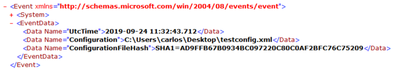

# What is Sysmon

Sysmon is a free tool initially developed by Mark Russinovich and has contributions by Tomas Garnier, David Magnotti, Mark Cook, Rob Mead, Giulia Biagini, and others at Microsoft. The tool is designed to extend the current logging capabilities in Windows to aid in understanding and detecting attackers by behavior. It was developed originally for internal use at Microsoft. (Note: There are still two versions of the tool—internal and external.) Currently, the tool supports 64-bit and 32-bit systems and uses a single command line tool for installation and configuration management.

All of the events generated by Sysmon are saved in Microsoft-Windows-Sysmon/Operational EventLog in order to accomodate security products that already leverage the EventLog, and to make the events easier to view and collect.

Sysmon is able to monitor for a series of actions on a Windows host that relate to existing behavior that is abused by threat actors. With this view on the actions, defenders are able to better detect abnormal behavior and abuses on a system.

The table below shows the event types and event ID for each.

| EventType| EventId|
|---|---|
|Sysmon Service Status Changed|0
|ProcessCreate|1
|FileCreateTime|2
|NetworkConnect|3
|Service State Change|4
|ProcessTerminate|5
|DriverLoad|6
|ImageLoad|7
|CreateRemoteThread| 8
|RawAccessRead| 9
|ProcessAccess| 10
|FileCreate| 11
|Registry object added or deleted | 12
|Registry Create| 13
|Registry Rename| 14
|FileCreateStreamHash | 15
|Sysmon Config Change| 16
|Named Pipe Create| 17
|Named Pipe Connected|18
|WMI Event Filter|19
|WMI Event Consumer|20
|WMI Consumer to Filter|21
|DNS Query|22
|File Delete|23
|Error|255


## The Sysmon Driver

All of the monitoring is performed thanks to a driver that Sysmon installs called SysmonDrv. The driver will hook into Windows APIs and leverage Event Tracing for Windows (ETW) to capture the information on the actions it wants to monitor.

This Sysmon Driver has a unique altitude number of 385201 that determines the order of loading of the driver in comparison to other drivers on the system. Some blog posts recommend changing this number in the registry for obfuscation, but this may cause a conflict with another driver and prevent Sysmon from working or cause other errors on the system.

The driver is loaded by a service at system startup and a secondary service then queries the cached information.


For all file system operations, the driver registers as a Minifilter driver that is attached to volumes allowing it to see all actions taken by APIs before they are processed by the file system.


Sysmon sets multiple callbacks on kernel objects in addition to using telemetry APIs and ETW.


When the tool is downloaded from the Microsoft Sysinternals website <https://docs.microsoft.com/en-us/sysinternals/> it is important to save and identify previous versions since Microsoft does not provide older versions and the release notes do not detail what has been fixed. Microsoft has a fast release cycle, forcing users to test very carefully and to keep track of versions.


Another important piece of information is that there is no support from Microsoft on the Sysinternal tools—they are free and provided as is. This means that a testing plan for the environment it is deployed on should be formulated, tested, implemented, and improved upon as new versions of Sysmon are released.

# The Sysmon Command Line

Sysmon installation and configuration can be done via the command line. When Sysmon is downloaded from Microsoft, the zip file will contain two command line versions of the tool:

* **Sysmon.exe** - x86 and x64 version.

* **Sysmon64.exe** - 64bit only version.

When using the tool, any errors will result in an error message and help information with basic switches. To see only the help information for the tool, the **-?** switch parameter is used. This help information will include:

* Parameter sets for installation, configuration, and uninstall

* Common command line parameters.

* General notes on how the tool works and further details on how to get more help informationn.

The parameters of the tool and the structure of the XML configuration file are defined in the tool Schema. This schema can be printed using the **-s "PrintSchema"** parameter; if no schema version is provided, it will print the default schema.

The tool can be run in 4 main modes; 3 of them are shown in the help message:

* **Install** - Install the driver, manifest and service on the host.

* **Configure** - Parses a given configuration file or command line parameters to generate a configuration that is stored in the registry.

* **Uninstall** - Removes the driver and service from the host.

The semi-hidden and undocumented method is Debug, in which a specified configuration is parsed, and live events are shown in the console.

## Install

The key parameter that initiates the installation mode of Sysmon is the **-i** switch. The installation process will be as follows:

* Decompresses and saves driver and copy of itself in to **%systemroot%**

* Registers event log manifest

* Creates a service

* Enables a default configuration (ProcessCreation, ProcessTermination, DriverLoad , FileCreationTimeChanged, SHA1 for Images) if no configuration file is passed using the **-c \<configuration file\>** parameter

The Installation process allows for some obfuscation:

* Driver name can be changed

* Service name can be changed

* Sysmon binary name can be renamed.

These obfuscation changes will also affect registry paths for the driver and processes service keys. All of the obfuscation methods are part of the installation option set.

The installation options are:

* Default -- Driver is installed and named SysmonDrv and service Sysmon

```shell
sysmon.exe --i --accepteula

```

* Renamed Driver -- The driver file and registry entry are renamed. Name has an 8-character limit.

```shell
sysmon.exe -i -d <drivername>
```

* Renamed Service -- The executable name defines the service name.

```shell
<renamed sysmon>.exe -i -d <drivername>
```

The installation process on a x64 system with the binary named sysmon.exe that is intended to work across x64 and x86 architectures is shown below. This is important since some of the actions may cause confusion or trigger alerts on monitoring systems.

One important thing to keep in mind when obfuscating the driver name and service name is that certain characteristics remain the same.

* Service description remains the same. (This can be modified post-install.)

* Driver Altitude number remains the same.

* The eventlog remains the same so as to not break collection from SIEM products.

***Process for x86***


***x64 Process***


Sysmon will create 2 registry keys to define the services for its operation under ***HKLM\\SYSTEM\\CurrentControlSet\\Services***

* Sysmon - Service that talks to the driver and performs the filtering action. It is named with the same name as the sysm onexecutable.

* SysmonDrv - Kernel Driver Service, this service loads the Sysmon driver with an altitude number of 385201

The settings for each service are:

Main Service:

* Name: **Name of the executable (default Sysmon or Sysmon64)**

* LogOn: **Local System**

* Description: **System Monitor service**

* Startup: **Automatic**

* ImagePath: **%windir%\\\<exe name\>**

Driver Service:

* Name: **SysmonDrv unless --d \<name\> is**

* LogOn: **Local System**

* Description: **System Monitor driver**

* Startup: **Automatic**

* ImagePath: **\<driver name\>.sys**

## Installation with Configuration

An XML configuration file can be passed during installation if an initial configuration needs to be set. This is the preferred method for production systems since a configuration file can cover all types and logic. The most used method is to pass a configuration file using the **-c \<config file\>** parameter.

```shell
sysmon.exe -i --accepteula -c <config file>
```

We can control the hashing algorithm used for events that hash images and we can control checking of revocation of signatures.

The hashing algorithm or combination of them can be specified with the **-h \<sha1\|sha2\|md5\|imphash\|\*\>** The specified algorithms will be used to hash all images.

```shell
sysmon.exe -i -c -h <sha1|sha2|md5|imphash\|*>
```

We can specify checking to see if certificates are revoked using the -r parameter.

```shell
sysmon.exe -i -c -r**

```

SSome basic filtering can be done also from the command line. Only filtering by process name can be done for NetworkConnect, ImageLoad, and ProcessAccess via the command line.

* **NetworkConnect** - Track network connections.

```shell
sysmon.exe -i -c -n [<process,...>]
```

* **ImageLoad** - DLL loading by processes.

```shell
sysmon.exe -i -c -l [<process,...>]
```

* **ProcessAccess** - Processes whose memory is accessed.

```shell
sysmon.exe -i -c -k [<process,...>]**
```

## Uninstall

To uninstall Sysmon, a binary with the same name as the main service, if renamed, has to be run with the **-u** switch parameter.

```shell
sysmon.exe -u
```

When executed the command will run a series of steps to uninstall the service, driver and remove files for the tool.


There is an undocumented value that can be passed to the **-u** parameter of **"force"** to force the removal of the services even if a stop was not possible.

```shell
sysmon.exe -u force
```

## Installation Best Practice

Installation best practices that can be followed to aid and minimize risk when deploying the Sysmon tool include:

* Keep a repository of Sysmon versions archived; Microsoft does not provide older versions for download.

* Sysmon is very dependent on the version of the binary for its configuration. The install/upgrade script should check the binary version for:

  * Upgrade

  * Version for applying initia config

* If a GPO is used to push scheduled tasks for upgrades or to push configuration, use a WMI filter to target the specific version that was tested. Example:

```sql
SELECT * FROM CIM_Datafile WHERE (Name="c:\\Windows\\Sysmon64.exe" OR Name="c:\\Windows\\Sysmon.exe") AND version="10.0.4.1"
```

* Check file versions they don't match release versioning.

* It is better to not push configuration as an XML that gets run from a share or dropped on disk with a scheduled task:

  * Credentials are left that can be recovered via DPAPI for deleted scheduled tasks.

  * The file can be read more easily by an attacker if controls are not properly placed

  * There is a higher chance of human error

  * Better to push values via GPO or other methods with file version checking.

# Configuration

The configuration options of Sysmon and the structure of the configuration file are defined in its schema. Each version of Sysmon that adds capabilities raises the schema version, and this version number is not tied to the binary version number.

To take a look at this schema, we would run the binary with the  **-s \[schema version\]** parameter; if no schema version is specified, we would get the latest one for the binary.

When we look at the XML representation of the schema, we see the manifest element has two attributes for versioning:

* **schemaversion** - The version number of the schema

* **binaryversion** - The binary version number of the compiled schema

Under this manifest element are two main elements:

* **configuration** - Command line switches for the executable and the filtering operators
* **events** - This section defines each event type and field we can filter on


## Command Line Parameters

Under the configuration element, we have an element called options that contains all the command line parameters. Each of the option elements are broken in to command line and configuration options where each type of the command line switches is identified with a comment in the XML.

The main attributes for each of the command-line options:

* **switch** - the command line switch to use.

* **name** - name of the switch.

* **argument** - is the argument optional or mandatory


The main arguments that can be passed are:

* **-i** : Install Sysmon

```shell
sysmon.exe -i [configfile path]
```

* **-c** : apply config

```shell
sysmon.exe -c [configfile path]
```

* **-u** : un-install Sysmon

```shell
sysmon.exe -u [force]
```

* **-m** : Install event manifest

```shell
sysmon.exe -m
```

* **-t** : Debug mode

```shell
sysmon.exe -t [configfile path]
```

* **-s** : Print schema

```shell
sysmon.exe -s [schema version]
```

* **-nologo** : don't show sysmon logo

```shell
sysmon.exe -nologo
```

* **-accepteula** : Accepts the license agreement

```shell
    sysmon.exe -accepteula
```

* **--** : Resets the configuration to the default

```shell
sysmon.exe --
```

The option elements under the comment "Configuration file" allow for the configuration of filters and parameters that relate to filters.

* **-h** : Hashing algorithm to has images.

```shell
sysmon.exe -c -h <sha1|sha2|md5|imphash|*>
```

* **-r** : Check for signature certificate revocation

```shell
sysmon.exe -c -r
```

* **-n** : Track network connections for specified process/processes

```shell
sysmon.exe -c -n [<process,...>]
```

* **-k** : Track when a specified process/processes memory are accessed

```shell
sysmon.exe -c -k [<process,...>]
```

* **-l** : Track modules (DLLs) loaded by a specified process/processes.

```shell
sysmon.exe -c -k [<process,...>]
```

* **-d** : Rename the sysmon driver during install (8 character limit)

```shell
sysmon.exe -i -c -d <drivername>
```

> **-g** and **--dns** switches are listed but as of the current version, they
> do not update the configuration.

## Filter Operators

In the filters element under configuration is the list of operators that can be used to filter against the fields of each event type.

|  **Operator**     |  **Meaning**
|------------------|------------------------------------------------------
|  Is|             Exact match.
|  IsNot|          Negates and exact match
|  Contains|       The string is contained in any part of the value of the field.
|  Excludes |      Excludes the event from the logic if the event is the value matches
|  Excludes All|   Exclude if all values match. (values are separate by ";" )
|  Excludes Any |  Excludes if any of the values match. (values are separate by ";" )
|  Image |         Name of the image without the full path.
|  BeginsWith |    String value starts with.
|  EndsWith |      String value ends with
|  LessThan  |     Numeric value is less than
|  MoreThan |      Numeric value is more than
|  Contain Any |   Contains any of the values. (values are separate by ";" )
|  Contains All |  Contains all of the values. (values are separate by ";" )

Each of these operators execute against the value in a given field for each of the event types.

## Event Schema

Under the events element each event that Sysmon generates is defined as an event element. Each event is defined as shown below:

* **name** : Name of event

* **value** : The EventID for the event

* **level** : Event severity level

* **template** : Event manifest template used for the event

* **ruleName** : Name of rule we filter on

* **ruledefault** : The default action of a rule if not specified

* **version** : The version of the event


We can filter on the Field Names defined in the data elements. They are defined as:

* **Name** : Name of filed

* **inType** : Type of data received in to the driver

* **outType** : Data type the data is presented as


As of the latest version we have defined as event types:

* **NetworkConnect** - Network connections made by processes on the system; both TCP and UDP

* **ProcessCreate** - Creation of new processes in the system and information related to the process

* **FileCreateTime** - File creation time modification and what process is responsible for it

* **ProcessTerminate** - The termination of a process

* **ImageLoad** - Loading of any image by another process (OCX, DLL, etc.) with information of the process loading the image and the image itself

* **DriverLoad*** - Loading of a driver by the system and its file information

* **DnsQuery** - DNS query performed by a process using Windows API, includes information on the query and the process that performed it

* **ProcessAccess** - Access to a process memory from another process and information on access permission and the processes involved

* **RawAccessRead** - Raw access to a file by a process bypassing the file system controls

* **FileCreateStreamHash** - An alternate stream was created and the content of the stream is hashed; information on the process that created the stream is logged

* **RegistryEvent** - Logs the creation, deletion, and modification of specific registry keys and values; information on the process that took the action is logged

* **FileCreate** - Information of a file that is created including the process that created the file

* **PipeEvent** - Named Pipe communication between two processes and its relevant information

* **WmiEvent** - Information on the creation, deletion, and modification of WMI permanent event components in the CIM database

## Configuration File

The main method of configuration of Sysmon is through the use of XML configuration files. XML configuration files allow for higher flexibility since more filtering options are possible by applying logical operations to the fields that are defined by the schema version for the event types.

Previous schemas can be used in newer releases of the binary allowing for upgrading of the binary without the need to update the configuration. The schema is defined on the root element (Sysmon) of the configuration file with the attribute schemaversion.


We can optionally specify a hashing algorithm with the HashAlgorithms elements. More than one can be specified in this element or all of them using the \* symbol.
The presence of the CheckRevocation element is enough to allow for checking whether a certificate used to sign an image has been revoked. There are three main ways to organize filters with the latest version of Sysmon.

* EventType filters.

* EvenType Filters organized using RuleGroups

* EventType Filters organized in to Rule sets inside RuleGroups.

We can have up to two instances of each EventType (one include and one exclude) for the entire configuration, whether or not RuleGroups are used. On SchemaVersion 4.22 and above, the default relation between filters is AND.


Below is an example where if the filters match, they are included and placed in the EventLog using an intrinsic AND logic.


This type of configuration is only good with Schema 4.22 and above. It is recommended that this is used only for quick tests due the limitation of the AND logic for filters.

### RuleGroups

The RuleGroup element allows for the modification of the logic of the filters and also allows for more complex logic since multiple Rule elements with multiple filters can be created and the logic for the filters can be modified in order to capture actions in a more granular way.


Remember: You can only have one single EventType per RuleGroup. Sysmon will not error if you have more than one, but only the first EventType filters will be loaded.

In a RuleGroup element, the name attribute is not used to populate the RuleName field of an event when one is created. While it may be used for a description, XML comments are a better option. When choosing the name to go in the RuleName field, the order of precedence for RuleName is Filter -> RuleGroup name attributes. It is recommended that names be placed on the individual filters to be able to leverage the field more efficiently when filtering logs on a SIEM platform. One thing to keep in mind is that when multiple filters are in a Rule element, only the first filter name attribute is used.

When using AND in a Rule element, the name used to populate the RuleName will be based on the order of the filters as they appear on the schema where the last matching one is the one used. When using OR in a Rule element, the name used to populate the RuleName will be the filter that matches.

Rules are processed in the order they are placed in the configuration file. This is important because once a Rule matches and the information for that EventType is included in the Windows EventLog, no other rule will be processed against that action. Filters that are not in a Rule element will be processed in the order that they appear in the schema. This also applies to multiple filters inside a Rule where the schema order is used.


## Configuration File Best Practices

It is important to track what a configuration does and keep a changelog. For this reason, it is recommended to add headers to track basic information like changelog, version, sysmon version tested against, etc.


For RuleGroups, Rules and Filters use comments to organize filters and to provide information on what each filter is doing.


Hash configurations that are deployed and keep a log of them for later
verification.

Hash configurations that are deployed and keep a log of them for later verification.
On a system where the Sysmon service process consumes a lot of CPU resources, the number of filters and operators should be reviewed. The operators that use slightly more CPU are:

* contains

* contains all

* contains any

A method for checking applied configuration is hashing the configuration
in the registry.
<https://github.com/PSGumshoe/PSGumshoe/blob/master/EventLog/Get-SysmonRuleHash.ps1>


Since getting stated can be complex, some great resources that serve as starting points for Rule development and reference include:

* Swift On Security configuration example
    <https://github.com/SwiftOnSecurity/sysmon-config>

* Olaf Hartong Sysmon Configuration Modules
    <https://github.com/olafhartong/sysmon-modular>

### Configuration Tampering

One of the actions an attacker takes is the identification of controls and logging on a system.

Due to initial footprint and safety, most advanced attackers limit their actions to enumerate controls to the most common actions that elements that will trigger a monitoring solution. The most common methods used are:

* Service list.

* Process list.

* Listing of installed applications from the registry.

This does not mean that an attacker will not use more advanced methods to enumerate controls and find Sysmon on the system.

Detection of Sysmon is achieved by looking at the areas that cannot be changed.

  **Indicator**               | **Can it be Changed**
  ----------------------------| -----------------------
  |Driver Name|                  YES
  |Service Name|                 YES
  |Registry Config Path|         YES
  |Driver altitude Number|       NO
  |EventLog Path and Name|       NO
  |Sysmon Service Description|   NO (Manually)

When Sysmon configuration is modified using the Sysmon command line tool, an **EventId 16** is generated. If the registry binary value is modified directly, no event is generated, and configuration is applied as soon as the value is modified.

When a GPO is used to update configuration by default every 90 minutes, the configuration will be updated. A better solution is to use a configuration management solution like DSC that can monitor for changes and update as soon as a change is detected.

Sysmon can be configured to monitor its own configuration to detect whether an attacker deletes or alters it. In the event that it is cleared, this will be the last event logged by Sysmon itself from its configured filters.


In case the configurations are cleared, the default one will take over:

* **ProcessCreation**

* **ProcessTermination**

* **DriverLoad**

* **FileCreationTimeChanged**

* **SHA1 for Images**

Since any user in the system can read the rule binary data, an attacker can operate around rule configurations once they have read them by:

* Execute tasks not logged.

* Execute tasks that would blend in with normal logged actions

Existing tools for parsing rules out of the registry break often as Sysmon is updated, since the way the information is structured in the binary blob is not documented. However, an attacker can export and import into the test system and use Sysmon to read the configuration.

## Configuration Deployment

Most environments that have the capabilities to leverage Sysmon enhanced log collection also have software deployment systems like Altiris, System Center Configuration Manager, Desired State Configuration, etc. This is why these are just general recommendations. 

### Deployment Script

On most of these environments, the deployment of Sysmon is managed by using scripts, with PowerShell being the most flexible one.

An install script should

* Check if Sysmon is installed; if not, Install.

* If Sysmon is installed, check the version and upgrade if needed.

* After an uninstall, ensure the registry key and files are removed before upgrading. (There have been issues in the past.)

```PowerShell
$DriverName = 'SysmonDrv.sys'
$CurrentVersion = '10.41'
# Check if the driver if present
$Present = Test-Path -Path "C:\Windows\$($DriverName)" -PathType Leaf
if ($Present) {
    Write-Host -Object "[+] Sysmon was found." -ForegroundColor Green
    # Check if the version on host is the approved one.
    $HostVersion = (Get-Item "C:\Windows\$($DriverName)").VersionInfo.FileVersion
    if ($CurrentVersion -eq $HostVersion) {
        Write-Host -Object "[+] Sysmon is current approved version." -ForegroundColor Green
    } else {
        # Execute upgrade process.
        Write-Host -Object "[-] Sysmon needs upgrade." -ForegroundColor Red
	    <path to Sysmon.exe> -U
        <path to Sysmon.exe> -I
    }
} else {
    # Execute install process.
}
```

### GPO Configuration Deployment

Group Policy remains one of the most used methods in the enterprise network for the control of configuration setting.

The following are instructions on how to create a GPO for an existing applied configuration.

1. In the Group Policy Management Console (**gpmc.msc**)

2. Create a new (or edit an existing) GPO and assign it to the appropriate Active Directory Organizational Unit.

3. Right click on the GPO and select **Edit**

4. Expand **Configuration -\> Preferences -\>Windows Settings -\> Registry**

5. Right Click on Registry **New -\> Registry Wizard**

   {width="6.5in" height="3.3125in"}

6. Select if local or remote machine.

7. Navigate and select the key **HKLM\\SYSTEM\\CurrentControlSet\\Services\\SysmonDrv\\Parameters** and all parameters under it.

  

A WMI filter will ensure only machines with the proper version of Sysmon installed will receive the configuration.

# Sysmon Events Types

Sysmon extends the collection capabilities of defenders by allowing the collection of specific types of behaviours in to the eventlog so existing solutions that already collect information from the eventlog can easily ingest this new information.

The table below shows the evet types and event ID for each.

| EventType| EventId|
|---|---|
|Sysmon Service Status Changed|0
|ProcessCreate|1
|FileCreateTime|2
|NetworkConnect|3
|Service State Change|4
|ProcessTerminate|5
|DriverLoad|6
|ImageLoad|7
|CreateRemoteThread| 8
|RawAccessRead| 9
|ProcessAccess| 10
|FileCreate| 11
|Registry object added or deleted | 12
|Registry Create| 13
|Registry Rename| 14
|FileCreateStreamHash | 15
|Sysmon Config Change| 16
|Named Pipe Create| 17
|Named Pipe Connected|18
|WMI Event Filter|19
|WMI Event Consumer|20
|WMI Consumer to Filter|21
|DNS Query|22
|File Delete|23
|Error|255

## Sysmon Operational Events

Sysmon will generate events for monitoring:

* Configuration Changes

* Service State Changes

* Sysmon Errors

These events cannot be filtered using Sysmon configuration and will be generated by the sysmon.exe (Default Install) process.

### Sysmon Config Change

Sysmon will log an EventID 16 when it updates its configuration. The event will only be generated if the configuration is changed with the Sysmon binary and not a direct change to the registry key. It is recommended that Windows Auditing be configured for the configuration key and a Sysmon filter to capture any attempt at modification outside of the use of the Sysmon binary.

Fields for the Event:

* **UtcTime**: Time the configuration was modified.

* **Configuration**: Path to configuration file or command line of
    command used to modify the config.

* **ConfigurationFileHash**: If a configuration file was used, the
    hash of the file.

Example: Configuration using a XML file.



Example: Configuration via Command Line resetting configuration to
default using the \-- switch.


Example: Configuration via Command Line. Set to monitor module loading
by powershell.exe


### Sysmon Error Event

If the Sysmon binary running as a service encounters any error in its operation, it will generate an EventID 255. Some of the cases where this event may be generated are when:

* The driver fails to load, or an attacker may have unloaded the driver

* An application or attacker has modified the configuration in a way that cannot be parsed by the service

Fields for the Event:
#### Known errors

|ID             |Description                    |
|---------------|-------------------------------|
| DriverCommunication |Failed to retrieve events|
| DriverCommunication |Incorrect event size [value]|
| DriverCommunication |Failed to access the driver|
| ServiceThread |Failed to initialize event for dispatch|
| ServiceThread |Failed to initialize the rule engine with data|
| ServiceThread |Failed to initialize signature verification|
| ServiceThread |Failed to allocate [value] bytes|

Example:


### Service State Change

EventID 4 is generated for Service State Changes. This event logs Start and Stop events when the Sysmon service is controlled via the Service Control Manager API (Services.mmc, sc.exe, net.exe, etc.). To better detect any manipulation of the service, Windows Auditing should be enabled for the service registry key and a Sysmon Registry filter for the service.

Fields for the event are:

* **UtcTime**: Time the service state changed.

* **State**: Started or Stopped

* **Version**: Version of the Sysmon binary

* **SchemaVersion**: Schema Version of the Sysmon binary.

Example:


## Process Events

Sysmon can log process creation, process termination and process access events. The process events are captured via ObjRegisterCallbacks at the kernel level using its driver, and contain a unique, deterministically generated ProcessGuid and LogonGuid that are unique to their process instance and LSA logon session respectively. 

The ProcessGuid and LoginGuid make tracking individual process and users much easier. The ProcessGuid attribute is used in all events associated with its process, and, unlike a ProcessID, will not be reused by the host system later.  The LogonGuid attirbute similarly is assigned to a login session of a particular user, and will not be reused later as a LoginID would.


When a user logs onto on a modern version of Windows (Windows 2016/10)
they will have 2 Logon IDs assigned if:

* User is a member of local Administrator Group.

* UAC (User Access Control) is enabled.

These sessions will be linked by a Linked Login ID in Successful Logon
Event ID 4624, making the logging of this event important.

The ProcessGUID depending on the event and where in the process tree it
is, it will also be known by other names by its relation to the action
monitored.

ProcessGUID is generated by Sysmon when Sysmon logs the event.  ProcessGUID 
specifically is not an attribute of the internal Windows process data structs
(EPROCESS).  Sysmon keeps track of the GUID until the process exits.


The only Event Types that will not reference a ProcessGuid or one of its
derived names are

* WMI events

* Kernel Driver Load

The image of the process is also related in other processes and can be
used to track all actions related to a specific one.


### Process Creation

Sysmon will log **EventID 1** for the creation of any new process when
it registers with the kernel.

Sysmon will generate a ProcessGuid and LogonGuid with the information it
obtains and it will hash the process main image. The command line of the
process will be parsed and logged in to eventlog. When storage permits a
common practice is to log all processes and to filter out common day to
day processes for Windows and Applications after profiling usage.

The fields on a process creation event are:

* **ProcessGuid** -- Unique process GUID generated by Sysmon.

* **ProcessId** -- Process ID represented as a integer number.

* **Image** -- Full path of the executable image that was executed.

* **FileVersion** -- File version filed in the image metadata.

* **Description** -- Description field in the image metadata.

* **Product** -- Product field in the image metadata.

* **Company** - Company field in the image metadata.

* **OriginalFileName** -- Original image name if renamed.

* **CommandLine** -- Command line that executed the image.

* **CurrentDirectory** -- Directory under which the image was
    executed.

* **User** - Name of the account who created the process (child) . It
    usually contains domain name and user name

* **LogonGuid** - Logon GUID of the user who created the new process.

* **LogonId** -Login ID of the user who created the new process.

* **TerminalSessionId** - ID of the session the user belongs to

* **IntegrityLevel** - Integrity label assigned to a process

* **Hashes** - Full hash of the file with the algorithms in the
    HashType field.

* **ParentProcessGuid** - ProcessGUID of the process that
    spawned/created the main process (child)

* **ParentProcessId** - Process ID of the process that spawned/created
    the main process (child)

* **ParentImage -** File path that spawned/created the main process.

* **ParentCommandLine -** Arguments which were passed to the
    executable associated with the parent process

Sysmon offers an advantage over the regular process logging since it not
only pulls the same information as with **EventID** **4688** but it also
pulls information from the PE header, hashes the images for correlation
with IOC databases like Virus Total and it also provides unique fields
when querying for events.

### Process Termintation

Symon will log an **EventID 5** when a process terminates. By logging
process termination events allow for calculating duration of operation
of a process by comparing the times with process creation. Process
termination also allows when co-related with shutdown and start events
if a process may have been terminated by an attacker.

The process termination fields are:

* **RuleName** -- Rule name for which the event triggered.

* **UtcTime** - Time in UTC when event was created

* **ProcessGuid** - Process Guid of the process that terminated

* **ProcessId** - Process ID used by the OS to identify the process
    that terminated

* **Image** - File path of the executable of the process that
    terminated
    
### Process Access

When one process opens another, sysmon will log this with an event ID of 10. The access with higher permissions allows for also reading the content of memory, patching memory, process hollowing, creations of threads and other tasks that are abused by attackers. This technique has been used for access to credentials, keys and data that are in the process memory.

This task is also common for benign processes that query information on another process, such as Task Manager, tasklist.exe and others, this requires that a baseline be established and filtered out at a SIEM level taking into consideration other factors like image fullpath, parent process and account used so as to prevent any whitelisted processes from being used as staging for attacks.

Sysmon generates this event using ObRegisterCallbacks leveraging its
driver. The main 2 filtering fields recommended are:

* **TargetImage** - File path of the executable being accessed by
    another process.

* **GrantedAccess** - The access flags (bitmask) associated with the
    process rights requested for the target process

As a minimum it is recommended to filter including critical processes,
as a minimum:

* C:\\Windows\\system32\\lsass.exe

* C:\\Windows\\system32\\csrss.exe

* C:\\Windows\\system32\\wininit.exe

* C:\\Windows\\system32\\winlogon.exe

* C:\\Windows\\system32\\services.exe

Check for masks of known tools for credential dumping, process injection
and process hollowing. Great care should be taken when setting masks
since Sysmon does a literal comparison of the mask string provided
against the one returned. It is not a bitwise operation, care should be
taken to track the proper combinations.

|Access                               |  Mask       |
|--------------------------------------|------------
| PROCESS\_CREATE\_PROCESS               |0x0080|
| PROCESS\_CREATE\_THREAD                |0x0002|
| PROCESS\_DUP\_HANDLE                   |0x0040|
| PROCESS\_SET\_INFORMATION              |0x0200|
| PROCESS\_SET\_QUOTA                    |0x0100|
| PROCESS\_QUERY\_LIMITED\_INFORMATION   |0x1000|
| SYNCHRONIZE                            |0x00100000|
| PROCESS\_QUERY\_INFORMATION            |0x0400|
| PROCESS\_SUSPEND\_RESUME               |0x0800|
| PROCESS\_TERMINATE                     |0x0001|
| PROCESS\_VM\_OPERATION                 |0x0008|
| PROCESS\_VM\_READ                      |0x0010|
| PROCESS\_VM\_WRITE                     |0x0020|

The PSGumshoe PowerShell module has a function for creating and parsing
mask strings.
<https://github.com/PSGumshoe/PSGumshoe/blob/sysmon_events/EventLog/Get-SysmonAccessMask.ps1>

The fields for the even are:

* **RuleName**: Rule that triggered the event

* **UtcTime**: Time in UTC when event was created

* **SourceProcessGUID**: Process Guid of the source process that
    opened another process.

* **SourceProcessId**: Process ID used by the OS to identify the
    source process that opened another process.

* **SourceThreadId**: ID of the specific thread inside of the source
    process that opened another process

* **SourceImage**: File path of the source process that created a
    thread in another process

* **TargetProcessGUID**: Process Guid of the target process

* **TargetProcessId**: Process ID used by the OS to identify the
    target process

* **TargetImage**: File path of the executable of the target process

* **GrantedAccess**: The access flags (bitmask) associated with the
    process rights requested for the target process

* **CallTrace**: Stack trace of where open process is called. Included
    is the DLL and the relative virtual address of the functions in the
    call stack right before the open process call

Example:

```xml
<Sysmon schemaversion="4.22">
   <EventFiltering>
 <RuleGroup name="" groupRelation="or">
      <ProcessAccess onmatch="include">
        <!-- Detect Access to LSASS-->
         <Rule groupRelation="and">
          <TargetImage name="technique_id=T1003,technique_name=Credential Dumping" condition="is">
          C:\Windows\system32\lsass.exe
          </TargetImage>
          <GrantedAccess>0x1FFFFF</GrantedAccess>
         </Rule>
         <Rule groupRelation="and">
          <TargetImage name="technique_id=T1003,technique_name=Credential Dumping" condition="is">
          C:\Windows\system32\lsass.exe
          </TargetImage>
          <GrantedAccess>0x1F1FFF</GrantedAccess>
         </Rule>
         <Rule groupRelation="and">
          <TargetImage name="technique_id=T1003,technique_name=Credential Dumping" condition="is">
          C:\Windows\system32\lsass.exe
          </TargetImage>
          <GrantedAccess>0x1010</GrantedAccess>
         </Rule>
         <Rule groupRelation="and">
          <TargetImage name="technique_id=T1003,technique_name=Credential Dumping" condition="is">
          C:\Windows\system32\lsass.exe
          </TargetImage>
          <GrantedAccess>0x143A</GrantedAccess>
         </Rule>

        <!--Dumping credentials from services or setting up a keylogger-->
         <Rule groupRelation="and">
         <!--Mitre T1098--> <!--Mitre T1075--> <!--Mitre T1003--><!-- 
        depending on what you're running on your host, this might be noisy-->
          <TargetImage name="technique_id=T1003,technique_name=Credential Dumping" condition="is">C:\Windows\system32\csrss.exe</TargetImage> 
          <GrantedAccess>0x1F1FFF</GrantedAccess>
         </Rule>
         <Rule groupRelation="and">
         <!--Mitre T1098--> <!--Mitre T1075--> <!--Mitre T1003--><!-- 
             depending on what you're running on your host, this might be noisy-->
          <TargetImage name="technique_id=T1003,technique_name=Credential Dumping" condition="is">C:\Windows\system32\wininit.exe</TargetImage> 
          <GrantedAccess>0x1F1FFF</GrantedAccess>
         </Rule>
         <Rule groupRelation="and">
          <!--Mitre T1098--> <!--Mitre T1075--> <!--Mitre T1003--><!-- 
            depending on what you're running on your host, this might be noisy-->
          <TargetImage name="technique_id=T1003,technique_name=Credential Dumping" condition="is">C:\Windows\system32\winlogon.exe</TargetImage> 
          <GrantedAccess>0x1F1FFF</GrantedAccess>
         </Rule>
         <Rule groupRelation="and">
          <!--Mitre T1098--> <!--Mitre T1075--> <!--Mitre T1003--><!-- d
          epending on what you're running on your host, this might be noisy-->
          <GrantedAccess>0x1F1FFF</GrantedAccess>
          <TargetImage name="technique_id=T1003,technique_name=Credential Dumping" condition="is">C:\Windows\system32\services.exe</TargetImage> 
         </Rule>
         <Rule groupRelation="or">
            <GrantedAccess name="technique_id=T1003,technique_name=Credential Dumping">0x0810</GrantedAccess>
         </Rule>

         <!-- Detect process hollowing-->
         <Rule groupRelation="or">
            <GrantedAccess name="technique_id=T1093,technique_name=Process Hollowing">0x0800</GrantedAccess>
            <GrantedAccess name="technique_id=T1093,technique_name=Process Hollowing">0x800</GrantedAccess>
         </Rule>
         <!-- Detect process process injection-->
         <Rule groupRelation="or">
            <GrantedAccess name="technique_id=T1055,technique_name=Process Injection">0x0820</GrantedAccess>
            <GrantedAccess name="technique_id=T1055,technique_name=Process Injection">0x820</GrantedAccess>
         </Rule>
      </ProcessAccess>
</RuleGroup>
</EventFiltering>
</Sysmon>
```

Some examples of actions from security tools like Mimikatz and their
access masks

  |Command                 |Sysmon 10                                           |Security 4663 Kernel Object
  |-----------------------|---------------------------------------------------|-----------------------------
  |lsadump::lsa /patch     |GrantedAccess 0x1438                                |AccessMask 0x10
  |lsadump::lsa /inject    |rantedAccess 0x143a                                |AccessMask 0x10
  |lsadump::trust /patch   |GrantedAccess 0x1438                                |AccessMask 0x10
  |misc:memssp             |GrantedAccess 0x1438                                |AccessMask 0x10
  |Procdump mimidump       |GrantedAccess 0x1fffff                              |AccessMask 0x10
  |Task Manage minidump    |GrantedAccess 0x1400, 0x1000, 0x1410 and 0x1fffff   |AccessMask 0x10
  |sekurlsa::\*            |GrantedAccess 0x1010                                |AccessMask 0x10

## File Events

### File Create

Via its filter driver, Sysmon can log the creation of files and information on what process is creating the file using **EventID 11**. This allows defender to filter for:

* Dropping of files for later execution (PowerShell, Office Apps, certutil.exe)

* Modification of system configurations (Scheduled Tasks, WMI)

* Detection of malicious behaviors that create temporary or log files (.Net compile and run, DotNet2JS)

Since AV minifilter loads before Sysmon (due to the lower altitude number range), if an AV or EDR minifilter driver detects a malicious file and blocks it writing to disk, Sysmon will not see the event.


The file creation event fields are:

* **RuleName**: Name of rule that triggered the event

* **UtcTime**: Time in UTC when event was created

* **ProcessGuid**: Process Guid of the process that created the file

* **ProcessId**: Process ID used by the OS to identify the process that created the file (child)

* **Image**: File path of the process that created the file

* **TargetFilename**: Name of the file that was created

* **CreationUtcTime**: File creation time

Example monitoring for script file creation by extension:

```XML
<Sysmon schemaversion="4.22">
  <EventFiltering>
    <RuleGroup name="" groupRelation="or">
      <FileCreate onmatch="include">
        <!-- Detect Dangerous File Type Creation -->
        <Rule groupRelation="or">
          <TargetFilename name="technique_id=T1170,technique_name=Mshta" condition="end with">.hta</TargetFilename>
        </Rule>

        <Rule groupRelation="or">
          <!--Batch scripting-->
          <TargetFilename name="technique_id=T1064,technique_name=Scripting" condition="end with">.bat</TargetFilename> 
          <TargetFilename condition="end with">.cmd</TargetFilename> 
          <TargetFilename condition="end with">.ps1</TargetFilename> 
          <TargetFilename condition="end with">.ps2</TargetFilename> 
          <TargetFilename condition="end with">.jse</TargetFilename> 
          <TargetFilename condition="end with">.vb</TargetFilename> 
          <TargetFilename condition="end with">.vbe</TargetFilename> 
          <TargetFilename condition="end with">.vbs</TargetFilename> 
        </Rule>

        <!-- Detect ClickOnce -->
        <Rule groupRelation="or">
          <TargetFilename name="ClickOnce File Execution" condition="end with">.application</TargetFilename>        <TargetFilename condition="end with">.appref-ms</TargetFilename>
        </Rule>

        <!-- MSBuild -->
        <Rule groupRelation="or">
          <!--Microsoft:MSBuild:Script More information: https://twitter.com/subTee/status/885919612969394177-->
          <TargetFilename name="technique_id=T1127,technique_name=Trusted Developer Utilities" condition="end with">.*proj</TargetFilename>
          <TargetFilename condition="end with">.sln</TargetFilename>
        </Rule>

        <!-- Macro File Creation -->
        <Rule groupRelation="or">
          <TargetFilename name="Microsoft:Office: Macro" condition="end with">.docm</TargetFilename>
          <TargetFilename condition="end with">.pptm</TargetFilename>
          <TargetFilename condition="end with">.xlsm</TargetFilename>
          <TargetFilename condition="end with">.xlm</TargetFilename>
          <TargetFilename condition="end with">.dotm</TargetFilename>
          <TargetFilename condition="end with">.xltm</TargetFilename>
          <TargetFilename condition="end with">.potm</TargetFilename>
          <TargetFilename condition="end with">.ppsm</TargetFilename>
          <TargetFilename condition="end with">.sldm</TargetFilename>
          <TargetFilename condition="end with">.xlam</TargetFilename>
          <TargetFilename condition="end with">.xla</TargetFilename>
        </Rule>

        <!-- DotNettoJS UsageLog -->
        <Rule groupRelation="or">
        <!--Dotnet v2 binary started-->
          <TargetFilename name="technique_id=1218,technique_name=DotnettoJs" condition="contains">AppData\Local\Microsoft\CLR_v2.0\UsageLogs\</TargetFilename>
          <TargetFilename condition="end with">\UsageLogs\cscript.exe.log</TargetFilename>
          <TargetFilename condition="end with">\UsageLogs\wscript.exe.log</TargetFilename>
          <TargetFilename condition="end with">\UsageLogs\wmic.exe.log</TargetFilename>
          <TargetFilename condition="end with">\UsageLogs\mshta.exe.log</TargetFilename>
          <TargetFilename condition="end with">\UsageLogs\svchost.exe.log</TargetFilename>
          <TargetFilename condition="end with">\UsageLogs\regsvr32.exe.log</TargetFilename>
          <TargetFilename condition="end with">\UsageLogs\rundll32.exe.log</TargetFilename>
        </Rule>
      </FileCreate>
    </RuleGroup>
  </EventFiltering>
</Sysmon>
```

### File Create Time Change

**EventID 2** is for the technique that modifies the timestamps of a file (the modify, access, create, and change times). This is done often to mimic files that are in the same folder to hide dropped files or accessed files to prevent casual detection. Some applications modify timestamps in their normal operation. A good practice is to exclude those applications that normally change file creation times like setup executables, Chrome, OneDrive, and others. As a minimum, the Users directory should be monitored.

The fields for the event:

* RuleName: Name of rule that triggered the event

* UtcTime: Time in UTC when the event was created

* ProcessGuid: Process GUID of the process that changed the file creation time

* ProcessId: Process ID used by the OS to identify the process changing the file creation time

* Image: File path of the process that changed the file creation time

* TargetFilename: Full path name of the file

* CreationUtcTime: New creation time of the file

* PreviousCreationUtcTime: Previous creation time of the file

Example:

```xml
<Sysmon schemaversion="4.22">
  <EventFiltering>
    <RuleGroup name="Include Filter for FileCreateTime" groupRelation="or">
      <FileCreateTime onmatch="include">
          <!-- Detect File Time changes on user files -->
          <Rule groupRelation="or">
            <Image name="technique_id=T1099" condition="begin with">C:\Users</Image>
          </Rule>
      </FileCreateTime>
    </RuleGroup>

    <RuleGroup name="Exclude Filters for FileCreateTime" groupRelation="or">
      <FileCreateTime onmatch="exclude">
        <!-- Detect Dangerous File Type Creation -->
        <Rule groupRelation="or">
          <!--OneDrive constantly changes file times-->
          <Image condition="image">OneDrive.exe</Image> 
          <Image condition="image">C:\Windows\system32\backgroundTaskHost.exe</Image>
          <!--Ignore setups-->
          <Image condition="contains">setup</Image> 
          <Image condition="contains">install</Image>
          <Image condition="contains">Update\</Image>
          <Image condition="end with">redist.exe</Image>
          <Image condition="is">msiexec.exe</Image> 
          <Image condition="is">TrustedInstaller.exe</Image> 
        </Rule>
      </FileCreateTime>
    </RuleGroup>
  </EventFiltering>
</Sysmon>
```

### File Stream Creation Hash

Sysmon will log **EventID 15** for the creation of Alternate Data Streams (ADS). This is an old technique where many vendors already monitor for the creation of ADS on files where the alternate stream is a PE executable. Attackers have changed to use alternate streams to hide information and to store other payloads that are not PE executables (DLL, Scripts). Sysmon will also capture the contents of text streams if they are less 1KB for the purpose of capturing  Mark Of The Web (MOTW) streams.

Each record in NTFS on a drive is subdivided into a list of variable length attributes:

* \$STANDARD\_INFORMATION

* \$FILE\_NAME

* \$DATA

* \$INDEX\_ROOT

* \$BITMAP

* \$INDEX\_ALLOCATION

* \$ATTRIBUTE\_LIST

Alternate Data Streams (ADS) are implemented by having multiple \$Data
attributes

* The Default data stream is unnamed

* Alternate streams are named ones.

Since streams that are part of the NTFS structure directories may have an AD, we can use PowerShell to look at a file with the single default unamend :\$DATA stream:


File with a second named stream:


Some execution examples:

* Execution Rundll32 example

* Cscript Example

* PowerShell Example

More execution examples at
<https://gist.github.com/api0cradle/cdd2d0d0ec9abb686f0e89306e277b8f> by
Oddvar Moe

In the case of downloads performed by browsers and email clients in Windows that leveragle the urlmon.dll for downloading files they have al indetifying stream added with information about the download including the URL and Refferer. This information can be used to track the origing of downloaded files by attackers with a console presense or via a phishing attack. 

We can use PowerShell Get-Item and Get-Content cmdlets to check is a Zone.Identifier stream exist and show its content. 


The fields for the event:

* **RuleName**: Name of rule that triggered the event
* **UtcTime**: Time in UTC when event was created
* **ProcessGuid**: Process GUID of the process that created the named file stream
* **ProcessId**: Process ID used by the OS to identify the process that created the named file stream
* **Image**: File path of the process that created the named file stream
* **TargetFilename**: Name of the file
* **CreationUtcTime**: File download time
* **Hash**: Full hash of the file with the algorithms in the HashType field
* **Content**: Contents of text streams. 


The number of processes that create alternate streams should be low and easily excluded. Mail clients and browsers are the main generators of this event in normal operation to set the Zone attribute; Because of this, a maintenance process is recommended when leveraging these filters.


Since urlmon.dll sets different parts of the stream as the file is downloaded we see normally a total of 6 events as the data is added to the file. This provides important forensic information to track files that an attacker may have delived and correlated with other networks logs. 

Example: Exclude common processes that create alternate data streams.

```xml
<Sysmon schemaversion="4.22">
   <EventFiltering>
 <RuleGroup name="" groupRelation="or">
    <FileCreateStreamHash onmatch="exclude">
        <!--Chrome Web Browser-->
        <Image condition="is">C:\Program Files (x86)\Google\Chrome\Application\chrome.exe</Image>
        <!--Edge Download broker-->
        <Image condition="is">C:\Windows\system32\browser_broker.exe</Image>
        <!--Internet Explorer-->
        <Image condition="is">C:\Program Files\Internet Explorer\iexplore.exe</Image>
        <!--Outlook Client-->
        <Image condition="end with">OUTLOOK.EXE</Image>
    </FileCreateStreamHash>
</RuleGroup>
</EventFiltering>
</Sysmon>
```
### File Delete

Via its filter driver, Sysmon can log the creation of files and information on what process is deleting of overwriting the file using **EventID 23**. This allows a defender to filter for:

* Dropper / stager that removes itself after execution (T1193 or T1064 and loads more) or attackers doing it manually

* Wiper software (T1485 and T1488)

* Ransomware (T1486)


#### Archive directory

By default this folder is set to Sysmon if no folder is specified during installation and specified either in the configuration either in config file with the ```<ArchiveDirectory>``` setting in XML configurations file or via the registry by setting the registry key value **FilterArchiveDirectory** under the  driver registry key paramaters.

On version 11.0 of Sysmon if the folder is not created during install using the commandline **-a \<folder name\>** parameter Sysmon will use the default **Sysmon** folder name and create that one and not the one specified in the configuration. On version 11.1 of Sysmon the parameter was removed and it is now required to specify the folder in the XML configuration file or the default name will be used. 
    
This folder is protected by a SYSTEM ACL, to access it you can use psexec to spawn a shell to access it via ```PsExec.exe -sid cmd```.

```
PS C:\> (Get-Acl C:\Sysmon\).access


FileSystemRights  : FullControl
AccessControlType : Allow
IdentityReference : NT AUTHORITY\SYSTEM
IsInherited       : False
InheritanceFlags  : None
PropagationFlags  : None
```

#### Event information

The file delete event fields are:

* **RuleName**: Name of rule that triggered the event

* **UtcTime**: Time in UTC when event was created

* **ProcessGuid**: Process Guid of the process that deletec the file

* **ProcessId**: Process ID used by the OS to identify the process that deleted the file (child)

* **Image**: File path of the process that deleted the file

* **TargetFilename**: Name of the file that was deleted

**Hashes**: Full hash of the file with the algorithms in the HashType field. This is also the filename of the saved file in the ArchiveDirectory

* **Archived**: States whether the archival action was succesful

Example monitoring for script file creation by extension:

```XML
<Sysmon schemaversion="4.30">
<ArchiveDirectory>SysmonIsAwesome</ArchiveDirectory>
  <EventFiltering>
    <RuleGroup name="" groupRelation="or">
      <FileCreate onmatch="include">
        <Rule groupRelation="or">
          <!--Download folder -->
          <TargetFilename condition="contains">\Downloads\</TargetFilename> 
          <!--Outlook Temporary Internet files-->
          <TargetFilename condition="end with">\Content.Outlook\</TargetFilename> 
          <TargetFilename condition="end with">\AppData\Local\Temp\</TargetFilename>
          <!--Office temp files-->
          <TargetFilename condition="end with">\AppData\Local\Microsoft\</TargetFilename> 
          <TargetFilename condition="begin with">C:\Windows\Temp</TargetFileName>
        </Rule>
        <!-- File extension options -->
        <TargetFilename condition="contains any">.exe;.ps1;.js;.xls;.xlsm;.docm</TargetFileName>
      </FileCreate>
    </RuleGroup>
  </EventFiltering>
</Sysmon>
```


## Named Pipes

A named pipe is a named, one-way or duplex pipe for communication
between the pipe server and one or more pipe clients. Each named pipe
has a unique name that distinguishes it from other named pipes in the
system\'s list of named objects. Pipe names are specified as
\\\\ServerName\\pipe\\PipeName when connection is local a "." would be
used as ServerName.

Named pipes are used for pivoting in several RATs/Implants to have SMB
connections between machines. Some tools will use named pipes to talk to
injected code in other processes.

Sysmon will generate a events

* **EventID 17** when a named pipe server is created.

* **EventID 18** when a client connects to a named piper server.

For named pipes there are 2 approaches that can be taken:

* Include all events and exclude known good.

* Include only known malicious actors.

The first approach requires more maintenance but in case of a breach
offers more value. The second one would be more targeted but this kind
of detection is better served with automation in the SIEM. Experienced
attackers normally avoid known Pipes to prevent breaking normal
operation of the system applications.

The process for PipeName values should be constant process.


Initial rule for collecting PipeEvent events

```xml
<Sysmon schemaversion="4.22">
  <EventFiltering>
    <RuleGroup name="" groupRelation="or">
      <!--Filter none driver default rule events-->
      <ProcessCreate onmatch = "include">
      </ProcessCreate>
      <ProcessTerminate onmatch = "include">
      </ProcessTerminate>
      <FileCreate onmatch = "include">
      </FileCreate>
      <FileCreateTime onmatch = "include">
      </FileCreateTime>
      <!--Include all PipeEvent events-->
      <PipeEvent onmatch="exclude">
      </PipeEvent>
    </RuleGroup>
  </EventFiltering>
</Sysmon>
```

Collect unique PipeName field values for building filters

The fields for the Pipe Create Event are:

* **RuleName**: Name of rule that triggered the event.

* **EventType**: ***[CreatePipe]{.underline}***

* **UtcTime**: Time in UTC when event was created

* **ProcessGuid**: Process Guid of the process that created the pipe

* **ProcessId**: Process ID used by the OS to identify the process
    that created the pipe

* **PipeName**: Name of the pipe created

* **Image**: File path of the process that created the pipe

The fields for the Pipe Connect Event are:

* **RuleName**: Name of rule that triggered the event.

* **EventType**: ***[ConnectPipe]{.underline}***

* **UtcTime**: Time in UTC when event was created

* **ProcessGuid**: Process Guid of the process that connected the pipe

* **ProcessId**: Process ID used by the OS to identify the process
    that connected the pipe

* **PipeName**: Name of the pipe connected

* **Image**: File path of the process that connected the pipe

Example excluding known good Pipe Names

```XML
<Sysmon schemaversion="4.22">
  <EventFiltering>
    <RuleGroup name="Exclude Filters for Named Pipes" groupRelation="or">
      <PipeEvent onmatch="exclude">
        <!-- Filter out known good named pipes -->
        <Rule groupRelation="or">
          <!-- OS Pipes-->
          <PipeName condition="is">\ntapvsrq</PipeName>
          <PipeName condition="is">\srvsvc</PipeName>
          <PipeName condition="is">\wkssvc</PipeName>
          <PipeName condition="is">\lsass</PipeName>
          <PipeName condition="is">\winreg</PipeName>
          <PipeName condition="is">\spoolss</PipeName>
          <PipeName condition="contains">Anonymous Pipe</PipeName>
          <Image condition="is">c:\windows\system32\inetsrv\w3wp.exe</Image>

          <!-- MSSQL Named Pipes-->
          <PipeName condition="is">\SQLLocal\MSSQLSERVER</PipeName>
          <PipeName condition="is">\SQLLocal\INSTANCE01</PipeName>
          <PipeName condition="is">\SQLLocal\SQLEXPRESS</PipeName>
          <PipeName condition="is">\SQLLocal\COMMVAULT</PipeName>
          <PipeName condition="is">\SQLLocal\RTCLOCAL</PipeName>
          <PipeName condition="is">\SQLLocal\RTC</PipeName>
          <PipeName condition="is">\SQLLocal\TMSM</PipeName>
          <Image condition="is">Program Files (x86)\Microsoft SQL Server\110\DTS\binn\dtexec.exe</Image>
        </Rule>
      </PipeEvent>
    </RuleGroup>
  </EventFiltering>
</Sysmon>
```

One thing to consider is that Sysmon uses a minifilter just like the
file events. If any AV or EDR with a lower altitude number triggers
on a named pipe and blocks it, Sysmon will not log the event.


## Driver Loading

Sysmon will log EventID 6 for the loading of drivers. Drivers have been used by attackers for the installation of rootkits or to run tooling that needs to run at the kernel level. Mimikatz is known to use a driver to perform tasks to query and modify the UFI to bypass process protections.

Sysmon will provide code signing information allowing filtering on those fields. Sysmon can also check if a certificate the driver signed has been revoked.

A recommended action for this event is to filter on the **Signature** and **SignatureStatus** fields and exclude known drivers. The main reason to filter on both fields is that many of the attacks steal certificates that are later revoked. By confirming that the **SignatureStatus** is valid, we can find easier drivers signed by a vendor who has been forced to revoke that specific signing certificate.

The process for Signature values should be a constant one.


Initial rule for collecting DriverLoad events

```xml
<Sysmon schemaversion="4.22">
  <EventFiltering>
    <RuleGroup name="" groupRelation="or">
        <!--Filter none driver default rule events-->
        <ProcessCreate onmatch = "include">
        </ProcessCreate>
        <ProcessTerminate onmatch = "include">
        </ProcessTerminate>
        <FileCreate onmatch = "include">
        </FileCreate>
        <FileCreateTime onmatch = "include">
        </FileCreateTime>
        <!--Include all driver events-->
        <DriverLoad onmatch="exclude">
        </DriverLoad>
    </RuleGroup>
  </EventFiltering>
</Sysmon>
```

Collect unique Signature field values for building filters

The event fields are:

* **RuleName**: Name of rule that triggered the event.

* **UtcTime**: Time in UTC when event was created

* **ImageLoaded**: File path of the driver loaded

* **Hashes**: Hashes captured by Sysmon driver

* **Signed**: Is the driver loaded signed

* **Signature**: Signer name of the driver

* **SignatureStatus**: Status of the signature

Example filtering out drivers signed by Microsoft, Intel and VMware for
a VDI environment

```xml
<Sysmon schemaversion="4.22">
  <CheckRevocation/>
  <EventFiltering>
    <RuleGroup name="" groupRelation="or">
      <DriverLoad onmatch="exclude">
        <!--Exclude signed Microsoft drivers-->
        <Rule groupRelation="and">
          <Signature condition="contains">Microsoft</Signature>
          <SignatureStatus condition="is">Valid</SignatureStatus>
        </Rule>
        <!--Exclude signed Inter drivers-->
        <Rule groupRelation="and">
          <Signature condition="begin with">Intel </Signature>
          <SignatureStatus condition="is">Valid</SignatureStatus>
        </Rule>
        <!--Exclude signed VMware drivers-->
        <Rule groupRelation="and">
          <Signature condition="begin with">VMware</Signature>
          <SignatureStatus condition="is">Valid</SignatureStatus>
        </Rule>
      </DriverLoad>
    </RuleGroup>
  </EventFiltering>
</Sysmon>
```

## Registry Actions

Sysmon has the capability to monitor for three major actions against the Registry

* **EventID 12** - Registry object added or deleted

* **EventID 13** - Registry value set

* **EventID 14** - Registry object renamed
The Windows Registry has been a source of information gathering, persistence, storage, and configuration control for attackers since its wider use introduction in Windows NT 4.0/Windows 95.

Sysmon uses abbreviated versions of Registry root key names, with the following mappings:

|**Key name**                                  |**Abbreviation**                |
|---------------------------------------------|---------------------------------
| HKEY\_LOCAL\_MACHINE                          |HKLM|
| HKEY\_USERS                                   |HKU|
| HKEY\_LOCAL\_MACHINE\\System\\ControlSet00x   |HKLM\\System\\CurrentControlSet|
| HKEY\_LOCAL\_MACHINE\\Classes                 |HKCR|

Registry Add/Delete Fields:

* **RuleName**: Name of rule that triggered the event

* **UtcTime**: Time in UTC when event was created

* **EventType**: CreateKey or DeleteKey

* **ProcessGuid**: Process GUID of the process that created or deleted a registry key

* **ProcessId**: Process ID used by the OS to identify the process that created or deleted a registry key

* **Image**: File path of the process that created or deleted a registry key

* **TargetObject**: Complete path of the registry key

Registry Set Value Fields:

* **RuleName**: Name of rule that triggered the event

* **UtcTime**: Time in UTC when event was created

* **EventType**: SetValue

* **ProcessGuid**: Process GUID of the process that modified a registry value

* **ProcessId**: Process ID used by the OS to identify the process that modified a registry value

* **Image**: File path of the process that modified a registry value

* **TargetObject**: Complete path of the modified registry key

* **Details**: Details added to the registry key

Registry Rename Fields:

* **RuleName**: Name of rule that triggered the event

* **UtcTime**: Time in UTC when event was created

* **EventType**: RenameKey

* **ProcessGuid**: Process GUID of the process that renamed a registry value and key

* **ProcessId**: Process ID used by the OS to identify the process that renamed a registry value and key

* **Image**: File path of the process that renamed a registry value and key

* **TargetObject**: Complete path of the renamed registry key

* **NewName**: New name of the registry key

This event type is better used in a targeted manner given the size of the registry and how it is used by a multitude of processes on a daily basis in Windows.

In registry events, the value name is appended to the full key path with a \"\\\" delimiter.

Default key values are named \"\\(Default)\"

When filtering for keys or values in HKCU, use **contains** or **ends with** when filtering against **TargetObject** since the SID of the user is appended after the Hive name.


Since the value name is appended when specifying a registry path in **TargetObject**, where we also want to catch modification of values under the key, the **contains** operator is better suited than **ends with**. For value events, the **Detail** element of the event will contain the type of value.

Sysmon does not log the actual value being set nor a previous or new one being modified.


Example of monitoring some AutoRun locations

```xml
<Sysmon schemaversion="4.22">
   <EventFiltering>
 <RuleGroup name="" groupRelation="or">
    <RegistryEvent onmatch="include">
    <!--Microsoft:Windows: Run keys, incld RunOnce, RunOnceEx, RunServices, RunServicesOnce [Also covers terminal server] -->
    <TargetObject name="technique_id=T1060,technique_name=Registry Run Keys / Start Folder" condition="contains">\CurrentVersion\Run</TargetObject>
    <TargetObject condition="contains">\Group Policy\Scripts</TargetObject> <!--Microsoft:Windows: Group policy scripts-->
    <TargetObject name="technique_id=T1037,technique_name=Logon Scripts" condition="contains">\Windows\System\Scripts</TargetObject> <!--Microsoft:Windows: Logon, Loggoff, Shutdown-->
    <TargetObject name="technique_id=T1060,technique_name=Registry Run Keys / Start Folder" condition="contains">\Policies\Explorer\Run</TargetObject><!--Microsoft:Windows -->
    <TargetObject condition="end with">\ServiceDll</TargetObject> <!--Microsoft:Windows: Points to a service's DLL [ https://blog.cylance.com/windows-registry-persistence-part-1-introduction-attack-phases-and-windows-services ] -->
    <TargetObject condition="end with">\ImagePath</TargetObject> <!--Microsoft:Windows: Points to a service's EXE [ https://github.com/crypsisgroup/Splunkmon/blob/master/sysmon.cfg ] -->
    <TargetObject condition="end with">\Start</TargetObject> <!--Microsoft:Windows: Services start mode changes (Disabled, Automatically, Manual)-->
    <TargetObject name="technique_id=T1004,technique_name=Winlogon Helper DLL" condition="begin with">HKLM\SOFTWARE\Microsoft\Windows NT\CurrentVersion\Winlogon\Notify</TargetObject><!--Microsoft:Windows: Autorun location [ https://www.cylance.com/windows-registry-persistence-part-2-the-run-keys-and-search-order ] -->
    <TargetObject name="technique_id=T1004,technique_name=Winlogon Helper DLL" condition="begin with">HKLM\SOFTWARE\Microsoft\Windows NT\CurrentVersion\Winlogon\Userinit</TargetObject> <!--Microsoft:Windows: Autorun location [ https://www.cylance.com/windows-registry-persistence-part-2-the-run-keys-and-search-order ] -->
    <TargetObject name="technique_id=T1004,technique_name=Winlogon Helper DLL" condition="begin with">HKLM\SOFTWARE\Microsoft\Windows NT\CurrentVersion\Winlogon\Shell</TargetObject>
    <TargetObject condition="begin with">HKLM\SOFTWARE\WOW6432Node\Microsoft\Windows NT\CurrentVersion\Drivers32</TargetObject> <!--Microsoft:Windows: Legacy driver loading | Credit @ion-storm -->
    <TargetObject name="technique_id=T1060,technique_name=Registry Run Keys / Start Folder" condition="begin with">HKLM\SYSTEM\CurrentControlSet\Control\Session Manager\BootExecute</TargetObject> <!--Microsoft:Windows: Autorun | Credit @ion-storm | [ https://www.cylance.com/windows-registry-persistence-part-2-the-run-keys-and-search-order ] -->
    <TargetObject name="technique_id=T1042,technique_name=Change Default File Association" condition="contains">\Explorer\FileExts</TargetObject><!--Microsoft:Windows: Changes to file extension mapping-->
    <TargetObject condition="contains">\shell\install\command</TargetObject> <!--Microsoft:Windows: Sensitive subkey under file associations and CLSID that map to launch command-->
    <TargetObject condition="contains">\shell\open\command</TargetObject> <!--Microsoft:Windows: Sensitive subkey under file associations and CLSID that map to launch command-->
    <TargetObject condition="contains">\shell\open\ddeexec</TargetObject> <!--Microsoft:Windows: Sensitive subkey under file associations and CLSID that map to launch command-->
    <TargetObject name="technique_id=T1060,technique_name=Registry Run Keys / Start Folder" condition="contains">Software\Microsoft\Windows\CurrentVersion\Explorer\User Shell Folders\Startup</TargetObject>
  </RegistryEvent>
</RuleGroup>
</EventFiltering>
</Sysmon>
```

## Image Loading

Sysmon will log **EventID 7** for the loading of images (Components like DLL, OCX..) by a given process. This filter can cause high CPU usage if filtering is to open on desktop or terminal systems with lots of process starting and stopping, because of this event is best targeted by monitoring for specific libraries or combinations used by attackers.

The event fields are:

* **RuleName**: Name of rule that triggered the event.

* **UtcTime**: Time in UTC when event was created

* **ProcessGuid**: Process Guid of the process that loaded the image

* **ProcessId**: Process ID used by the OS to identify the process that loaded the image

* **Image**: File path of the process that loaded the image

* **ImageLoaded**: Path of the image loaded

* **FileVersion**: Version of the image loaded

* **Description**: Description of the image loaded

* **Product**: Product name the image loaded belongs to

* **Company**: Company name the image loaded belongs to

* **OriginalFileName**: OriginalFileName from the PE header, added on compilation

* **Hashes**: Full hash of the file with the algorithms in the HashType field

* **Signed**: State whether the image loaded is signed

* **Signature**: The signer name

* **SignatureStatus**: status of the signature

Example of libraries leveraged by attackers

```xml
<Sysmon schemaversion="4.22">
  <EventFiltering>
    <RuleGroup name="" groupRelation="or">
      <ImageLoad onmatch="include">
        <!--Detect execution of HTA using the IE Javascript engine to bypass AMSI-->
        <!--Note: Rule placed before Windows Scriptingh to ensure it triggers on this on case any other component is used.-->
        <Rule groupRelation="and">
            <ImageLoaded name="technique_id=T1170,technique_name=MSHTA with AMSI Bypass" condition="end with">jscript9.dll</ImageLoaded>
            <Image condition="end with">mshta.exe</Image>
        </Rule>
        <!--Capture components used by malicious macros and scripts.-->
        <Rule groupRelation="or">
            <ImageLoaded name="technique_id=T1064,technique_name=Windows Scripting Host Component" condition="end with">wshom.ocx</ImageLoaded>
            <ImageLoaded condition="end with">scrrun.dll</ImageLoaded>
            <ImageLoaded condition="end with">vbscript.dll</ImageLoaded>
        </Rule>
        <!--Check for loading of the PowerShell engine-->
        <Rule groupRelation="or">
            <ImageLoaded name="technique_id=T1086,technique_name=PowerShell Engine" condition="end with">System.Management.Automation.ni.dll</ImageLoaded>
            <ImageLoaded condition="end with">System.Management.Automation.dll</ImageLoaded>
        </Rule>
        <!--Detect the Squiblydoo technique-->
        <Rule groupRelation="or">
            <ImageLoaded name="technique_id=T1117,technique_name=Regsvr32" condition="end with">scrobj.dll</ImageLoaded>
        </Rule>
      </ImageLoad>
    </RuleGroup>
  </EventFiltering>
</Sysmon>
```

## Network Connections

Sysmon will log **EventID 3** for all TCP and UDP network connections. This event will generate a large number of entries and filtering should be tuned for specific processes and ports. 

For the DestinationHostname, the GetNameInfo API is used and it will often not have any information and may just be a CDN, making it NOT reliable for filtering since it uses a reverse DNS Lookup to get this information, in Sysmon v11.0 this behaviour can be disabled by using the ```<DnsLookup>True</DnsLookup>``` at the root of the configuration file. 

For the DestinationPortName, the GetNameInfo API is used for the friendly name of ports. In the case of services doing connections on some systems due to memory use, they are hosted under svchost.exe and most connections will originate from this process.

The fields for the event are:

* **RuleName**: Name of rule that triggered the event

* **UtcTime**: Time in UTC when event was created

* **ProcessGuid**: Process GUID of the process that made the network connection

* **ProcessId**: Process ID used by the OS to identify the process that made the network connection

* **Image**: File path of the process that made the network connection

* **User**: Name of the account who made the network connection

* **Protocol**: Protocol being used for the network connection

* **Initiated**: Indicated process-initiated TCP connection

* **SourceIsIpv6**: Is the source IP an Ipv6

* **SourceIp**: Source IP address that made the network connection

* **SourceHostname**: DNS name of the host that made the network connection

* **SourcePort**: Source port number

* **SourcePortName**: Name of the source port being used

* **DestinationIsIpv6**: Is the destination IP an Ipv6

* **DestinationIp**: IP address destination

* **DestinationHostname**: DNS name of the host that is contacted

* **DestinationPort**: Destination port number

* **DestinationPortName**: Name of the destination port


Example tracking connections for attacker "Living off the land"

```xml
<Sysmon schemaversion="4.22">
  <EventFiltering>
    <RuleGroup name="" groupRelation="or">
      <NetworkConnect onmatch="include">
      <!--Native Windows tools - Living off the land-->
      <!--Microsoft:Windows: Remote task scheduling | Credit @ion-storm -->
      <Image name="technique_id=T1053,technique_name=Scheduled Task" condition="image">at.exe</Image> 
      <!--Microsoft:Windows: Certificate tool can contact outbound | 
      Credit @ion-storm and @FVT [ https://twitter.com/FVT/status/834433734602530817 ] -->
      <Image name="technique_id=T1218,technique_name=Signed Binary Proxy Execution" condition="image">certutil.exe</Image> 
      <!--Microsoft:Windows: Command prompt-->
      <Image condition="image">cmd.exe</Image> 
      <!--Microsoft:WindowsScriptingHost: | Credit @Cyb3rOps [ https://gist.github.com/Neo23x0/a4b4af9481e01e749409 ] -->
      <Image name="technique_id=T1218,technique_name=Signed Script Proxy Execution" condition="image">cscript.exe</Image>
      <!--Java: Monitor usage of vulnerable application | Credit @ion-storm -->
      <Image condition="image">java.exe</Image> 
      <!--Microsoft:Windows: HTML application executes scripts without IE protections | 
      Credit @ion-storm [ https://en.wikipedia.org/wiki/HTML_Application ] -->
      <Image name="technique_id=T1170,technique_name=Mshta" condition="image">mshta.exe</Image>
      <!--Microsoft:Windows: Can install from http:// paths | Credit @vector-sec -->
      <Image name="technique_id=T1218,technique_name=Signed Binary Proxy Execution" condition="image">msiexec.exe</Image> 
      <!--Mitre T1018--><!--Mitre T1077--><!--Mitre T1087--><!--Mitre T1135-->
      <!--Mitre T1069--><!--Mitre T1016--><!--Microsoft:Windows: 
      "net use"/"net view" used by attackers to surveil and connect with file shares 
      from command line | Credit @ion-storm -->
      <Image name="technique_id=T1069,technique_name=Permission Groups Discovery" condition="image">net.exe</Image> 
      <!--Microsoft:Windows: [ https://blog.cobaltstrike.com/2013/08/08/why-is-notepad-exe-connecting-to-the-internet/ ] -->
      <Image name="technique_id=T1218,technique_name=Signed Binary Proxy Execution" condition="image">notepad.exe</Image> 
      <!--Microsoft:Windows: PowerShell interface-->
      <Image name="technique_id=T1218,technique_name=Signed Binary Proxy Execution" condition="image">powershell.exe</Image>
      <!--Mitre T1012--><!--Mitre T1112--><!--Microsoft:Windows: Remote Registry | Credit @ion-storm -->
      <Image name="technique_id=T1012,technique_name=Query Registry" condition="image">reg.exe</Image> 
      <!--Microsoft:Windows: [ https://subt0x10.blogspot.com/2016/04/bypass-application-whitelisting-script.html ] -->
      <Image name="technique_id=T1218,technique_name=Regsvr32" condition="image">regsvr32.exe</Image>
      <!--Microsoft:Windows: [ https://blog.cobaltstrike.com/2016/07/22/why-is-rundll32-exe-connecting-to-the-internet/ ] -->
      <Image name="technique_id=T1085,technique_name=Rundll32" condition="image">rundll32.exe</Image>
      <!--Microsoft:Windows: Remotely change Windows service settings from command line | Credit @ion-storm -->
      <Image name="technique_id=T1031,technique_name=Modify Existing Service" condition="image">sc.exe</Image>
      <!--T1047--><!--Mitre T1135--><!--Microsoft:WindowsManagementInstrumentation: 
      Credit @Cyb3rOps [ https://gist.github.com/Neo23x0/a4b4af9481e01e749409 ] -->
      <Image name="technique_id=T1047,technique_name=Windows Management Instrumentation" condition="image">wmic.exe</Image>
      <!--Microsoft:WindowsScriptingHost: | Credit @arekfurt -->
      <Image name="technique_id=T1218,technique_name=Signed Script Proxy Execution" condition="image">wscript.exe</Image> 
      <!--Microsoft:Windows: Remote recognisance of system configuration, oudated/vulnerable drivers -->
      <Image condition="image">driverquery.exe</Image> 
      <!--Microsoft: Query Active Directory -->
      <Image condition="image">dsquery.exe</Image> 
      <!--Microsoft:Windows: HTML Help Executable, opens CHM files -->
      <Image condition="image">hh.exe</Image> 
      <!--Microsoft: [ https://github.com/huntresslabs/evading-autoruns ] | Credit @KyleHanslovan -->
      <Image condition="image">infDefaultInstall.exe</Image> 
      <!--Java: Monitor usage of vulnerable application and init from JAR files -->
      <Image condition="image">javaw.exe</Image>
      <!--Java: Monitor usage of vulnerable application and init from JAR files -->
      <Image condition="image">javaws.exe</Image> 
      <!--Microsoft:Windows: -->
      <Image name="technique_id=T1031,technique_name=Modify Existing Service" condition="image">mmc.exe</Image> 
      <!--Microsoft:Windows: 
      [ https://www.hybrid-analysis.com/sample/a314f6106633fba4b70f9d6ddbee452e8f8f44a72117749c21243dc93c7ed3ac?environmentId=100 ] -->
      <Image name="technique_id=T1218,technique_name=Signed Binary Proxy Execution" condition="image">msbuild.exe</Image>
      <!--Microsoft:Windows: NetBIOS statistics, attackers use to enumerate local network -->
      <Image name="technique_id=T1016,technique_name=System Network Configuration Discovery" condition="image">nbtstat.exe</Image> 
      <!--Mitre T1018--><!--Mitre T1077--><!--Mitre T1087--><!--Mitre T1135-->
      <!--Mitre T1069--><!--Mitre T1016--><!--Microsoft:Windows: Launched by "net.exe", but it may not detect connections either -->
      <Image name="technique_id=T1069,technique_name=Permission Groups Discovery" condition="image">net1.exe</Image> 
      <!--Microsoft:Windows: Retrieve data over DNS -->
      <Image name="technique_id=T1018,technique_name=Remote System Discovery" condition="image">nslookup.exe</Image> 
      <!--Microsoft:Windows: 
      [ https://www.first.org/resources/papers/conf2017/APT-Log-Analysis-Tracking-Attack-Tools-by-Audit-Policy-and-Sysmon.pdf ] -->
      <Image name="technique_id=T1057,technique_name=Process Discovery" condition="image">qprocess.exe</Image> 
      <!--Microsoft:Windows: Remotely query login sessions on a server or workstation | Credit @ion-storm -->
      <Image name="technique_id=T1057,technique_name=Process Discovery" condition="image">qwinsta.exe</Image>
      <!--Microsoft:Windows: [ https://www.hybrid-analysis.com/sample/3f94d7080e6c5b8f59eeecc3d44f7e817b31562caeba21d02ad705a0bfc63d67?environmentId=100 ] -->
      <Image name="technique_id=T1121,technique_name=Regsvcs/Regasm" condition="image">regsvcs.exe</Image>
      <!--Microsoft:Windows: Disconnect remote sessions | Credit @ion-storm -->
      <Image name="technique_id=T1057,technique_name=Process Discovery" condition="image">rwinsta.exe</Image> 
      <!--Microsoft:Windows: Command-line interface to local and remote tasks -->
      <Image name="technique_id=T1053,technique_name=Scheduled Task" condition="image">schtasks.exe</Image> 
      <!--Microsoft:Windows: Kill processes, has remote ability -->
      <Image name="technique_id=T1089,technique_name=Disabling Security Tools" condition="image">taskkill.exe</Image> 
      <!--Microsoft:Windows: List processes, has remote ability -->
      <Image name="technique_id=T1057,technique_name=Process Discovery" condition="image">tasklist.exe</Image> 
      <Image name="technique_id=T1218,technique_name=Signed Binary Proxy Execution" condition="image">replace.exe</Image>
      </NetworkConnect>
    </RuleGroup>
  </EventFiltering>
</Sysmon>
```

## Create Remote Thread

Sysmon will log **EventID 8** for all processes that use the Win32 API
[CreateRemoteThread](https://docs.microsoft.com/en-us/windows/win32/api/processthreadsapi/nf-processthreadsapi-createremotethread)
call.

This call is used by some programs, parts of the OS and debuggers making
the number of events easy to filter out the normal usages to detect the
outliers.

Process of use/abuse of CreateRemoteThread

* Use **OpenProcess( )** to open a target process.

* Use **VirtualAllocEx( )** allocate a chunk of memory in the process.

* Use **WriteProcessMemory( )** write the payload to the newly
    allocated section.

* User **CreateRemoteThread( )** to create a new thread in the remote
    process to execute the shellcode.

There are multiple Process Injection techniques, Sysmon monitors for the
most common one used. The infographic from
<http://struppigel.blogspot.com/2017/07/process-injection-info-graphic.html>

Illustrates the different techniques.


The fields for the event are:

* **RuleName**: Name of rule that triggered the event.

* **UtcTime**: Time in UTC when event was created

* **SourceProcessGuid**: Process Guid of the source process that
    created a thread in another process

* **SourceProcessId**: Process ID used by the OS to identify the
    source process that created a thread in another process

* **SourceImage**: File path of the source process that created a
    thread in another process

* **TargetProcessGuid**: Process Guid of the target process

* **TargetProcessId**: Process ID used by the OS to identify the
    target process

* **TargetImage**: File path of the target process

* **NewThreadId**: Id of the new thread created in the target process

* **StartAddress**: New thread start address

* **StartModule**: Start module determined from thread start address
    mapping to PEB loaded module list

* **StartFunction**: Start function is reported if exact match to
    function in image export tables

Since the number of processes that use the **CreateRemoteThread()** API in a production environment is low, the best approach is to exclude known good processes by their full path. **CreateRemoteThread()** is not the only API call that can be used to create a thread, so it should not be relied on as a definitive guarantee of lack of process injection.


Example where known processes that use the API call are excluded

```xml
<Sysmon schemaversion="4.22">
  <CheckRevocation/>
    <EventFiltering>
      <RuleGroup name="" groupRelation="or">
        <CreateRemoteThread onmatch="exclude">
          <!--The process activity of those in the list should be monitored since an-->
          <!--attacker may host his actions in one of these to bypass detection.-->
           <TargetImage condition="end with">
             Google\Chrome\Application\chrome.exe
            </TargetImage>
            <SourceImage condition="is">
              C:\Windows\System32\wbem\WmiPrvSE.exe
            </SourceImage>
            <SourceImage condition="is">
              C:\Windows\System32\svchost.exe
            </SourceImage>
            <SourceImage condition="is">
              C:\Windows\System32\wininit.exe
            </SourceImage>
            <SourceImage condition="is">
              C:\Windows\System32\csrss.exe
            </SourceImage>
            <SourceImage condition="is">
              C:\Windows\System32\services.exe
            </SourceImage>
            <SourceImage condition="is">
              C:\Windows\System32\winlogon.exe
            </SourceImage>
            <SourceImage condition="is">
              C:\Windows\System32\audiodg.exe
            </SourceImage>
            <StartModule condition="is">
              C:\windows\system32\kernel32.dll
            </StartModule>
        </CreateRemoteThread>
        </RuleGroup>
    </EventFiltering>
</Sysmon>
```


## Raw Access Read

Sysmon will log **EventID 9** for any process trying to read straight from a storage device by bypassing any filesystem restrictions that may be imposed by it. This information is logged by Sysmon leveraging its minifilter. This type of action is only done by drive imaging software or backup software in a normal operating environment.

Attackers have been known to use this technique to copy NTDS.dit and SAM Registry Hives off host for the purpose of credential harvesting.

The fields for the event are:

* **RuleName**: Name of rule that triggered the event

* **UtcTime**: Time in UTC when event was created

* **ProcessGuid**: Process GUID of the process that conducted reading operations from the drive

* **ProcessId**: Process ID used by the OS to identify the process that conducted reading operations from the drive

* **Image**: File path of the process that conducted reading operations from the drive

* **Device**: Target device

Given that no process should be performing this action normally, it is best to log all instances of it or, even better, to target the NTDS.dit file on domain controllers and SAM hive file on all systems. On systems with many file modifications, slightly higher resource usage may result if monitoring is enabled for all files.

Example that captures all instances of this event


## DNS Query

Sysmon will log EventID 22 to log all DNS Queries using the Windows DnsQuery_* API calls in **dnsapi.dll**. Logging is supported on Windows 8.1 or above since it leverages new ETW functionality in newer versions of Windows. Programs that do their own DNS resolution and do not use the Windows API calls will not be logged

The fields for the event are:

* **RuleName**: Name of rule that triggered the event.

* **UtcTime**: Time in UTC when event was created

* **ProcessGuid**: Process Guid of the process that made the DNS query

* **ProcessId**: Process ID of the process that made the DNS query

* **QueryName**: DNS name that was queries

* **QueryStatus**: Query result status code

* **QueryResults**: Query results

* **Image**: File path of the process that made the DNS query
Exclude known destinations in order to focus on new unknown destinations. This is a high-volume event generation filter, so it is recommended to experiment and build rules with filters for your specific environment if implemented. Some examples can be found in 
<https://github.com/olafhartong/sysmon-modular/tree/master/22_dns_query>

Example that excludes known update and telemetry domains.

```xml
<Sysmon schemaversion="4.22">
   <!-- special thanks to @SwiftOnSecurity for this -->
   <HashAlgorithms>*</HashAlgorithms>
   <CheckRevocation/>
   <EventFiltering>
      <RuleGroup name="" groupRelation="or">
      <DnsQuery onmatch="exclude">
      <!-- Browser Update Domains-->

      <!--Mozilla-->
      <QueryName condition="end with">
         .mozaws.net
      </QueryName>
      <QueryName condition="end with">
         .mozilla.com
      </QueryName>
      <QueryName condition="end with">
         .mozilla.net
      </QueryName>
      <QueryName condition="end with">
         .mozilla.org
      </QueryName>
         
      <!--Google-->
      <QueryName condition="is">
         clients1.google.com
      </QueryName>
      <QueryName condition="is">
         clients2.google.com
      </QueryName>
      <QueryName condition="is">
         clients3.google.com
      </QueryName>
      <QueryName condition="is">
         clients4.google.com
      </QueryName>
      <QueryName condition="is">
         clients5.google.com
      </QueryName>
      <QueryName condition="is">
         clients6.google.com
      </QueryName>
      <QueryName condition="is">
         safebrowsing.googleapis.com
      </QueryName>
         
      <!-- Microsoft Domains -->
      <!--Microsoft: Doesn't appear to host customer content or subdomains-->
      <QueryName condition="end with">
         -pushp.svc.ms
      </QueryName> 
      <QueryName condition="end with">
         .b-msedge.net
      </QueryName> 
      <!-- Microsoft | Microsoft default exclusion -->
      <QueryName condition="end with">
         .bing.com
      </QueryName> 
      <QueryName condition="end with">
         .hotmail.com
      </QueryName>
      <QueryName condition="end with">
         .live.com
      </QueryName>
      <QueryName condition="end with">
         .live.net
      </QueryName>
      <QueryName condition="end with">
         .s-microsoft.com
      </QueryName>
      <QueryName condition="end with">
         .microsoft.com
      </QueryName>
      <QueryName condition="end with">
         .microsoftonline.com
      </QueryName>
      <QueryName condition="end with">
         .microsoftstore.com
      </QueryName>
      <QueryName condition="end with">
         .ms-acdc.office.com
      </QueryName> 
      <QueryName condition="end with">
         .msedge.net
      </QueryName>
      <QueryName condition="end with">
         .msn.com
      </QueryName>
      <QueryName condition="end with">
         .msocdn.com
      </QueryName>
      <QueryName condition="end with">
         .skype.com
      </QueryName>
      <QueryName condition="end with">
        .skype.net
      </QueryName>
      <QueryName condition="end with">
         .windows.com
      </QueryName>
      <QueryName condition="end with">
         .windows.net.nsatc.net
      </QueryName>
      <QueryName condition="end with">
         .windowsupdate.com
      </QueryName>
      <QueryName condition="end with">
         .xboxlive.com
      </QueryName>
      <QueryName condition="is">
         login.windows.net
      </QueryName>
      </DnsQuery>
    </RuleGroup>
  </EventFiltering>
</Sysmon>
```


## WMI Events

WMI events, both temporary and permanent (survive a reboot), have been used for
over a decade by vendors and enterprise users to automate actions on systems.
Attackers leverage events in the same manner for automating actions and for
persistence. Attackers will create or modify existing event components (APT 28,
29) on systems for which they gain administrator privilege. WMI events are those
events that happen when a specific Event Class instance is created or they are
modified in the WMI Model.

An attacker can monitor (and take certain actions) when these events occur by
using subscriptions that monitor for them.

There are two types of WMI Event Subscriptions:

* **Temporary** - Subscription is active as long as the process that created the subscription is active (They run under the privilege of the process)

* **Permanent** - Subscription is stored in the CIM Database and is active until removed from it (They always run as SYSTEM)

All event subscriptions have three components:

* **Filter** - WQL Query for the events we want

* **Consumer** - An action to take upon triggering the filter

* **Binding** - Registers a filter to a consumer

The filter and consumer are created individually and then registered together.
The actions that Sysmon filters on are those for permanent events. Sysmon will
only log **ActiveScript** and **CommandLine** consumers since these are the ones
abused by attackers.

Fields for the Filter creation, modification, or deletion are:

* **RuleName**: Rule name for filter

* **EventType**: Will always be *WmiFilterEvent*

* **UtcTime**: Time event happened

* **Operation**: Created, modified or deleted

* **User**: User that performed the action

* **EventNamespace**: WMI Namespace where object was created

* **Name**: Name of the filter

* **Query**: Query defined for the filter

The fields for Consumer creation, modification, or deletion are:

* **RuleName**: Rule name for filter

* **EventType**: Will always be *WmiConsumerEvent*

* **UtcTime**: Time event happened

* **Operation**: Created, modified, or deleted

* **User**: User that performed the action

* **Name**: Name of the consumer

* **Type**: Type of consumer

* **Destination**: Command or Script being executed

The fields for filter to consumer binding are:

* **RuleName**: Rule name for filter

* **EventType**: Will always be *WmiBindingEvent*

* **UtcTime**: Time event happened

* **Operation**: Created, modified, or deleted

* **User**: User that performed the action

* **Consumer**: Consumer path in the CIM Database

* **Filter**: Filter path in the CIM Database

When a Permanent Event Subscription is created, an EventID **5861** in
**Microsoft-Windows-WMI-Activity/Operational** is created in **Windows 2012 R2,
Windows 2016,** and **Windows 10 Pro/Enterprise**.

The event includes the Query and Consumer object information for the
subscription in its data.


It is recommended to log all instances of this event type.

```XML
<Sysmon schemaversion="4.22">
   <!-- Capture all hashes -->
   <HashAlgorithms>*</HashAlgorithms>
   <CheckRevocation/>
   <EventFiltering>
 <RuleGroup name="" groupRelation="or">
      <WmiEvent onmatch="exclude">
      </WmiEvent>
</RuleGroup>
</EventFiltering>
</Sysmon>
```
