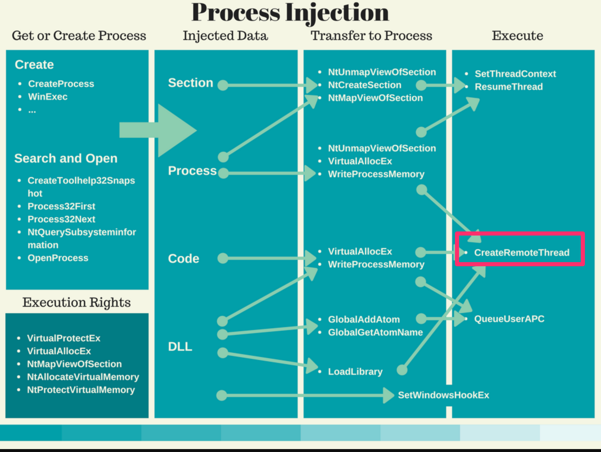

Create Remote Thread
====================

Sysmon will log **EventID 8** for processes that use the Win32 API [CreateRemoteThread](https://docs.microsoft.com/en-us/windows/win32/api/processthreadsapi/nf-processthreadsapi-createremotethread) call. This is a **low-volume, high-value event type** that detects one of the most common process injection techniques used by malware and attackers.

Detection Value and Why It Matters
-----------------------------------

CreateRemoteThread is a classic process injection technique where one process creates a thread in another process to execute code. This is used by attackers for:

**Code Injection**: Injecting malicious code into legitimate processes to evade detection and inherit the target process's privileges and context.

**Defense Evasion**: Running malicious code inside trusted processes (explorer.exe, svchost.exe) to avoid detection by security tools that trust those processes.

**Privilege Escalation**: Injecting into processes running with higher privileges.

**Persistence**: Maintaining presence by continuously injecting into long-running system processes.

**MITRE ATT&CK Mapping**:
* **T1055.001 - Process Injection: Dynamic-link Library Injection**
* **T1055.002 - Process Injection: Portable Executable Injection**
* **T1055 - Process Injection** (general)

How CreateRemoteThread Injection Works
---------------------------------------

Process injection using CreateRemoteThread follows this pattern:

Process of use/abuse of CreateRemoteThread

* Use **OpenProcess( )** to open a target process.

* Use **VirtualAllocEx( )** allocate a chunk of memory in the process.

* Use **WriteProcessMemory( )** write the payload to the newly
    allocated section.

* User **CreateRemoteThread( )** to create a new thread in the remote
    process to execute the shellcode.

There are multiple Process Injection techniques, Sysmon monitors for the
most common one used. The infographic from
<http://struppigel.blogspot.com/2017/07/process-injection-info-graphic.html>

Illustrates the different techniques.



The fields for the event are:

* **RuleName**: Name of rule that triggered the event.

* **UtcTime**: Time in UTC when event was created

* **SourceProcessGuid**: Process Guid of the source process that
    created a thread in another process

* **SourceProcessId**: Process ID used by the OS to identify the
    source process that created a thread in another process

* **SourceImage**: File path of the source process that created a
    thread in another process

* **TargetProcessGuid**: Process Guid of the target process

* **TargetProcessId**: Process ID used by the OS to identify the
    target process

* **TargetImage**: File path of the target process

* **NewThreadId**: Id of the new thread created in the target process

* **StartAddress**: New thread start address

* **StartModule**: Start module determined from thread start address
    mapping to PEB loaded module list

* **StartFunction**: Start function is reported if exact match to
    function in image export tables

Configuration Strategy: Log All, Exclude Known-Good
----------------------------------------------------

The number of processes that legitimately use CreateRemoteThread() in a production environment is **very low**. This makes it ideal for a **log-all approach** with minimal exclusions.

**Important Limitation**: CreateRemoteThread() is not the only API for creating remote threads. Attackers may use alternative methods like:
* NtCreateThreadEx()
* RtlCreateUserThread()
* QueueUserAPC()
* Other undocumented APIs

Sysmon only monitors CreateRemoteThread(), so this event type alone does not guarantee detection of all process injection. It should be combined with other event types (Process Access, Image Loading) for comprehensive coverage.

What to Investigate
-------------------

When reviewing CreateRemoteThread events, prioritize:

**1. Unknown Source Processes**
* Any SourceImage you don't recognize or that isn't a system process
* Processes running from temp directories or user folders
* Unsigned or suspicious executables

**2. Injection into Critical Processes**
* Threads created in explorer.exe, lsass.exe, or other critical system processes
* Especially suspicious if the source is not a system process

**3. Unusual StartModule or StartAddress**
* StartModule not pointing to legitimate system DLLs
* StartAddress in unusual memory regions
* StartFunction that doesn't match expected behavior

**4. Script Engines or Office Apps as Source**
* powershell.exe, cscript.exe, wscript.exe creating remote threads
* WINWORD.EXE, EXCEL.EXE injecting into other processes (very suspicious)

**5. Correlation with Other Events**
* Cross-reference with Process Access events for the same target
* Check if the source process was recently created (staging malware)


Example Configuration: Excluding Known-Good System Processes
-------------------------------------------------------------

After baselining, exclude verified legitimate uses of CreateRemoteThread:

```xml
<Sysmon schemaversion="4.22">
  <CheckRevocation/>
    <EventFiltering>
      <RuleGroup name="" groupRelation="or">
        <CreateRemoteThread onmatch="exclude">
          <!--The process activity of those in the list should be monitored since an-->
          <!--attacker may host his actions in one of these to bypass detection.-->
           <TargetImage condition="end with">
             Google\Chrome\Application\chrome.exe
            </TargetImage>
            <SourceImage condition="is">
              C:\Windows\System32\wbem\WmiPrvSE.exe
            </SourceImage>
            <SourceImage condition="is">
              C:\Windows\System32\svchost.exe
            </SourceImage>
            <SourceImage condition="is">
              C:\Windows\System32\wininit.exe
            </SourceImage>
            <SourceImage condition="is">
              C:\Windows\System32\csrss.exe
            </SourceImage>
            <SourceImage condition="is">
              C:\Windows\System32\services.exe
            </SourceImage>
            <SourceImage condition="is">
              C:\Windows\System32\winlogon.exe
            </SourceImage>
            <SourceImage condition="is">
              C:\Windows\System32\audiodg.exe
            </SourceImage>
            <StartModule condition="is">
              C:\windows\system32\kernel32.dll
            </StartModule>
        </CreateRemoteThread>
        </RuleGroup>
    </EventFiltering>
</Sysmon>
```
