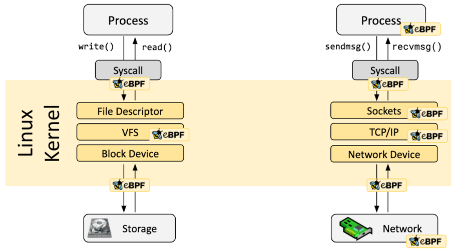
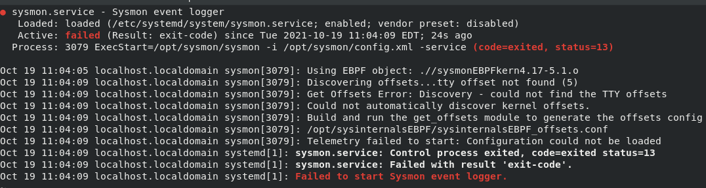

sysinternalsEBPF
=================

 Sysmon for Linux uses its own library “sysinternalsEBPF” to handle the security events monitoring process. The advantages are that eBPF is a technology that allows programs to run in a sandbox in an operating system at the kernel level. The eBPF library will allow for the collection of information on:

* Processes
* System Calls
* Network Sockets

 The “sysinternalsEBPF” library is open sourced and licensed under the MIT License. The source is available in GitHub at <https://github.com/Sysinternals/SysinternalsEBPF> In GitHub the latest installation and build instructions can be found.

The eBPF library leverages a large library of Kernel memory offsets that are stored after installation in a JSON file at /opt/sysinternalsEBPF/offsets.json if the kerneel is not one in the list it will do an auto discovery of the offsets and add them to /opt/sysinternalsEBPF/sysinternalsEBPF_offsets.conf There might be some cases where it will fail to do an autodiscovery of the offsets like in the case of a kernel update. In this case the seervice will fail to load and provide instructions on how to update the offsets. Bellow is the error that would be displayed in the case that autodiscovery fails.

The GitHub repo instructions on how to build and offset config for the current kernel are provided <https://github.com/Sysinternals/SysinternalsEBPF/tree/main/getOffsets>
