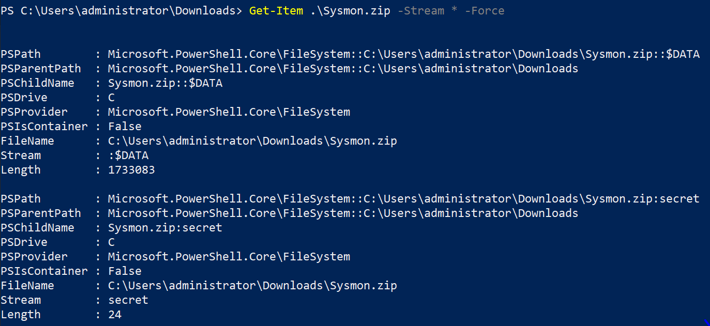
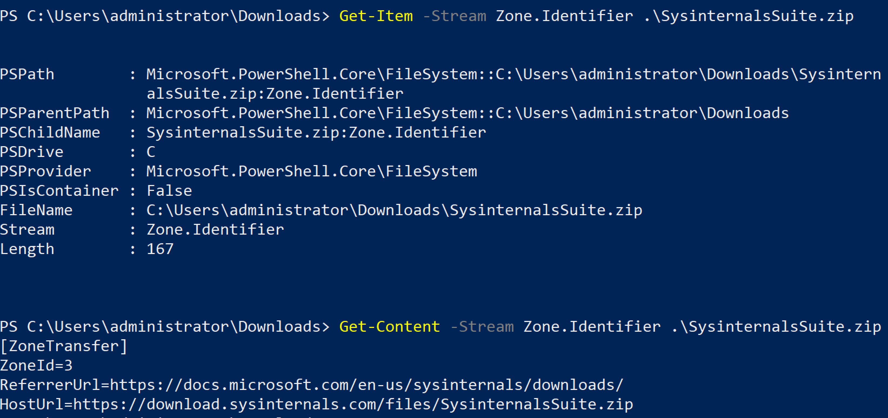

File Stream Creation Hash
=========================

Sysmon will log **EventID 15** for the creation of Alternate Data Streams (ADS) on NTFS filesystems. This is a **moderate-volume event type** that detects both malicious use of ADS for hiding payloads and provides valuable forensic information through Mark of the Web (MOTW) tracking. Alternate Data Streams are a powerful but often overlooked detection opportunity.

Detection Value and Why It Matters
-----------------------------------

Alternate Data Streams provide unique detection and forensic capabilities:

**Malicious Payload Hiding**: Attackers use ADS to hide malicious content:
* Executables hidden in alternate streams (not visible in directory listings)
* Scripts (PowerShell, VBScript, JScript) stored in ADS for execution
* Malware components and configuration files hidden from casual inspection
* Tools and utilities concealed on compromised systems

**Mark of the Web (MOTW) Forensics**: Windows Internet Explorer and other browsers create a `Zone.Identifier` ADS on downloaded files containing:
* **ZoneId**: Security zone of download (Internet, Intranet, Trusted, etc.)
* **ReferrerUrl**: The URL that linked to the download
* **HostUrl**: The URL the file was downloaded from

This data is **critical forensic evidence** for tracking:
* How malware was delivered (phishing email, malicious website)
* The origin of attacker tools and payloads
* User downloads during compromise investigations
* Attribution and infrastructure mapping

**Defense Evasion**: ADS allows attackers to:
* Bypass file extension filters (store .exe in ADS of .txt file)
* Hide from antivirus scans that don't inspect ADS
* Evade file integrity monitoring on the main data stream
* Conceal backdoors and persistence mechanisms

**MITRE ATT&CK Mapping**:
* **T1564.004 - Hide Artifacts: NTFS File Attributes** - Primary ADS abuse technique
* **T1027 - Obfuscated Files or Information** - Hiding via ADS
* **T1140 - Deobfuscate/Decode Files or Information** - Extracting from ADS

Understanding NTFS Alternate Data Streams
------------------------------------------

Each NTFS file record contains multiple attributes that define different aspects of the file:
* **$STANDARD_INFORMATION** - Timestamps and attributes
* **$FILE_NAME** - File name
* **$DATA** - File content (can have multiple streams)
* **$INDEX_ROOT**, **$BITMAP**, **$INDEX_ALLOCATION** - Directory structures
* **$ATTRIBUTE_LIST** - List of all attributes

**Alternate Data Streams** are implemented by having multiple $DATA attributes:
* **Default stream**: Unnamed stream (the normal file content)
* **Alternate streams**: Named streams (additional hidden content)

**Example**: A file `document.txt` can have:
* Default stream: `document.txt` (visible content)
* Named stream: `document.txt:hidden.exe` (hidden executable)
* MOTW stream: `document.txt:Zone.Identifier` (download origin info)

**Viewing ADS with PowerShell**:
```powershell
# File with default stream only
Get-Item file.txt -Stream *
# Output: :$DATA (unnamed default stream)

# File with alternate streams
Get-Item downloaded.exe -Stream *
# Output:
#   :$DATA (default stream)
#   Zone.Identifier (MOTW stream)
#   hidden (malicious ADS)
```


File with a second named stream:



How Attackers Use ADS
----------------------

**Hiding Executables**:
```cmd
# Hide executable in ADS of text file
type malware.exe > innocent.txt:hidden.exe

# Execute from ADS
wmic process call create "C:\innocent.txt:hidden.exe"
```

**Hiding Scripts**:
```powershell
# Store PowerShell script in ADS
Get-Content malicious.ps1 | Set-Content .\document.docx:payload.ps1 -Stream payload.ps1

# Execute from ADS
powershell -Command "Get-Content .\document.docx:payload.ps1 -Stream payload.ps1 | IEX"
```

**Execution Examples from ADS**:
* **Rundll32**: `rundll32.exe file.txt:malicious.dll,EntryPoint`
* **Cscript**: `cscript.exe file.txt:script.vbs`
* **PowerShell**: `powershell Get-Content file.txt:script.ps1 -Stream script.ps1 | IEX`

More execution techniques: https://gist.github.com/api0cradle/cdd2d0d0ec9abb686f0e89306e277b8f (by Oddvar Moe)

Mark of the Web (MOTW) - Forensic Gold
---------------------------------------

When files are downloaded using Windows APIs (`urlmon.dll`), a `Zone.Identifier` ADS is created with forensic metadata:

**Example MOTW Content**:
```
[ZoneTransfer]
ZoneId=3
ReferrerUrl=https://malicious-site.com/landing
HostUrl=https://malicious-site.com/payload.exe
```

**ZoneId Values**:
* 0 = Local computer
* 1 = Local intranet
* 2 = Trusted sites
* 3 = Internet
* 4 = Restricted sites

**Forensic Value**:
* Track phishing email links (ReferrerUrl shows email gateway URL)
* Identify malware download sites (HostUrl)
* Correlate with network logs for full attack chain
* Determine if file was locally created (no Zone.Identifier) or downloaded

**Important**: Attackers commonly delete Zone.Identifier streams to hide download origin. Detecting Zone.Identifier deletion is a strong indicator of anti-forensics activity.



Volume Characteristics
-----------------------

ADS creation volume varies by environment:
* **Workstations with active browsing**: Moderate-to-high volume (100-500 events/day)
* **Servers**: Low volume outside of software downloads
* **Most events**: Zone.Identifier streams from browsers and email clients

**MOTW Generation Pattern**: Downloading a file typically generates **6 events** as `urlmon.dll` progressively writes the Zone.Identifier stream during download. This is normal and provides detailed forensic timeline.

What to Investigate
--------------------

When reviewing file stream creation events, prioritize investigation of:

**1. Non-MOTW Alternate Streams**
* Any stream name **other than** `Zone.Identifier`
* Streams with executable names (`.exe`, `.dll`, `.ps1`, `.bat`, `.vbs`)
* Streams created by suspicious processes
* **High priority** - These are almost always malicious or very unusual

**2. Executable Content in ADS**
* Check the **Hash** field - if populated, the stream contains executable code
* Cross-reference hash with threat intelligence
* Any PE executable stored in ADS is highly suspicious

**3. Script Files in ADS**
* PowerShell scripts (`.ps1`)
* VBScript, JScript files
* Batch files, command scripts
* These enable fileless execution techniques

**4. Suspicious Processes Creating ADS**
* PowerShell, CMD creating non-MOTW streams
* Processes from temp directories
* Office applications (macros creating ADS)
* Unknown executables

**5. MOTW Forensics (Download Tracking)**
* Review **TargetFilename** to identify what was downloaded
* Check **Content** field for Zone.Identifier data (HostUrl, ReferrerUrl)
* **ZoneId=3** (Internet) downloads of executables are high-priority
* Correlate with network logs using HostUrl
* Track user downloads during investigations

**6. Timing and Context**
* ADS creation shortly after file creation
* Multiple ADS creations in sequence (staging payloads)
* ADS creation during suspected compromise timeline
* Downloads from recently created or suspicious domains

Event Fields
------------

The file stream creation event fields are:

* **RuleName**: Name of rule that triggered the event
* **UtcTime**: Time in UTC when stream was created
* **ProcessGuid**: Process GUID of the process that created the named file stream
* **ProcessId**: Process ID of the process that created the stream
* **Image**: File path of the process that created the stream
* **TargetFilename**: Full path of the file (including stream name after `:`)
* **CreationUtcTime**: File creation time (not stream creation time)
* **Hash**: Full hash of the stream contents (if stream contains executable code)
* **Contents**: For text streams <1KB, the actual stream contents are logged (MOTW data)

**Critical Field**: **Contents** field captures Zone.Identifier data, providing HostUrl and ReferrerUrl for forensic tracking.

Configuration Examples
-----------------------

**Example 1: Exclusion-Based (Recommended for Workstations)**

Log all ADS creation but exclude browsers and email clients creating MOTW streams:

```xml
<Sysmon schemaversion="4.22">
   <EventFiltering>
      <RuleGroup name="" groupRelation="or">
         <FileCreateStreamHash onmatch="exclude">
            <!-- Web Browsers (MOTW generation) -->
            <Image condition="is">C:\Program Files\Google\Chrome\Application\chrome.exe</Image>
            <Image condition="is">C:\Program Files (x86)\Google\Chrome\Application\chrome.exe</Image>
            <Image condition="is">C:\Program Files\Mozilla Firefox\firefox.exe</Image>
            <Image condition="is">C:\Program Files (x86)\Microsoft\Edge\Application\msedge.exe</Image>

            <!-- Edge Download Broker -->
            <Image condition="is">C:\Windows\System32\browser_broker.exe</Image>

            <!-- Internet Explorer -->
            <Image condition="is">C:\Program Files\Internet Explorer\iexplore.exe</Image>
            <Image condition="is">C:\Program Files (x86)\Internet Explorer\iexplore.exe</Image>

            <!-- Email Clients (MOTW on attachments) -->
            <Image condition="end with">OUTLOOK.EXE</Image>
         </FileCreateStreamHash>
      </RuleGroup>
   </EventFiltering>
</Sysmon>
```

**Example 2: Detect Only Malicious ADS (Not MOTW)**

Focus on non-Zone.Identifier streams which are almost always malicious:

```xml
<Sysmon schemaversion="4.22">
   <EventFiltering>
      <RuleGroup name="" groupRelation="or">
         <FileCreateStreamHash onmatch="exclude">
            <!-- Exclude only Zone.Identifier (MOTW) streams -->
            <TargetFilename condition="end with">:Zone.Identifier</TargetFilename>
         </FileCreateStreamHash>
      </RuleGroup>
   </EventFiltering>
</Sysmon>
```

This configuration captures **only suspicious ADS creation**, not normal download tracking.

**Example 3: Monitor Executable Downloads (Forensic Tracking)**

Capture MOTW for executable files while excluding other downloads:

```xml
<Sysmon schemaversion="4.22">
   <EventFiltering>
      <RuleGroup name="" groupRelation="or">
         <FileCreateStreamHash onmatch="include">
            <!-- Track downloads of executables and scripts -->
            <Rule groupRelation="and">
               <TargetFilename condition="end with">:Zone.Identifier</TargetFilename>
               <Rule groupRelation="or">
                  <TargetFilename condition="contains">.exe:</TargetFilename>
                  <TargetFilename condition="contains">.dll:</TargetFilename>
                  <TargetFilename condition="contains">.ps1:</TargetFilename>
                  <TargetFilename condition="contains">.bat:</TargetFilename>
                  <TargetFilename condition="contains">.vbs:</TargetFilename>
                  <TargetFilename condition="contains">.js:</TargetFilename>
                  <TargetFilename condition="contains">.hta:</TargetFilename>
                  <TargetFilename condition="contains">.msi:</TargetFilename>
               </Rule>
            </Rule>
         </FileCreateStreamHash>
      </RuleGroup>
   </EventFiltering>
</Sysmon>
```

**Example 4: Comprehensive - Detect Malicious ADS + Track Executable Downloads**

Best of both worlds - catch ADS abuse and track executable downloads:

```xml
<Sysmon schemaversion="4.22">
   <EventFiltering>
      <RuleGroup name="" groupRelation="or">
         <FileCreateStreamHash onmatch="include">
            <!-- Capture all ADS creation -->
            <TargetFilename condition="contains">:</TargetFilename>
         </FileCreateStreamHash>
      </RuleGroup>

      <RuleGroup name="" groupRelation="or">
         <FileCreateStreamHash onmatch="exclude">
            <!-- Exclude Zone.Identifier on non-executable files (reduce noise) -->
            <Rule groupRelation="and">
               <TargetFilename condition="end with">:Zone.Identifier</TargetFilename>
               <TargetFilename condition="not contains">.exe:</TargetFilename>
               <TargetFilename condition="not contains">.dll:</TargetFilename>
               <TargetFilename condition="not contains">.ps1:</TargetFilename>
               <TargetFilename condition="not contains">.bat:</TargetFilename>
               <TargetFilename condition="not contains">.vbs:</TargetFilename>
               <TargetFilename condition="not contains">.msi:</TargetFilename>
            </Rule>

            <!-- Exclude known browsers -->
            <Image condition="contains">chrome.exe</Image>
            <Image condition="contains">firefox.exe</Image>
            <Image condition="end with">msedge.exe</Image>
         </FileCreateStreamHash>
      </RuleGroup>
   </EventFiltering>
</Sysmon>
```

Investigation Workflow
-----------------------

**For Non-MOTW ADS (Malicious)**:
1. **Extract the stream**: Identify the file and stream name from TargetFilename
2. **Analyze the content**:
   ```powershell
   Get-Content "C:\path\to\file.txt" -Stream "streamname"
   ```
3. **Check for executable content**: If Hash field is populated, extract and analyze the PE
4. **Identify the creator**: Check Image field - what process created the ADS?
5. **Timeline correlation**: What else was happening when the ADS was created?

**For MOTW Streams (Forensics)**:
1. **Review Contents field**: Extract HostUrl and ReferrerUrl
2. **Check ZoneId**: Was it downloaded from Internet (3) or other zone?
3. **Identify the file**: What was downloaded? (TargetFilename)
4. **Correlate with network logs**: Search for HostUrl in proxy/firewall logs
5. **Check file hash**: Was the downloaded file malicious?
6. **Attribution**: Map HostUrl to known threat infrastructure

Detecting ADS Abuse Patterns
-----------------------------

**Pattern 1: Hiding Executables**
* TargetFilename contains `:` but doesn't end with `:Zone.Identifier`
* Hash field is populated (executable content)
* Image is PowerShell, CMD, or unknown process

**Pattern 2: Script Hiding**
* Stream names ending in `.ps1`, `.vbs`, `.js`, `.bat`
* Created by Office applications (macro-based)
* Created by scripting engines

**Pattern 3: Anti-Forensics**
* Zone.Identifier deletion (look for File Delete events with `:Zone.Identifier`)
* MOTW stream removed from recently downloaded executables
* Attacker cleaning tracks

**Pattern 4: Malware Delivery**
* MOTW showing download from newly registered domain
* Executable downloaded from suspicious TLD (.tk, .pw, etc.)
* ReferrerUrl from known malicious sites

Evasion and Limitations
------------------------

**Attacker Evasions**:
* Some attackers avoid ADS entirely, knowing it's monitored
* Can delete Zone.Identifier to hide download origin
* May use non-standard download methods that don't create MOTW
* Can use volume shadow copies to hide ADS from live analysis

**Sysmon Limitations**:
* Only logs stream creation, not stream deletion (use File Delete events)
* Does not log stream access or execution
* MOTW only created by specific download methods (urlmon.dll-based)
* Some download tools don't create Zone.Identifier

**MOTW Bypasses**:
* Downloads via curl, wget, or other non-urlmon.dll tools don't create MOTW
* File transfers over RDP, SMB shares don't create MOTW
* Archive extraction doesn't preserve MOTW on contained files

Best Practices
---------------

1. **Prioritize Non-MOTW ADS**: These are rare and high-value indicators
2. **Track Executable Downloads**: MOTW on .exe, .dll, .ps1 files provides forensic value
3. **Baseline Your Environment**: Understand normal ADS creation patterns
4. **Correlate with Network Logs**: Use HostUrl/ReferrerUrl to enrich detections
5. **Monitor for MOTW Deletion**: Cross-reference with File Delete events
6. **Maintain Exclusion Lists**: Update browser/email client exclusions as software updates

Summary
-------

File stream creation monitoring (EventID 15) provides dual value:
* **Detection**: Catches attackers hiding payloads in Alternate Data Streams
* **Forensics**: Tracks file download origins through Mark of the Web

The moderate volume and high detection value make ADS monitoring essential for:
* Detecting fileless malware techniques
* Tracking malware delivery mechanisms
* Incident response and attribution
* Understanding attacker infrastructure

When configured to exclude legitimate MOTW generation while capturing suspicious ADS creation, this event type delivers high-fidelity detections with strong forensic context.
