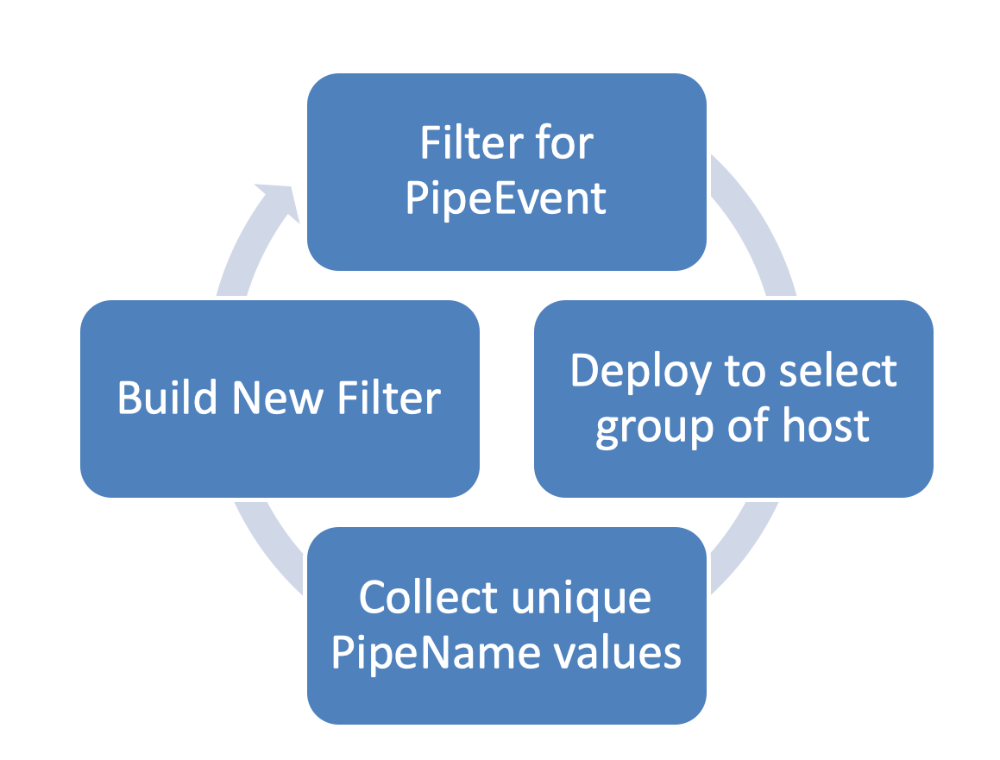

Named Pipes
===========

Sysmon will log **EventID 17** (PipeCreated) when a named pipe server is created and **EventID 18** (PipeConnected) when a client connects to a named pipe. Named pipe monitoring is a **moderate-volume event type** that requires careful filtering strategy based on your environment. Named pipes are critical for detecting lateral movement, command and control communication, and inter-process communication used by malware.

Detection Value and Why It Matters
-----------------------------------

A named pipe is a named, one-way or duplex pipe for communication between a pipe server and one or more pipe clients. Each named pipe has a unique name that distinguishes it from other named pipes in the system's list of named objects. Pipe names follow the format `\\ServerName\pipe\PipeName` (or `\\.\pipe\PipeName` for local connections).

Attackers extensively use named pipes for:

**Lateral Movement and C2 Communication**: Named pipes enable SMB-based communication between systems. Remote Access Trojans (RATs) and implants like Cobalt Strike, Metasploit, and Empire use named pipes to:
* Create communication channels between compromised systems
* Tunnel commands and data over SMB (port 445)
* Pivot through networks via established trust relationships
* Bypass network firewalls by using allowed SMB traffic

**Inter-Process Communication (IPC)**: Malware uses named pipes to communicate between different processes on the same system:
* Communication with injected code in other processes
* Coordination between malware components
* Data exchange between stagers and payloads

**Well-Known Attack Tool Pipes**: Many offensive security tools use identifiable pipe names that can be detected:
* **Cobalt Strike**: `\MSSE-<number>-server`, `\msagent_<number>`, `\postex_<number>`, `\postex_ssh_<number>`
* **Metasploit**: `\msf-pipe-<number>`, `\msfpipe`
* **PsExec**: `\PSEXESVC`
* **Empire**: Uses customizable pipe names, often defaults like `\Legit-Pipe-Name`

However, experienced attackers often avoid using well-known pipe names to prevent detection and to avoid breaking normal system operations.

**MITRE ATT&CK Mapping**:
* **T1021.002 - Remote Services: SMB/Windows Admin Shares** - Named pipes over SMB
* **T1090 - Proxy** - Named pipe pivoting
* **T1573 - Encrypted Channel** - Named pipes for encrypted C2
* **T1071 - Application Layer Protocol** - Named pipes as C2 channel

Volume Characteristics and Configuration Strategy
--------------------------------------------------

Named pipe volume varies significantly by environment:
* Workstations typically generate moderate volume (50-200 events per day)
* Systems with SQL Server, Exchange, or enterprise software generate many legitimate pipes
* Servers with database or messaging software can generate thousands of events per day
* Volume depends heavily on installed applications and their use of inter-process communication

**Two Configuration Approaches:**

**Approach 1 - Exclusion-Based (Recommended for most environments)**: Log all named pipes but exclude known-good system and application pipes. This provides comprehensive visibility while keeping volume manageable. This approach requires ongoing baseline maintenance but offers the most detection value during incident response, as you'll capture novel or custom pipe names used by attackers.

**Approach 2 - Targeted Includes (For high-volume environments)**: Only log known malicious pipe names or pipes from suspicious processes. This minimizes volume but may miss novel attacks. This approach is better served with automated SIEM-based detection logic rather than Sysmon filtering alone.

**The baseline and iterative refinement process should be continuous**, as new applications and updates may introduce new legitimate pipes.

What to Investigate
--------------------

When reviewing named pipe events, prioritize investigation of:

**1. Known Malicious Pipe Names**
* Cobalt Strike indicators: `MSSE-`, `msagent_`, `postex_`, `status_`
* Metasploit indicators: `msf`, `meterpreter`
* PsExec: `\PSEXESVC` (unless you use PsExec legitimately)
* Any pipes matching known offensive tool patterns

**2. Suspicious Pipe Name Patterns**
* Random-looking names (long strings of random characters)
* Misspellings of legitimate pipe names
* Generic names trying to blend in (`\pipe\generic`, `\pipe\default`)
* Pipes with unusual prefixes or suffixes

**3. Pipes Created by Suspicious Processes**
* PowerShell, cmd.exe, or scripting engines creating named pipes
* Processes running from temp directories or user folders
* Unsigned or recently created executables
* Processes with suspicious parent-child relationships

**4. Unusual Pipe Connections (EventID 18)**
* Connections to pipes from unexpected processes
* Cross-process pipe connections that don't match normal application behavior
* Connections shortly after suspicious process creation

**5. Remote Pipe Connections**
* Pipes with ServerName that isn't `.` (local)
* SMB-based pipe connections between systems (check network logs for corresponding SMB traffic)
* Pipe activity correlating with lateral movement indicators

**6. Timing and Correlation**
* Pipe creation shortly after initial compromise indicators
* Multiple pipe events in sequence suggesting C2 setup
* Pipe activity during off-hours
* Correlation with Process Access or Network Connection events



Event Fields and Structure
---------------------------

The fields for the Pipe Create Event (EventID 17) are:

* **RuleName**: Name of rule that triggered the event
* **EventType**: `CreatePipe`
* **UtcTime**: Time in UTC when event was created
* **ProcessGuid**: Process GUID of the process that created the pipe
* **ProcessId**: Process ID used by the OS to identify the process that created the pipe
* **PipeName**: Name of the pipe created
* **Image**: File path of the process that created the pipe

The fields for the Pipe Connect Event (EventID 18) are:

* **RuleName**: Name of rule that triggered the event
* **EventType**: `ConnectPipe`
* **UtcTime**: Time in UTC when event was created
* **ProcessGuid**: Process GUID of the process that connected to the pipe
* **ProcessId**: Process ID used by the OS to identify the process that connected to the pipe
* **PipeName**: Name of the pipe connected
* **Image**: File path of the process that connected to the pipe

Configuration Examples
-----------------------

**Initial Baseline Configuration**: Log all named pipes to understand your environment

```xml
<Sysmon schemaversion="4.22">
    <EventFiltering>
        <RuleGroup name="" groupRelation="or">
            <!-- Log all named pipe events initially -->
            <PipeEvent onmatch="exclude">
            </PipeEvent>
        </RuleGroup>
    </EventFiltering>
</Sysmon>
```

After collecting baseline data for 1-2 weeks, analyze the unique PipeName values and create exclusions for verified legitimate pipes.

**Exclusion-Based Configuration**: After baselining, exclude known-good pipes

```xml
<Sysmon schemaversion="4.22">
    <EventFiltering>
        <RuleGroup name="Exclude Known Good Named Pipes" groupRelation="or">
            <PipeEvent onmatch="exclude">
                <!-- Windows OS Pipes -->
                <PipeName condition="is">\ntapvsrq</PipeName>
                <PipeName condition="is">\srvsvc</PipeName>
                <PipeName condition="is">\wkssvc</PipeName>
                <PipeName condition="is">\lsass</PipeName>
                <PipeName condition="is">\winreg</PipeName>
                <PipeName condition="is">\spoolss</PipeName>
                <PipeName condition="is">\samr</PipeName>
                <PipeName condition="is">\eventlog</PipeName>
                <PipeName condition="contains">Anonymous Pipe</PipeName>

                <!-- IIS Web Server -->
                <Image condition="is">c:\windows\system32\inetsrv\w3wp.exe</Image>

                <!-- Microsoft SQL Server Pipes -->
                <PipeName condition="is">\SQLLocal\MSSQLSERVER</PipeName>
                <PipeName condition="is">\SQLLocal\INSTANCE01</PipeName>
                <PipeName condition="is">\SQLLocal\SQLEXPRESS</PipeName>
                <PipeName condition="is">\SQLLocal\COMMVAULT</PipeName>
                <PipeName condition="is">\SQLLocal\RTCLOCAL</PipeName>
                <PipeName condition="is">\SQLLocal\RTC</PipeName>
                <PipeName condition="is">\SQLLocal\TMSM</PipeName>

                <!-- Add environment-specific exclusions discovered during baseline -->
            </PipeEvent>
        </RuleGroup>
    </EventFiltering>
</Sysmon>
```

**Targeted Include Configuration**: For high-volume environments, only log suspicious patterns

```xml
<Sysmon schemaversion="4.22">
    <EventFiltering>
        <RuleGroup name="Include Suspicious Named Pipes" groupRelation="or">
            <PipeEvent onmatch="include">
                <!-- Cobalt Strike Indicators -->
                <PipeName condition="contains">MSSE-</PipeName>
                <PipeName condition="contains">msagent_</PipeName>
                <PipeName condition="contains">postex_</PipeName>
                <PipeName condition="contains">status_</PipeName>

                <!-- Metasploit Indicators -->
                <PipeName condition="contains">msf</PipeName>
                <PipeName condition="contains">meterpreter</PipeName>

                <!-- PsExec -->
                <PipeName condition="is">\PSEXESVC</PipeName>

                <!-- Suspicious processes creating pipes -->
                <Image condition="end with">\powershell.exe</Image>
                <Image condition="end with">\cmd.exe</Image>
                <Image condition="end with">\cscript.exe</Image>
                <Image condition="end with">\wscript.exe</Image>
                <Image condition="contains">\Temp\</Image>
                <Image condition="contains">\AppData\Local\Temp\</Image>
            </PipeEvent>
        </RuleGroup>
    </EventFiltering>
</Sysmon>
```

Important Limitation: Minifilter Altitude
------------------------------------------

Sysmon uses a minifilter driver to monitor named pipe creation, similar to how it monitors file events. **If any antivirus or EDR solution with a lower altitude number** (which means higher priority in the driver stack) **triggers on a named pipe and blocks it, Sysmon will not log the event**.

This means some malicious pipe creation attempts may be blocked by security software before Sysmon can observe them. This is generally acceptable, as the pipe was blocked, but it's important to understand this limitation when investigating incidents. Your EDR or antivirus logs may contain pipe blocking events that don't appear in Sysmon.
