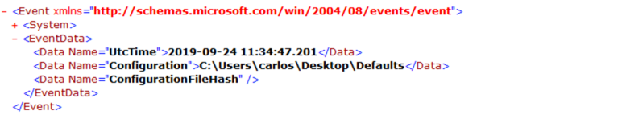
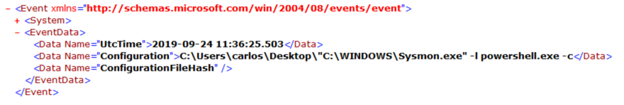
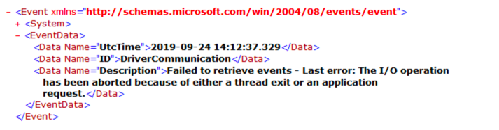
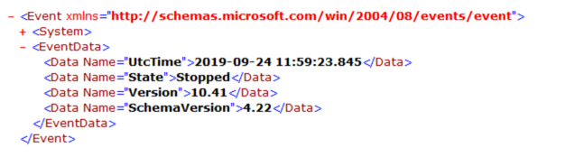

Sysmon Operational Events
=========================

* [Sysmon Operational Events](#sysmon-operational-events)

  * [Sysmon Config Change](#sysmon-config-change)

  * [Sysmon Error Event](#sysmon-error-event)

  * [Service State Change](#service-state-change)

Sysmon will generate events for monitoring:

* Configuration Changes

* Service State Changes

* Sysmon Errors

These events cannot be filtered using Sysmon configuration and will be
generated by the sysmon.exe (Default Install) process.

Sysmon Config Change
--------------------

Sysmon will log an EventID 16 when it updates its configuration. The event will only be generated if the configuration is changed with the Sysmon binary and not a direct change to the registry key. It is recommended that Windows Auditing be configured for the configuration key and a Sysmon filter to capture any attempt at modification outside of the use of the Sysmon binary.

Fields for the Event:

* **UtcTime**: Time the configuration was modified.

* **Configuration**: Path to configuration file or command line of
    command used to modify the config.

* **ConfigurationFileHash**: If a configuration file was used, the
    hash of the file.

Example: Configuration using a XML file.

Example: Configuration via Command Line resetting configuration to
default using the \-- switch.

Example: Configuration via Command Line. Set to monitor module loading
by powershell.exe

Sysmon Error Event
------------------

If the Sysmon binary running as a service encounters any error in its operation, it will generate an EventID 255. Some of the cases where this event may be generated are when:

* The driver fails to load, or an attacker may have unloaded the driver

* An application or attacker has modified the configuration in a way that cannot be parsed by the service

Fields for the Event:

* **UtcTime**: Time when the error was logged.

* **ID**: The error ID

* **Description**: Description of what caused the error.

Example:

Service State Change
--------------------

EventID 4 is generated for Service State Changes. This event logs Start and Stop events when the Sysmon service is controlled via the Service Control Manager API (Services.mmc, sc.exe, net.exe, etc.). To better detect any manipulation of the service, Windows Auditing should be enabled for the service registry key and a Sysmon Registry filter for the service.

Fields for the event are:

* **UtcTime**: Time the service state changed.

* **State**: Started or Stopped

* **Version**: Version of the Sysmon binary

* **SchemaVersion**: Schema Version of the Sysmon binary.

Example:

