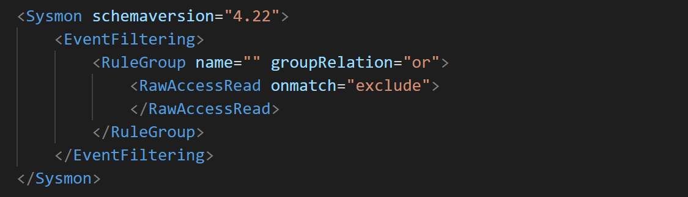

Raw Access Read
===============

Sysmon will log **EventID 9** for any process attempting to read directly from a storage device, bypassing filesystem restrictions. This is a **low-volume, extremely high-value event type** that should almost always log all occurrences. Raw disk access is rare in normal operations and highly indicative of credential theft or anti-forensics activity.

Detection Value and Why It Matters
-----------------------------------

Raw access read bypasses the Windows filesystem layer to read data directly from disk. In normal operations, only specialized software performs this action:
* Drive imaging tools (forensic software)
* Backup software performing sector-level backups
* Disk repair and recovery utilities

Attackers use raw disk access for critical attack objectives:

**Credential Harvesting on Windows**: Direct disk access allows attackers to bypass file locks and permissions to steal:
* **NTDS.dit** (Active Directory database on Domain Controllers) - Contains password hashes for all domain accounts
* **SAM Registry Hive** - Local user account password hashes
* **SYSTEM Registry Hive** - Needed to decrypt SAM hashes

**Credential Harvesting on Linux**: Raw block device access to steal:
* Shadow password files
* SSH private keys
* Credential stores and key material

**Anti-Forensics**: Reading raw disk to:
* Locate and wipe evidence from unallocated space
* Access deleted files
* Manipulate filesystem metadata

**Data Theft**: Bypassing filesystem permissions to access protected files.

**MITRE ATT&CK Mapping**:
* **T1003.002 - OS Credential Dumping: Security Account Manager** - SAM hive theft
* **T1003.003 - OS Credential Dumping: NTDS** - NTDS.dit extraction
* **T1006 - Direct Volume Access** - Raw disk access technique
* **T1561 - Disk Wipe** - Anti-forensics using raw access

Why This is Low-Volume
-----------------------

Raw disk access is extremely rare:
* Normal applications use filesystem APIs, not raw disk access
* Even most administrative tools don't require raw access
* Typical systems generate 0-5 events per day, often zero
* Events usually come from legitimate backup or imaging software

This makes raw access read ideal for **logging everything** with minimal or no exclusions.

Configuration Strategy: Log All
--------------------------------

The recommended approach is simple: **log all raw access read events**. The volume is so low that filtering provides minimal benefit and risks missing critical detections.

On systems with frequent legitimate imaging or backup operations, you may exclude those specific tools by full path after verification.

The fields for the event are:

* **RuleName**: Name of rule that triggered the event

* **UtcTime**: Time in UTC when event was created

* **ProcessGuid**: Process GUID of the process that conducted reading operations from the drive

* **ProcessId**: Process ID used by the OS to identify the process that conducted reading operations from the drive

* **Image**: File path of the process that conducted reading operations from the drive

* **Device**: Target device

What to Investigate
--------------------

When reviewing raw access read events, **investigate every occurrence** unless it's from verified legitimate software:

**1. Unknown Processes**: Any process you don't recognize performing raw disk access should be investigated immediately.

**2. Suspicious Processes**:
* powershell.exe, cmd.exe, or scripting engines with raw disk access
* Processes from temp directories or user folders
* Recently created processes accessing raw disk

**3. Timing Correlation**:
* Raw disk access shortly after suspicious process creation
* Access during off-hours or immediately after compromise indicators
* Multiple raw access events in sequence

**4. Targeted Devices**:
* Access to system drive (C:\) partitions
* Domain controller disk access (potential NTDS.dit theft)

**5. Known Attack Tools**:
* ntdsutil.exe used outside of maintenance windows
* Custom or unknown utilities accessing disk

Configuration: Log All (Recommended)
-------------------------------------

Given the extremely low volume and high detection value, the recommended configuration is simple - log everything:

Raw access read monitoring provides some of the highest-fidelity detections available. Nearly every occurrence outside of known backup windows warrants investigation.
