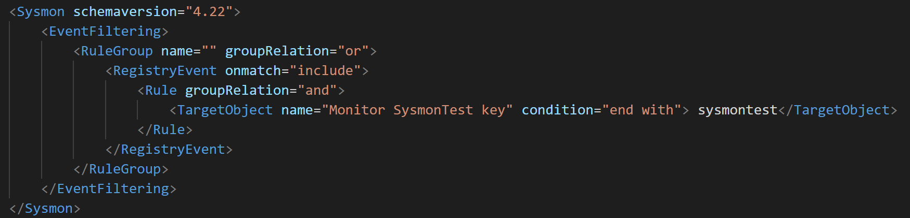
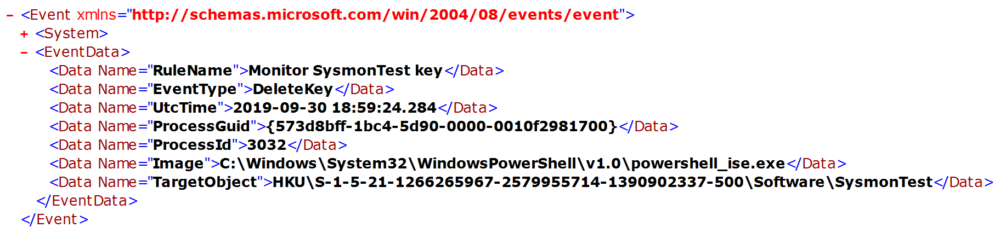
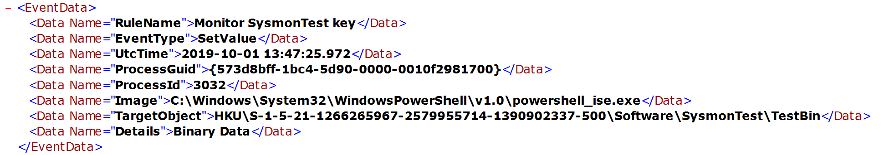

Registry Actions
================

Sysmon has the capability to monitor for three major actions against the Windows Registry:

* **EventID 12** - Registry object (key) added or deleted

* **EventID 13** - Registry value set

* **EventID 14** - Registry object (key) renamed

The Windows Registry has been a central target for attackers since its introduction in Windows NT 4.0 and Windows 95. The registry provides attackers with capabilities for persistence, privilege escalation, defense evasion, discovery, and configuration manipulation. Understanding registry monitoring is critical for detection engineering, but it must be approached carefully due to extreme volume challenges.

Detection Value and Use Cases
------------------------------

Registry monitoring provides visibility into some of the most common and persistent attack techniques:

**Persistence Mechanisms**: Attackers use registry keys to ensure their malware survives reboots. Common persistence locations include:
* Run and RunOnce keys for automatic program execution at startup
* Services keys for creating malicious Windows services
* Winlogon keys for hijacking the logon process
* Scheduled task configurations stored in registry
* AppInit_DLLs and AppCertDlls for DLL injection on process start

**Privilege Escalation**: Registry modifications can elevate privileges or bypass security controls:
* UAC bypass techniques often modify specific registry values
* Service configuration changes to run malware with SYSTEM privileges
* Accessibility feature hijacking (Sticky Keys, etc.)

**Defense Evasion**: Attackers modify registry to disable security controls:
* Windows Defender settings and exclusions
* Windows Firewall configuration
* Safe boot settings
* Audit policy modifications to reduce logging

**Discovery**: Attackers query registry for reconnaissance:
* Installed software enumeration
* Network configuration discovery
* Security product identification
* System configuration gathering

**Credential Access**: Some registry locations contain or control credential storage:
* LSA secrets configuration
* Credential manager settings
* WDigest authentication settings (enabling plaintext credential storage)

**MITRE ATT&CK Mapping**: Registry monitoring helps detect numerous techniques:
* **T1547 - Boot or Logon Autostart Execution** - Run keys, services, Winlogon modifications
* **T1112 - Modify Registry** - General registry tampering
* **T1548 - Abuse Elevation Control Mechanism** - UAC bypass techniques
* **T1562 - Impair Defenses** - Disabling security tools via registry
* **T1012 - Query Registry** - Reconnaissance through registry queries
* **T1543.003 - Create or Modify System Process: Windows Service** - Service manipulation
* **T1546 - Event Triggered Execution** - Various registry-based execution triggers
* **T1574 - Hijack Execution Flow** - DLL hijacking, path interception via registry

The Extreme Volume Challenge
-----------------------------

Registry events are among the highest-volume event types Sysmon generates. The Windows Registry is accessed thousands of times per minute during normal system operation:
* Windows components constantly read and write registry values
* Every application startup involves numerous registry accesses
* Background services continuously update configuration in registry
* User profile changes modify HKCU extensively
* Group Policy processing writes to many registry locations

**You CANNOT log all registry activity.** Attempting to do so will:
* Generate tens of thousands to millions of events per day per system
* Severely impact system performance (CPU and I/O)
* Overwhelm your SIEM infrastructure
* Create so much noise that real detections are impossible to find
* Potentially cause Sysmon to consume excessive system resources

Configuration Philosophy: Highly Targeted Includes
---------------------------------------------------

Registry monitoring requires the **most aggressive targeted include approach** of any Sysmon event type. You must be extremely selective about which registry keys you monitor. Focus exclusively on high-value keys known to be abused by attackers.

**Best Practices:**
* Only monitor specific registry paths that indicate malicious activity
* Avoid broad patterns that match many keys
* Prefer "end with" or exact matches over "contains" when possible
* Never attempt to monitor entire registry hives or subtrees
* Test any new registry filters in a lab first to assess volume
* Start with a minimal configuration and expand carefully

Sysmon uses abbreviated versions of Registry root key names, with the following mappings:


|**Key name**                                  |**Abbreviation**                |
|---------------------------------------------|---------------------------------
| HKEY\_LOCAL\_MACHINE                          |HKLM|
| HKEY\_USERS                                   |HKU|
| HKEY\_LOCAL\_MACHINE\\System\\ControlSet00x   |HKLM\\System\\CurrentControlSet|
| HKEY\_LOCAL\_MACHINE\\Classes                 |HKCR|

Registry Add/Delete Fields:

* **RuleName**: Name of rule that triggered the event

* **UtcTime**: Time in UTC when event was created

* **EventType**: CreateKey or DeleteKey

* **ProcessGuid**: Process GUID of the process that created or deleted a registry key

* **ProcessId**: Process ID used by the OS to identify the process that created or deleted a registry key

* **Image**: File path of the process that created or deleted a registry key

* **TargetObject**: Complete path of the registry key


Registry Set Value Fields:

* **RuleName**: Name of rule that triggered the event

* **UtcTime**: Time in UTC when event was created

* **EventType**: SetValue

* **ProcessGuid**: Process GUID of the process that modified a registry value

* **ProcessId**: Process ID used by the OS to identify the process that modified a registry value

* **Image**: File path of the process that modified a registry value

* **TargetObject**: Complete path of the modified registry key

* **Details**: Details added to the registry key


Registry Rename Fields:

* **RuleName**: Name of rule that triggered the event

* **UtcTime**: Time in UTC when event was created

* **EventType**: RenameKey

* **ProcessGuid**: Process GUID of the process that renamed a registry value and key

* **ProcessId**: Process ID used by the OS to identify the process that renamed a registry value and key

* **Image**: File path of the process that renamed a registry value and key

* **TargetObject**: Complete path of the renamed registry key

* **NewName**: New name of the registry key


This event type is better used in a targeted manner given the size of the registry and how it is used by a multitude of processes on a daily basis in Windows.

In registry events, the value name is appended to the full key path with a \"\\\" delimiter.

Default key values are named \"\\(Default)\"

When filtering for keys or values in HKCU, use **contains** or **ends with** when filtering against **TargetObject** since the SID of the user is appended after the Hive name.





Since the value name is appended when specifying a registry path in **TargetObject**, where we also want to catch modification of values under the key, the **contains** operator is better suited than **ends with**. For value events, the **Detail** element of the event will contain the type of value.

Sysmon does not log the actual value being set nor a previous or new one being modified.




High-Value Registry Keys to Monitor
------------------------------------

Focus your registry monitoring on these high-value locations known to be frequently abused:

**Persistence - Autorun Locations:**
* `\CurrentVersion\Run` and `\CurrentVersion\RunOnce` - Most common persistence mechanism
* `\CurrentVersion\Explorer\User Shell Folders\Startup` - Startup folder path hijacking
* `\Windows NT\CurrentVersion\Winlogon\` (Userinit, Shell, Notify) - Logon process hijacking
* `\CurrentControlSet\Control\Session Manager\BootExecute` - Pre-boot execution

**Service Manipulation:**
* `\CurrentControlSet\Services\*\ImagePath` - Service executable path
* `\CurrentControlSet\Services\*\ServiceDll` - Service DLL specification
* `\CurrentControlSet\Services\*\Start` - Service start mode changes

**DLL Loading and Hijacking:**
* `\Windows NT\CurrentVersion\Windows\AppInit_DLLs` - DLLs loaded into every process
* `\System\CurrentControlSet\Control\Session Manager\AppCertDlls` - DLL injection mechanism
* `\Explorer\FileExts` and file association shell commands - Execution through file associations

**Defense Evasion - Security Tool Tampering:**
* `\SOFTWARE\Microsoft\Windows Defender\` - Windows Defender settings
* `\SOFTWARE\Policies\Microsoft\Windows Defender\` - Defender policy modifications
* `\SYSTEM\CurrentControlSet\Services\WinDefend\Start` - Defender service disable
* `\SOFTWARE\Microsoft\Windows\CurrentVersion\Policies\System\EnableLUA` - UAC disable

**Credential Access:**
* `\SYSTEM\CurrentControlSet\Control\SecurityProviders\WDigest\UseLogonCredential` - Enable WDigest plaintext passwords
* `\SYSTEM\CurrentControlSet\Control\Lsa\` - LSA configuration

**Accessibility Feature Hijacking (Sticky Keys, etc.):**
* `\SOFTWARE\Microsoft\Windows NT\CurrentVersion\Image File Execution Options\sethc.exe` - Sticky Keys debugger
* `\SOFTWARE\Microsoft\Windows NT\CurrentVersion\Image File Execution Options\utilman.exe` - Utility Manager debugger
* Similar paths for osk.exe, narrator.exe, magnify.exe, displayswitch.exe

Configuration Examples
-----------------------

**Example 1: Comprehensive Persistence Monitoring**

```xml
<Sysmon schemaversion="4.22">
   <EventFiltering>
 <RuleGroup name="" groupRelation="or">
      <RegistryEvent onmatch="include">
        <TargetObject name="technique_id=T1060,technique_name=Registry Run Keys / Start Folder" condition="contains">\CurrentVersion\Run</TargetObject><!--Microsoft:Windows: Run keys, incld RunOnce, RunOnceEx, RunServices, RunServicesOnce [Also covers terminal server] -->
        <TargetObject condition="contains">\Group Policy\Scripts</TargetObject> <!--Microsoft:Windows: Group policy scripts-->
        <TargetObject name="technique_id=T1037,technique_name=Logon Scripts" condition="contains">\Windows\System\Scripts</TargetObject> <!--Microsoft:Windows: Logon, Loggoff, Shutdown-->
        <TargetObject name="technique_id=T1060,technique_name=Registry Run Keys / Start Folder" condition="contains">\Policies\Explorer\Run</TargetObject><!--Microsoft:Windows -->
        <TargetObject condition="end with">\ServiceDll</TargetObject> <!--Microsoft:Windows: Points to a service's DLL [ https://blog.cylance.com/windows-registry-persistence-part-1-introduction-attack-phases-and-windows-services ] -->
        <TargetObject condition="end with">\ImagePath</TargetObject> <!--Microsoft:Windows: Points to a service's EXE [ https://github.com/crypsisgroup/Splunkmon/blob/master/sysmon.cfg ] -->
        <TargetObject condition="end with">\Start</TargetObject> <!--Microsoft:Windows: Services start mode changes (Disabled, Automatically, Manual)-->
        <TargetObject name="technique_id=T1004,technique_name=Winlogon Helper DLL" condition="begin with">HKLM\SOFTWARE\Microsoft\Windows NT\CurrentVersion\Winlogon\Notify</TargetObject><!--Microsoft:Windows: Autorun location [ https://www.cylance.com/windows-registry-persistence-part-2-the-run-keys-and-search-order ] -->
        <TargetObject name="technique_id=T1004,technique_name=Winlogon Helper DLL" condition="begin with">HKLM\SOFTWARE\Microsoft\Windows NT\CurrentVersion\Winlogon\Userinit</TargetObject> <!--Microsoft:Windows: Autorun location [ https://www.cylance.com/windows-registry-persistence-part-2-the-run-keys-and-search-order ] -->
        <TargetObject name="technique_id=T1004,technique_name=Winlogon Helper DLL" condition="begin with">HKLM\SOFTWARE\Microsoft\Windows NT\CurrentVersion\Winlogon\Shell</TargetObject>
        <TargetObject condition="begin with">HKLM\SOFTWARE\WOW6432Node\Microsoft\Windows NT\CurrentVersion\Drivers32</TargetObject> <!--Microsoft:Windows: Legacy driver loading | Credit @ion-storm -->
        <TargetObject name="technique_id=T1060,technique_name=Registry Run Keys / Start Folder" condition="begin with">HKLM\SYSTEM\CurrentControlSet\Control\Session Manager\BootExecute</TargetObject> <!--Microsoft:Windows: Autorun | Credit @ion-storm | [ https://www.cylance.com/windows-registry-persistence-part-2-the-run-keys-and-search-order ] -->
        <TargetObject name="technique_id=T1042,technique_name=Change Default File Association" condition="contains">\Explorer\FileExts</TargetObject><!--Microsoft:Windows: Changes to file extension mapping-->
        <TargetObject condition="contains">\shell\install\command</TargetObject> <!--Microsoft:Windows: Sensitive subkey under file associations and CLSID that map to launch command-->
        <TargetObject condition="contains">\shell\open\command</TargetObject> <!--Microsoft:Windows: Sensitive subkey under file associations and CLSID that map to launch command-->
        <TargetObject condition="contains">\shell\open\ddeexec</TargetObject> <!--Microsoft:Windows: Sensitive subkey under file associations and CLSID that map to launch command-->
        <TargetObject name="technique_id=T1060,technique_name=Registry Run Keys / Start Folder" condition="contains">Software\Microsoft\Windows\CurrentVersion\Explorer\User Shell Folders\Startup</TargetObject>
    </RegistryEvent>
</RuleGroup>
</EventFiltering>
</Sysmon>
```

**Example 2: Defense Evasion Detection**

Monitor for attempts to disable security controls:

```xml
<RegistryEvent onmatch="include">
  <!-- Windows Defender Tampering -->
  <TargetObject name="DefenderDisable" condition="contains">\Microsoft\Windows Defender\DisableAntiSpyware</TargetObject>
  <TargetObject condition="contains">\Microsoft\Windows Defender\Exclusions\</TargetObject>
  <TargetObject condition="contains">\Microsoft\Windows Defender\Real-Time Protection\</TargetObject>

  <!-- UAC Bypass -->
  <TargetObject name="UACDisable" condition="contains">\Policies\System\EnableLUA</TargetObject>
  <TargetObject condition="contains">\Policies\System\ConsentPromptBehaviorAdmin</TargetObject>

  <!-- Firewall Disable -->
  <TargetObject condition="contains">\CurrentControlSet\Services\SharedAccess\Parameters\FirewallPolicy\</TargetObject>
</RegistryEvent>
```

**Example 3: Credential Access Monitoring**

```xml
<RegistryEvent onmatch="include">
  <!-- WDigest Plaintext Password Enable -->
  <TargetObject name="WDigestDowngrade" condition="end with">\WDigest\UseLogonCredential</TargetObject>

  <!-- LSA Configuration Changes -->
  <TargetObject condition="contains">\Control\Lsa\DisableRestrictedAdmin</TargetObject>
  <TargetObject condition="contains">\Control\Lsa\LmCompatibilityLevel</TargetObject>
</RegistryEvent>
```

**Example 4: Accessibility Feature Hijacking (Sticky Keys)**

```xml
<RegistryEvent onmatch="include">
  <!-- Image File Execution Options - Debugger Hijacking -->
  <TargetObject name="StickyKeysHijack" condition="contains">\Image File Execution Options\sethc.exe</TargetObject>
  <TargetObject name="UtilManHijack" condition="contains">\Image File Execution Options\utilman.exe</TargetObject>
  <TargetObject condition="contains">\Image File Execution Options\osk.exe</TargetObject>
  <TargetObject condition="contains">\Image File Execution Options\narrator.exe</TargetObject>
  <TargetObject condition="contains">\Image File Execution Options\magnify.exe</TargetObject>
</RegistryEvent>
```

What to Investigate
-------------------

When reviewing registry events, prioritize these patterns:

**1. Run Key Modifications**
* New or modified entries in Run/RunOnce keys, especially in HKLM (affects all users)
* Unusual paths (temp directories, ProgramData, user folders)
* Encoded or obfuscated command lines
* Unsigned executables being added to autorun

**2. Service Creation or Modification**
* New services created outside of normal software installation
* Existing service ImagePath or ServiceDll modifications
* Service start type changes from Disabled to Automatic
* Services pointing to unusual file locations

**3. Security Tool Tampering**
* Any modifications to Windows Defender registry keys
* Defender exclusion additions
* Firewall rule changes or firewall disable
* UAC setting modifications

**4. Accessibility Feature Abuse**
* Debugger registry key creation for sethc.exe, utilman.exe, or other accessibility executables
* This technique allows attackers to get SYSTEM shell at login screen by pressing Shift 5 times

**5. File Association Hijacking**
* Changes to shell\open\command or shell\open\ddeexec for common file types
* Can cause malicious code execution when users open files

**6. WDigest Credential Downgrade**
* UseLogonCredential set to 1 (enables storing plaintext passwords in memory for older protocols)
* Common post-exploitation technique to facilitate credential dumping

**7. Unusual Processes Modifying Registry**
* Scripting engines (powershell.exe, cmd.exe, wscript.exe) modifying persistence keys
* Processes running from temp directories making registry changes
* Non-administrative tools modifying HKLM

Understanding HKCU Monitoring Challenges
-----------------------------------------

Monitoring HKEY_CURRENT_USER (HKCU) is particularly challenging because:
* Each user has their own HKCU hive identified by their SID
* The actual registry path includes the SID: `HKEY_USERS\S-1-5-21-xxx-xxx-xxx-xxxx\Software\...`
* Sysmon translates this to HKU\{SID}\...

**When filtering HKCU keys:**
* Use **contains** instead of **begins with** or **is** because the SID varies per user
* Example: `<TargetObject condition="contains">\CurrentVersion\Run</TargetObject>` will match both HKLM and HKCU Run keys

**HKCU Monitoring Considerations:**
* HKCU persistence affects only a single user but can still be valuable for detection
* HKCU is modified very frequently by normal user activity
* Consider only monitoring specific high-value HKCU keys rather than broad patterns
* HKLM persistence is generally higher priority (affects all users, often requires elevation)

Common False Positives and Mitigation
--------------------------------------

Registry monitoring will generate some benign events even with targeted includes:

**Software Updates and Installations**
* Legitimate software modifying Run keys during installation
* Windows updates changing service configurations
* **Mitigation**: Filter known software installers by full path and signature, or accept and triage at SIEM level

**Group Policy Application**
* Domain Group Policy writing to various registry locations
* **Mitigation**: Identify Group Policy engine processes and consider excluding, or use SIEM correlation to identify GP-related changes

**Windows Built-in Maintenance**
* System maintenance tasks modifying registry
* Windows Defender updates changing Defender registry
* **Mitigation**: Baseline normal maintenance patterns and filter at SIEM level

**Management Software**
* SCCM, Tanium, or other endpoint management making registry changes
* **Mitigation**: Document expected management tool behavior and exclude specific processes with full path

Performance and Volume Management
----------------------------------

Registry monitoring requires careful performance management:

**Start Minimal**: Begin with only the most critical persistence keys (Run, Services, Winlogon) and expand gradually.

**Test Every Addition**: Before adding a new registry filter to production, test it in a lab environment for 24-48 hours to measure event volume.

**Monitor Sysmon CPU Usage**: Registry filtering happens in real-time and can consume CPU. Watch for Sysmon process CPU spikes after configuration changes.

**Typical Volume Expectations**: With a well-tuned configuration monitoring ~20-30 high-value registry paths, expect:
* Workstations: 10-100 events/day
* Servers: 50-500 events/day
* Domain Controllers: Higher due to Group Policy application

**If Volume Exceeds Expectations:**
* Review which specific TargetObject patterns are generating the most events
* Consider if the filter is too broad (using "contains" when "end with" would suffice)
* Evaluate if SIEM-level filtering might be more appropriate
* Validate the key being monitored provides actual detection value

Testing and Validation
-----------------------

Validate your registry monitoring configuration:

1. **Test Persistence Techniques**: Create a Run key entry in a lab and verify Sysmon logs it
2. **Service Creation**: Create a test service and modify its ImagePath
3. **Defender Tampering Simulation**: Attempt to add Defender exclusions (in isolated environment)
4. **Sticky Keys Test**: Set a debugger for sethc.exe in a lab
5. **Volume Baseline**: Run configuration for 1 week and track daily event volumes
6. **Performance Monitoring**: Watch Sysmon CPU usage to ensure no performance degradation

Registry monitoring, when configured with highly targeted includes focused on known abuse patterns, provides critical detection of persistence, privilege escalation, and defense evasion techniques. The key is maintaining strict discipline about only monitoring proven high-value registry keys to keep volume manageable and performance impact minimal.
