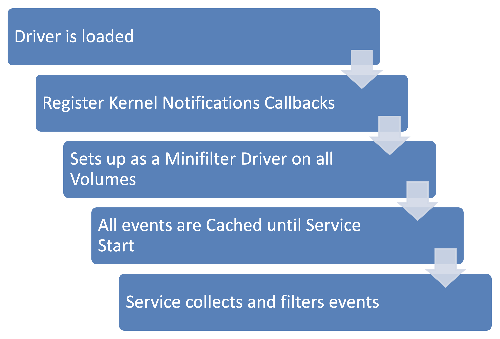
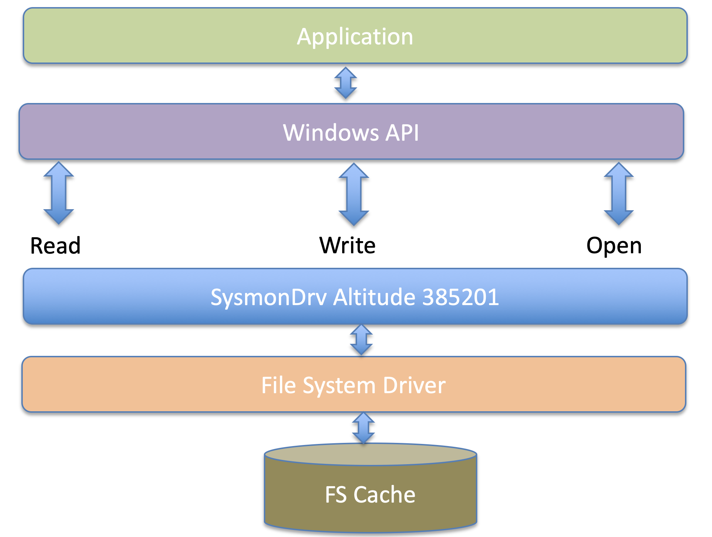
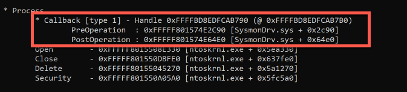
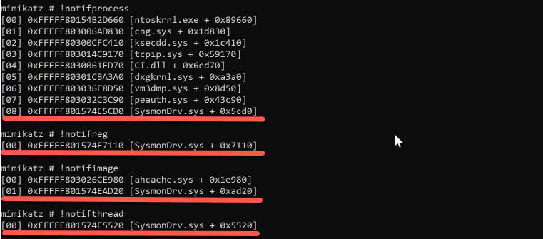

The Sysmon Driver
=================

All of the monitoring is performed thanks to a driver that Sysmon installs called SysmonDrv. The driver will hook into Windows APIs and leverage Event Tracing for Windows (ETW) to capture the information on the actions it wants to monitor.

This Sysmon Driver has a unique altitude number of 385201 that determines the order of loading of the driver in comparison to other drivers on the system. Some blog posts recommend changing this number in the registry for obfuscation, but this may cause a conflict with another driver and prevent Sysmon from working or cause other errors on the system.

The driver is loaded by a service at system startup and a secondary service then queries the cached information.

For all file system operations, the driver registers as a Minifilter driver that is attached to volumes allowing it to see all actions taken by APIs before they are processed by the file system.

Sysmon sets multiple callbacks on kernel objects in addition to using telemetry APIs and ETW.

When the tool is downloaded from the Microsoft Sysinternals website <https://docs.microsoft.com/en-us/sysinternals/> it is important to save and identify previous versions since Microsoft does not provide older versions and the release notes do not detail what has been fixed. Microsoft has a fast release cycle, forcing users to test very carefully and to keep track of versions.

You can take a look at recent changes across versions in the community guide [Sysmon Changelog](https://github.com/trustedsec/SysmonCommunityGuide/blob/master/sysmon-changelog.md)

Another important piece of information is that there is no support from Microsoft on the Sysinternal tools—they are free and provided as is. This means that a testing plan for the environment it is deployed on should be formulated, tested, implemented, and improved upon as new versions of Sysmon are released.
