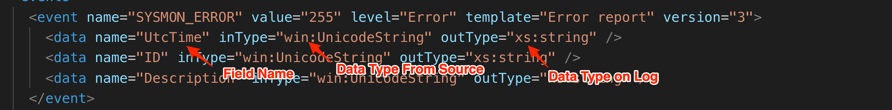
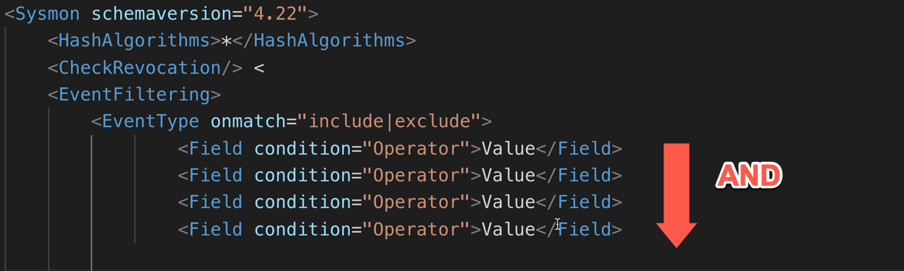

Install and Configuration
=========================

* [Sysmon Command Line](#the-sysmon-command-line)

* [Installation with Configuration](#installation-with-configuration)

  * [Uninstall](#uninstall)

  * [Installation Best Practice](#installation-best-practice)

* [Configuration](#configuration)

  * [Command Line Parameters](#command-line-parameters)

  * [Filter Operators](#filter-operators)

  * [Event Schema](#event-schema)

  * [Configuration File](#configuration-file)

  * [RuleGroups](#rulegroups)

  * [Configuration File Best Practices](#configuration-file-best-practices)

  * [Configuration Tampering](#configuration-tampering)

  * [Configuration Deployment](#configuration-deployment)

  * [Deployment Script](#deployment-script)

  * [GPO Configuration Deployment](#gpo-configuration-deployment)

The Sysmon Command Line
=======================

Sysmon installation and configuration can be done via the command line. When Sysmon is downloaded from Microsoft, the zip file will contain two command line versions of the tool:

* **Sysmon.exe** - x86 and x64 version.

* **Sysmon64.exe** - 64bit only version.

When using the tool, any errors will result in an error message and help information with basic switches. To see only the help information for the tool, the **-?** switch parameter is used. This help information will include:

* Parameter sets for installation, configuration, and uninstall

* Common command line parameters.

* General notes on how the tool works and further details on how to get more help information.

The parameters of the tool and the structure of the XML configuration file are defined in the tool Schema. This schema can be printed using the **-s "PrintSchema"** parameter; if no schema version is provided, it will print the default schema.

The tool can be run in 4 main modes; 3 of them are shown in the help message:

* **Install** - Install the driver, manifest and service on the host.

* **Configure** - Parses a given configuration file or command line parameters to generate a configuration that is stored in the registry.

* **Uninstall** - Removes the driver and service from the host.

The semi-hidden and undocumented method is Debug, in which a specified configuration is parsed, and live events are shown in the console.

Install
-------

The key parameter that initiates the installation mode of Sysmon is the **-i** switch. The installation process will be as follows:

* Decompresses and saves driver and copy of itself in to **%systemroot%**

* Registers event log manifest

* Creates a service

* Enables a default configuration (ProcessCreation, ProcessTermination, DriverLoad , FileCreationTimeChanged, SHA1 for Images) if no configuration file is passed using the **-c \<configuration file\>** parameter

The Installation process allows for some obfuscation:

* Driver name can be changed

* Service name can be changed

* Sysmon binary name can be renamed.

These obfuscation changes will also affect registry paths for the driver and processes service keys. All of the obfuscation methods are part of the installation option set.

The installation options are:

* Default -- Driver is installed and named SysmonDrv and service Sysmon

```shell
sysmon.exe --i --accepteula

```

* Renamed Driver -- The driver file and registry entry are renamed. Name has an 8-character limit.

```shell
sysmon.exe -i -d <drivername>
```

* Renamed Service -- The executable name defines the service name.

```shell
<renamed sysmon>.exe -i -d <drivername>
```

The installation process on a x64 system with the binary named sysmon.exe that is intended to work across x64 and x86 architectures is shown below. This is important since some of the actions may cause confusion or trigger alerts on monitoring systems.

One important thing to keep in mind when obfuscating the driver name and service name is that certain characteristics remain the same.

* Service description remains the same. (This can be modified post-install.)

* Driver Altitude number remains the same.

* The eventlog remains the same so as to not break collection from SIEM products.

Process for x86
---------------


x64 Process
-----------


Sysmon will create 2 registry keys to define the services for its operation under ***HKLM\\SYSTEM\\CurrentControlSet\\Services***

* Sysmon - Service that talks to the driver and performs the filtering action. It is named with the same name as the Sysmon executable.

* SysmonDrv - Kernel Driver Service, this service loads the Sysmon driver with an altitude number of 385201

The settings for each service are:

Main Service:

* Name: **Name of the executable (default Sysmon or Sysmon64)**

* LogOn: **Local System**

* Description: **System Monitor service**

* Startup: **Automatic**

* ImagePath: **%windir%\\\<exe name\>**

Driver Service:

* Name: **SysmonDrv unless --d \<name\> is**

* LogOn: **Local System**

* Description: **System Monitor driver**

* Startup: **Automatic**

* ImagePath: **\<driver name\>.sys**

Installation with Configuration
-------------------------------
An XML configuration file can be passed during installation if an initial configuration needs to be set. This is the preferred method for production systems since a configuration file can cover all types and logic. The most used method is to pass a configuration file using the **-c \<config file\>** parameter.

```shell
sysmon.exe -i --accepteula -c <config file>
```
If the configuration specifies a archive folder using the ```<ArchiveDirectory>``` element the **-a \<archive folder\>** needs to be specified in the command line so that Sysmon can create the folder and set the proper permissions for version 11.0 of Sysmon, for version 11.1 the parameter was removed and now it is configured via the configuration file. If the folder is not present and even if specified Sysmon will create a folder named **Sysmon** instead and use that folder to archive the deleted files. 

We can control the hashing algorithm used for events that hash images and we can control checking of revocation of signatures.

The hashing algorithm or combination of them can be specified with the **-h \<sha1\|sha2\|md5\|imphash\|\*\>** The specified algorithms will be used to hash all images.

```shell
sysmon.exe -i -c -h <sha1|sha2|md5|imphash\|*>
```

We can specify checking to see if certificates are revoked using the -r parameter.

```shell
sysmon.exe -i -c -r

```

SSome basic filtering can be done also from the command line. Only filtering by process name can be done for NetworkConnect, ImageLoad, and ProcessAccess via the command line.

* **NetworkConnect** - Track network connections.

```shell
sysmon.exe -i -c -n [<process,...>]
```

* **ImageLoad** - DLL loading by processes.

```shell
sysmon.exe -i -c -l [<process,...>]
```

* **ProcessAccess** - Processes whose memory is accessed.

```shell
sysmon.exe -i -c -k [<process,...>]
```

Uninstall
---------

To uninstall Sysmon, a binary with the same name as the main service, if renamed, has to be run with the **-u** switch parameter.

```shell
sysmon.exe -u
```
When executed the command will run a series of steps to uninstall the service, driver and remove files for the tool.


There is an undocumented value that can be passed to the **-u** parameter of **"force"** to force the removal of the services even if a stop was not possible.

```shell
sysmon.exe -u force
```

Installation Best Practice
--------------------------

Installation best practices that can be followed to aid and minimize risk when deploying the Sysmon tool include:

* Keep a repository of Sysmon versions archived; Microsoft does not provide older versions for download.

* Sysmon is very dependent on the version of the binary for its configuration. The install/upgrade script should check the binary version for:

  * Upgrade

  * Version for applying initial config

* If a GPO is used to push scheduled tasks for upgrades or to push configuration, use a WMI filter to target the specific version that was tested. Example:

```sql
SELECT * FROM CIM_Datafile WHERE (Name="c:\\Windows\\Sysmon64.exe" OR Name="c:\\Windows\\Sysmon.exe") AND version="10.0.4.1"
```

* Check file versions they don't match release versioning.

* It is better to not push configuration as an XML that gets run from a share or dropped on disk with a scheduled task:

  * Credentials are left that can be recovered via DPAPI for deleted scheduled tasks.

  * The file can be read more easily by an attacker if controls are not properly placed

  * There is a higher chance of human error

  * Better to push values via GPO or other methods with file version checking.

Configuration
-------------
The configuration options of Sysmon and the structure of the configuration file are defined in its schema. Each version of Sysmon that adds capabilities raises the schema version, and this version number is not tied to the binary version number.

To take a look at this schema, we would run the binary with the  **-s \[schema version\]** parameter; if no schema version is specified, we would get the latest one for the binary.

When we look at the XML representation of the schema, we see the manifest element has two attributes for versioning:

* **schemaversion** - The version number of the schema

* **binaryversion** - The binary version number of the compiled schema

Under this manifest element are two main elements:

* **configuration** - Command line switches for the executable and the filtering operators
* **events** - This section defines each event type and field we can filter on


Command Line Parameters
-----------------------

Under the configuration element, we have an element called options that contains all the command line parameters. Each of the option elements are broken in to command line and configuration options where each type of the command line switches is identified with a comment in the XML.

The main attributes for each of the command-line options:

* **switch** - the command line switch to use.

* **name** - name of the switch.

* **argument** - is the argument optional or mandatory


The main arguments that can be passed are:

* **-i** : Install Sysmon

```shell
sysmon.exe -i [configfile path]
```

* **-c** : apply config

```shell
sysmon.exe -c [configfile path]
```

* **-u** : un-install Sysmon

```shell
sysmon.exe -u [force]
```

* **-m** : Install event manifest

```shell
sysmon.exe -m
```

* **-t** : Debug mode

```shell
sysmon.exe -t [configfile path]
```

* **-s** : Print schema

```shell
sysmon.exe -s [schema version]
```

* **-nologo** : don't show sysmon logo

```shell
sysmon.exe -nologo
```

* **-accepteula** : Accepts the license agreement

```shell
    sysmon.exe -accepteula
```

* **--** : Resets the configuration to the default

```shell
sysmon.exe --
```

The option elements under the comment "Configuration file" allow for the configuration of filters and parameters that relate to filters.

* **-h** : Hashing algorithm to has images.

```shell
sysmon.exe -c -h <sha1|sha2|md5|imphash|*>
```

* **-r** : Check for signature certificate revocation

```shell
sysmon.exe -c -r
```

* **-n** : Track network connections for specified process/processes

```shell
sysmon.exe -c -n [<process,...>]
```

* **-k** : Track when a specified process/processes memory are accessed

```shell
sysmon.exe -c -k [<process,...>]
```

* **-l** : Track modules (DLLs) loaded by a specified process/processes.

```shell
sysmon.exe -c -k [<process,...>]
```

* **-d** : Rename the sysmon driver during install (8 character limit)

```shell
sysmon.exe -i -c -d <drivername>
```

> **-g** and **--dns** switches are listed but as of the current version, they
> do not update the configuration.

Filter Operators
----------------

In the filters element under configuration is the list of operators that can be used to filter against the fields of each event type.

|  **Operator**     |  **Meaning**
|------------------|------------------------------------------------------
|  Is|             Exact match.
|  IsNot|          Negates and exact match
|  Contains|       The string is contained in any part of the value of the field.
|  Excludes |      Excludes the event from the logic if the event is the value matches
|  Excludes All|   Exclude if all values match. (values are separate by ";" )
|  Excludes Any |  Excludes if any of the values match. (values are separate by ";" )
|  Image |         Name of the image without the full path.
|  BeginsWith |    String value starts with.
|  EndsWith |      String value ends with
|  LessThan  |     Numeric value is less than
|  MoreThan |      Numeric value is more than
|  Contain Any |   Contains any of the values. (values are separate by ";" )
|  Contains All |  Contains all of the values. (values are separate by ";" )

Each of these operators execute against the value in a given field for each of the event types.

Event Schema
------------

Under the events element each event that Sysmon generates is defined as an event element. Each event is defined as shown below:

* **name** : Name of event

* **value** : The EventID for the event

* **level** : Event severity level

* **template** : Event manifest template used for the event

* **ruleName** : Name of rule we filter on

* **ruledefault** : The default action of a rule if not specified

* **version** : The version of the event


We can filter on the Field Names defined in the data elements. They are defined as:

* **Name** : Name of filed

* **inType** : Type of data received in to the driver

* **outType** : Data type the data is presented as



As of the latest version we have defined as event types:

* **NetworkConnect** - Network connections made by processes on the system; both TCP and UDP

* **ProcessCreate** - Creation of new processes in the system and information related to the process

* **FileCreateTime** - File creation time modification and what process is responsible for it

* **ProcessTerminate** - The termination of a process

* **ImageLoad** - Loading of any image by another process (OCX, DLL, etc.) with information of the process loading the image and the image itself

* **DriverLoad*** - Loading of a driver by the system and its file information

* **DnsQuery** - DNS query performed by a process using Windows API, includes information on the query and the process that performed it

* **ProcessAccess** - Access to a process memory from another process and information on access permission and the processes involved

* **RawAccessRead** - Raw access to a file by a process bypassing the file system controls

* **FileCreateStreamHash** - An alternate stream was created and the content of the stream is hashed; information on the process that created the stream is logged

* **RegistryEvent** - Logs the creation, deletion, and modification of specific registry keys and values; information on the process that took the action is logged

* **FileCreate** - Information of a file that is created including the process that created the file

* **PipeEvent** - Named Pipe communication between two processes and its relevant information

* **WmiEvent** - Information on the creation, deletion, and modification of WMI permanent event components in the CIM database


Configuration File
==================

The main method of configuration of Sysmon is through the use of XML configuration files. XML configuration files allow for higher flexibility since more filtering options are possible by applying logical operations to the fields that are defined by the schema version for the event types.

Previous schemas can be used in newer releases of the binary allowing for upgrading of the binary without the need to update the configuration. The schema is defined on the root element (Sysmon) of the configuration file with the attribute schemaversion.


We can optionally specify a hashing algorithm with the HashAlgorithms elements. More than one can be specified in this element or all of them using the \* symbol.
The presence of the CheckRevocation element is enough to allow for checking whether a certificate used to sign an image has been revoked. There are three main ways to organize filters with the latest version of Sysmon.

* EventType filters.

* EvenType Filters organized using RuleGroups

* EventType Filters organized in to Rule sets inside RuleGroups.

We can have up to two instances of each EventType (one include and one exclude) for the entire configuration, whether or not RuleGroups are used. On SchemaVersion 4.22 and above, the default relation between filters is AND.



Below is an example where if the filters match, they are included and placed in the EventLog using an intrinsic AND logic.


This type of configuration is only good with Schema 4.22 and above. It is recommended that this is used only for quick tests due the limitation of the AND logic for filters.

RuleGroups
----------

The RuleGroup element allows for the modification of the logic of the filters and also allows for more complex logic since multiple Rule elements with multiple filters can be created and the logic for the filters can be modified in order to capture actions in a more granular way.


Remember: You can only have one single EventType per RuleGroup. Sysmon will not error if you have more than one, but only the first EventType filters will be loaded.

In a RuleGroup element, the name attribute is not used to populate the RuleName field of an event when one is created. While it may be used for a description, XML comments are a better option. When choosing the name to go in the RuleName field, the order of precedence for RuleName is Filter -> RuleGroup name attributes. It is recommended that names be placed on the individual filters to be able to leverage the field more efficiently when filtering logs on a SIEM platform. One thing to keep in mind is that when multiple filters are in a Rule element, only the first filter name attribute is used.

When using AND in a Rule element, the name used to populate the RuleName will be based on the order of the filters as they appear on the schema where the last matching one is the one used. When using OR in a Rule element, the name used to populate the RuleName will be the filter that matches.

Rules are processed in the order they are placed in the configuration file. This is important because once a Rule matches and the information for that EventType is included in the Windows EventLog, no other rule will be processed against that action. Filters that are not in a Rule element will be processed in the order that they appear in the schema. This also applies to multiple filters inside a Rule where the schema order is used.


Configuration File Best Practices
---------------------------------

It is important to track what a configuration does and keep a changelog. For this reason, it is recommended to add headers to track basic information like changelog, version, sysmon version tested against, etc.


For RuleGroups, Rules and Filters use comments to organize filters and to provide information on what each filter is doing.


Hash configurations that are deployed and keep a log of them for later
verification.

Hash configurations that are deployed and keep a log of them for later verification.
On a system where the Sysmon service process consumes a lot of CPU resources, the number of filters and operators should be reviewed. The operators that use slightly more CPU are:

* contains

* contains all

* contains any

A method for checking applied configuration is hashing the configuration
in the registry.
<https://github.com/PSGumshoe/PSGumshoe/blob/master/EventLog/Get-SysmonRuleHash.ps1>


Since getting stated can be complex, some great resources that serve as starting points for Rule development and reference include:

* Swift On Security configuration example
    <https://github.com/SwiftOnSecurity/sysmon-config>

* Olaf Hartong Sysmon Configuration Modules
    <https://github.com/olafhartong/sysmon-modular>

Configuration Tampering
-----------------------
One of the actions an attacker takes is the identification of controls and logging on a system.

Due to initial footprint and safety, most advanced attackers limit their actions to enumerate controls to the most common actions that elements that will trigger a monitoring solution. The most common methods used are:

* Service list.

* Process list.

* Listing of installed applications from the registry.

This does not mean that an attacker will not use more advanced methods to enumerate controls and find Sysmon on the system.

Detection of Sysmon is achieved by looking at the areas that cannot be changed.

  **Indicator**               | **Can it be Changed**
  ----------------------------| -----------------------
  |Driver Name|                  YES
  |Service Name|                 YES
  |Registry Config Path|         YES
  |Driver altitude Number|       NO
  |EventLog Path and Name|       NO
  |Sysmon Service Description|   NO (Manually)

When Sysmon configuration is modified using the Sysmon command line tool, an **EventId 16** is generated. If the registry binary value is modified directly, no event is generated, and configuration is applied as soon as the value is modified.

When a GPO is used to update configuration by default every 90 minutes, the configuration will be updated. A better solution is to use a configuration management solution like DSC that can monitor for changes and update as soon as a change is detected.

Sysmon can be configured to monitor its own configuration to detect whether an attacker deletes or alters it. In the event that it is cleared, this will be the last event logged by Sysmon itself from its configured filters.


In case the configurations are cleared, the default one will take over:

* **ProcessCreation**

* **ProcessTermination**

* **DriverLoad**

* **FileCreationTimeChanged**

* **SHA1 for Images**

Since any user in the system can read the rule binary data, an attacker can operate around rule configurations once they have read them by:

* Execute tasks not logged.

* Execute tasks that would blend in with normal logged actions

Existing tools for parsing rules out of the registry break often as Sysmon is updated, since the way the information is structured in the binary blob is not documented. However, an attacker can export and import into the test system and use Sysmon to read the configuration.

Configuration Deployment
------------------------
Most environments that have the capabilities to leverage Sysmon enhanced log collection also have software deployment systems like Altiris, System Center Configuration Manager, Desired State Configuration, etc. This is why these are just general recommendations. 

Deployment Script
-----------------

On most of these environments, the deployment of Sysmon is managed by using scripts, with PowerShell being the most flexible one.

An install script should

* Check if Sysmon is installed; if not, Install.

* If Sysmon is installed, check the version and upgrade if needed.

* After an uninstall, ensure the registry key and files are removed before upgrading. (There have been issues in the past.)

```PowerShell
$DriverName = 'SysmonDrv.sys'
$CurrentVersion = '10.41'
# Check if the driver if present
$Present = Test-Path -Path "C:\Windows\$($DriverName)" -PathType Leaf
if ($Present) {
    Write-Host -Object "[+] Sysmon was found." -ForegroundColor Green
    # Check if the version on host is the approved one.
    $HostVersion = (Get-Item "C:\Windows\$($DriverName)").VersionInfo.FileVersion
    if ($CurrentVersion -eq $HostVersion) {
        Write-Host -Object "[+] Sysmon is current approved version." -ForegroundColor Green
    } else {
        # Execute upgrade process.
        Write-Host -Object "[-] Sysmon needs upgrade." -ForegroundColor Red
	    <path to Sysmon.exe> -U
        <path to Sysmon.exe> -I
    }
} else {
    # Execute install process.
}
```

GPO Configuration Deployment
----------------------------

Group Policy remains one of the most used methods in the enterprise network for the control of configuration setting.

The following are instructions on how to create a GPO for an existing applied configuration.

1. In the Group Policy Management Console (**gpmc.msc**)

2. Create a new (or edit an existing) GPO and assign it to the appropriate Active Directory Organizational Unit.

3. Right click on the GPO and select **Edit**

4. Expand **Configuration -\> Preferences -\>Windows Settings -\> Registry**

5. Right Click on Registry **New -\> Registry Wizard**

   {width="6.5in" height="3.3125in"}

6. Select if local or remote machine.

7. Navigate and select the key **HKLM\\SYSTEM\\CurrentControlSet\\Services\\SysmonDrv\\Parameters** and all parameters under it.

  

A WMI filter will ensure only machines with the proper version of Sysmon installed will receive the configuration.
