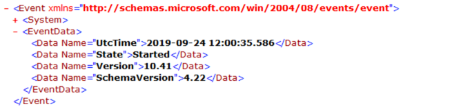
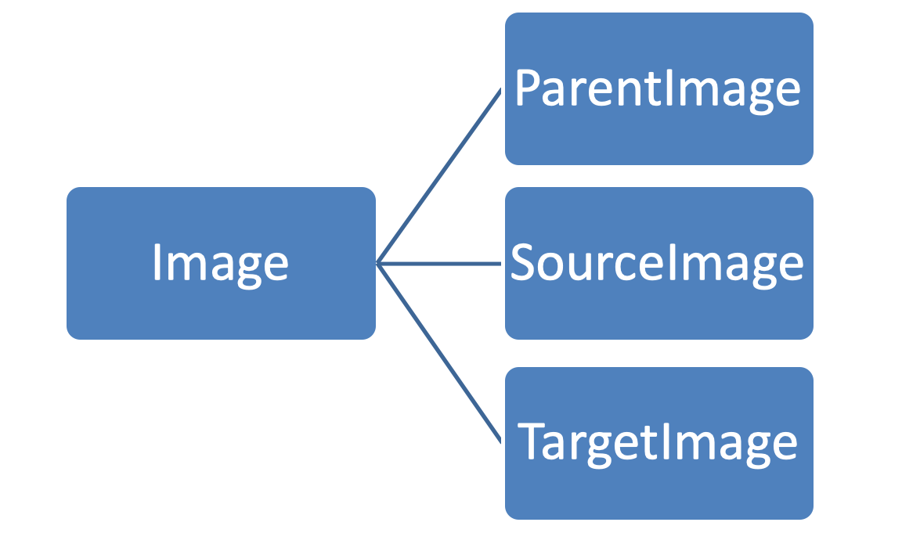
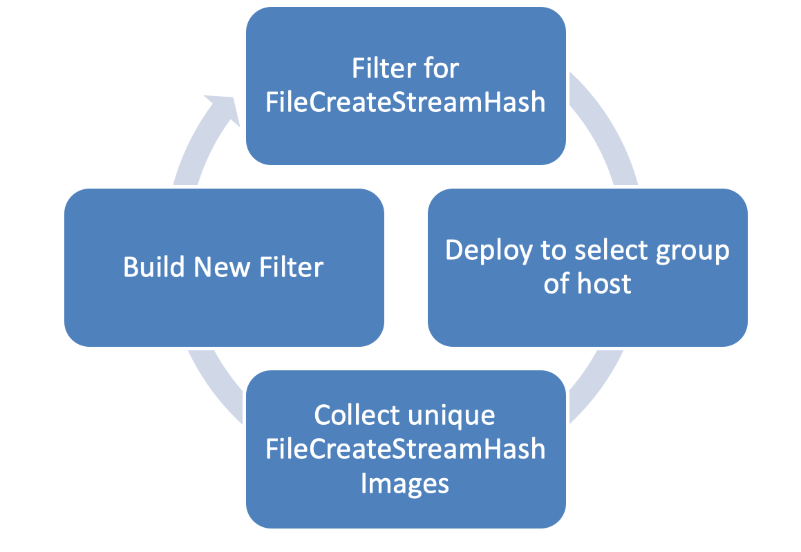

Sysmon Events
=============

* [Sysmon Operational Events](#sysmon-operational-events)

  * [Sysmon Config Change](#sysmon-config-change)

  * [Sysmon Error Event](#sysmon-error-event)

  * [Service State Change](#service-state-change)

  * [Process Monitoring](#process-monitoring)

  * [Process Creation](#process-creation)

  * [Process Termination](#process-termination)

  * [Process Access](#process-access)

  * [File Events](#file-events)

  * [File Create](#file-create)

  * [File Create Time Change](#file-create-time-change)

  * [File Stream Creation Hash](#file-stream-creation-hash)

  * [Named Pipes](#named-pipes)

  * [Driver Loading](#driver-loading)

  * [Registry Actions](#registry-actions)

  * [Image Loading](#image-loading)

  * [Network Connections](#network-connections)

  * [Create Remote Thread](#create-remote-thread)

  * [Raw Access Read](#raw-access-read)

  * [DNS Query](#dns-query)

  * [WMI Events](#wmi-events)

  * [Clipboard Capture](#clipboard-capture.md)

  * [Process Tampering](#process-tampering.md)

Sysmon Operational Events
-------------------------

Sysmon will generate events for monitoring:

* Configuration Changes

* Service State Changes

* Sysmon Errors

These events cannot be filtered using Sysmon configuration and will be
generated by the sysmon.exe (Default Install) process.

Sysmon Config Change
--------------------

Sysmon will log an EventID 16 when it updates its configuration. The
event will only be generated if the configuration **is changed with the
Sysmon binary and not a direct change to the registry key.** It is
recommended that Windows Auditing be configured for the configuration
key and a Sysmon filter to capture any attempt at modification outside
of the use of the Sysmon binary.

Fields for the Event:

* **UtcTime**: Time the configuration was modified.

* **Configuration**: Path to configuration file or command line of
    command used to modify the config.

* **ConfigurationFileHash**: If a configuration file was used, the
    hash of the file.

Example: Configuration using a XML file.


Example: Configuration via Command Line resetting configuration to
default using the \-- switch.


Example: Configuration via Command Line. Set to monitor module loading
by powershell.exe


Sysmon Error Event
------------------

If the Sysmon binary running as a service encounters any error in its
operation it will generate a EventID 255. Some of the cases where this
event may be generated are when:

* The driver fails to load or an attacker may have unloaded the
    driver.

* An application or attacker have modified in a way it cannot be
    parsed by the service.

Fields for the Event:

* **UtcTime**: Time when the error was logged.

* **ID**: The error ID

* **Description**: Description of what caused the error.

### Known errors

|ID             |Description                    |
|---------------|-------------------------------|
| DriverCommunication |Failed to retrieve events|
| DriverCommunication |Incorrect event size [value]|
| DriverCommunication |Failed to access the driver|
| ServiceThread |Failed to initialize event for dispatch|
| ServiceThread |Failed to initialize the rule engine with data|
| ServiceThread |Failed to initialize signature verification|
| ServiceThread |Failed to allocate [value] bytes|

Example:


Service State Change
--------------------

The Event ID 4 is generated for Service State Changes. This event logs
Start and Stop events when the Sysmon service **is controlled via the
Service Control Manager API**. (Services.mmc, sc.exe, net.exe ..etc) To
better detect any manipulation of the service, Windows Auditing should
be enabled for the service registry key and a Sysmon Registry filter for
the service.

Fields for the event are:

* **UtcTime**: Time the service state changed.

* **State**: Started or Stopped

* **Version**: Version of the Sysmon binary

* **SchemaVersion**: Schema Version of the Sysmon binary.

Example:




Process Monitoring
------------------

Sysmon can log process creation, process termination and process access
events. The prorocess actions are captured via ObjRegisterCallbacks at
the kernel level using its driver. These events are important since the
**ProcessGuid** field of these events are used by other so as to provide
more context on the process that relates to the actions and the
ProcessGuid maps to the **LogonGuid** that it is then used to track all
actions of a given logon session. The main reason for using this GUIDs
is that Process ID and Logon ID on a system get re-used as time passes.
In the case of processes ID it can happen multiple times in a days.


When a user logs onto on a modern version of Windows (Windows 2016/10)
they will have 2 Logon IDs assigned if:

* User is a member of local Administrator Group.

* UAC (User Access Control) is enabled.

These sessions will be linked by a Linked Login ID in Successful Logon
Event ID 4624, making the login of this event important.

The ProcessGUID depending on the event and where in the process tree it
is, it will also be known by other names by its relation to the action
monitored


The only Event Types that will not reference a ProcessGuid or one of its
derived names are

* WMI events

* Kernel Driver Load

The image of the process is also related in other processes and can be
used to track all actions related to a specific one.



Process Creation
----------------

Sysmon will log **EventID 1** for the creation of any new process when
it registers with the kernel.

Sysmon will generate a ProcessGuid and LogonGuid with the information it
obtains and it will hash the process main image. The command line of the
process will be parsed and logged in to eventlog. When storage permits a
common practice is to log all processes and to filter out common day to
day processes for Windows and Applications after profiling usage.

The fields on a process creation event are:

* **ProcessGuid** -- Unique process GUID generated by Sysmon.

* **ProcessId** -- Process ID represented as a integer number.

* **Image** -- Full path of the executable image that was executed.

* **FileVersion** -- File version filed in the image metadata.

* **Description** -- Description field in the image metadata.

* **Product** -- Product field in the image metadata.

* **Company** - Company field in the image metadata.

* **OriginalFileName** -- Original image name if renamed.

* **CommandLine** -- Command line that executed the image.

* **CurrentDirectory** -- Directory under which the image was
    executed.

* **User** - Name of the account who created the process (child) . It
    usually contains domain name and user name

* **LogonGuid** - Logon GUID of the user who created the new process.

* **LogonId** -Login ID of the user who created the new process.

* **TerminalSessionId** - ID of the session the user belongs to

* **IntegrityLevel** - Integrity label assigned to a process

* **Hashes** - Full hash of the file with the algorithms in the
    HashType field.

* **ParentProcessGuid** - ProcessGUID of the process that
    spawned/created the main process (child)

* **ParentProcessId** - Process ID of the process that spawned/created
    the main process (child)

* **ParentImage -** File path that spawned/created the main process.

* **ParentCommandLine -** Arguments which were passed to the
    executable associated with the parent process

Sysmon offers an advantage over the regular process logging since it not
only pulls the same information as with **EventID** **4688** but it also
pulls information from the PE header, hashes the images for correlation
with IOC databases like Virus Total and it also provides unique fields
when querying for events.

Process Termination
-------------------

Symon will log an **EventID 5** when a process terminates. By logging
process termination events allow for calculating duration of operation
of a process by comparing the times with process creation. Process
termination also allows when co-related with shutdown and start events
if a process may have been terminated by an attacker.

The process termination fields are:

* **RuleName** -- Rule name for which the event triggered.

* **UtcTime** - Time in UTC when event was created

* **ProcessGuid** - Process Guid of the process that terminated

* **ProcessId** - Process ID used by the OS to identify the process
    that terminated

* **Image** - File path of the executable of the process that
    terminated

Process Access
--------------

Sysmon Process Access events will monitor of one process opening
another. The access with higher permissions allows for also reading the
content of memory, patching memory, process hollowing, creations of
threads and other tasks that are abused by attackers. This technique has
been used for access to credentials, keys and data that are in the
process memory.

This task is common for processes that query information on another
process, such as Task Manager, tasklist.exe and others, this requires
that a baseline be stablished and filter out at a SIEM level taking into
consideration other factors like image fullpath, parent process and
account used so as to prevent any whitelisted processes to be used as
staging for attacks.

Sysmon generates this event using ObRegisterCallbacks levering its
driver. The main 2 filtering fields recommended are:

* **TargetImage** - File path of the executable being accessed by
    another process.

* **GrantedAccess** - The access flags (bitmask) associated with the
    process rights requested for the target process

As a minimum it is recommended to filter including critical processes,
as a minimum:

* C:\\Windows\\system32\\lsass.exe

* C:\\Windows\\system32\\csrss.exe

* C:\\Windows\\system32\\wininit.exe

* C:\\Windows\\system32\\winlogon.exe

* C:\\Windows\\system32\\services.exe

Check for masks of known tools for credential dumping, process injection
and process hollowing. Great care should be taken when setting masks
since Sysmon does a literal comparison of the mask string provided
against the one returned. It is not a bitwise operation, care should be
taken to track the proper combinations.

|Access                               |  Mask       |
|--------------------------------------|------------|
| PROCESS\_CREATE\_PROCESS               |0x0080|
| PROCESS\_CREATE\_THREAD                |0x0002|
| PROCESS\_DUP\_HANDLE                   |0x0040|
| PROCESS\_SET\_INFORMATION              |0x0200|
| PROCESS\_SET\_QUOTA                    |0x0100|
| PROCESS\_QUERY\_LIMITED\_INFORMATION   |0x1000|
| SYNCHRONIZE                            |0x00100000|
| PROCESS\_QUERY\_INFORMATION            |0x0400|
| PROCESS\_SUSPEND\_RESUME               |0x0800|
| PROCESS\_TERMINATE                     |0x0001|
| PROCESS\_VM\_OPERATION                 |0x0008|
| PROCESS\_VM\_READ                      |0x0010|
| PROCESS\_VM\_WRITE                     |0x0020|

The PSGumshoe PowerShell module has a function for creating and parsing
mask strings.
<https://github.com/PSGumshoe/PSGumshoe/blob/sysmon_events/EventLog/Get-SysmonAccessMask.ps1>

The fields for the even are:

* **RuleName**: Rule that triggered the event

* **UtcTime**: Time in UTC when event was created

* **SourceProcessGUID**: Process Guid of the source process that
    opened another process.

* **SourceProcessId**: Process ID used by the OS to identify the
    source process that opened another process.

* **SourceThreadId**: ID of the specific thread inside of the source
    process that opened another process

* **SourceImage**: File path of the source process that created a
    thread in another process

* **TargetProcessGUID**: Process Guid of the target process

* **TargetProcessId**: Process ID used by the OS to identify the
    target process

* **TargetImage**: File path of the executable of the target process

* **GrantedAccess**: The access flags (bitmask) associated with the
    process rights requested for the target process

* **CallTrace**: Stack trace of where open process is called. Included
    is the DLL and the relative virtual address of the functions in the
    call stack right before the open process call

Example:

```xml
<Sysmon schemaversion="4.22">
   <EventFiltering>
 <RuleGroup name="" groupRelation="or">
      <ProcessAccess onmatch="include">
        <!-- Detect Access to LSASS-->
         <Rule groupRelation="and">
          <TargetImage name="technique_id=T1003,technique_name=Credential Dumping" condition="is">C:\Windows\system32\lsass.exe</TargetImage>
          <GrantedAccess>0x1FFFFF</GrantedAccess>
         </Rule>
         <Rule groupRelation="and">
          <TargetImage name="technique_id=T1003,technique_name=Credential Dumping" condition="is">C:\Windows\system32\lsass.exe</TargetImage>
          <GrantedAccess>0x1F1FFF</GrantedAccess>
         </Rule>
         <Rule groupRelation="and">
          <TargetImage name="technique_id=T1003,technique_name=Credential Dumping" condition="is">C:\Windows\system32\lsass.exe</TargetImage>
          <GrantedAccess>0x1010</GrantedAccess>
         </Rule>
         <Rule groupRelation="and">
          <TargetImage name="technique_id=T1003,technique_name=Credential Dumping" condition="is">C:\Windows\system32\lsass.exe</TargetImage>
          <GrantedAccess>0x143A</GrantedAccess>
         </Rule>

        <!--Dumping credentials from services or setting up a keylogger-->
         <Rule groupRelation="and">
          <TargetImage name="technique_id=T1003,technique_name=Credential Dumping" condition="is">C:\Windows\system32\csrss.exe</TargetImage> <!--Mitre T1098--> <!--Mitre T1075--> <!--Mitre T1003--><!-- depending on what you're running on your host, this might be noisy-->
          <GrantedAccess>0x1F1FFF</GrantedAccess>
         </Rule>
         <Rule groupRelation="and">
          <TargetImage name="technique_id=T1003,technique_name=Credential Dumping" condition="is">C:\Windows\system32\wininit.exe</TargetImage> <!--Mitre T1098--> <!--Mitre T1075--> <!--Mitre T1003--><!-- depending on what you're running on your host, this might be noisy-->
          <GrantedAccess>0x1F1FFF</GrantedAccess>
         </Rule>
         <Rule groupRelation="and">
          <TargetImage name="technique_id=T1003,technique_name=Credential Dumping" condition="is">C:\Windows\system32\winlogon.exe</TargetImage> <!--Mitre T1098--> <!--Mitre T1075--> <!--Mitre T1003--><!-- depending on what you're running on your host, this might be noisy-->
          <GrantedAccess>0x1F1FFF</GrantedAccess>
         </Rule>
         <Rule groupRelation="and">
          <TargetImage name="technique_id=T1003,technique_name=Credential Dumping" condition="is">C:\Windows\system32\services.exe</TargetImage> <!--Mitre T1098--> <!--Mitre T1075--> <!--Mitre T1003--><!-- depending on what you're running on your host, this might be noisy-->
          <GrantedAccess>0x1F1FFF</GrantedAccess>
         </Rule>
         <Rule groupRelation="or">
            <GrantedAccess name="technique_id=T1003,technique_name=Credential Dumping">0x0810</GrantedAccess>
         </Rule>

         <!-- Detect process hollowing-->
         <Rule groupRelation="or">
            <GrantedAccess name="technique_id=T1093,technique_name=Process Hollowing">0x0800</GrantedAccess>
            <GrantedAccess name="technique_id=T1093,technique_name=Process Hollowing">0x800</GrantedAccess>
         </Rule>
         <!-- Detect process process injection-->
         <Rule groupRelation="or">
            <GrantedAccess name="technique_id=T1055,technique_name=Process Injection">0x0820</GrantedAccess>
            <GrantedAccess name="technique_id=T1055,technique_name=Process Injection">0x820</GrantedAccess>
         </Rule>
      </ProcessAccess>
</RuleGroup>
</EventFiltering>
</Sysmon>
```

Some examples of actions from security tools like Mimikatz and their
access masks

  |Command                 |Sysmon 10                                           |Security 4663 Kernel Object
  |-----------------------|---------------------------------------------------|-----------------------------
  |lsadump::lsa /patch     |GrantedAccess 0x1438                                |AccessMask 0x10
  |lsadump::lsa /inject    |rantedAccess 0x143a                                |AccessMask 0x10
  |lsadump::trust /patch   |GrantedAccess 0x1438                                |AccessMask 0x10
  |misc:memssp             |GrantedAccess 0x1438                                |AccessMask 0x10
  |Procdump mimidump       |GrantedAccess 0x1fffff                              |AccessMask 0x10
  |Task Manage minidump    |GrantedAccess 0x1400, 0x1000, 0x1410 and 0x1fffff   |AccessMask 0x10
  |sekurlsa::\*            |GrantedAccess 0x1010                                |AccessMask 0x10

File Events
-----------

With Sysmon we can filter and log 2 file specific related actions:

* Creation of a file.

* Change of a file creation date information on the file system.

* When a NTFS Record Alternate Data Stream \$Data attribute is
    modified.

File Create
-----------

Sysmon via its filter driver can log the creation of files and
information on what process is creating the file using **EventID 11**.
This allows defender to filter for:

* Dropping of files for later execution (PowerShell, Office Apps,
    certutil.exe..)

* Modification of system configurations (Scheduled Tasks, WMI)

* Detect malicious behaviors that create temporary or log files (.Net
    compile and run, DotNet2JS)

One thing to keep in mind when creating filters for this type is that
since AV minifilter loads before Sysmon due to their lower altitude
number range if an AV or EDR minifilter driver detects a malicious file
and blocks it writing to disk Sysmon will not see the event.


The file creation event fields are:

* **RuleName**: Rule name for which the event triggered.

* **UtcTime**: Time in UTC when event was created.

* **ProcessGuid**: Process Guid of the process that created the file.

* **ProcessId**: Process ID used by the OS to identify the process
    that created the file (child) .

* **Image**: File path of the process that created the file.

* **TargetFilename**: Name of the file that was created

* **CreationUtcTime**: File creation time

Example monitoring for script file creation by extension:

```XML
<Sysmon schemaversion="4.22">
    <EventFiltering>
        <RuleGroup name="" groupRelation="or">
            <FileCreate onmatch="include">
                <!-- Detect Dangerous File Type Creation -->
                <Rule groupRelation="or">
                    <TargetFilename name="technique_id=T1170,technique_name=Mshta" condition="end with">.hta</TargetFilename>
                </Rule>

                <Rule groupRelation="or">
                    <TargetFilename name="technique_id=T1064,technique_name=Scripting" condition="end with">.bat</TargetFilename> <!--Batch scripting-->
                    <TargetFilename condition="end with">.cmd</TargetFilename> <!--Batch scripting | Credit @ion-storm -->
                    <TargetFilename condition="end with">.ps1</TargetFilename> <!--PowerShell-->
                    <TargetFilename condition="end with">.ps2</TargetFilename> <!--PowerShell-->
                    <TargetFilename condition="end with">.jse</TargetFilename> <!--Registry File-->
                    <TargetFilename condition="end with">.vb</TargetFilename> <!--VisualBasicScripting files-->
                    <TargetFilename condition="end with">.vbe</TargetFilename> <!--VisualBasicScripting files-->
                    <TargetFilename condition="end with">.vbs</TargetFilename> <!--VisualBasicScripting files-->
                </Rule>

                <!-- Detect ClickOnce -->
                <Rule groupRelation="or">
                    <TargetFilename name="ClickOnce File Execution" condition="end with">.application</TargetFilename>        <TargetFilename condition="end with">.appref-ms</TargetFilename>
                </Rule>

                <!-- MSBuild -->
                <Rule groupRelation="or">
                    <TargetFilename name="technique_id=T1127,technique_name=Trusted Developer Utilities" condition="end with">.*proj</TargetFilename><!--Microsoft:MSBuild:Script More information: https://twitter.com/subTee/status/885919612969394177-->
                    <TargetFilename condition="end with">.sln</TargetFilename>
                </Rule>

                <!-- Macro File Creation -->
                <Rule groupRelation="or">
                    <TargetFilename name="Microsoft:Office: Macro" condition="end with">.docm</TargetFilename>
                    <TargetFilename condition="end with">.pptm</TargetFilename>
                    <TargetFilename condition="end with">.xlsm</TargetFilename>
                    <TargetFilename condition="end with">.xlm</TargetFilename>
                    <TargetFilename condition="end with">.dotm</TargetFilename>
                    <TargetFilename condition="end with">.xltm</TargetFilename>
                    <TargetFilename condition="end with">.potm</TargetFilename>
                    <TargetFilename condition="end with">.ppsm</TargetFilename>
                    <TargetFilename condition="end with">.sldm</TargetFilename>
                    <TargetFilename condition="end with">.xlam</TargetFilename>
                    <TargetFilename condition="end with">.xla</TargetFilename>
                </Rule>

                <!-- DotNettoJS UsageLog -->
                <Rule groupRelation="or">
                    <TargetFilename name="technique_id=1218,technique_name=DotnettoJs" condition="contains">AppData\Local\Microsoft\CLR_v2.0\UsageLogs\</TargetFilename><!--Dotnet v2 binary started-->
                    <TargetFilename condition="end with">\UsageLogs\cscript.exe.log</TargetFilename>
                    <TargetFilename condition="end with">\UsageLogs\wscript.exe.log</TargetFilename>
                    <TargetFilename condition="end with">\UsageLogs\wmic.exe.log</TargetFilename>
                    <TargetFilename condition="end with">\UsageLogs\mshta.exe.log</TargetFilename>
                    <TargetFilename condition="end with">\UsageLogs\svchost.exe.log</TargetFilename>
                    <TargetFilename condition="end with">\UsageLogs\regsvr32.exe.log</TargetFilename>
                    <TargetFilename condition="end with">\UsageLogs\rundll32.exe.log</TargetFilename>
                </Rule>
            </FileCreate>
        </RuleGroup>
    </EventFiltering>
</Sysmon>
```

File Create Time Change
-----------------------

File Creation Time Change **EventID 2** for the technique that modifies
the timestamps of a file (the modify, access, create, and change times)
This is done often to mimic files that are in the same folder to hide
dropped files or accessed files to prevent casual detection. Some
applications in their normal operation modify time stamps. A good
practice is to exclude those applications that normally change file
creation times like setup executables, Chrome, OneDrive and others. As a
minimum Users directory should be monitored.

The fields for the event:

* **RuleName**: Name of rule that triggered the event.

* **UtcTime**: Time in UTC when event was created

* **ProcessGuid**: Process Guid of the process that changed the file
    creation time

* **ProcessId**: Process ID used by the OS to identify the process
    changing the file creation time

* **Image**: File path of the process that changed the file creation
    time

* **TargetFilename**: Full path name of the file

* **CreationUtcTime**: New creation time of the file

* **PreviousCreationUtcTime**: Previous creation time of the file

Example:

```xml
<Sysmon schemaversion="4.22">
    <EventFiltering>
        <RuleGroup name="Include Filter for FileCreateTime" groupRelation="or">
            <FileCreateTime onmatch="include">
                <!-- Detect File Time changes on user files -->
                <Rule groupRelation="or">
                    <Image name="technique_id=T1099" condition="begin with">C:\Users</Image>
                </Rule>
            </FileCreateTime>
        </RuleGroup>

        <RuleGroup name="Exclude Filters for FileCreateTime" groupRelation="or">
            <FileCreateTime onmatch="exclude">
                <!-- Detect Dangerous File Type Creation -->
                <Rule groupRelation="or">
                    <Image condition="image">OneDrive.exe</Image> <!--OneDrive constantly changes file times-->
                    <Image condition="image">C:\Windows\system32\backgroundTaskHost.exe</Image>
                    <Image condition="contains">setup</Image> <!--Ignore setups-->
                    <Image condition="contains">install</Image> <!--Ignore setups-->
                    <Image condition="contains">Update\</Image> <!--Ignore setups-->
                    <Image condition="end with">redist.exe</Image> <!--Ignore setups-->
                    <Image condition="is">msiexec.exe</Image> <!--Ignore setups-->
                    <Image condition="is">TrustedInstaller.exe</Image> <!--Ignore setups-->
                </Rule>
            </FileCreateTime>
        </RuleGroup>
    </EventFiltering>
</Sysmon>
```

File Stream Creation Hash
-------------------------

Sysmon will log EventID 15 for the creation of Alternate Data Streams.
This is an old technique where many vendors already monitor for the
creation of ADS on files where the alternate stream is a PE executable.
Attackers have changed to use alternate streams to hide information and
to store other payloads that are not PE executables (DLL, Scripts)

Each record in NTFS on a drive is subdivided into a list of variable
length Attributes:

* \$STANDARD\_INFORMATION

* \$FILE\_NAME

* \$DATA

* \$INDEX\_ROOT

* \$BITMAP

* \$INDEX\_ALLOCATION

* \$ATTRIBUTE\_LIST

Alternate Data Streams (ADS) are implemented by having multiple \$Data
attributes

* The Default data stream is unnamed

* Alternate streams are named ones.

Since streams are part of the NTFS structure directories may have an AD,
we can use PowerShell to look at a file with the single default unamend
:\$DATA stream


File with a second named stream


Some execution examples:

* Execution Rundll32 example

* Cscript Example

* PowerShell Example

More execution examples at
<https://gist.github.com/api0cradle/cdd2d0d0ec9abb686f0e89306e277b8f> by
Oddvar Moe

The fields for the event:

* **RuleName**: Name of rule that triggered the event.

* **UtcTime**: Time in UTC when event was created

* **ProcessGuid**: Process Guid of the process that created the named
    file stream

* **ProcessId**: Process ID used by the OS to identify the process
    that created the named file stream

* **Image**: File path of the process that created the named file
    stream

* **TargetFilename**: Name of the file

* **CreationUtcTime**: File download time

* **Hash**:Full hash of the file with the algorithms in the HashType
    field

The number of processes that create alternate streams should be low and
easy excluded. Normally mail clients and browsers are the main
generators of this event in normal operation to set the Zone attribute.
Because of this a maintenance process is recommended when leveraging
these filters.



Example: Exclude common processes that create alternate data streams.

```xml
<Sysmon schemaversion="4.22">
   <EventFiltering>
 <RuleGroup name="" groupRelation="or">
    <FileCreateStreamHash onmatch="exclude">
        <!--Chrome Web Browser-->
        <Image condition="is">C:\Program Files (x86)\Google\Chrome\Application\chrome.exe</Image>
        <!--Edge Download broker-->
        <Image condition="is">C:\Windows\system32\browser_broker.exe</Image>
        <!--Internet Explorer-->
        <Image condition="is">C:\Program Files\Internet Explorer\iexplore.exe</Image>
        <!--Outlook Client-->
        <Image condition="end with">OUTLOOK.EXE</Image>
	</FileCreateStreamHash>
</RuleGroup>
</EventFiltering>
</Sysmon>
```

Named Pipes
-----------

A named pipe is a named, one-way or duplex pipe for communication
between the pipe server and one or more pipe clients. Each named pipe
has a unique name that distinguishes it from other named pipes in the
system\'s list of named objects. Pipe names are specified as
\\\\ServerName\\pipe\\PipeName when connection is local a "." would be
used as ServerName.

Named pipes are used for pivoting in several RATs/Implants to have SMB
connections between machines. Some tools will use named pipes to talk to
injected code in other processes.

Sysmon will generate a events

* **EventID 17** when a named pipe server is created.

* **EventID 18** when a client connects to a named piper server.

For named pipes there are 2 approaches that can be taken:

* Include all events and exclude known good.

* Include only known malicious actors.

The first approach requires more maintenance but in case of a breach
offers more value. The second one would be more targeted but this kind
of detection is better served with automation in the SIEM. Experienced
attackers normally avoid known Pipes to prevent breaking normal
operation of the system applications.

The process for PipeName values should be constant process.


Initial rule for collecting PipeEvent events

```xml
<Sysmon schemaversion="4.22">
    <EventFiltering>
        <RuleGroup name="" groupRelation="or">
            <!--Filter none driver default rule events-->
            <ProcessCreate onmatch = "include">
            </ProcessCreate>
            <ProcessTerminate onmatch = "include">
            </ProcessTerminate>
            <FileCreate onmatch = "include">
            </FileCreate>
            <FileCreateTime onmatch = "include">
            </FileCreateTime>

            <!--Include all PipeEvent events-->
            <PipeEvent onmatch="exclude">
            </PipeEvent>
        </RuleGroup>
    </EventFiltering>
</Sysmon>
```

Collect unique PipeName field values for building filters

The fields for the Pipe Create Event are:

* **RuleName**: Name of rule that triggered the event.

* **EventType**: ***[CreatePipe]{.underline}***

* **UtcTime**: Time in UTC when event was created

* **ProcessGuid**: Process Guid of the process that created the pipe

* **ProcessId**: Process ID used by the OS to identify the process
    that created the pipe

* **PipeName**: Name of the pipe created

* **Image**: File path of the process that created the pipe

The fields for the Pipe Connect Event are:

* **RuleName**: Name of rule that triggered the event.

* **EventType**: ***[ConnectPipe]{.underline}***

* **UtcTime**: Time in UTC when event was created

* **ProcessGuid**: Process Guid of the process that connected the pipe

* **ProcessId**: Process ID used by the OS to identify the process
    that connected the pipe

* **PipeName**: Name of the pipe connected

* **Image**: File path of the process that connected the pipe

Example excluding known good Pipe Names

```XML
<Sysmon schemaversion="4.22">
    <EventFiltering>
        <RuleGroup name="Exclude Filters for Named Pipes" groupRelation="or">
            <PipeEvent onmatch="exclude">
                <!-- Filter out known good named pipes -->
                <Rule groupRelation="or">
                    <!-- OS Pipes-->
                    <PipeName condition="is">\ntapvsrq</PipeName>
                    <PipeName condition="is">\srvsvc</PipeName>
                    <PipeName condition="is">\wkssvc</PipeName>
                    <PipeName condition="is">\lsass</PipeName>
                    <PipeName condition="is">\winreg</PipeName>
                    <PipeName condition="is">\spoolss</PipeName>
                    <PipeName condition="contains">Anonymous Pipe</PipeName>
                    <Image condition="is">c:\windows\system32\inetsrv\w3wp.exe</Image>

                    <!-- MSSQL Named Pipes-->
                    <PipeName condition="is">\SQLLocal\MSSQLSERVER</PipeName>
                    <PipeName condition="is">\SQLLocal\INSTANCE01</PipeName>
                    <PipeName condition="is">\SQLLocal\SQLEXPRESS</PipeName>
                    <PipeName condition="is">\SQLLocal\COMMVAULT</PipeName>
                    <PipeName condition="is">\SQLLocal\RTCLOCAL</PipeName>
                    <PipeName condition="is">\SQLLocal\RTC</PipeName>
                    <PipeName condition="is">\SQLLocal\TMSM</PipeName>
                    <Image condition="is">Program Files (x86)\Microsoft SQL Server\110\DTS\binn\dtexec.exe</Image>
                </Rule>
            </PipeEvent>
        </RuleGroup>
    </EventFiltering>
</Sysmon>
```

One thing to consider is that Sysmon uses a minifilter just like the
file events, any AV or EDR with a higher altitude number if it triggers
on the named pipe and block Sysmon will not log the event.

Driver Loading
--------------

###

Sysmon will log **EventID 6** for the loading of drivers. Drivers have
been used by attackers for the installation of rootkits or to run
tooling that needs to run at the kernel level. Mimikatz is known to use
a driver to perform tasks to query and modify the UFI to bypass process
protections.

Sysmon will provide code signing information allowing to filter on those
fields. Sysmon can also check if a certificate the driver has been
signed has been revoked.

A recommended action for this event is to filter on the **Signature**
and **SignatureStatus** fields and exclude known drivers. Main reason to
filter on both fields is that many of the attacks steal certificates
that are later revoked, by checking the **SignatureStatus** is valid we
can find easier drivers signed by a vendor who has been forced to revoke
that specific signing certificate.

The process for Signature values should be a constant one.


Initial rule for collecting DriverLoad events

```xml
<Sysmon schemaversion="4.22">
    <EventFiltering>
        <RuleGroup name="" groupRelation="or">
            <!--Filter none driver default rule events-->
            <ProcessCreate onmatch = "include">
            </ProcessCreate>
            <ProcessTerminate onmatch = "include">
            </ProcessTerminate>
            <FileCreate onmatch = "include">
            </FileCreate>
            <FileCreateTime onmatch = "include">
            </FileCreateTime>

            <!--Include all driver events-->
            <DriverLoad onmatch="exclude">
            </DriverLoad>
        </RuleGroup>
    </EventFiltering>
</Sysmon>
```

Collect unique Signature field values for building filters

The event fields are:

* **RuleName**: Name of rule that triggered the event.

* **UtcTime**: Time in UTC when event was created

* **ImageLoaded**: File path of the driver loaded

* **Hashes**: Hashes captured by Sysmon driver

* **Signed**: Is the driver loaded signed

* **Signature**: Signer name of the driver

* **SignatureStatus**: Status of the signature

Example filtering out drivers signed by Microsoft, Intel and VMware for
a VDI environment

```xml
<Sysmon schemaversion="4.22">
    <CheckRevocation/>
    <EventFiltering>
        <RuleGroup name="" groupRelation="or">
            <DriverLoad onmatch="exclude">
                <!--Exclude signed Microsoft drivers-->
                <Rule groupRelation="and">
                    <Signature condition="contains">Microsoft</Signature>
                    <SignatureStatus condition="is">Valid</SignatureStatus>
                </Rule>
                <!--Exclude signed Inter drivers-->
                <Rule groupRelation="and">
                    <Signature condition="begin with">Intel </Signature>
                    <SignatureStatus condition="is">Valid</SignatureStatus>
                </Rule>
                <!--Exclude signed VMware drivers-->
                <Rule groupRelation="and">
                    <Signature condition="begin with">VMware</Signature>
                    <SignatureStatus condition="is">Valid</SignatureStatus>
                </Rule>
            </DriverLoad>
        </RuleGroup>
    </EventFiltering>
</Sysmon>
```

Registry Actions
----------------

Sysmon has the capability to monitor for 3 major actions against
Registry

* **EventID 12** - Registry object added or deleted

* **EventID 13** - Registry value set

* **EventID 14** - Registry object renamed

The Windows Registry has been a source of information gathering,
persistence, storage and configuration control for attackers since its
wider use introduction in Windows NT 4.0/Windows 95.

Sysmon uses abbreviated versions of Registry root key names, with the
following mappings:

|**Key name**                                  |**Abbreviation**                |
|---------------------------------------------|---------------------------------|
| HKEY\_LOCAL\_MACHINE                          |HKLM|
| HKEY\_USERS                                   |HKU|
| HKEY\_LOCAL\_MACHINE\\System\\ControlSet00x   |HKLM\\System\\CurrentControlSet|
| HKEY\_LOCAL\_MACHINE\\Classes                 |HKCR|

Registry Add/Delete Fields:

* **RuleName**: Name of rule that triggered the event.

* **UtcTime**: Time in UTC when event was created

* **EventType**: CreateKey or DeleteKey

* **ProcessGuid**: Process Guid of the process that created or deleted
    a registry key

* **ProcessId**: Process ID used by the OS to identify the process
    that created or deleted a registry key

* **Image**: File path of the process that created or deleted a
    registry key

* **TargetObject**: Complete path of the registry key

Registry Set Value Fields:

* **RuleName**: Name of rule that triggered the event.

* **UtcTime**: Time in UTC when event was created

* **EventType**: SetValue

* **ProcessGuid**: Process Guid of the process that modified a
    registry value

* **ProcessId**: Process ID used by the OS to identify the process
    that that modified a registry value

* **Image**: File path of the process that that modified a registry
    value

* **TargetObject**: Complete path of the modified registry key

* **Details**: Details added to the registry key

Registry Rename Fields:

* **RuleName**: Name of rule that triggered the event.

* **UtcTime**: Time in UTC when event was created

* **EventType**: RenameKey

* **ProcessGuid**: Process Guid of the process that renamed a registry
    value and key

* **ProcessId**: Process ID used by the OS to identify the process
    that renamed a registry value and key

* **Image**: File path of the process that renamed a registry value
    and key

* **TargetObject**: Complete path of the renamed registry key

* **NewName**: New name of the registry key

This event type is better used in a targeted manner given the size of
the registry and how it is used by a multitude of processes on a daily
basis in Windows.

In registry events, the value name is appended to the full key path with
a \"\\\" delimiter.

Default key values are named \"\\(Default)\"

When filtering for keys or values in HKCU use **contains** or **end
with** when filtering against **TargetObject** since the SID of the user
is appended after the Hive name


Since the value name is appended when specifying a registry path in
**TargetObject** where we also want to catch modification of values
under the key the **contains** operator is better suited than **ends
with.** For value events the **Detail** element of the event will
contain the type of value.

Sysmon does not log the actual value being set nor a previous and new
one being modified.


Example of monitoring some AutoRun locations

```xml
<Sysmon schemaversion="4.22">
   <EventFiltering>
 <RuleGroup name="" groupRelation="or">
      <RegistryEvent onmatch="include">
        <TargetObject name="technique_id=T1060,technique_name=Registry Run Keys / Start Folder" condition="contains">\CurrentVersion\Run</TargetObject><!--Microsoft:Windows: Run keys, incld RunOnce, RunOnceEx, RunServices, RunServicesOnce [Also covers terminal server] -->
        <TargetObject condition="contains">\Group Policy\Scripts</TargetObject> <!--Microsoft:Windows: Group policy scripts-->
        <TargetObject name="technique_id=T1037,technique_name=Logon Scripts" condition="contains">\Windows\System\Scripts</TargetObject> <!--Microsoft:Windows: Logon, Loggoff, Shutdown-->
        <TargetObject name="technique_id=T1060,technique_name=Registry Run Keys / Start Folder" condition="contains">\Policies\Explorer\Run</TargetObject><!--Microsoft:Windows -->
        <TargetObject condition="end with">\ServiceDll</TargetObject> <!--Microsoft:Windows: Points to a service's DLL [ https://blog.cylance.com/windows-registry-persistence-part-1-introduction-attack-phases-and-windows-services ] -->
        <TargetObject condition="end with">\ImagePath</TargetObject> <!--Microsoft:Windows: Points to a service's EXE [ https://github.com/crypsisgroup/Splunkmon/blob/master/sysmon.cfg ] -->
        <TargetObject condition="end with">\Start</TargetObject> <!--Microsoft:Windows: Services start mode changes (Disabled, Automatically, Manual)-->
        <TargetObject name="technique_id=T1004,technique_name=Winlogon Helper DLL" condition="begin with">HKLM\SOFTWARE\Microsoft\Windows NT\CurrentVersion\Winlogon\Notify</TargetObject><!--Microsoft:Windows: Autorun location [ https://www.cylance.com/windows-registry-persistence-part-2-the-run-keys-and-search-order ] -->
        <TargetObject name="technique_id=T1004,technique_name=Winlogon Helper DLL" condition="begin with">HKLM\SOFTWARE\Microsoft\Windows NT\CurrentVersion\Winlogon\Userinit</TargetObject> <!--Microsoft:Windows: Autorun location [ https://www.cylance.com/windows-registry-persistence-part-2-the-run-keys-and-search-order ] -->
        <TargetObject name="technique_id=T1004,technique_name=Winlogon Helper DLL" condition="begin with">HKLM\SOFTWARE\Microsoft\Windows NT\CurrentVersion\Winlogon\Shell</TargetObject>
        <TargetObject condition="begin with">HKLM\SOFTWARE\WOW6432Node\Microsoft\Windows NT\CurrentVersion\Drivers32</TargetObject> <!--Microsoft:Windows: Legacy driver loading | Credit @ion-storm -->
        <TargetObject name="technique_id=T1060,technique_name=Registry Run Keys / Start Folder" condition="begin with">HKLM\SYSTEM\CurrentControlSet\Control\Session Manager\BootExecute</TargetObject> <!--Microsoft:Windows: Autorun | Credit @ion-storm | [ https://www.cylance.com/windows-registry-persistence-part-2-the-run-keys-and-search-order ] -->
        <TargetObject name="technique_id=T1042,technique_name=Change Default File Association" condition="contains">\Explorer\FileExts</TargetObject><!--Microsoft:Windows: Changes to file extension mapping-->
        <TargetObject condition="contains">\shell\install\command</TargetObject> <!--Microsoft:Windows: Sensitive subkey under file associations and CLSID that map to launch command-->
        <TargetObject condition="contains">\shell\open\command</TargetObject> <!--Microsoft:Windows: Sensitive subkey under file associations and CLSID that map to launch command-->
        <TargetObject condition="contains">\shell\open\ddeexec</TargetObject> <!--Microsoft:Windows: Sensitive subkey under file associations and CLSID that map to launch command-->
        <TargetObject name="technique_id=T1060,technique_name=Registry Run Keys / Start Folder" condition="contains">Software\Microsoft\Windows\CurrentVersion\Explorer\User Shell Folders\Startup</TargetObject>
    </RegistryEvent>
</RuleGroup>
</EventFiltering>
</Sysmon>
```

Image Loading
-------------

Sysmon will log **EventID 7** for the loading of images (Components like
DLL, OCX..) by a given process. This filter can cause high CPU usage if
filtering is to open on desktop or terminal systems with lots of process
starting and stopping, because of this event is best targeted by
monitoring for specific libraries or combinations used by attackers.

The event fields are:

* **RuleName**: Name of rule that triggered the event.

* **UtcTime**: Time in UTC when event was created

* **ProcessGuid**: Process Guid of the process that loaded the image

* **ProcessId**: Process ID used by the OS to identify the process
    that loaded the image

* **Image**: File path of the process that loaded the image

* **ImageLoaded**: Path of the image loaded

* **FileVersion**: Version of the image loaded

* **Description**: Description of the image loaded

* **Product**: Product name the image loaded belongs to

* **Company**: Company name the image loaded belongs to

* **OriginalFileName**: OriginalFileName from the PE header, added on
    compilation

* **Hashes**: Full hash of the file with the algorithms in the
    HashType field

* **Signed**: State whether the image loaded is signed

* **Signature**: The signer name

* **SignatureStatus**: status of the signature

Example of libraries leveraged by attackers

```xml
<Sysmon schemaversion="4.22">
    <EventFiltering>
        <RuleGroup name="" groupRelation="or">
            <ImageLoad onmatch="include">
                <!--Detect execution of HTA using the IE Javascript engine to bypass AMSI-->
                <!--Note: Rule placed before Windows Scriptingh to ensure it triggers on this on case any other component is used.-->
                <Rule groupRelation="and">
                    <ImageLoaded name="technique_id=T1170,technique_name=MSHTA with AMSI Bypass" condition="end with">jscript9.dll</ImageLoaded>
                    <Image condition="end with">mshta.exe</Image>
                </Rule>
                <!--Capture components used by malicious macros and scripts.-->
                <Rule groupRelation="or">
                    <ImageLoaded name="technique_id=T1064,technique_name=Windows Scripting Host Component" condition="end with">wshom.ocx</ImageLoaded>
                    <ImageLoaded condition="end with">scrrun.dll</ImageLoaded>
                    <ImageLoaded condition="end with">vbscript.dll</ImageLoaded>
                </Rule>
                <!--Check for loading of the PowerShell engine-->
                <Rule groupRelation="or">
                    <ImageLoaded name="technique_id=T1086,technique_name=PowerShell Engine" condition="end with">System.Management.Automation.ni.dll</ImageLoaded>
                    <ImageLoaded condition="end with">System.Management.Automation.dll</ImageLoaded>
                </Rule>
                <!--Detect the Squiblydoo technique-->
                <Rule groupRelation="or">
                    <ImageLoaded name="technique_id=T1117,technique_name=Regsvr32" condition="end with">scrobj.dll</ImageLoaded>
                </Rule>
            </ImageLoad>
        </RuleGroup>
    </EventFiltering>
</Sysmon>
```

Network Connections
-------------------

Sysmon will log **EventID 3** for all TCP and UDP network connections.
This event will generate a large number of entries and filtering should
be tuned for specific processes and ports. For the DestinationHostname
the GetNameInfo API is used and it will often not have any information,
and may just be a CDN making it NOT reliable for filtering. For the
DestinationPortName the GetNameInfo API is used for the friendly name of
ports. In the case of services doing connections on some systems do to
memory use they be hosted under svchost.exe and most connections will
originate from this process.

The fields for the event are:

* **RuleName**: Name of rule that triggered the event.

* **UtcTime**: Time in UTC when event was created

* **ProcessGuid**: Process Guid of the process that made the network
    connection

* **ProcessId**: Process ID used by the OS to identify the process
    that made the network connection

* **Image**: File path of the process that made the network connection

* **User**: Name of the account who made the network connection

* **Protocol**: Protocol being used for the network connection

* **Initiated**: Indicated process-initiated TCP connection

* **SourceIsIpv6**: Is the source IP an Ipv6

* **SourceIp**: source IP address that made the network connection

* **SourceHostname**: DNS name of the host that made the network
    connection

* **SourcePort**: source port number

* **SourcePortName**: name of the source port being used

* **DestinationIsIpv6**: is the destination IP an Ipv6

* **DestinationIp**: IP address destination

* **DestinationHostname**: DNS name of the host that is contacted

* **DestinationPort**: destination port number

* **DestinationPortName**: name of the destination port

Example tracking connections for attacker "Living off the land"

```xml
<Sysmon schemaversion="4.22">
   <EventFiltering>
 <RuleGroup name="" groupRelation="or">
      <NetworkConnect onmatch="include">
            <!--Native Windows tools - Living off the land-->
            <Image name="technique_id=T1053,technique_name=Scheduled Task" condition="image">at.exe</Image> <!--Microsoft:Windows: Remote task scheduling | Credit @ion-storm -->
            <Image name="technique_id=T1218,technique_name=Signed Binary Proxy Execution" condition="image">certutil.exe</Image> <!--Microsoft:Windows: Certificate tool can contact outbound | Credit @ion-storm and @FVT [ https://twitter.com/FVT/status/834433734602530817 ] -->
            <Image condition="image">cmd.exe</Image> <!--Microsoft:Windows: Command prompt-->
            <Image name="technique_id=T1218,technique_name=Signed Script Proxy Execution" condition="image">cscript.exe</Image><!--Microsoft:WindowsScriptingHost: | Credit @Cyb3rOps [ https://gist.github.com/Neo23x0/a4b4af9481e01e749409 ] -->
            <Image condition="image">java.exe</Image> <!--Java: Monitor usage of vulnerable application | Credit @ion-storm -->
            <Image name="technique_id=T1170,technique_name=Mshta" condition="image">mshta.exe</Image><!--Microsoft:Windows: HTML application executes scripts without IE protections | Credit @ion-storm [ https://en.wikipedia.org/wiki/HTML_Application ] -->
            <Image name="technique_id=T1218,technique_name=Signed Binary Proxy Execution" condition="image">msiexec.exe</Image> <!--Microsoft:Windows: Can install from http:// paths | Credit @vector-sec -->
            <Image name="technique_id=T1069,technique_name=Permission Groups Discovery" condition="image">net.exe</Image> <!--Mitre T1018--><!--Mitre T1077--><!--Mitre T1087--><!--Mitre T1135--><!--Mitre T1069--><!--Mitre T1016--><!--Microsoft:Windows: "net use"/"net view" used by attackers to surveil and connect with file shares from command line | Credit @ion-storm -->
            <Image name="technique_id=T1218,technique_name=Signed Binary Proxy Execution" condition="image">notepad.exe</Image> <!--Microsoft:Windows: [ https://blog.cobaltstrike.com/2013/08/08/why-is-notepad-exe-connecting-to-the-internet/ ] -->
            <Image name="technique_id=T1218,technique_name=Signed Binary Proxy Execution" condition="image">powershell.exe</Image><!--Microsoft:Windows: PowerShell interface-->
            <Image name="technique_id=T1012,technique_name=Query Registry" condition="image">reg.exe</Image> <!--Mitre T1012--><!--Mitre T1112--><!--Microsoft:Windows: Remote Registry | Credit @ion-storm -->
            <Image name="technique_id=T1218,technique_name=Regsvr32" condition="image">regsvr32.exe</Image><!--Microsoft:Windows: [ https://subt0x10.blogspot.com/2016/04/bypass-application-whitelisting-script.html ] -->
            <Image name="technique_id=T1085,technique_name=Rundll32" condition="image">rundll32.exe</Image><!--Microsoft:Windows: [ https://blog.cobaltstrike.com/2016/07/22/why-is-rundll32-exe-connecting-to-the-internet/ ] -->
            <Image name="technique_id=T1031,technique_name=Modify Existing Service" condition="image">sc.exe</Image> <!--Microsoft:Windows: Remotely change Windows service settings from command line | Credit @ion-storm -->
            <Image name="technique_id=T1047,technique_name=Windows Management Instrumentation" condition="image">wmic.exe</Image> <!--T1047--><!--Mitre T1135--><!--Microsoft:WindowsManagementInstrumentation: Credit @Cyb3rOps [ https://gist.github.com/Neo23x0/a4b4af9481e01e749409 ] -->
            <Image name="technique_id=T1218,technique_name=Signed Script Proxy Execution" condition="image">wscript.exe</Image> <!--Microsoft:WindowsScriptingHost: | Credit @arekfurt -->
            <Image condition="image">driverquery.exe</Image> <!--Microsoft:Windows: Remote recognisance of system configuration, oudated/vulnerable drivers -->
            <Image condition="image">dsquery.exe</Image> <!--Microsoft: Query Active Directory -->
            <Image condition="image">hh.exe</Image> <!--Microsoft:Windows: HTML Help Executable, opens CHM files -->
            <Image condition="image">infDefaultInstall.exe</Image> <!--Microsoft: [ https://github.com/huntresslabs/evading-autoruns ] | Credit @KyleHanslovan -->
            <Image condition="image">javaw.exe</Image> <!--Java: Monitor usage of vulnerable application and init from JAR files -->
            <Image condition="image">javaws.exe</Image> <!--Java: Monitor usage of vulnerable application and init from JAR files -->
            <Image name="technique_id=T1031,technique_name=Modify Existing Service" condition="image">mmc.exe</Image> <!--Microsoft:Windows: -->
            <Image name="technique_id=T1218,technique_name=Signed Binary Proxy Execution" condition="image">msbuild.exe</Image><!--Microsoft:Windows: [ https://www.hybrid-analysis.com/sample/a314f6106633fba4b70f9d6ddbee452e8f8f44a72117749c21243dc93c7ed3ac?environmentId=100 ] -->
            <Image name="technique_id=T1016,technique_name=System Network Configuration Discovery" condition="image">nbtstat.exe</Image> <!--Microsoft:Windows: NetBIOS statistics, attackers use to enumerate local network -->
            <Image name="technique_id=T1069,technique_name=Permission Groups Discovery" condition="image">net1.exe</Image> <!--Mitre T1018--><!--Mitre T1077--><!--Mitre T1087--><!--Mitre T1135--><!--Mitre T1069--><!--Mitre T1016--><!--Microsoft:Windows: Launched by "net.exe", but it may not detect connections either -->
            <Image name="technique_id=T1018,technique_name=Remote System Discovery" condition="image">nslookup.exe</Image> <!--Microsoft:Windows: Retrieve data over DNS -->
            <Image name="technique_id=T1057,technique_name=Process Discovery" condition="image">qprocess.exe</Image> <!--Microsoft:Windows: [ https://www.first.org/resources/papers/conf2017/APT-Log-Analysis-Tracking-Attack-Tools-by-Audit-Policy-and-Sysmon.pdf ] -->
            <Image name="technique_id=T1057,technique_name=Process Discovery" condition="image">qwinsta.exe</Image> <!--Microsoft:Windows: Remotely query login sessions on a server or workstation | Credit @ion-storm -->
            <Image name="technique_id=T1121,technique_name=Regsvcs/Regasm" condition="image">regsvcs.exe</Image> <!--Microsoft:Windows: [ https://www.hybrid-analysis.com/sample/3f94d7080e6c5b8f59eeecc3d44f7e817b31562caeba21d02ad705a0bfc63d67?environmentId=100 ] -->
            <Image name="technique_id=T1057,technique_name=Process Discovery" condition="image">rwinsta.exe</Image> <!--Microsoft:Windows: Disconnect remote sessions | Credit @ion-storm -->
            <Image name="technique_id=T1053,technique_name=Scheduled Task" condition="image">schtasks.exe</Image> <!--Microsoft:Windows: Command-line interface to local and remote tasks -->
            <Image name="technique_id=T1089,technique_name=Disabling Security Tools" condition="image">taskkill.exe</Image> <!--Microsoft:Windows: Kill processes, has remote ability -->
            <Image name="technique_id=T1057,technique_name=Process Discovery" condition="image">tasklist.exe</Image> <!--Microsoft:Windows: List processes, has remote ability -->
      <Image name="technique_id=T1218,technique_name=Signed Binary Proxy Execution" condition="image">replace.exe</Image>
    </NetworkConnect>
</RuleGroup>
</EventFiltering>
</Sysmon>
```

Create Remote Thread
--------------------

Sysmon will log **EventID 8** for all processes that use the Win32 API
[CreateRemoteThread](https://docs.microsoft.com/en-us/windows/win32/api/processthreadsapi/nf-processthreadsapi-createremotethread)
call.

This call is used by some programs, parts of the OS and debuggers making
the number of events easy to filter out the normal usages to detect the
outliers.

Process of use/abuse of CreateRemoteThread

* Use **OpenProcess( )** to open a target process.

* Use **VirtualAllocEx( )** allocate a chunk of memory in the process.

* Use **WriteProcessMemory( )** write the payload to the newly
    allocated section.

* User **CreateRemoteThread( )** to create a new thread in the remote
    process to execute the shellcode. 

There are multiple Process Injection techniques, Sysmon monitors for the
most common one used. The infographic from
<http://struppigel.blogspot.com/2017/07/process-injection-info-graphic.html>

Illustrates the different techniques.


The fields for the event are:

* **RuleName**: Name of rule that triggered the event.

* **UtcTime**: Time in UTC when event was created

* **SourceProcessGuid**: Process Guid of the source process that
    created a thread in another process

* **SourceProcessId**: Process ID used by the OS to identify the
    source process that created a thread in another process

* **SourceImage**: File path of the source process that created a
    thread in another process

* **TargetProcessGuid**: Process Guid of the target process

* **TargetProcessId**: Process ID used by the OS to identify the
    target process

* **TargetImage**: File path of the target process

* **NewThreadId**: Id of the new thread created in the target process

* **StartAddress**: New thread start address

* **StartModule**: Start module determined from thread start address
    mapping to PEB loaded module list

* **StartFunction**: Start function is reported if exact match to
    function in image export tables

Since the number of processes that use the CreateRemoteThread( ) API in
a production environment is a low one the best approach is to exclude
known good processes by their full path. CreateRemoteThread( ) is not
the only API call that can be used to create a thread so it should not
be relied as a definitive guarantee of lack of process injection.


Example where known processes that use the API call are excluded

```xml
<Sysmon schemaversion="4.22">
    <CheckRevocation/>
    <EventFiltering>
        <RuleGroup name="" groupRelation="or">
            <CreateRemoteThread onmatch="exclude">
            <!--The process activity of those in the list should be monitored since an-->
            <!--attacker may host his actions in one of these to bypass detection.-->
            <TargetImage condition="end with">Google\Chrome\Application\chrome.exe</TargetImage>
            <SourceImage condition="is">C:\Windows\System32\wbem\WmiPrvSE.exe</SourceImage>
            <SourceImage condition="is">C:\Windows\System32\svchost.exe</SourceImage>
            <SourceImage condition="is">C:\Windows\System32\wininit.exe</SourceImage>
            <SourceImage condition="is">C:\Windows\System32\csrss.exe</SourceImage>
            <SourceImage condition="is">C:\Windows\System32\services.exe</SourceImage>
            <SourceImage condition="is">C:\Windows\System32\winlogon.exe</SourceImage>
            <SourceImage condition="is">C:\Windows\System32\audiodg.exe</SourceImage>
            <StartModule condition="is">C:\windows\system32\kernel32.dll</StartModule>
        </CreateRemoteThread>
        </RuleGroup>
    </EventFiltering>
</Sysmon>
```

Raw Access Read
---------------

Sysmon will log **EventID 9** any process trying to read straight from
the device bypassing all filesystem restrictions a given file leveraging
its minifilter. This type of action is only done by drive imaging
software or backup software in a normal operating environment.

Attackers have been known to use this technique to copy NTDS.dit and SAM
Registry Hives off host for the purpose of credential harvesting.

The fields for the event are:

* **RuleName**: Name of rule that triggered the event.

* **UtcTime**: Time in UTC when event was created

* **ProcessGuid**: Process Guid of the process that conducted reading
    operations from the drive

* **ProcessId**: Process ID used by the OS to identify the process
    that conducted reading operations from the drive

* **Image**: File path of the process that conducted reading
    operations from the drive

* **Device**: Target device

Given that normally no process should be performing this action it is
best to log all instances of it or even better to target the NTDS.dit
file on domain controllers and SAM hive file on all systems. On systems
with lots of file modifications it may cause slightly higher resource
usage if enabled to monitor all files.

Example that captures all instances of this event


DNS Query
---------

Sysmon will log **EventID 22** to log all DNS Queries using the Windows
***DnsQuery\_\**** API calsl in **dnsapi.dll**. **Logging is supported
on Windows 8.1 or above** since it leverages new ETW functionality in
newer version of Windows. Programs that do their own DNS resolution and
do not use the Windows API calls will not be logged.

The fields for the event are:

* **RuleName**: Name of rule that triggered the event.

* **UtcTime**: Time in UTC when event was created

* **ProcessGuid**: Process Guid of the process that made the DNS query

* **ProcessId**: Process ID of the process that made the DNS query

* **QueryName**: DNS name that was queries

* **QueryStatus**: Query result status code

* **QueryResults**: Query results

* **Image**: File path of the process that made the DNS query

Exclude known destinations so as to focus on new unknown destinations.
This is a high-volume event generation filter so it is recommended to
experiment and build rules with filters for your specific environment if
implemented. Some examples can be found in
<https://github.com/olafhartong/sysmon-modular/tree/master/22_dns_query>

Example that excludes known update and telemetry domains.

```xml
<Sysmon schemaversion="4.22">
   <!-- special thanks to @SwiftOnSecurity for this -->
   <HashAlgorithms>*</HashAlgorithms>
   <CheckRevocation/>
   <EventFiltering>
      <RuleGroup name="" groupRelation="or">
      <DnsQuery onmatch="exclude">
            <!-- Browser Update Domains-->
            <QueryName condition="end with">.mozaws.net</QueryName> <!--Mozilla-->
            <QueryName condition="end with">.mozilla.com</QueryName> <!--Mozilla-->
            <QueryName condition="end with">.mozilla.net</QueryName> <!--Mozilla-->
            <QueryName condition="end with">.mozilla.org</QueryName> <!--Mozilla-->
            <QueryName condition="is">clients1.google.com</QueryName> <!--Google-->
            <QueryName condition="is">clients2.google.com</QueryName> <!--Google-->
            <QueryName condition="is">clients3.google.com</QueryName> <!--Google-->
            <QueryName condition="is">clients4.google.com</QueryName> <!--Google-->
            <QueryName condition="is">clients5.google.com</QueryName> <!--Google-->
            <QueryName condition="is">clients6.google.com</QueryName> <!--Google-->
            <!-- Microsoft Domains -->
            <QueryName condition="is">safebrowsing.googleapis.com</QueryName> <!--Google-->
            <QueryName condition="end with">-pushp.svc.ms</QueryName> <!--Microsoft: Doesn't appear to host customer content or subdomains-->
            <QueryName condition="end with">.b-msedge.net</QueryName> <!--Microsoft: Doesn't appear to host customer content or subdomains-->
            <QueryName condition="end with">.bing.com</QueryName> <!-- Microsoft | Microsoft default exclusion -->
            <QueryName condition="end with">.hotmail.com</QueryName> <!--Microsoft | Microsoft default exclusion-->
            <QueryName condition="end with">.live.com</QueryName> <!--Microsoft | Microsoft default exclusion-->
            <QueryName condition="end with">.live.net</QueryName> <!--Microsoft | Microsoft default exclusion-->
            <QueryName condition="end with">.s-microsoft.com</QueryName> <!--Microsoft-->
            <QueryName condition="end with">.microsoft.com</QueryName> <!--Microsoft | Microsoft default exclusion-->
            <QueryName condition="end with">.microsoftonline.com</QueryName> <!--Microsoft | Microsoft default exclusion-->
            <QueryName condition="end with">.microsoftstore.com</QueryName> <!--Microsoft | Microsoft default exclusion-->
            <QueryName condition="end with">.ms-acdc.office.com</QueryName> <!--Microsoft: Doesn't appear to host customer content or subdomains-->
            <QueryName condition="end with">.msedge.net</QueryName> <!--Microsoft: Doesn't appear to host customer content or subdomains-->
            <QueryName condition="end with">.msn.com</QueryName> <!--Microsoft | Microsoft default exclusion-->
            <QueryName condition="end with">.msocdn.com</QueryName> <!--Microsoft-->
            <QueryName condition="end with">.skype.com</QueryName> <!--Microsoft | Microsoft default exclusion-->
            <QueryName condition="end with">.skype.net</QueryName> <!--Microsoft | Microsoft default exclusion-->
            <QueryName condition="end with">.windows.com</QueryName> <!--Microsoft-->
            <QueryName condition="end with">.windows.net.nsatc.net</QueryName> <!--Microsoft-->
            <QueryName condition="end with">.windowsupdate.com</QueryName> <!--Microsoft-->
            <QueryName condition="end with">.xboxlive.com</QueryName> <!--Microsoft-->
            <QueryName condition="is">login.windows.net</QueryName> <!--Microsoft-->
      </DnsQuery>
</RuleGroup>
</EventFiltering>
</Sysmon>
```

WMI Events
----------

WMI events both temporary and permanent (survive a reboot) have been
used for over a decade by vendors and enterprise user to automate
actions on systems. Attackers leverage events in the same manner for
automating actions and for persistence. Attackers will create or modify
existing event components (APT 28, 29) on systems they gain admin
privilege on. WMI Events are those events that happen when a specific
Event Class instance is created or they are modified in the WMI Model.

An attacker can monitor and take certain actions when these events occur
by using subscription that monitor for them.

There are 2 types of WMI Event Subscriptions:

* **Temporary** -- Subscription is active as long as the process that
    created the subscription is active. (They run under the privilege of
    the process)

* **Permanent** -- Subscription is stored in the CIM Database and are
    active until removed from it. (They always run as SYSTEM)

All event subscriptions have 3 components:

* **Filter** -- WQL Query for the events we want.

* **Consumer** -- An action to take upon triggering the filter

* **Binding** -- Registers a Filter to a Consumer.

The filter and consumer are created individually, once created they are
registered together. The actions that Sysmon filters on are those for
permanent events. Sysmon will only log **ActiveScript** and
**CommandLine** consumers since these are the ones abused by attackers.

Fields for the Filter creation, modification or deletion are:

* **RuleName**: Rule name for filter.

* **EventType**: always will be [WmiFilterEvent]{.underline}

* **UtcTime**: Time event happened.

* **Operation**: Created, Modified or Deleted

* **User**: User that performed the action.

* **EventNamespace**: WMI Namespace where object was created.

* **Name**: Name of the Filter

* **Query**: Query defined for the filter.

The fields for Consumer creation, modification or deletion are:

* **RuleName**: Rule name for filter.

* **EventType**: always will be [WmiConsumerEvent]{.underline}

* **UtcTime**: Time event happened.

* **Operation**: Created, Modified or Deleted

* **User**: User that performed the action.

* **Name**: Name of the consumer.

* **Type**: Type of consumer.

* **Destination**: Command or Script being executed.

The fields for filter to consumer binding are:

* **RuleName**: Rule name for filter.

* **EventType**: always will be [WmiBindingEvent]{.underline}

* **UtcTime**: Time event happened.

* **Operation**: Created, Modified or Deleted

* **User**: User that performed the action.

* **Consumer**: Consumer path in the CIM Database.

* **Filter**: Filter path in the CIM Database.

When a Permanent Event Subscriptions is created a EventID **5861** in
**Microsoft-Windows-WMI-Activity/Operational** is created in **Windows
2012 R2, Windows 2016** and **Windows 10 Pro/Enterprise**.

The event includes in its data the Query and Consumer object information
for the subscription.


It is recommended to log all instances of this event type.
